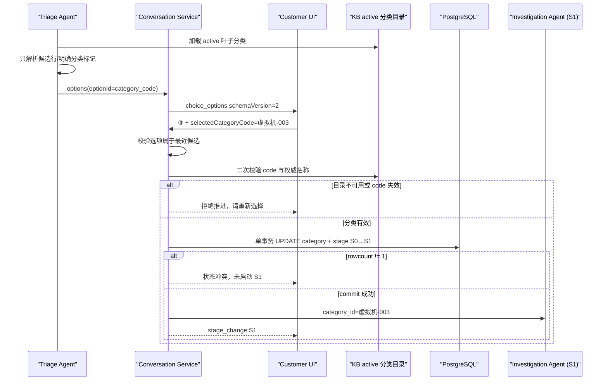

# S0 分类稳定身份协议与候选治理方案

> **现场工单**：`Q2026072855923`
> **会话 ID**：`2b0b8528-8c42-413d-a090-496c8de8fa60`
> **最终决策**：展示序号与业务身份分离，`kb_category.code` 是唯一稳定身份；模型只能提出候选，用户结构化确认后才能原子写入分类并进入 S1。

## 1. 问题与用户可见现象

用户在 S0 页面选择的是“③ 虚拟机-003 虚拟机开机失败”，S1 收到的确定分类却是“存储-020”。页面候选中还出现了“① ubu-sus-25”，它是环境中的虚拟机名，不是故障分类。

这不是两个独立的问题，而是同一条错误链的前后两端：

1. Agent 用过宽正则扫描整段模型回复，把资源名 `ubu-sus-25.2` 截成外形像分类编码的 `ubu-sus-25`。
2. 前端把页面位置“③”当成分类身份回传。
3. Conversation 过滤非法第①项后把数组压缩，又把数字 `3` 解析为压缩后的第 3 项，于是得到“存储-020”。

## 2. 现场证据

### 2.1 部署版本

现场四个相关服务均为同一提交，排除“代码没有生效”：

```text
agent-service        20260728-0035-81f0508
api-gateway          20260728-0035-81f0508
conversation-service 20260728-0035-81f0508
customer-ui          20260728-0035-81f0508
```

### 2.2 同一条 assistant 消息的正文和 metadata 已经不一致

正文：

```text
① 虚拟机-038 虚拟机IO读写慢
② 虚拟机-003 虚拟机开机失败
③ 存储-020 虚拟存储性能告警
④ 虚拟机-036 虚拟机整体卡慢
⑤ 以上都不是
```

落库的 `metadata.options`：

```json
[
  {"optionId":"1","name":"ubu-sus-25 "},
  {"optionId":"2","name":"虚拟机-038 虚拟机IO读写慢"},
  {"optionId":"3","name":"虚拟机-003 虚拟机开机失败"},
  {"optionId":"4","name":"存储-020 虚拟存储性能告警（io繁忙告警、io时延过高）"},
  {"optionId":"5","name":"以上都不是（请补充症状描述）"}
]
```

用户消息只有：

```text
content  = ③
metadata = {}
```

数据库的 active 分类目录中，`虚拟机-003` / `虚拟机-036` / `虚拟机-038` / `存储-020` 存在，`ubu-sus-25` 不存在。

### 2.3 时序日志

```text
03:14:59.337 extract_s0_candidates_metadata_success candidate_count=3
03:14:59.363 S0 → S1
03:14:59.366 conversation_category_updated 存储-020
03:14:59.432 InvestigationAgent category_id=存储-020
```

这证明错分类是在 Conversation 的 S0 选择解析阶段写入，S1 只是忠实消费了错误的已确认分类。

## 3. 根因：三个局部正确的改动组合成系统错误

| 历史变更 | 当时解决的问题 | 本次暴露的缺口 |
|---|---|---|
| PR #360 | `interactive_request` 响应支持 `selectedOptionId` metadata | 只覆盖 `metadata.kind=interactive_request` |
| PR #372 | S0 `intent_selection` 转为 `choice_options` 气泡 | `handleChoiceSelect()` 只发送圆圈序号，绕过 #360 的结构化响应 |
| PR #384 | 从 `metadata.options` 反向提取 S0 候选 | 只保留 code/name，丢弃原 `optionId`；测试数据全部合法且连续 |

另外，Triage 解析器的“字符串外形合法”被错当成“业务分类有效”。当权威字典存在时，旧逻辑仍允许不在字典中的模型原文 Fail Open，使资源名进入了选项。

## 4. 第一性原理和不变量

### 4.1 展示位置不是业务身份

`①②③` 只表示此次渲染中的顺序，会因过滤、排序、文案、新旧版本而变化。跨进程、落库、刷新和重试都必须使用不随展示变化的身份。在本领域中，该身份已经存在：`kb_category.code`。

### 4.2 模型提案不是事实

LLM 可以提出候选，不能创建分类。候选必须与当前 active 的 KB 权威目录交集；目录不可用或未命中时 Fail Closed，不得用模型原文兜底。

### 4.3 S0 确认是一个业务事务

`category_id=虚拟机-003` 与 `diagnostic_stage=S1` 不能分别 fire-and-forget。任一失败都不得启动 S1，否则 S1 可能看到旧分类或空分类。

## 5. 最终协议

### 5.1 Agent 输出选项

```json
{
  "kind": "choice_options",
  "schemaVersion": 2,
  "requestId": "triage-<conversation_id>",
  "options": [
    {
      "optionId": "虚拟机-003",
      "code": "虚拟机-003",
      "categoryName": "虚拟机开机失败",
      "name": "虚拟机-003 虚拟机开机失败"
    },
    {
      "optionId": "__none__",
      "name": "以上都不是（请补充症状描述）"
    }
  ]
}
```

### 5.2 前端用户响应

页面仍按数组位置显示 `①②③`，点击后消息正文可保留圆圈序号用于人类阅读，业务响应使用 metadata：

```json
{
  "kind": "intent_selection_response",
  "selectedOptionId": "虚拟机-003",
  "selectedCategoryCode": "虚拟机-003",
  "selectedCategoryName": "虚拟机开机失败",
  "isNoneOfAbove": false,
  "sourceMessageId": "<assistant-message-id>",
  "sourceRequestId": "triage-<conversation_id>"
}
```

### 5.3 消费端规则

1. 优先使用 `selectedCategoryCode` / 稳定 `selectedOptionId`。
2. 稳定 ID 不属于最近候选时拒绝推进，不猜测。
3. 对历史消息的纯数字回复，只能用历史候选保留的原 `optionId` 匹配，不得按过滤后数组下标重排。
4. 选中 `__none__` 时留在 S0，记录补充描述并重新生成候选。
5. 选中分类后再请求 KB active 叶子目录作二次权威校验，名称也以目录为准。

## 6. 处理流程和事务边界



S0 模型流结束后的“从原文检测分类并自动写库”路径已禁用。用户没有结构化确认时，无论模型文本看起来多么确定，都不能进入 S1。

## 7. Agent 候选治理

### 7.1 允许解析的文本边界

- 行首独立候选：`① 虚拟机-003 虚拟机开机失败`。
- 明确标记：`故障分类：虚拟机-003 ...` 或 `已确认故障分类：...`。

禁止在判断依据、环境事实、虚拟机名、请求 ID 和命令输出中全文扫描“像 code 的字符串”。

### 7.2 Fail Closed

- active 目录为空：不输出分类。
- 模型提出未注册 code：记录 `triage_unknown_category_rejected` 并过滤。
- 模型提供的名称与目录不一致：使用目录 canonical name。
- 选择时 KB 不可用：保持 S0，不将故障误路由到其他 KBD/SOP。

## 8. 兼容、上线和观测

### 8.1 向后兼容

- 新卡片只生成 v2 stable code。
- 已落库旧卡片仍可点击；前端从选项 name 提取 code 并随 metadata 回传。
- 只收到旧 `①②③` 时，Conversation 保留并匹配历史原 optionId；只有完全没有 optionId 的更旧数据才按连续下标兼容。

### 8.2 关键日志

| 事件 | 含义 |
|---|---|
| `triage_unknown_category_rejected` | Agent 过滤了未注册模型分类 |
| `s0_stable_option_invalid` | 响应中的 stable ID 不属于最近候选 |
| `s0_category_authority_empty` | KB 权威目录不可用，已 Fail Closed |
| `s0_confirmation_committed` | category 与 S1 已同事务提交 |
| `s0_confirmation_state_conflict` | 重复点击/并发请求未重复推进 |

## 9. 验收不变量

1. 页面选择“虚拟机-003”后，用户消息 metadata 必须含 `selectedCategoryCode=虚拟机-003`。
2. `conversation.category_id` 必须为 `虚拟机-003`，`diagnostic_stage` 必须同时为 `S1`。
3. S1 `InvestigationAgent category_id` 必须为 `虚拟机-003`。
4. 新生成的 `metadata.options` 不得包含 `ubu-sus-25`，且所有分类 code 必须存在于 active 目录。
5. 上述四项任一不满足，人工验收失败，不能用“S1 已经启动”代替分类一致性检查。

## 10. 关联文档

- [Q2026072855923 S0 分类错位验证记录](../../verify/events/2026-07-28-Q2026072855923-S0分类错位验证.md)
- [Conversation Service 设计](../conversation/对话设计.md)
- [HCI 平台架构设计](../架构设计.md)
