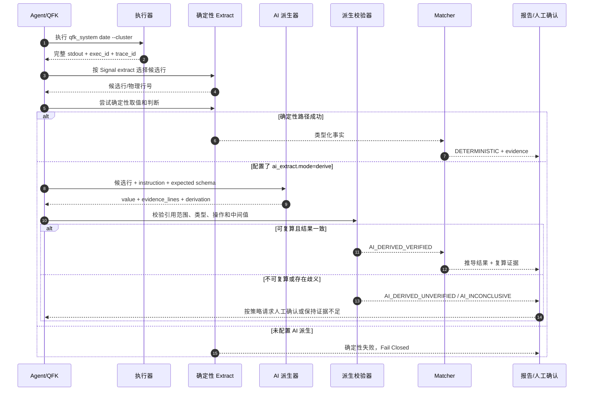
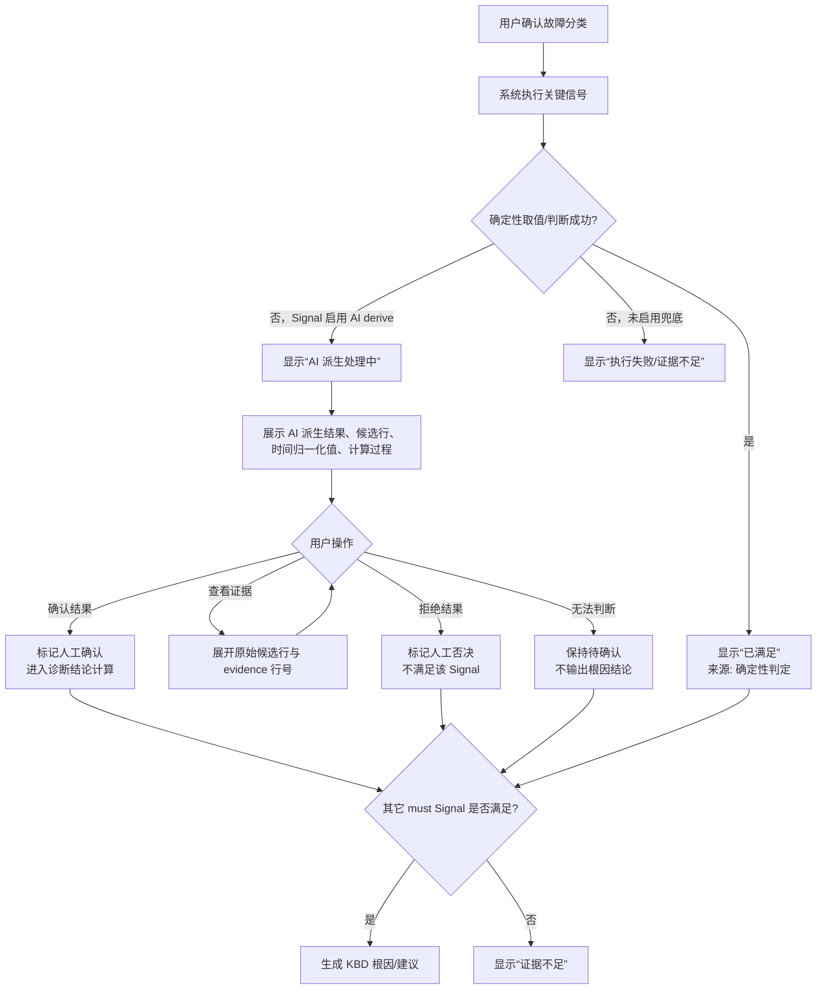
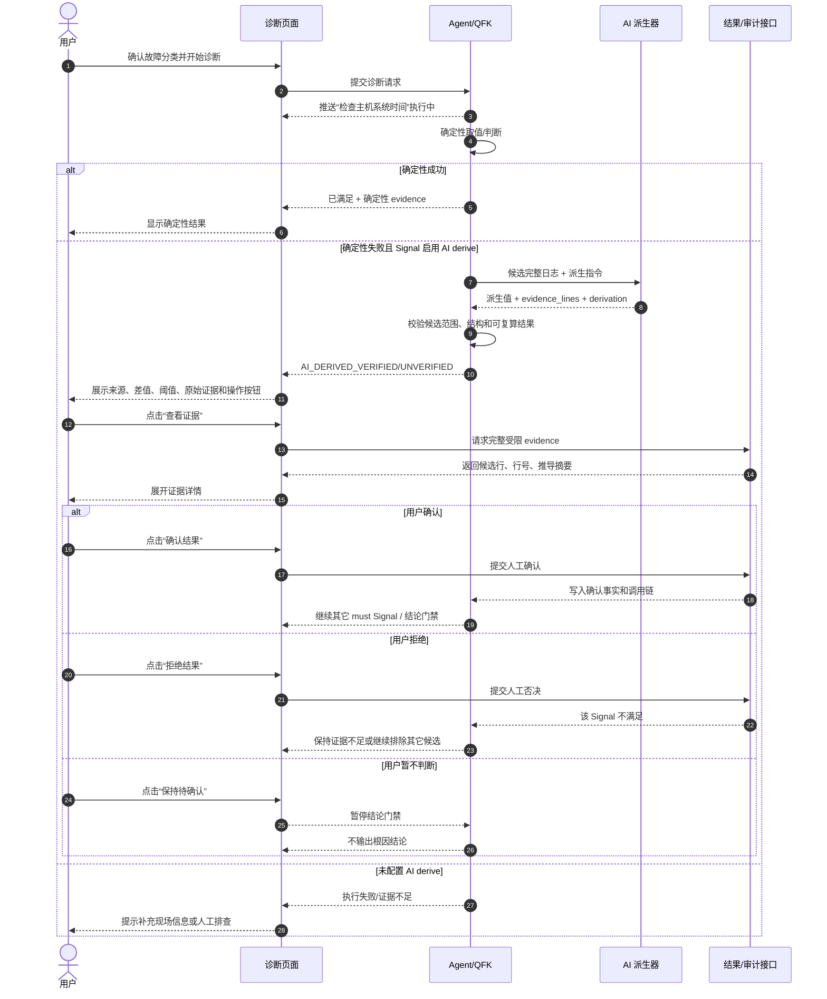
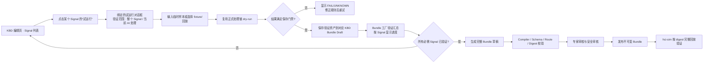
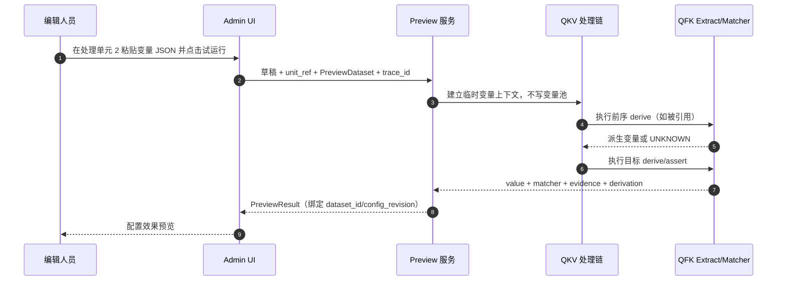

# QFK AI 派生兜底与 KBD41398 时间差问题归档

## 1. 结论摘要

本事件记录工单 `Q2026082619587` 的 KBD `41398` 仿真失败，以及由此确认的 AI 能力边界扩展方案。

当前 AI 提取器不是通用推理器，而是“从候选完整日志行中摘取原文值”的受控组件。41398 的指令却要求 AI：

1. 解析多台主机的时间；
2. 计算最大时间差；
3. 与 2 秒比较；
4. 返回业务编码 `1` 或 `0`。

这超出了当前 `grounded_extract` 契约。AI 返回的 `1`/`0` 不存在于候选日志行中，被逐字 evidence 校验拒绝，最终产生：

```text
QFK_AI_EXTRACT_FAILED: AI 无法提取：指令要求返回对比结果'1'或'0'，但候选日志行中未包含该结果字面量，无法提取。
```

本方案不建议为 KBD 41398 或其他单个案例新增专用 Matcher。平台只增加一次通用的 AI 派生兜底能力，案例通过显式配置选择是否启用。

## 2. 现场事实

### 2.1 工单与 Signal

| 项目 | 值 |
|---|---|
| 工单 | `Q2026082619587` |
| KBD | `41398` |
| Signal | `sig_003` |
| 检查 | 检查主机系统时间 |
| 采集工具 | `qfk_system` |
| 命令 | `acli --cluster --timeout 60 system date` |
| AI 指令 | 对比集群中所有主机的时间差是否超过2秒，如果超过就返回'1'，没超过就返回'0' |

### 2.2 候选日志

```text
10.97.128.120: /sf/bin/acli '--timeout' '60' 'system' 'date' Wed Aug 26 11:00:22 CST 2026
10.97.128.13: /sf/bin/acli '--timeout' '60' 'system' 'date' Wed Aug 26 11:00:26 CST 2026
10.97.128.11: /sf/bin/acli '--timeout' '60' 'system' 'date' Wed Aug 26 11:00:30 CST 2026
```

现场事实是最大时间差为 `8` 秒，业务结论应为“超过 2 秒”。但是候选行中没有字面量业务结果 `1` 或 `0`。

### 2.3 当前代码为什么拒绝

- AI 系统提示词要求只摘取候选完整日志行中已经原样出现的字面量。
- `value` 必须通过目标类型校验。
- `evidence_lines` 必须引用候选物理行。
- `_assert_grounded()` 要求 AI 返回的原始值能在引用行中回查。
- `threshold/delta/trend` 当前设计是 AI 先提供数值，随后由确定性 Matcher 判断，不允许 AI 直接决定业务真假。

因此这不是模型“不会算”，而是运行时按安全契约拒绝了越权结果。

## 3. 第一性原理拆解

这个需求包含三个不同的逻辑阶段，不能继续用一个“提取值”字段混合表达：

```text
现场输出
  -> 事实识别：识别每台主机及其时间
  -> 派生计算：计算 max(time) - min(time)
  -> 业务判定：difference > 2
```

原有 `grounded_extract` 只覆盖第一阶段。41398 把三个阶段压缩成了“返回 1/0”，造成了取值协议与业务判断协议冲突。

## 4. 设计决策

### 4.1 不新增案例专用 Matcher

不新增 `clock_skew` 这类只服务一个案例的 Matcher。6000+ KBD 应共享统一能力，案例只声明参数、输入范围和兜底策略。

### 4.2 保留现有 AI 提取模式

现有模式命名为 `grounded_extract`（名称可在实现阶段确定），语义保持不变：

- 只能摘取候选行已有字面量；
- 只能返回声明的类型；
- 必须逐字 evidence 回查；
- 失败时 fail closed；
- 不能直接产生业务 True/False。

存量 Signal 默认继续使用该模式，避免扩大变更面。

### 4.3 新增显式 AI 派生模式

增加通用、默认关闭的 `derive` 模式。它允许 AI 基于有界候选行完成受控归一化或计算，并返回派生结果；该结果不能伪装成原文字面量。

建议的概念配置如下（字段名称在实现评审时最终确定）：

```json
{
  "match": {
    "type": "threshold",
    "operator": ">",
    "value": 2,
    "expected": true,
    "extract": {
      "type": "text",
      "rows": {"mode": "all"},
      "cardinality": "all",
      "source": "stdout",
      "ai_extract": {
        "mode": "derive",
        "result_type": "boolean",
        "instruction": "从每行识别主机时间，计算所有主机的最大时间差是否超过2秒"
      }
    }
  }
}
```

`mode=derive` 是平台通用执行模式，不是新的案例专用 Matcher。它只应在 Signal 明确声明后启用，并且只在确定性取值/判定无法覆盖时作为兜底。

### 4.4 优先采用“AI 归一化、代码计算”

对于时间差这类可形式化问题，推荐的实际执行路径是：

```text
AI：识别每台主机的时间并归一化为时间戳
代码：执行 max(timestamp) - min(timestamp)
代码：执行 difference > 2
```

AI 直接返回最终布尔值只作为第二级兜底。这样既覆盖非结构化输出，又保留可重复的核心判定。

## 5. AI 派生输出契约

`derive` 模式不得复用原有“值必须逐字出现”的校验，而应采用单独的派生证据契约：

```json
{
  "ok": true,
  "value": true,
  "evidence_lines": [1, 2, 3],
  "derivation": {
    "operation": "max_minus_min_gt",
    "normalized_values": ["2026-08-26T11:00:22+08:00", "2026-08-26T11:00:26+08:00", "2026-08-26T11:00:30+08:00"],
    "minimum": "2026-08-26T11:00:22+08:00",
    "maximum": "2026-08-26T11:00:30+08:00",
    "difference_seconds": 8,
    "threshold_seconds": 2,
    "decision": true
  }
}
```

约束如下：

1. `evidence_lines` 仍必须来自候选完整输出，AI 不能引用范围外的数据。
2. 派生值必须明确标记 `value_source=ai_derived`，不能标成 `ai_grounded`。
3. `derivation` 必须结构化记录中间值、操作和比较参数，禁止只返回裸 `1/0`。
4. 解析失败、时区不明、主机缺失、样本不足或推导不完整时返回 `inconclusive`，不能猜测。
5. 对已有可验证操作，服务端应重新计算并校验 AI 的派生结果；无法复算的自由指令只能作为低信任兜底。

## 6. 结果状态与用户交互

AI 派生不应复用普通“已满足”图标而隐藏来源。建议结果至少区分：

| 状态 | 含义 | 是否可自动作为根因证据 |
|---|---|---|
| `DETERMINISTIC` | 完全由确定性取值和 Matcher 得出 | 可以 |
| `AI_DERIVED_VERIFIED` | AI 归一化/计算，服务端复算一致 | 按策略可以 |
| `AI_DERIVED_UNVERIFIED` | AI 给出推导，但服务端无法复算 | 默认不可，需确认 |
| `AI_INCONCLUSIVE` | 候选不足、格式歧义或 AI 无法完成 | 不可以 |

对于 `must` Signal：

- `AI_DERIVED_VERIFIED` 可按产品策略自动进入结论，但报告必须显示来源和推导证据；
- `AI_DERIVED_UNVERIFIED` 进入“待人工确认”，不能静默视为成立；
- `AI_INCONCLUSIVE` 保持证据不足，不得升级为失败或成功。

## 7. 交互时序图



## 7.1 用户使用交互图

下面的图描述的是用户在诊断页面中的实际使用路径，不是内部服务调用时序。核心原则是：用户先看到证据和结果来源，再决定是否接受 AI 派生结果；`AI_DERIVED_UNVERIFIED` 不能直接显示为普通“已满足”。



### 用户界面最低要求

| 界面区域 | 必须展示 | 禁止展示 |
|---|---|---|
| 信号标题 | `AI 派生` 或 `确定性` 来源标签 | 把 AI 派生隐藏成普通成功 |
| 结果区 | 是否超过阈值、差值、阈值、主机数量 | 只有裸 `1/0` |
| 证据区 | 原始候选行、物理行号、时间归一化结果 | 只展示模型解释而不展示原文 |
| 操作区 | 查看证据、确认、拒绝、保持待确认 | 未确认时自动继续根因结论 |
| 最终报告 | 模型、Prompt、复算状态、人工确认人和时间 | 将未验证结果写成确定性事实 |

## 7.2 用户—前端—Agent 交互时序图



## 8. 41398 按新方案的目标结果

建议将命令输出改为优先提供机器可解析的 epoch 秒（若 aCLI 支持参数透传）：

```text
10.97.128.120: 1788xxxx22
10.97.128.13:  1788xxxx26
10.97.128.11:  1788xxxx30
```

AI 负责识别三行中的主机和时间，平台确定性计算：

```text
min = 11:00:22
max = 11:00:30
difference = 8 秒
8 > 2 => true
```

若现场只能返回自然语言 `date` 格式，AI 派生器仍可作为归一化兜底，但必须保留时区解析结果和原始证据行；跨午夜、时区缺失或格式混杂时应返回 `AI_INCONCLUSIVE`。

## 9. 对抗性审查与防护

| 攻击/故障面 | 失败方式 | 防护 |
|---|---|---|
| 日志注入指令 | 日志文本诱导 AI 改变任务 | 明确日志是不可信数据；只允许结构化输出 |
| 裸 `1/0` | 无法证明它来自何处或如何计算 | 强制 `evidence_lines` 和 `derivation` |
| 时间格式歧义 | CST、跨日、夏令时解析错误 | 优先 epoch；无法确认时 inconclusive |
| 主机重复/乱序 | 错把返回顺序当时间顺序 | 按主机去重；计算 min/max，不使用 first/last |
| 模型漂移 | 同一输入结果改变 | 记录模型、Prompt、响应哈希；可复算操作服务端复核 |
| 结论越权 | AI 直接改变 must 根因 | AI 派生来源单独标记，未验证结果必须人工确认 |

## 10. 可观测性要求

每次 AI 派生必须沿用唯一调用链，至少记录：

- `trace_id`、`conversation_id`、`case_id`、`support_id`、`signal_id`；
- Signal revision、Prompt revision、模型 ID；
- 候选行数量、候选物理行号和输出摘要哈希；
- `ai_derived_started/succeeded/failed/inconclusive` 事件；
- `value_source`、校验结果、推导操作、复算结果和最终状态；
- 原始响应长度、响应哈希和受限审计内容，禁止写入完整敏感日志。

## 11. 实施边界（待确认）

本文件只归档问题和设计，不代表代码已修改。确认后分阶段实施：

1. 先增加 `derive` 模式 Schema、结果状态和审计字段，保持旧 `grounded_extract` 不变；
2. 实现 AI 归一化 + 服务端可复算操作白名单；
3. 增加 41398 fixture、真实输出回放、乱序/跨午夜/时区缺失反例；
4. 再评估是否开放不可复算的 AI 直接判定，并默认要求人工确认；
5. 补齐 Agent、Shared Schema、hci-sim 和管理台的契约测试。

**待确认事项：**

- 是否同意新增 `ai_extract.mode=derive` 这一通用能力；
- 是否将“AI 归一化 + 代码计算”作为 41398 的默认实现；
- `AI_DERIVED_UNVERIFIED` 是否必须人工确认后才能满足 `must` Signal；
- 是否允许后续为低风险 `should/context` Signal 开放 AI 直接判定。

## 12. Admin UI 页面设计稿（待确认）

### 12.1 与现有截图的变化

现有页面只显示一行“AI 提取”文本框，用户无法区分“从原文摘值”和“基于原文做推导”。实施本方案后，页面改为统一的“AI 处理方式”区块，并提供两个互斥模式。相比“提取 / 通用”，“原文取值 / 智能推导”更准确：前者表达证据边界，后者表达允许的计算行为。

| 模式 | 适用场景 | 页面语义 | 默认结论权限 |
|---|---|---|---|
| `原文取值` | 从日志中找出 IP、ID、状态、数值等原文值 | AI 只能返回候选行中已有的字面量 | 交给确定性 Matcher/Produce |
| `智能推导` | 时间差、跨行归一化、非固定格式计算等 | AI 可按受控说明做归一化或派生计算 | 经复算可自动采用，否则人工确认 |

“原文取值”是现有行为的改名和显式化；“智能推导”是新增的低信任兜底入口。两种模式不能同时启用，避免一个 Signal 同时存在两套互相矛盾的 AI 语义。两个选项旁边应提供悬浮提示：

- 原文取值：`只摘取原文已有值，不做跨行计算；值必须逐字出现在证据行中。`
- 智能推导：`可基于候选证据归一化或计算；必须返回推导过程，未复算结果需人工确认。`

### 12.2 页面布局

```text
┌──────────────────────────────────────────────────────────────────────────────┐
│ 关键信号：检查主机系统时间                         [草稿 · 待发布]           │
├──────────────────────────────────────────────────────────────────────────────┤
│ 执行结果处理 · 第一步：取值 → 第二步：判断                                   │
│                                                                              │
│ AI 处理方式                                  配置效果预览                   │
│ ┌──────────────────────────────────────┐    ┌────────────────────────────┐ │
│ │ [ 原文取值 ]   [ 智能推导 ]            │    │ 暂无运行数据                │ │
│ │                                      │    │                              │ │
│ │ 处理说明 *                            │    │ AI 已完成归一化，等待确认   │ │
│ │ ┌──────────────────────────────────┐ │    │                              │ │
│ │ │ 从每行识别主机时间，计算...       │ │    │ 保存并执行后显示真实结果   │ │
│ │ └──────────────────────────────────┘ │    │ 真实数据来源 signal execution│ │
│ │ 提取类型       结果数量              │    │ 执行后加载                   │ │
│ │ [数值数组 ▼]   [全部候选行 ▼]        │    │ 候选行 → AI 响应 → 复算结果  │ │
│ │                                      │    │ → evidence（执行后展示）    │ │
│ │ ☑ 保留候选行与证据引用                │    │                              │ │
│ │                                      │    │                              │ │
│ │                         [保存处理配置]│    └────────────────────────────┘ │
│ └──────────────────────────────────────┘                                     │
└──────────────────────────────────────────────────────────────────────────────┘
```

### 12.3 “原文取值”模式字段

- 处理说明：例如“提取每行的第一个 IP 地址”。
- 提取类型：字符串、单个数值、数值数组等，沿用现有类型契约。
- 结果数量：恰好一条、首条、末条、全部候选行。
- 固定提示：AI 只能引用候选完整行；返回值必须逐字可回查；Matcher/Produce 负责后续判断或写入。
- 用户侧状态：`AI 取值 · 待规则判断`，不增加人工确认步骤。

### 12.4 “智能推导”模式字段

- 处理说明：例如“从每行识别主机时间，计算所有主机的最大时间差是否超过2秒”。
- 输出类型：布尔值、数值、结构化对象。
- 结果策略：`可复算后自动采用` 或 `必须人工确认`。
- 要求返回推导过程：默认开启，记录归一化值、操作、比较参数和结果。
- 保留候选行与证据引用：默认开启，确保用户可以回看原始输入。
- 固定提示：智能推导不是普通原文取值；结果来源显示为 `AI_DERIVED_VERIFIED` 或 `AI_DERIVED_UNVERIFIED`。

### 12.5 用户侧结果状态

编辑态右侧是“配置效果预览”，默认不生成现场事实；但允许用户提供一组明确标记为“临时样本”的输入并点击“解析预览”。此时右侧展示的是该临时样本的真实解析结果，不代表生产现场。保存并执行 Signal 后，诊断结果页才使用现场执行记录。

```text
确定性成功       → 已满足 · 确定性判定
AI 原文取值成功  → 已取值 · 交由规则判断
AI 派生已复算    → 已满足 · AI 派生（已复算）
AI 派生未复算    → AI 派生 · 待确认
AI 无法完成      → 证据不足 · 需要补充信息
```

当状态为“AI 派生 · 待确认”时，用户可以：

1. 展开候选行和推导过程；
2. 点击“确认结果”，将人工确认写入审计链并继续结论门禁；
3. 点击“拒绝结果”，该 Signal 不满足；
4. 点击“保持待确认”，系统不输出根因结论。

### 12.6 真实数据如何进入结果页

真实结果不是由 Admin UI 静态预览生成，而是来自一次实际 Signal 执行：

```text
qfk_system 执行输出
  -> Agent 保留完整 stdout、exec_id、trace_id
  -> Extract/AI 处理产生 value、evidence_lines、derivation
  -> 服务端复算并写入 Signal evaluation/evidence 引用
  -> 诊断结果页读取该次执行记录渲染结果
```

因此页面必须区分两种状态：

- 编辑态没有临时样本且无执行记录：显示“暂无运行数据”，只展示字段结构；
- 有执行记录：显示真实候选行、AI 原始响应摘要、归一化值、计算结果、复算状态和 evidence 行。

不能在编辑态用固定的“3 台主机、8 秒”填充预览；用户粘贴的临时样本可以直接解析，但必须标注来源且不写入生产证据。如果需要复用正式数据，必须显式选择已发布的 hci-sim fixture 或上传回放输出，并在界面标注“仿真数据/回放数据”。

### 12.7 数据集来源与多组数据展示

页面支持三类数据来源，每次只选择一个数据集计算：

| 数据来源 | 进入方式 | 页面标识 | 是否写入生产证据 |
|---|---|---|---|
| 临时样本 | 用户粘贴候选输出，点击“解析预览” | `临时样本 · 不写入规则` | 否 |
| hci-sim fixture | 选择已发布的 KBD/fixture 版本并加载 | `仿真数据 · fixture digest` | 否，属于仿真运行记录 |
| 现场回放 | 选择已有 `exec_id`/回放记录 | `现场回放 · exec_id` | 只读引用，不修改原始执行事实 |

多组数据不能拼接后一起计算。页面通过“数据集”选择器逐组查看，例如：

```text
数据集
├─ 临时样本（用户输入）       当前展示
├─ fixture: 41398 / case-01   切换查看
└─ 回放: exec-xxxx             切换查看
```

切换数据集后，右侧同时切换候选行、解析结果、推导过程、复算状态和 evidence；每组结果都带来源标签和数据集标识。

本次用户输入作为临时样本时，页面可直接显示：

```text
最小时间：11:00:24 CST
最大时间：11:05:24 CST
时间差：300 秒
判断：300 > 2 → true
来源：PREVIEW_VERIFIED（临时样本，不是生产证据）
```

如果用户清空输入、fixture 未加载或回放未选择，右侧必须回到“暂无运行数据”，不能保留上一组数据的结果。

### 12.8 预览数据接口（拟议）

三类输入统一为 `PreviewDataset`，Admin UI 不直接拼装结果：

```json
{
  "dataset_id": "preview-uuid",
  "source_type": "pasted | fixture | replay",
  "source_ref": "临时样本 | fixture_digest | exec_id/artifact_id",
  "text": "候选完整输出",
  "persisted": false
}
```

编辑页面点击“解析预览”时，前端提交当前草稿 Signal、`source_type=pasted` 和输入文本到后端 dry-run 接口（接口路径待实现）。后端复用正式 Extract/AI/Matcher 链路，返回 `PreviewResult`，但不写入 KBD 发布版本、生产变量池或正式根因证据。

```json
{
  "dataset_id": "preview-uuid",
  "status": "AI_DERIVED_UNVERIFIED",
  "value": true,
  "derivation": {"difference_seconds": 300, "threshold_seconds": 2},
  "evidence_lines": [1, 2, 3],
  "source_label": "临时样本 · 不写入规则"
}
```

fixture 数据通过 `support_id + revision + fixture_digest` 从 hci-sim 已发布 Bundle 加载；现场回放通过不可变 `exec_id/artifact_id` 读取 Bridge/Collector 保存的完整输出。两者均只读，不能由前端伪造 source_ref。

多个数据集在页面上使用选择器逐个查看。每个数据集拥有独立的 `dataset_id`、候选行、AI 响应、推导、复算状态和 evidence；切换时整块结果原子替换，禁止把 A 数据集的主机时间与 B 数据集的时间混合计算。需要比较多组数据时，另设“对比”动作，明确展示每组结果，不能改变单组 Signal 的判定语义。

### 12.9 设计稿

可交互页面稿（旧版能力对比稿，保留用于说明“原文取值/智能推导”和数据集隔离）：

`ai-processing-admin-ui.html`（由本事件评审时生成，最终实现应对齐 Element Plus 管理台现有样式）。

按 Signal 绑定入口和 Bundle 草稿沉淀的新版页面稿见 `ai-processing-signal-modal.html`：主页面是 Signal 列表，每个 Signal 独立打开试运行对话框。

## 13. 统一执行结果试运行（待确认）

### 13.1 目标与边界

“试运行输入（可选）”不是 AI 专属控件，而是所有执行结果处理单元的通用只读验证能力：编辑人员提供一组明确来源的输入，系统按当前**未保存草稿**复用正式处理链执行一次，展示处理结果是否符合预期。

| 编辑位置 | 试运行输入 | 执行范围 | 结果用途 |
|---|---|---|---|
| QFK「执行结果处理」 | 完整 `stdout/stderr` 候选文本 | 当前 Signal 的 Extract -> AI 处理（如启用）-> Matcher | 验证取值、AI 推导和判断 |
| QKV「变量处理」 | 已投影变量的 JSON records，或单个变量样本 | 当前处理单元及其必需的前序处理单元 | 验证 derive 输出和 assert 判断 |

这项能力的最小事实是“给定输入，在当前草稿下会得到什么处理结果”，不是“现场已经发生什么”。因此任何试运行均不得写入 KBD 发布版本、生产变量池、正式执行记录、根因结论或生产 evidence。

### 13.2 页面行为与入口层级

试运行入口必须绑定到当前 KBD 的具体 Signal/处理单元，不能放在页面顶部作为全局 QFK/QKV 切换器。用户在一个 KBD 中逐个验证 Signal：在该 Signal 的“执行结果处理”或“变量处理”卡片右上角点击 `试运行`，系统已携带 `kbd_id、kbd_revision、signal_id、processing_index`，弹出当前对象的试运行对话框。

对话框内的“验证范围”才提供两个选项：`整个 Signal`（执行输入适配、Extract/AI 处理到 Matcher/产出变量）和 `当前 AI 处理`（只验证已绑定的 AI 步骤）。QFK 显示完整 `stdout/stderr` 文本，QKV 显示 `produces` 投影后的 JSON records；用户不需要重新选择“编辑位置”。

```text
KBD 41398 · sig_003 检查主机系统时间 · 执行结果处理       [试运行]
└─ 对话框：验证范围 [整个 Signal ▼] · 试运行输入 · [解析预览]
             配置效果预览 · [保存到 Bundle 草稿]
```

输入来源沿用第 12.7 节的数据集隔离规则。临时样本由用户粘贴且标记为“不写入规则”；fixture 必须指定已发布 `fixture_digest`；现场回放必须指定不可变的 `exec_id/artifact_id`。数据源切换、草稿处理配置变更或引用变量变更后，旧的 `PreviewResult` 立即失效并显示“配置已变更，请重新试运行”。

对话框底部的“保存到 Bundle 草稿”只保存通过门禁的验证资产，不写入生产诊断事实。

### 13.3 统一协议

前端无论在 QFK 还是 QKV 编辑器中都调用同一 dry-run 服务；调用参数只通过 `scope` 区分输入适配方式。正式运行与试运行共用解析、类型、基数、AI、复算和 Matcher 实现，禁止前端自行实现规则计算。

```json
{
  "draft_revision": "content-hash",
  "scope": "qfk_execution_result | qkv_variable_processing",
  "unit_ref": {"signal_id": "sig_003", "processing_index": 1},
  "verification_scope": "signal | ai_step",
  "dataset": {
    "dataset_id": "preview-uuid",
    "source_type": "pasted | fixture | replay",
    "source_ref": "user-input | fixture_digest | exec_id/artifact_id",
    "payload": "QFK 原始文本，或 QKV 已投影变量 JSON records"
  },
  "persisted": false
}
```

统一返回 `PreviewResult`，其中至少包含 `trace_id`、`dataset_id`、`unit_ref`、`verification_scope`、处理状态（`PASS` / `FAIL` / `UNKNOWN` / AI 派生状态）、输入摘要哈希、提取或派生值、Matcher 结果、`evidence_lines`、`derivation`、可操作错误码和 `config_revision`。日志和链路追踪使用独立的 preview 调用链；原始敏感输入仅按现有审计脱敏与保留策略保存。

### 13.4 验证结果进入 Bundle 工厂草稿

“不写生产 evidence”不等于“结果丢弃”。通过门禁的验证样本作为 Bundle 工厂的草稿验证资产保存到当前 KBD 的 Bundle Draft，供后续 hci-sim 完整回放；它与现场执行事实、根因证据和生产变量池属于不同事实域。

保存动作调用 Bundle 工厂现有 Draft revise 能力（`POST /api/hci-sim/v1/control-plane/bundles/{bundle_digest}/revise`），由服务端按 KBD revision 和 Signal 身份合并，不接受浏览器直接提交任意 KBD revision。建议在 Draft 的 manifest/compile input 中增加受控字段：

```json
{
  "verification_assets": [
    {
      "asset_id": "va-41398-sig003-01",
      "support_id": "41398",
      "kbd_revision": 7,
      "signal_id": "sig_003",
      "tool": "qfk_system",
      "route_fingerprint": "sha256:...",
      "stdout": "<完整用户验证输入>",
      "stderr": "",
      "verification_scope": "signal",
      "result_status": "AI_DERIVED_VERIFIED",
      "config_revision": "sha256:...",
      "trace_id": "preview-trace-..."
    }
  ]
}
```

约束：

1. 资产主键为 `support_id + kbd_revision + signal_id + route_fingerprint + asset_id`；同一 Signal 再次保存不得静默覆盖，必须生成新 asset 并由专家选择保留版本。
2. 只允许保存 `PASS`、`AI_DERIVED_VERIFIED` 或已明确人工确认的结果；`FAIL/UNKNOWN/AI_DERIVED_UNVERIFIED` 不能作为“已验证”门禁。
3. `stdout/stderr` 保存到 Bundle 工厂受控对象/manifest payload，数据库与普通日志只保存摘要、长度、sha256、来源和 trace_id；敏感数据沿用 Artifact 扫描、脱敏和保留策略。
4. 保存时校验 `config_revision` 与当前 KBD 草稿一致；规则、工具契约、命令或 AI Prompt 改变后，资产自动标记 `stale`，必须重新试运行。
5. QFK 保存完整文本；QKV 保存已投影 records 及其投影路径/字段快照，禁止把完整 QKV 原始响应伪装成变量输入。

Bundle 工厂编译时将每个 `verification_asset` 映射到对应 Signal 的 RouteKey 响应（即该路由的 `stdout/stderr`），而不是把不同 Signal 的文本拼成一个全局 stdout。一个 Signal 有多组样本时，Draft 保留多个带 `asset_id/dataset_id` 的响应版本；编译器必须要求专家明确选择 canonical 响应或生成显式 variant，禁止按保存顺序静默取第一组。

Bundle Draft 页面显示验证汇总：

```text
KBD 41398 · Bundle 草稿 bd-... · 验证进度 2 / 3 Signal
sig_001  PASS              已保存 1 组 stdout
sig_002  AI 派生（已复算） 已保存 2 组 stdout
sig_003  待验证            [打开 Signal]
                              [生成完整 Bundle 草稿]
```

只有当当前 KBD revision 的所有必需 Signal 都至少有一组有效验证资产，且 Bundle Compiler、Schema、路由唯一性和 digest 校验全部通过，`生成完整 Bundle 草稿` 才可执行。生成后进入 Bundle 工厂既有 `draft -> validate -> approve -> publish` 状态机；审核发布后，hci-sim Runtime 按该不可变 Bundle digest 执行完整验证。任何单 Signal 失败都保持“待验证/证据不足”，不能用其它 Signal 的样本补齐。

### 13.5 Bundle 工厂用户流程图



### 13.6 QKV 顺序语义

QKV 不能只对被点击单元孤立运行。其输入可能来自 `produces`，也可能引用前序 `derive` 的输出；因此系统从第一个被该单元依赖的处理单元开始，依序执行到目标单元，并在临时变量上下文中传递结果。



基数规则保持与正式运行一致：单 record 不会自动伪装成多 record，多 record 也不会静默取第一条。若输入缺少依赖变量、前序 derive 失败或基数不满足，返回 `UNKNOWN` 和可操作原因，不能由 UI 填默认值。

### 13.7 对抗性审查与门禁

| 攻击/故障面 | 必须防护 |
|---|---|
| 前端预览与正式执行语义漂移 | dry-run 调用正式运行链的只读副本；禁止在浏览器实现 Matcher 或 AI 派生计算 |
| QKV 多条 record 被错误聚合 | 明确 `cardinality` / `aggregation`；返回每条输入的证据定位，不隐式取首条 |
| 后序单元读取不存在的临时变量 | 解析依赖图，按前序顺序执行；依赖失败返回 `UNKNOWN` |
| 临时样本、fixture、回放混算 | 一个 `PreviewDataset` 只承载一组数据；结果原子替换且带来源标识 |
| 草稿已经变化但展示旧结果 | `PreviewResult.config_revision` 必须匹配当前草稿内容哈希，否则前端作废展示 |
| 预览被当作生产事实 | `persisted=false`、独立 trace、结果标识“不写入规则”；发布与诊断结论接口拒绝引用 preview ID |
| 试运行输入泄漏 | 限制大小、脱敏、访问控制与审计；不把完整输入写到普通请求日志 |
| 验证资产错绑其它 KBD/Signal | 服务端从当前页面上下文解析 KBD revision、Signal、route fingerprint；浏览器不提交任意 revision |
| 多次验证互相覆盖 | asset_id 不可变；同一 Signal 追加版本并显示差异，专家显式选择 |
| 未完成全部 Signal 就生成 Bundle | Bundle 工厂按必需 Signal 集合计算门禁，缺一即拒绝生成 |
| 把临时预览当成已验证资产 | 只有保存动作才进入 Draft；保存前结果仍是 preview，保存后保留来源和验证状态 |
| 验证资产与规则版本漂移 | 绑定 config/tool/prompt/route 指纹，任一变化自动 stale |

该通用试运行能力与 `ai_extract.mode=derive` 同步实施，但不依赖于 AI：确定性 Extract、Matcher、QKV `feature/split` 和断言均可使用。这样它是对 6000+ 案例的统一验证入口，而非为 41398 增加的专用页面功能。

### 13.8 实施状态与 Bundle 工厂改造边界

本次归档和视觉稿是设计确认稿，不代表 `verification_assets` 已在运行时代码中落地。要实现“试运行结果可生成完整 Bundle”，必须补齐以下实现项：

1. Bundle Draft/Registry 的 schema、Repository 和 `revise` API 支持 `verification_assets` 的追加、去重、版本和 stale 状态；
2. Bundle Compiler 将 canonical asset/variant 编译为 RouteKey 对应的 `stdout/stderr`，并将资产摘要纳入 `input_fingerprint` 与 Bundle digest；
3. Admin UI 在当前 KBD/Signal 上下文调用 dry-run 与 revise，显示保存成功、冲突、过期和缺少 Signal 等状态；
4. Bundle 工厂按必需 Signal 集合提供“生成完整 Bundle 草稿”门禁，并继续使用既有 validate/approve/publish 状态机；
5. hci-sim Runtime 从发布 Bundle digest 加载这些输出，增加逐 Signal 的 positive/negative/inconclusive 完整回放验收。

在上述改造完成前，页面上的“保存到 Bundle 草稿”应显示为规划中的禁用态或能力缺口，不得伪装成已经持久化成功。
