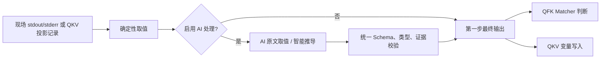
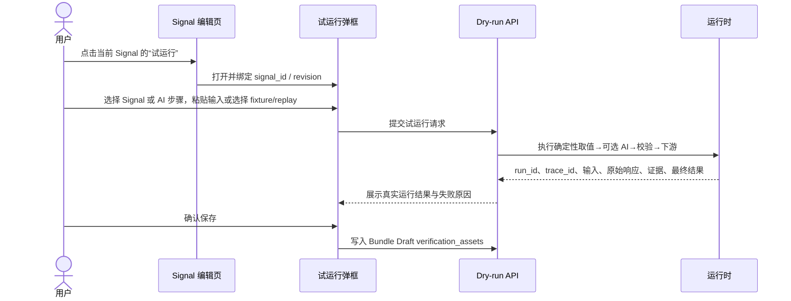

# AI 处理方式统一重构设计与实施归档

## 1. 背景与真实问题

工单 Q2026082619587（KBD 41398）要求比较多台主机的系统时间差。旧配置把“智能推导”实现成日期时间专用归一化：模型必须返回字面量 `1` 或 `0`，但输入是三行时间文本，模型没有返回布尔字面量，最终出现 `QFK_AI_EXTRACT_FAILED`。这不是提示词措辞问题，而是产品层级、响应契约和执行链路混淆造成的结构性失败。

旧实现存在以下问题：

- AI 绕过或替代确定性取值，数值 Matcher、文本 Matcher、QKV 各自有不同入口。
- `ai_extract` 同时承担“原文提取”“智能推导”“时间归一化”三种互不相同的语义。
- 平台要求模型直接返回最终真假，无法展示结构化中间结果，也无法复算。
- 时间格式、时区、`datetime_epoch` 等案例专用逻辑扩大了配置面，却没有形成通用能力。
- 证据、原始响应、输入候选和下游判断没有统一关联，无法还原一次 AI 判断。

## 2. 第一性原理

一个信号的业务事实只有两步：

1. 从现场输出中确定性取值。行、列、JSON 路径、基数和类型转换均由平台执行。
2. 对第一步结果做 Matcher 判断或写入变量。

AI 不是事实来源，也不是执行失败的救援通道。它只能作为第一步输出之后的可选数据后处理器。关闭 AI 时，链路必须完全不调用模型；确定性取值失败时，链路必须失败闭合，不能把未定义输入交给模型。



## 3. 统一语义

“AI 处理”是可选的数据后处理，默认关闭；页面文案保留“智能推导”作为通用模式名称。AI 处理方式包含：

- **原文取值**：按处理说明从确定性候选中提取值。`output` 必须能从证据原文逐字回查（数值允许平台数值等值比较）。
- **智能推导**：按处理说明对确定性候选归纳、计算或归一化。`output` 可以是计算结果，但必须提供有效证据和理由。

原“提取类型”统一改为“输出类型”，可选：布尔值（1/0）、数值、文本、数组；数组另选元素类型。平台依据输出类型校验，不允许额外字段。

## 4. 配置与响应契约

配置字段：

```json
{
  "ai_processing": {
    "contract_version": 1,
    "mode": "derive",
    "instruction": "从每行识别主机系统时间并返回 Unix 秒数组",
    "output_type": "array",
    "item_type": "number"
  }
}
```

统一响应：

```json
{
  "status": "success",
  "output": [1787713524, 1787713528, 1787713532],
  "evidence": [{"ref": "line:1", "quote": "Wed Aug 26 11:05:24 CST 2026"}],
  "reason": "识别并转换候选行中的主机系统时间"
}
```

平台拒绝缺字段、未知字段、错误 status、空 evidence、非法 ref/quote、类型不匹配、NaN/Infinity、混合数组元素。`extract` 模式还拒绝无法从证据回查的 output。任何失败均 Fail Closed，不执行 Matcher 判定或变量写入。

## 5. QFK/QKV 执行设计

QFK：`matcher.extract` 先执行确定性行/列取值，AI 仅接收该范围内的有界候选；校验后的 output 作为同一份第一步最终输出，所有 Matcher（keyword、regex、state、threshold、delta、trend、exists）统一消费。数值聚合、比较和真假转换始终由代码完成。

QKV：原始投影记录先按 feature/split/identity 确定性取值，再按单元配置可选 AI 后处理，最后写入变量池或执行断言。AI 不再是 feature/split 失败后的兜底。

41398 推荐配置：确定性完整行/全部行 → 智能推导 → 输出类型数组、元素数值 → `threshold` 聚合 `range`、操作符 `>`、值 `2`。平台计算 `max(values)-min(values)>2`，不需要时间专用 Matcher 或 normalizer。

## 6. 用户交互

用户从单个 Signal 的“试运行”入口进入；输入、规则和结果只属于当前 Signal。编辑态没有运行数据时显示“暂无运行数据”，粘贴输入仅用于本次试运行。fixture/replay 必须明确数据集来源，多组数据分开显示，不能伪造现场事实。



## 7. Bundle Factory 持久化

每次 Signal 独立试运行产生不可变 verification asset，至少保存 `run_id`、`trace_id`、`signal_id`、`kbd_revision`、数据集来源、输入哈希、实际 AI 输入、原始响应、校验后 output、证据、理由、下游 Matcher/变量结果、模型和 prompt/contract 版本。多个数据集按 `dataset_id` 分组。所有 Signal 验证完成后，Bundle Factory 生成包含这些资产的完整草稿；审核发布后再执行完整 KBD 验证。

## 8. 可观测性

日志和 Langfuse/OTel observation 必须能重建一次判断：`trace_id`、`run_id`、`support_id`、`kbd_revision`、`signal_id`、`processing_index`、`dataset_id`、`input_sha256`、`model`、`prompt_version`、`contract_version`、`mode`、`output_type`、候选数量、原始响应哈希、证据引用、下游结果和错误码。Prometheus 只使用低基数标签：mode、status、error_code；高基数字段进入结构化日志和 trace。

## 9. 迁移与兼容

新保存和发布路径只写 `ai_processing`。读取层可在迁移窗口识别历史 `ai_extract`，但不再解释 `derive.normalizer`、`datetime_epoch`、`formats` 或 `timezone`；历史配置必须在编辑/发布前转换为显式 output_type 和 instruction，无法安全迁移则阻断并提示重配。旧案例专用模块删除。

## 10. 对抗性审查

| 攻击场景 | 防护 |
| --- | --- |
| 模型返回 `1/0` 之外的自然语言 | 统一 JSON schema + 类型校验，失败闭合 |
| 模型引用候选范围外内容 | ref 必须属于候选，quote 必须是候选子串 |
| 原文取值返回计算值 | extract 模式逐字回查，拒绝无依据结果 |
| 确定性取值为空或失败 | 不调用 AI，不写变量，不判定 |
| Prompt 注入/额外 JSON 字段 | 候选作为不可信数据；严格字段集合 |
| 数值溢出或数组混型 | 有限数校验、item_type 校验 |
| 重试导致重复写入 | run_id/asset_id 幂等，Bundle 草稿原子更新 |
| 多 Signal/多数据集串结果 | signal_id + dataset_id 隔离 |

## 11. 验收标准与验证记录

- 页面展示“输出类型”，不再出现“提取类型”、时间格式、时区和 datetime_epoch。
- AI 未配置时零模型调用；确定性失败时零模型调用。
- QFK/QKV 使用相同配置和响应可得到一致 AI 校验结果。
- 所有 Matcher 只消费第一步最终输出，数值运算由代码完成。
- 41398 三台主机时间样本可返回数组并由 range threshold 复算。
- dry-run 展示实际输入、原始响应、校验结果、证据和下游结果；无数据展示“暂无运行数据”。
- 日志、指标、trace 可通过 run_id/trace_id 还原完整判断。

本次实施已完成统一契约模块、QFK AI 响应校验、QKV 串行执行调整、Schema 和前端字段迁移；提交前执行 `uv run ruff check`，并按上述验收标准补充单元与集成测试。
