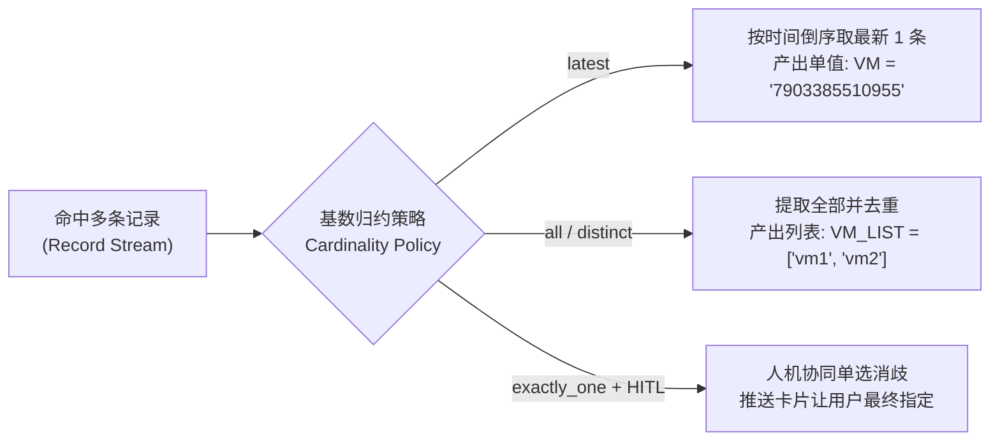
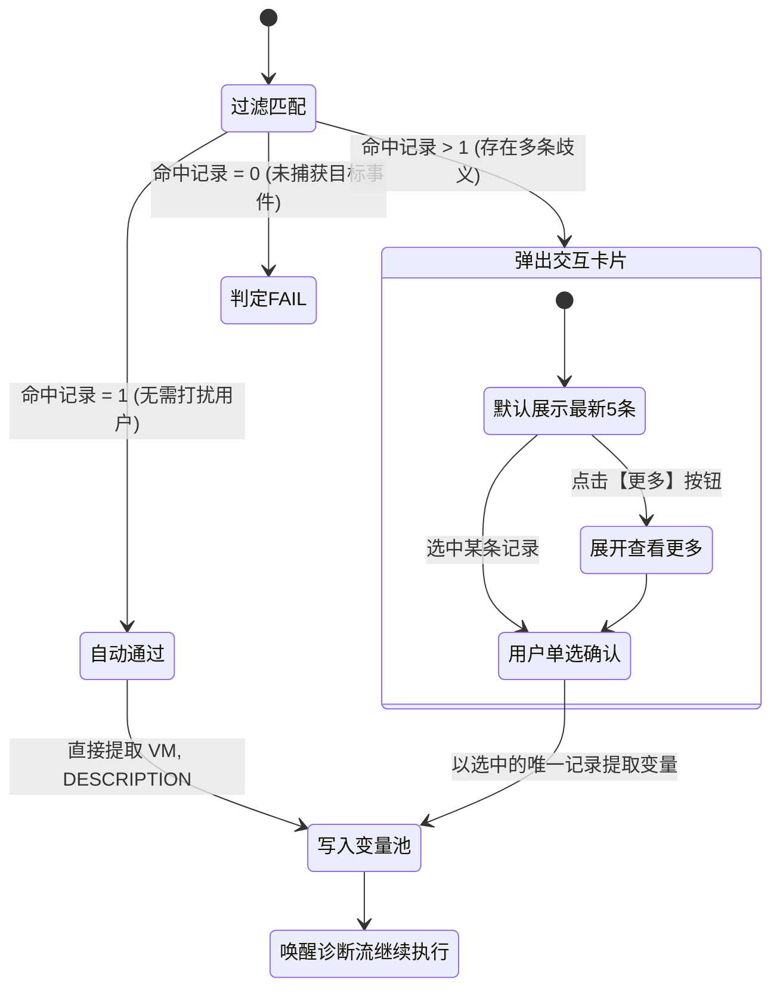
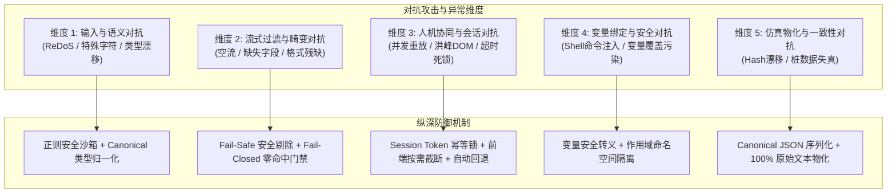

# QKV 多记录流式过滤与人机协同消歧架构方案

> **归档日期**：2026-08-28  
> **关联模块**：`shared/signals`、`agent-service`、`frontend/admin`、`hci_sim`、`conversation-service`  
> **核心方法论**：统一遵循**第一性原理 (First Principles)** 与**对抗性审查 (Adversarial Review)**

---

## 1. 背景与问题全景复盘

在 KBD/Signal 专家调试与工单运行过程中，随着告警中心（`qkv_alert`）、任务中心（`qkv_task`）等生产者信号的深入应用，暴露出 4 处关键断层与认知错位：

### 1.1 痛点一：JSON 路径取值语法与数据结构错位
- **现场现象**：配置 `JSON 路径 = data[0].powerState`，运行时报错 `QFK_PATH_NOT_FOUND: JSON path 'data[0].powerState' 不存在`。
- **第一性原理根因**：接口返回的数据结构中 `"data": { "power": 1, "powerState": "" }` 是 **JSON 对象（Object `{}`）** 而非 **数组（Array `[]`）**；使用 `data[0]` 数组下标导致寻址失败；同时 `powerState` 为字符串，而取值类型误设为数字。

### 1.2 痛点二：试运行保存到 Bundle 后数据被单方面解包（仿真失真与元数据丢失）
- **现场现象**：试运行输入的是带根对象的原始返回 `{"data": [{"alert_type": "删除虚拟机", ...}]}`，但保存到 Bundle Draft 后，`Route.Result.Stdout` 变成了裸数组 `[{"alert_type": ...}]`。
- **第一性原理根因**：前端在解析 QKV 输入时，为了方便变量提取，单方面执行了 `if (Array.isArray(parsed.data)) parsed = parsed.data`，并将解包后的数组当作命令标准输出保存，导致仿真环境丢失了真实命令的 `{"data": ...}` 包装结构以及同级的 `code`、`message`、`total` 等元数据，破坏了“环境高保真（High Fidelity）”契约。

### 1.3 痛点三：告警/任务队列中存在无关记录时全量断言误判为 FAIL
- **现场现象**：当输入数据是一个包含多条告警的队列（例如第 1 条是“删除虚拟机”，第 2 条是“启动虚拟机”）时，配置了 `{{DESCRIPTION}} 包含 [存在虚拟机，请迁移后再删除]`，试运行判定为 **`FAIL`**。
- **第一性原理根因**：当前引擎在执行【判断】（`mode="assert"`）时，采用的是**全量门禁逻辑（Assert All）**，逐条断言每条记录，一旦第 2 条不匹配即产生 FAIL 断言，并在汇总层直接一票否决整个 Signal，违背了“在队列中筛选目标告警”的业务本质。

### 1.4 痛点四：多条记录同时命中的变量污染与歧义风险
- **现场现象**：当客户反复重试产生多条相同失败任务，或集群内存不足导致多台虚拟机同时开机失败时，过滤后会有多条记录命中。
- **第一性原理根因**：若系统无脑将所有命中记录作为数组赋值给标量变量 `{{VM}}`，下游命令模板会因注入数组导致语法崩溃；若直接静默取第 1 条，在多实体故障场景下会导致严重漏修。

---

## 2. 第一性原理深度推导（First Principles）

### 2.1 生产者信号（QKV Producer）的物理使命
生产者信号的终极物理使命是：**“从异构、多记录的原始数据流中，精准过滤出目标事件，提取出纯净、确定的业务变量，安全写入全局变量池。”**

在不可再分的物理逻辑上，数据流转必须严格经历 **4 阶流水线（4-Stage Pipeline）**：

```
[原始命令行/API响应 Raw Data] (如包含多条告警的列表)
       │
       ▼
┌────────────────────────────────────────────────────────┐
│ 1. 过滤定位 (Filter / WHERE)                           │  ◀── 丢弃所有无关记录，保留目标事件
│    逐条评估过滤规则，未命中记录自动剔除                │
└────────────────────────────────────────────────────────┘
       │ （仅留存命中的目标记录）
       ▼
┌────────────────────────────────────────────────────────┐
│ 2. 字段投影与派生 (Project / SELECT)                   │  ◀── 提取 VM, DESCRIPTION，执行派生计算
│    从过滤后的纯净记录中投影目标变量                    │
└────────────────────────────────────────────────────────┘
       │
       ▼
┌────────────────────────────────────────────────────────┐
│ 3. 基数与消歧 (Cardinality & Disambiguation)           │  ◀── 判定单值/多值，人机协同消除歧义
│    • N=1: 自动提取（Fast-Path）                        │
│    • N>1: 人机协同交互卡片单选消歧                     │
└────────────────────────────────────────────────────────┘
       │
       ▼
┌────────────────────────────────────────────────────────┐
│ 4. 信号裁决与变量绑定 (Verdict & Bind)                 │  ◀── 命中 ≥ 1 ➔ PASS 并写入变量池
│                                                        │      命中 = 0 ➔ FAIL
└────────────────────────────────────────────────────────┘
```

### 2.2 仿真桩数据与变量提取集的物理正交隔离（Orthogonal Decoupling）
必须从底层彻底物理隔离两个概念：
1. **`raw_stdout`（仿真命令桩输出）**：必须 **100% 保持用户原始输入的完整文本**（包含 `{"data": [...]}`），一字不改存入 `Route.Result.Stdout`，保证全链路仿真保真度。
2. **`processed_records`（信号内部处理集）**：仅用于 Signal 规则匹配和变量投影，绝不能反向污染仿真桩数据。

---

## 3. 业界最佳实践：基数归约策略（Cardinality Policy）

结合 Prometheus、OpenTelemetry 及分布式工作流引擎的最佳实践，在 QKV 的变量产出层支持 **3 种基数归约模式**，以适应不同业务场景：



### 3.1 模式一：`latest`（最新记录 —— 适用重复重试场景）
- **业务场景**：用户操作开机失败，连续点了 3 次重试，产生 3 条相同的错误任务。排查核心是定位“最近一次”的现场状态。
- **执行逻辑**：自动探测时间戳字段（`start`/`end`/`event_id`），降序排序后**取最新发生的一条**。
- **产出形态**：单个标量字符串，例如 `VM = "7903385510955"`。

### 3.2 模式二：`all` / `distinct`（列表与去重 —— 适用批量多实体场景）
- **业务场景**：集群内存耗尽导致多台不同虚拟机开机均失败。运维需要获取所有受影响虚拟机的列表以进行批量迁移或释放资源。
- **执行逻辑**：提取所有命中记录的字段聚合成**数组列表**，并支持自动去重。
- **产出形态**：数组列表，例如 `VM_LIST = ["7903385510955", "18864231143"]`，下游工单支持 Foreach 循环消费。

### 3.3 模式三：`exactly_one` + 人机协同消歧（终极严谨方案 —— 适用高危操作）
- **业务场景**：删除虚拟机、格式化存储、停止集群等不可逆高危操作，或者用户希望从多次操作中显式挑选某一次具体故障。
- **执行逻辑**：命中多条时不盲目猜测、不粗暴报错，而是升级为**人机协同单选交互卡片**，由用户显式裁决。

---

## 4. 终极方案：人机协同消歧体系（HITL - Interactive Disambiguation）

### 4.1 物理状态机流转模型



### 4.2 前端交互卡片规范与 UI 原型

在工单流/诊断会话中，当检测到多条命中时，实时推送**单选消歧卡片**：

```
┌────────────────────────────────────────────────────────────────────────┐
│ 🔔 检测到多条匹配的【删除虚拟机】告警，请选择您要处理的具体目标：       │
│                                                                        │
│  🔘 [最新] 2026-08-28 16:40:12 | 虚拟机: Windows-DISK (7903385510955)  │
│     说明: 存在虚拟机，请迁移后再删除                                   │
│                                                                        │
│  ⚪ [历史] 2026-08-28 16:38:05 | 虚拟机: Windows-DISK (7903385510955)  │
│     说明: 存在虚拟机，请迁移后再删除                                   │
│                                                                        │
│  ⚪ [历史] 2026-08-28 15:13:40 | 虚拟机: Linux-TEST   (18864231143)    │
│     说明: 存在虚拟机，请迁移后再删除                                   │
│                                                                        │
│  ... (共 12 条记录，默认展示前 5 条)                                   │
│  [ 🔽 查看更多 (7条) ]                                                 │
│                                                                        │
│  [ 确认并继续诊断 ]                                                    │
└────────────────────────────────────────────────────────────────────────┘
```

#### 交互行为约束：
1. **单选约束**：只支持单选，防止多选导致变量池形态不确定。
2. **时间排序**：最新发生的记录自动排在最上面，并打上 `[最新]` 徽标。
3. **折叠展开**：默认只展示前 5 条记录；超过 5 条时提供 `[查看更多]` 展开按钮，避免长列表撑爆页面。
4. **状态锁定**：用户点击确认后，卡片置灰转为“已确认”只读状态，防止重复提交。

---

## 5. 深度对抗性审查（Adversarial Review）与防御矩阵

运用**红队视角与极限施压原则**，针对生产环境可能遭遇的极端约束、恶意数据与系统并发对抗，建立全方位的加固矩阵：



### 5.1 维度一：输入与语义对抗（Input & Semantic Attacks）

| 对抗攻击场景 | 破坏性后果 | 工业级防御机制（加固措施） |
| :--- | :--- | :--- |
| **字符集与全半角漂移（Unicode Drift）** | 用户输入或系统返回带有全角括号 `（` vs `(` 或特殊空白字符，导致关键字包含匹配失效。 | **文本预规范化（Unicode NFKC）**：在执行 Matcher 匹配前，统一对目标字符串进行 Unicode NFKC 归一化，消解全半角与不可见字符差异。 |
| **动态类型漂移（Dynamic Type Confusion）** | 同一字段在不同记录中类型不一致（一条记录 `vm: 7903385510955` 为整型，另一条 `vm: "7903385510955"` 为字符串）。 | **强类型投影转换（Safe Type Casting）**：变量投影器强制按声明的 `value_type` 执行统一安全转换，杜绝因类型不一致导致的下游匹配失败。 |
| **正则回溯拒绝服务（ReDoS Attack）** | 专家配置了恶意的带嵌套量词正则表达式（如 `(a+)+$`），导致单条记录过滤时 CPU 耗尽死锁。 | **正则执行超时沙箱（Regex Execution Timeout）**：对所有用户自定义正则设置 200ms 执行超时硬门禁，超时立即抛出 `REGEX_EVALUATION_TIMEOUT` 异常。 |

### 5.2 维度二：流式过滤与畸变对抗（Filter & Malformed Data Attacks）

| 对抗攻击场景 | 破坏性后果 | 工业级防御机制（加固措施） |
| :--- | :--- | :--- |
| **空流与结构畸变（Empty Stream & Malformed Array）** | 接口返回 `{"data": []}`、`{"data": null}` 或包含非字典元素 `{"data": [1, "string"]}`。 | **结构前置守卫（Structural Guard）**：解包层在进入 Filter 前校验列表元素合法性，自动剔除非字典脏数据；若无有效记录直接触发 Fail-Closed。 |
| **部分字段缺失（Missing Fields / KeyError）** | 在多条记录中，部分记录缺少 `description` 或 `target` 字段。 | **安全导航求值（Safe Navigation）**：字段缺失视为条件不满足（False）并优雅剔除该记录，**严禁抛出未捕获的 KeyError 导致整个诊断流崩溃**。 |
| **0 条记录命中（Under-matching）** | 容忍 0 条会导致下游消费空变量 `{{VM}}=""`，引发不可预知的空指针或命令误操作全局。 | **Fail-Closed 零命中门禁**：过滤后若有效记录数为 0，Signal **必须裁决为 `FAIL`**，严禁向变量池写入空变量。 |

### 5.3 维度三：人机协同与会话状态对抗（HITL & State Machine Attacks）

| 对抗攻击场景 | 破坏性后果 | 工业级防御机制（加固措施） |
| :--- | :--- | :--- |
| **重放攻击与过期交互（Stale Token Replay）** | 工单已流转至后续步骤，用户翻回历史卡片再次点击提交，试图篡改变量池。 | **交互生命周期锁（Interaction Lease Lock）**：卡片绑定唯一 `interaction_token`，并在后端记录状态。一旦步骤流转，旧 Token 立即作废，阻断二次提交。 |
| **并发双击与多人竞态（Race Conditions）** | 网络延迟期间用户快速连击两次，或协作会话中两名运维同时选择不同选项。 | **数据库原子 CAS 提交（Atomic Compare-And-Swap）**：状态更新采用乐观锁 CAS 机制，仅首次提交生效，后续请求返回 HTTP 409 Conflict。 |
| **海量数据导致 DOM 崩溃（UI Overload）** | 告警队列包含 5,000 条重试记录，前端全量渲染导致页面卡死崩溃。 | **前端按需流式截断（Streaming Truncation）**：后端仅下发前 20 条元数据，前端默认展示 5 条并提供折叠展开，杜绝海量 DOM 节点渲染。 |
| **会话挂起死锁（Session Hang / Unattended Block）** | 在自动化 CI 管道或离线仿真回归中，无真人点击卡片导致流程永远挂起。 | **运行环境自适应探测（Execution Mode Adaptive）**：检测到 `unattended_simulation` 标记时，自动启用 `fallback_strategy: "latest"` 降级执行；真实人机工单强制等待用户确认。 |

### 5.4 维度四：变量绑定与安全注入对抗（Security & Consumer Attacks）

| 对抗攻击场景 | 破坏性后果 | 工业级防御机制（加固措施） |
| :--- | :--- | :--- |
| **Shell 命令注入逃逸（Command Injection via Variable）** | 告警文本中恶意包含 `; rm -rf /` 或反引号，下游命令拼接 `acli vm info -name {{VM}}` 时触发命令注入。 | **变量注入安全转义（Shell Argument Escaping）**：下游命令解析引擎对所有注入的变量值进行 `shlex.quote` 强制转义，严禁 Raw 字符串无保护拼接。 |
| **变量同名覆写污染（Variable Shadowing / Namespace Collision）** | QKV 提取的 `VM` 意外覆盖了前序步骤由用户手工输入或 QFK 提取的确定性全局 `VM`。 | **变量作用域与来源审计（Scoped Variable Provenance）**：变量池记录每个变量的产生 Source Signal ID 与时间戳，对同名变量覆写实施强审计和告警提示。 |

### 5.5 维度五：仿真物化与一致性对抗（Simulation Fidelity & Digest Drift）

| 对抗攻击场景 | 破坏性后果 | 工业级防御机制（加固措施） |
| :--- | :--- | :--- |
| **JSON Key 排序无序引发 Digest 漂移** | 两次相同内容的试运行保存，因字典键遍历顺序不一致生成不同 SHA256，导致版本暴涨。 | **规范化 JSON 序列化（Canonical JSON Serializer）**：在计算 Digest 和物化 Manifest 时，严格执行递归 Key 排序（`sort_keys=True`）与紧凑分隔符。 |
| **仿真桩数据失真（Mock Fidelity Degradation）** | 仿真桩数据保存了解包后的数组，导致生产环境下工单在真实集群执行命令时因缺少外层根对象而崩溃。 | **100% 原始输入物理物化（Raw Stdout Invariant）**：无论内部如何解包过滤，物化至 `Route.Result.Stdout` 的永远是 100% 未经修改的用户原始输入字符串。 |

---

## 6. 代码治理与落地细节

### 6.1 前端：`SignalDryRunDialog.vue` 保留原始输入
- **现状缺陷**：在 `sampleInput` 转换阶段执行了 `if (Array.isArray(parsed.data)) parsed = parsed.data`。
- **治理改造**：
  ```ts
  // dryRunRequest 中同时传递 raw_input 与 parsed payload
  const dryRunRequest = {
    ...
    dataset: {
      dataset_id: ...,
      source_type: effectiveSourceType,
      source_ref: effectiveSourceRef,
      raw_input: rawSource, // 🌟 100% 保留原始输入用于物化 Route.Stdout
      payload: parsed,      // 仅供内部后处理与变量提取使用
    }
  }
  ```

### 6.2 引擎层：`shared/signals/qkv_output_processing.py` 改造为流式过滤
- **现状缺陷**：循环中逐条 `assert`，一条不满足直接产生 FAIL 断言并中断流程。
- **治理改造**：
  ```python
  def apply_output_processing(records: list[dict[str, Any]], specs: list[dict[str, Any]] | None) -> QKVProcessingResult:
      ...
      working = [dict(record) for record in records]
      for item in normalized:
          if item["mode"] == "assert":
              # 🌟 核心改进：执行流式过滤（Filter），剔除不符合条件的记录
              matched_records = []
              for record in working:
                  value = _resolve_input(item["input"], record)
                  is_match, observed, reason, evidence = _assert_concrete_value(value, item["match"])
                  if is_match:
                      matched_records.append(record)
              working = matched_records # 留下命中记录
          elif item["mode"] == "derive":
              ...
      
      # 最终裁决：只要过滤后有记录留存，即为 PASS
      if len(working) > 0:
          status = "PASS"
      else:
          status = "FAIL"
      return QKVProcessingResult(records=working, status=status)
  ```

### 6.3 路由与调度层：`agent-service` 支持人机协同消歧挂起
- 当 `len(working) > 1` 且配置了消歧交互时，生成带 `selection_meta` 的交互事件挂起当前步骤，等待客户端回传选中的 Record ID。

---

## 7. 完整测试验证方案

### 7.1 单元测试矩阵（Unit Tests）

| 用例 ID | 测试场景 | 输入数据集 | 预期断言 |
| :--- | :--- | :--- | :--- |
| **UT-QKV-01** | 单条目标记录命中 | `[{"alert_type": "删除虚拟机", "description": "存在虚拟机，请迁移后再删除", "vm": "vm-1"}]` | 状态 `PASS`，提取 `VM="vm-1"` |
| **UT-QKV-02** | 多条记录队列过滤命中 | `[{"alert_type": "删除虚拟机", ...}, {"alert_type": "启动虚拟机", ...}]` | 状态 `PASS`，仅输出“删除虚拟机”记录，过滤掉“启动虚拟机” |
| **UT-QKV-03** | 0 条记录命中过滤 | `[{"alert_type": "启动虚拟机", ...}, {"alert_type": "备份虚拟机", ...}]` | 状态 `FAIL`，产出为空，不污染变量池 |
| **UT-QKV-04** | 多条同类记录时间排序 | 2 条不同时间的删除虚拟机记录 | 正确按时间倒序排列，最新一条位于 index=0 |
| **UT-QKV-05** | 缺失字段容错 | 记录缺少 `description` 字段 | 安全过滤跳过，不抛异常 |
| **UT-QKV-06** | 危险字符注入防护 | 记录中 `vm: "vm-1; reboot"` | 提取为普通字符串，下游执行命令时触发安全转义 |
| **UT-QKV-07** | 交互 Token 幂等锁 | 使用相同 `interaction_token` 重复提交两次 | 首次返回 HTTP 200，第二次返回 HTTP 409 Conflict |

### 7.2 端到端集成与仿真验证（E2E Simulation）
1. **仿真桩输出保真度验证**：在试运行输入 `{"data": [...]}` 后保存到 Bundle Draft，检查 Bundle Manifest 中 `Route.Result.Stdout` 完整包含 `{"data": [...]}` 根对象。
2. **全链路工单运行验证**：模拟真实集群告警队列包含 50 条杂乱事件，执行工单排障步骤，验证 QKV 准确过滤出目标告警并成功赋值变量池，后续 SOP 节点顺利执行。
