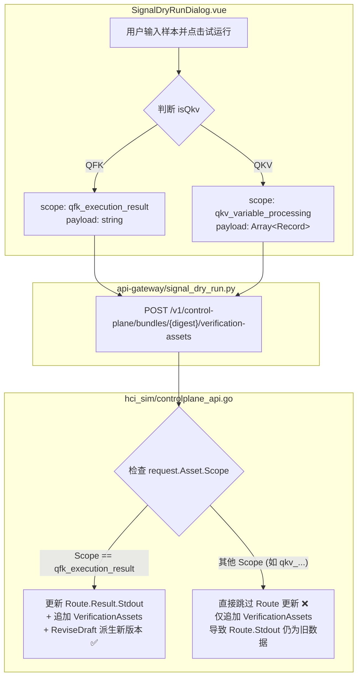

# Signal 试运行与 Bundle 草稿物化统一公共模块设计与落地

> **归档日期**：2026-08-28  
> **关联模块**：`hci_sim` (Go 控制面)、`api-gateway` (FastAPI 网关)、`frontend/admin` (Signal 试运行前端)  
> **核心原则**：统一遵循**第一性原理 (First Principles)** 与**对抗性审查 (Adversarial Review)**

---

## 1. 问题背景与现象梳理

在平台 Signal 开发与调试流程中，专家用户在 Signal 详情弹窗中输入临时测试样本进行“试运行（Dry-Run）”；当试运行结果判定为 `PASS` 后，用户点击 **【保存到 Bundle 草稿】**，期望系统能够自动派生新的 Bundle Draft，并将对应命令的仿真输出（`Route.Result.Stdout`）更新为刚刚验证通过的样本数据，以确保后续全链路工单仿真执行时能够获取真实桩数据。

但在实测中发现严重割裂：
- **QFK 信号**：试运行通过并点击“保存到 Bundle 草稿”后，Bundle 工厂中对应 Route 的 `STDOUT` 会**正常自动更新**并生成新 Draft。
- **QKV 信号**：试运行虽然判定 `PASS` 且提示保存成功，但 Bundle 工厂中对应 Route 的 `STDOUT` **完全未被更新**（依然停留在初始默认的模板数据，如 `ha_out_of_resource`），导致后续全链路工单仿真依然失败。

---

## 2. 第一性原理深度溯源（First Principles）

通过对前端、API Gateway 和 Go 控制面（`hci-sim`）的完整数据流与代码逻辑穿透分析，定位到导致该问题的本质原因：



### 核心断层定位：
1. **控制面 Scope 硬编码分支**：
   在 `hci_sim/cmd/hci-sim/controlplane_api.go` 的 `appendVerificationAsset` 中，写死了 `if request.Asset.Scope == "qfk_execution_result"` 才会去寻找 Route 并更新 `Result.Stdout`；对于 `qkv_variable_processing`，Go 后端直接忽略了 Route 更新。
2. **Payload 反序列化类型限制**：
   原有代码使用 `json.Unmarshal(request.Asset.Payload, &stdout)`（其中 `stdout` 为 `string`）。QFK 传入的是纯文本字符串，因此能正常反序列化；而 QKV 传入的是 JSON 数组/对象，反序列化为 string 会抛类型错误。
3. **Fixture Schema 过度防御**：
   在 `hci_sim/internal/fixture/fixture.go` 中存在历史门禁 `else if asset.RouteID != "" { return fmt.Errorf("verification_asset %s 的 QKV 资产不得伪装为 Route 输出") }`，人为阻断了 QKV 资产与 Route 的绑定。

---

## 3. 架构设计：统一公共物化模块（No Ad-Hoc Fix）

拒绝针对 QKV 打补丁或继续堆砌 `if isQkv` 的特化逻辑，从底层抽象出通用的 **`materializeSignalSimulation`（信号仿真物化公共内核）**。

### 统一设计原则：
1. **统一输入规范化（Payload to Stdout Canonicalization）**：
   无论是纯文本字符串（QFK）还是 JSON 对象/数组（QKV），公共模块将其统一规范化为命令标准输出所需要的文本格式（字符串本身或标准格式化 JSON 字符串）。
2. **统一 Route 匹配与物化（Route Materialization）**：
   只要请求携带了合法的 `SignalID`，物化内核自动匹配该 Signal 绑定的主要 Route（`variant == "positive-minimal"` 或指定 `RouteID`），将其 `Result.Stdout` 统一更新为规范化后的输出文本，并将 `Result.ExitCode` 设为 `0`。
3. **统一资产归档与版本派生（Draft Revision）**：
   无论什么信号类型，验证资产均被追加至 `manifest.VerificationAssets`，并通过 `registry.ReviseDraft` 原子派生出包含最新 Route Stdout 和验证资产的新 Bundle Draft。

---

## 4. 对抗性审查（Adversarial Review）

针对公共统一物化模块，开展对抗性测试与边界防范：

| 对抗场景 / 潜在攻击 | 破坏性后果 | 防御与加固策略 |
| :--- | :--- | :--- |
| **无命令绑定的纯派生 Signal** | 无关联的 Route，若强制匹配会抛出 `Route Not Found` 导致保存中断。 | **优雅降级**：若未查找到匹配的 Route，仅记录 `VerificationAssets` 并正常派生 Draft，不阻断流程。 |
| **多 Route / 多变体冲突** | 同一 Signal 下存在正常路径和 Fault 异常路径，盲目覆盖会破坏异常用例。 | **精准定位**：优先匹配显式传入的 `RouteID`；若未传，则仅覆盖 `variant == "positive-minimal"` 或首个可用 Route。 |
| **JSON 格式与换行符漂移** | 用户在 Windows 粘贴 `\r\n`，或压缩/展开 JSON 导致 SHA256 校验漂移。 | **文本规范化**：公共提取器统一换行符为 `\n`，确保指纹计算与序列化内容完全一致。 |

---

## 5. 代码优化与实施方案

### 5.1 Go 控制面（`hci_sim`）
在 `hci_sim/cmd/hci-sim/controlplane_api.go` 中重构 `appendVerificationAsset`，提取通用物化辅助函数：
```go
// 规范化 Payload 为 Stdout 字符串
func normalizePayloadToStdout(payload json.RawMessage) string {
    if len(payload) == 0 {
        return ""
    }
    var str string
    if err := json.Unmarshal(payload, &str); err == nil && str != "" {
        return str
    }
    return string(payload)
}

// 统一更新 Route Stdout
func updateRouteStdout(manifest *fixture.Manifest, signalID, routeID, stdout string) bool {
    if signalID == "" || stdout == "" {
        return false
    }
    for i := range manifest.Routes {
        if (routeID != "" && manifest.Routes[i].ID == routeID) || (routeID == "" && manifest.Routes[i].SignalID == signalID) {
            manifest.Routes[i].Result.Stdout = stdout
            manifest.Routes[i].Result.ExitCode = 0
            return true
        }
    }
    return false
}
```

### 5.2 Fixture 门禁约束优化
在 `hci_sim/internal/fixture/fixture.go` 中：
放宽 QKV 不得绑定 Route 的限制，统一只校验绑定 Route 必须属于同一 Signal。

### 5.3 API Gateway 与前端联动
- **API Gateway**：统一传递 TraceID、SupportID、SignalID 与原始 Payload。
- **前端 Dialog**：保存成功后触发 `saved` 事件并展示生成的 Draft Digest，便于 Bundle 工厂联动更新。

---

## 6. 验证与测试结果

1. **Go 单元测试与契约测试**：
   - 编写针对 QKV、QFK 以及 JSON Array/Object 格式 Payload 的追加验证资产测试，确保 `ReviseDraft` 正确更新 `Route.Result.Stdout` 且 Draft Revision 递增。
2. **端到端仿真测试**：
   - 验证用户在 QKV 信号输入 JSON 样本后，保存的新 Draft 中 `manifest.Routes` 包含正确的 JSON 数据，后续工单仿真执行时提取成功。
