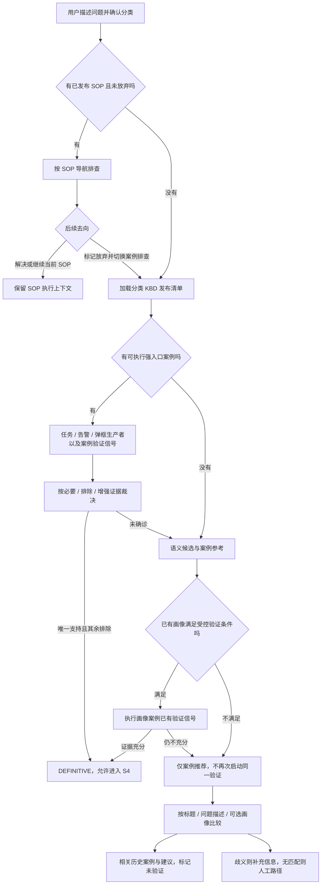

# KBD 证据诊断与 CDD 闭环设计

本文是 **SOP、KBD 强信号、语义画像、无信号案例如何进入排查并输出结论**的现行运行流程。知识发布见[知识库设计](知识库设计.md)，信号字段见[信号契约](关键信号架构设计.md)，文本排名细节见[语义检索与推荐](KBD语义检索与案例推荐设计.md)。

基线为当前工作区；无信号推荐已经本地实现，尚未提交、部署和做真实检索准确率评测。旧文档里的目标态 CategoryDecision、SOP applicability 引擎等不能视为已实现行为。

## 变更历史

| 日期 | 版本 | 变更 |
|---|---|---|
| 2026-09-23 | v2.0 | 合并运行流程与主动调度文档，明确 SOP 优先、强信号、语义验证、无信号推荐和结论隔离。 |
| 2026-08-20 | v1.2 | 分类完整候选、采集复用、真实/仿真等价。 |
| 2026-07-28 | v1.1 | 用户态信号状态与结构化产出展示。 |

整理前设计及目标态讨论见[历史快照](../../archive/kbd-signals-2026-09-23/solution/knowledge-base/KBD证据诊断与CDD闭环设计.md)；不作为当前接口或字段定义。

## 1. 总流程

这是业务阅读顺序。实际 CDD 不是固定“先跑所有生产者、再跑所有消费者”的两轮循环，而是按依赖和调度评分选择可执行 acquisition；不会为了补齐图里的方框重复执行已剪枝案例。

## 2. SOP 何时会转入 KBD

当前 [InvestigationAgent](../../../backend/agent-service/app/adapters/agents/htp/investigation_agent.py) 的规则：

- 有恢复上下文且未放弃时，按原 `sop_document_id` 恢复。
- 否则加载分类清单；有已发布 SOP 且无回退标记，选择返回列表的第一篇 SOP。
- SOP 分支本轮执行后直接返回，不会顺带执行同分类 KBD 信号。
- `status=aborted` 或 `sop_fallback_requested=true` 才绕过 SOP，转同分类 KBD；S6 选择未解决后的回退已有测试覆盖。
- SOP 超时、某个工具失败或仅仅“执行结束”，不自动等于 SOP 已放弃。

目前不应宣称系统已按结构化适用性对多篇 SOP 完成择优。这是旧设计中的目标，当前代码仍以上述选择规则为准。

## 3. 分类清单与四类案例

[playbooks.py](../../../backend/kb-service/app/routes/playbooks.py) 返回分类完整知识清单及每篇的执行资格。

| 案例类型 | 找到方式 | 下一步 | 结论资格 |
|---|---|---|---|
| 有强入口及有效信号 | 同分类可执行集合 | 运行任务/告警/弹框及依赖检查 | 按证据策略确认 |
| 无强入口、有可执行语义画像 | 用户描述匹配画像，满足原门禁 | 验证画像案例已有消费者 | 匹配本身不确认根因 |
| `guidance_only` 画像 | 症状、范围、锚点或标题推荐 | 人工指引/未验证参考 | 不进入自动 CDD |
| `reference_only` 空信号案例 | 标题、问题描述直接检索 | 展示发布案例与处理建议 | 不进入 CDD，不参与“唯一根因”竞争 |

损坏、过期、未发布的执行配置不能冒充干净的参考案例。推荐不会修改 CDD 的原始候选状态。

## 4. 强信号命中后仍需看证据

`qkv_task/qkv_alert/qkv_dialog` 命中是现场入口。生产者可以产出变量，也可以用 `output_processing` 做断言。QFK 可取值判定，也可以继续产出变量。

例如三个案例共用“虚拟机启动失败”任务查询；实际根因仍可能分别是空间不足、管理服务异常或镜像问题。生产者查询相同不意味着三个案例都被确诊。每篇的必要、排除、增强证据独立判断。

没有生产者断言时，QKV 取得一条完整的声明产出记录即可满足该生产信号。因此发布配置的语义质量必须由专家审核；“至少一条 QFK”只是结构门槛，不足以证明根因区分度。

## 5. CDD 编译与调度

实现集中在 [shared/cdd](../../../backend/shared/cdd)：

1. `plan_compiler.py` 将发布 Signal 编译为 SignalRef 和 acquisition 图，校验工具参数、稳定 ID、变量来源与依赖可达性。
2. 同一工具及相同执行参数可共享物理采集；`instruction` 不影响采集身份，`qfk_log` 的 Matcher 下推影响身份。
3. 每个 SignalRef 独立投影、处理和求值，不能直接复用另一个案例的 PASS。
4. `scheduler.py` 只为仍是 CANDIDATE 的案例选择变量已就绪的采集；已经完成的采集不重复执行。
5. 评分综合区分能力、必要证据覆盖、依赖解锁、复用、成本、延迟和风险，只决定顺序，不决定根因。

当前评分是启发式权重，不是经概率模型校准的信息增益。源代码是权重与计算式的唯一来源，文档不复制容易漂移的系数。

## 6. 信号结果、证据作用与候选状态

`SATISFIED` 表示符合该信号的期望，`CONTRADICTED` 表示与期望相反。它们不等于“系统健康/故障”。错误、阻断、未知分别保持 `ERROR/BLOCKED/UNKNOWN`，未运行保持 `NOT_RUN`。

| 证据作用 | 支持条件 | 排除/未决条件 |
|---|---|---|
| Must 必要 | 全部满足 | 任一 CONTRADICTED 排除；缺失/错误/未知保持未决 |
| Exclude 排除 | 全部明确 CONTRADICTED，即排除条件不成立 | 任一 SATISFIED 排除；未查询/错误不等于已清除 |
| Should 增强 | 满足数量达到 `minimum_should` | 数量不足不能支持；不满足本身一般不直接排除 |
| Context 上下文 | 不参与支持门槛 | 可供变量和背景使用 |

Must 非空、全部满足、Exclude 清除、Should 门槛达到，才成为 SUPPORTED。范围 UNKNOWN 仍不能确认。编译失败为 NOT_EXECUTABLE；其它未完成项在收尾时进入 INCONCLUSIVE。

`minimum_should=0` 时，增强证据不构成确认条件，案例一旦 SUPPORTED，其可选信号可能不再调度；不要把“有增强信号”理解成“一定执行过增强验证”。

## 7. 结论门禁

权威实现是 [conclusion_gate.py](../../../backend/shared/cdd/conclusion_gate.py)。

| 等级 | 条件 | 对用户的含义 |
|---|---|---|
| DEFINITIVE | 恰好一篇 SUPPORTED，且没有未决或不可执行候选，其余已排除 | 可以进入 S4，引用案例根因与现场证据 |
| PARTIAL | 有支持案例，但不唯一或仍有未决候选 | 部分支持，不能宣称唯一根因 |
| INCONCLUSIVE | 无支持案例，仍有未决/不可执行项 | 证据不足 |
| NO_MATCH | 可执行候选全部被证据排除 | 当前候选未匹配 |

只有一个候选、标题分数最高、某条命令返回成功，都不能单独产生 DEFINITIVE。无信号推荐案例不入 CDD，既不空集通过，也不阻塞已验证案例。

## 8. 语义验证和标题推荐的衔接

- 强生产者完整未命中，或分类没有强入口时，已有可执行画像可以按原规则进入受限验证。
- 强入口命中但 CDD 未确诊时，不用文本相似度绕过强证据执行门禁。
- 强入口不可用时，可以展示明确标记为未验证的参考；不能将失败记为“未命中”。
- CDD 已 REJECTED 的 ID 跨后续语义/参考轮次传递，不能凭标题相似重新入选。
- 画像验证仍未确诊后，`recommendation_only` 限制下一步为只读推荐，避免再次启动同一验证。
- 相关案例不等于当前根因。推荐显示历史根因、处理方法与适用条件；不会写 S4。

匹配条件、缓存、阈值和前端字段只在[语义检索与案例推荐](KBD语义检索与案例推荐设计.md)维护。

## 9. 在线、仿真与离线

| 模式 | 现场来源 | 共同约束 |
|---|---|---|
| 在线 | 真实受控采集器及 Terminal Bridge | 变量、Matcher 和结论由契约裁决 |
| hci-sim | Bundle 提供的仿真现场 | 目标 support_id 是场景标签，不是候选答案；分类完整性不能被缩小 |
| 离线 | 受控 Evidence 和 AcquisitionProvider | 无证据/缺变量不伪造通过；同修订同输入的处理语义应一致 |
| 离线参考入口 | 发布正文与用户描述 | 不创建 Collector、映射、采集画像或空计划 |

原可执行案例转为 reference_only 后，资源同步按既有停用机制处理失去引用的采集资源。仿真/离线流程的独立运行条件见 [hci-sim](../../../hci_sim/README.md) 和[离线诊断模式需求](../agent/离线诊断模式需求说明_V3.1.md)。

## 10. 验证与定位

| 问题 | 首先查看 |
|---|---|
| 为什么一直走 SOP | 会话恢复状态、aborted/fallback 标记、investigation_route |
| 为什么案例不执行 | 分类发布快照中的 executable、execution_issues、SignalPlan 编译结果 |
| 为什么生产者命中却未确诊 | Must/Exclude/Should、范围状态、缺失变量、candidate_states |
| 为什么已排除案例又出现 | 后续请求 excluded_kbd_ids 和精确发布修订 |
| 为什么只显示参考 | reference_only/guidance_only、case_recommendations、采集状态 |
| 为什么仿真和真实不同 | 分类候选全集、Bundle RouteKey 覆盖、相同发布修订 |

定向测试：[Agent 编排](../../../backend/agent-service/tests/unit/test_semantic_entry_investigation.py)、[CDD reducer](../../../backend/shared/cdd/candidate_reducer.py)、[共享检索](../../../backend/shared/tests/test_kbd_recommendation.py)、[离线资源](../../../backend/diagnosis-service/tests/unit/test_offline_resource_sync_service.py)。测试是当前行为守护，不替代部署后现场验收。
