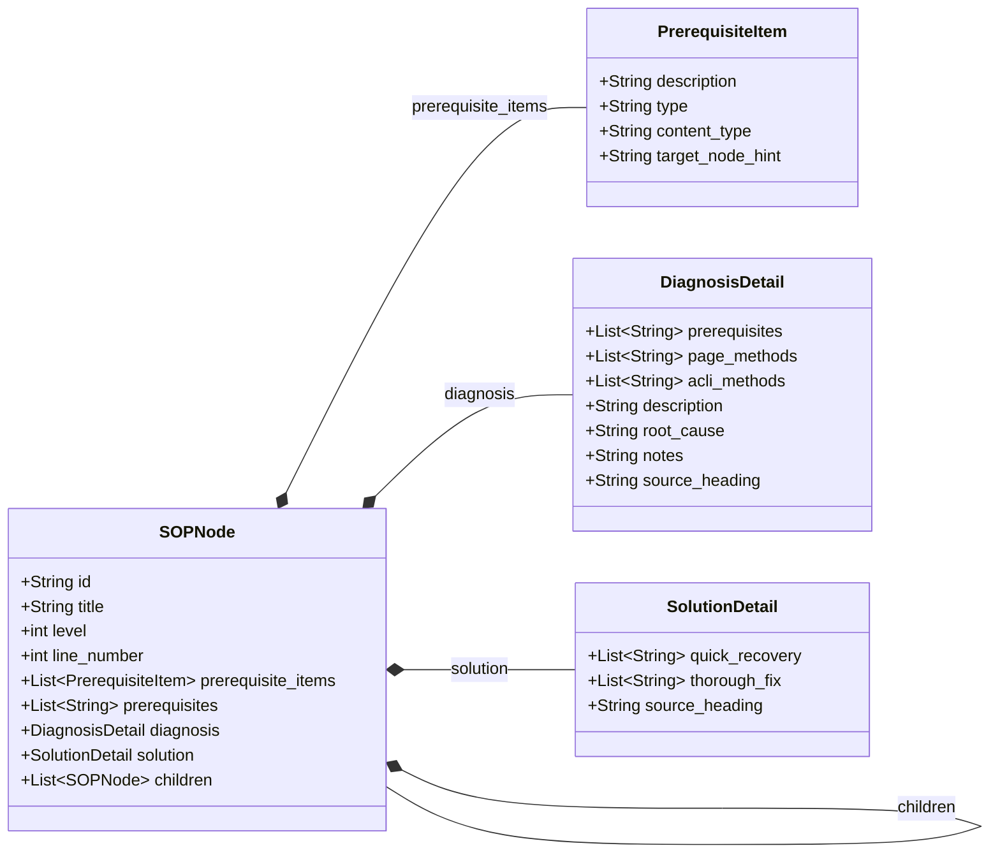

# SOP 多叉决策树解析与实际 SOP 数据审计报告

本报告针对 HCI 智能排障平台中 **SOP 多叉决策树** 的架构设计、数据模型、校验策略以及目前数据库中存在的实际 SOP 记录进行深入剖析。

---

## 一、 SOP 多叉决策树核心设计原则

### 1.1 点-边 决策树范式 (Unified Node Principle)
平台采用了统一节点的设计模式。无论是根节点（场景）、中间路由节点还是叶子节点（故障案例），都基于 `SOPNode` 进行建模。
* **点 (SOPNode)**：代表当前定位到的故障场景或类别。
* **边 (PrerequisiteItem)**：进入某个节点所必须满足的前置检查条件。
* **叶子节点**：没有子节点（`children = []`），拥有具体的 `diagnosis`（判断方法）和 `solution`（解决方案）。
* **中间节点**：含有子节点（`children` 非空），只负责路由，无需包含诊断和解决方案。

### 1.2 叶优先边界锚定策略 (Leaf-First Parser Strategy)
相较于旧版基于固定 Heading 级别（如 H4=叶节点，H5=判断方法）的解析器，新版采用**叶优先**策略：
1. **定位头与尾**：最高层级的 Markdown Heading 确立为根节点；拥有成对「判断方法」与「解决方案」段落的 Heading 被识别为叶节点。
2. **关键词等效匹配**：段落的语义角色由内容决定，而非 H 层级：
   * **诊断/判断**：匹配“判断方法 / 判断依据 / 排查方法 / 排查步骤 / 识别方法 / 确认方法 / 诊断方法”
   * **解决方案**：匹配“解决方案 / 解决方法 / 处理方法 / 处理步骤 / 修复方法 / 修复步骤 / 解决步骤”
3. **推导中间节点**：中间所有 Heading 根据其与根及叶之间的**相对层级差**，自动推导并生长为树分支。

### 1.3 宽松校验模式与三层 `validation_issues`
为支持部分破损 SOP 文档的容错入库及后续差异审计，Pydantic 模型层移除了强制性的 `model_validator`：
* **即时反馈**：解析失败的 `error` 级别（如叶节点缺少判断或解决段落）会阻断上传并返回 422 接口错误。
* **持久化审计**：`warning` 级别（如段落使用非规范标题，或者缺少彻底解决方案）会在响应中返回，且正常写入 `sop_document.tree_validation_issues`。
* **异类检测**：可用于跨文档聚合低频异常话术（如 “处理步骤” 占比低，引导批量纠偏）。

---

## 二、 Pydantic 数据模型解析

对应文件：[sop_template.py](file:///aihci/hci-troubleshoot-platform/backend/kb-service/app/schemas/sop_template.py)



### 关键字段设计说明
1. **`id`**：格式为路径编码 `n-{根序号}-{子序号}-{孙序号}...`（如 `n-1-2-1`），以保证树拓扑结构不变时 ID 的绝对稳定性。
2. **`prerequisite_items`**：包含 `type` (filter 过滤/priority 调序) 与 `content_type` (text 文本/command 命令行)。命令行会提取围栏代码块并剥离 ````bash````。
3. **`source_heading`**：在 `DiagnosisDetail` 与 `SolutionDetail` 中分别记录原始 Heading（如 `"处理方法"`），以作审计追溯。

---

## 三、 数据库实际记录审计与对比

根据从 staging 环境 `postgres-0` 的 `sop_document` 导出的数据，我们获取了 4 条实际 SOP 记录。这 4 条记录完整覆盖了决策树的各种架构复杂性。

### 3.1 SOP 记录多维度对比表

| ID | Title / 场景名称 | Source ID (幂等键) | Status | 叶子节点数 | 校验状态 | 典型变量获取策略 | 树架构特点 |
|---|---|---|---|---|---|---|---|
| **1** | 虚拟机开机失败排查流程 | `sop-upload-e2ce05e0e194` | `draft` | 65 | `null` | `user_input`, `skill_call` | 深度多叉路由树（SOP 3 发布的草稿版本） |
| **2** | 磁盘寿命到期 | `sop-upload-72b051b10a3f` | `published` | 5 | `warnings` | `json_extract`, `skill_call`, `tool_call` | 经典多分支流转树（根据系统盘/aSAN盘、软RAID/硬RAID流转） |
| **3** | 虚拟机开机失败 | `sop-upload-e6acc7d51654` | `published` | 65 | `warnings` | `llm_inference`, `derived`, `skill_call` | 庞大多级决策树（核心 SOP 资产，包含 65 个故障分支） |
| **4** | 硬盘坏道 | `sop-upload-d93f22af7912` | `published` | 1 | `warnings` | `user_input`, `json_extract`, `tool_call` | 极简一节点树（根节点即叶节点，直接做坏道诊断） |

---

### 3.2 实际 SOP 树拓扑分析

#### 案例一：硬盘坏道 (ID=4) —— 极简单节点树
```
[根/叶] n-1: 硬盘坏道
  ├── 前置检查 (acli alert get...)
  ├── 诊断方法 (smartctl.real...) -> 调用 hci-disk-health-checker
  └── 解决方案 (返修换盘 / 正常)
```
* **特点**：没有子标题路由。解析器直接将 H1 定位为根，又因为无 `children`，根据宽松条件，在检测到 diagnosis 与 solution 后直接归为叶子节点。AI Agent 无需进行页面树跳转。

#### 案例二：磁盘寿命到期 (ID=2) —— 典型多路决策树
```
n-1: 磁盘寿命到期
  ├── n-1-1: 系统盘寿命异常 (Route)
  │     ├── n-1-1-1: 软RAID阵列盘 (Leaf)
  │     └── n-1-1-2: 非软RAID阵列盘 (Leaf) -> ( lacks SMART ? 转至硬件RAID )
  └── n-1-2: aSAN盘寿命异常 (Route)
        ├── n-1-2-1: NVME盘 (Leaf)
        └── n-1-2-2: 硬件RAID阵列盘 (Route)
              ├── n-1-2-2-1: MegaRAID 卡 (Leaf)
              └── n-1-2-2-2: SAS RAID 卡 (Leaf)
```
* **特点**：该树体现了前置条件（`PrerequisiteItem`）与流程跳转的应用。例如：在 `n-1-1`（系统盘寿命异常）路由节点上，挂载了 `container_exec -n vs-cp-manager -c "lsblk | grep boot"` 等前置检查，通过回显是 `sdX` 还是 `mdX` 来决定进入 `n-1-1-1` 还是 `n-1-1-2`。
* **校验告警 (Validation Warning)**：所有叶节点都触发了 `solution_missing_thorough_fix` 告警（缺失彻底解决方案，系统自动复用了快速恢复方案内容），其行号与具体路径已被 `tree_validation_issues` 记录。

#### 案例三：虚拟机开机失败 (ID=3) —— 65叶节点深度树
* **特点**：这是一棵包含了 65 个叶子节点的超级深度多叉决策树，几乎包含了 HCI 所有场景的虚拟机启动故障（例如 CPU不足、显卡切分、vdi PCI 地址冲突、UEFI 文件双点、存储离线、Redis OOM 等）。
* **诊断与恢复流程设计**：
  * 该树第一层分为两大路由：`n-1-1`（有启动虚拟机失败任务）和 `n-1-2`（无启动虚拟机失败任务）。
  * 每一个子路由上，解析器都精确记录了它在 Markdown 源文件中的 `line_number`（行号追踪），使前端能在报错或展示时一键定位源文。

---

## 四、 SOP 变量管道 (Variable Pipeline) 的运行机制

每个已发布的 SOP 都会生成 `variable_schema`（变量声明池）。这是 ReAct 引擎在会话期间的“工作内存”。

### 4.1 变量声明与依赖结构
在 `sop_document` 中，我们看到了如 `alert_logs`、`disk_dev`、`smart_info`、`check_meth` 的串联拓扑图：
1. **原始数据**：Agent 读取告警，填充 `alert_logs` (`acquisition_strategy=user_input`)。
2. **告警解析**：`node_ip` / `disk_name` / `node_hostname` 等通过 **Skill** `hci-alert-parsing` 解析，由于声明了 `depends_on = ["alert_logs"]`，解析器在 `alert_logs` 未就绪时会拦截。
3. **资产提取**：通过 `json_extract`（例如 `$.data.disks[?(@.disk_name == '{disk_name}')].dev`）自动从 aSAN 磁盘列表提取设备盘符 `disk_dev`。
4. **底层诊断**：通过 `bash_exec` 工具调用 `smartctl.real` 读取 `smart_info`，它包含了参数模板（例如 `{node_ip}`、`{disk_dev}`）。
5. **模型分析**：把 `smart_info` 的文本喂给 `hci-disk-vendor-lifetime` 或者是 `hci-disk-health-checker` 进行专家系统/大模型分析，将输出返回为 `check_meth` 评估值（`返修` / `正常`）。

### 4.2 运行时阻断与门禁
在 AI Agent 决策树导航中，如果遇到未就绪的变量，变量门禁（Variable Gate）会根据 `depends_on` 的顺序，优先触发对应的获取策略：
* 如果是 `tool_call`，Agent 自动执行该工具（或提示用户点击确认）。
* 如果是 `skill_call`，触发底层技能服务。
* 如果是 `user_input` 且无法提取，则以 inline 表单形式让用户手动输入或确认。
