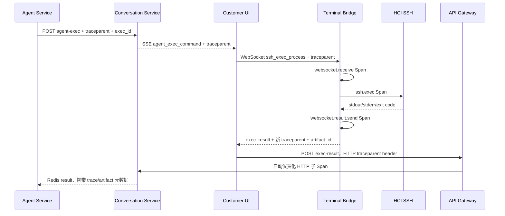

# Terminal Bridge 端到端可观测性 P0 重构设计

## 1. 结论与验收口径

“业务结果能够返回”不等于“端到端可观测”。本方案只在以下五类证据同时成立时，允许使用“端到端完整可观测”的表述：

1. 同一个 W3C Trace ID 覆盖 Agent、conversation-service SSE、浏览器中继、Terminal Bridge、结果回传 Gateway/Conversation；
2. Bridge 的 `websocket.receive`、`ssh.exec`、`websocket.result.send` 是 Tempo 中的真实 Span，而不是手工拼接的固定 Span ID；
3. 每次执行都有 `exec_id` 和 `artifact_id`，可从 Tempo、Loki、Langfuse、`tool_result`、Bridge Audit 互相跳转；
4. stdout/stderr 有内存上限、权威超时、字节数、截断标志和 SHA-256，完整受控内容保存在专用 Artifact；
5. 日志采集、回采、重复提交和进程重启均有明确的持久化、幂等和失败可见性。

HCI 后台本身未嵌入 OTel SDK，因此 `terminal_bridge.ssh.exec` 是 HTP 对 HCI 命令执行的客户端观测边界。它能证明命令发起、耗时、退出状态和返回内容，但不能凭空生成 HCI 内部进程的 Span。

## 2. 地址与运行形态

`ws://localhost:9999` 没有协议缺陷，继续作为 Windows EXE 和 WSL 裸进程的默认地址。`/terminal-bridge` 只用于 K3s Ingress 的路由选择：

| 形态 | 浏览器地址 | 原因 |
|---|---|---|
| Windows EXE | `ws://localhost:9999` | 浏览器与客户端在同一 Windows 主机 |
| WSL 裸进程 | `ws://localhost:9999` | Bridge 直接监听 WSL 网络端口 |
| K3s Pod | 同源 `ws(s)://<页面主机>/terminal-bridge` | ClusterIP 不等于 WSL 浏览器的 localhost，必须经 Ingress |

三种形态使用同一份 `terminal_bridge/main.go`、同一 WebSocket 协议和同一构建版本。路径差异不构成代码分叉。

## 3. Trace Context 数据流

关键约束：

- `trace_id` 只用于检索和冗余关联，传播权威是完整的 `traceparent`；
- 浏览器不创建 Span，但必须原样中继上下文；
- Bridge 用 OTel Go SDK提取远程父上下文并导出 OTLP/HTTP 到 Tempo；
- Bridge 返回 `websocket.result.send` 的真实 Span Context，结果 POST 以它为父上下文；
- 实时路径必须保持同一 Trace ID。离线重放可创建新 Trace 并使用 Span Link，但不得伪造父子关系。

## 4. 执行结果与内存边界

Bridge 为 stdout/stderr 分别设置 `HCI_BRIDGE_EXEC_MAX_OUTPUT_BYTES`，dev 默认 4 MiB。读取器即使达到上限仍继续 drain SSH pipe，避免远端写阻塞，但不再增长内存或向浏览器发送额外数据。

每条结果至少包含：

- `stdout` / `stderr`：上限内的受控内容；
- `stdout_bytes` / `stderr_bytes`：远端实际总字节数；
- `stdout_truncated` / `stderr_truncated`；
- `stdout_sha256` / `stderr_sha256`：针对完整字节流计算；
- `exit_code`、`duration_ms`、`timed_out`、`cancelled`、`error_type`；
- `trace_id`、`traceparent`、`exec_id`、`artifact_id`。

Bridge 默认 120 秒权威超时。每次 `ssh_exec_process` 都建立独立 SSH TCP 连接和 Session；超时时同时关闭 Session 与独立 Client，使远端命令通道确定性停止。只在交互连接上创建新 Session 不足以实现硬超时：部分 SSH 服务端会让 `Session.Close()` 等待远端进程自然结束。浏览器、Agent、Redis 的预算由同一个 Helm 值派生，分别为 `Bridge+15`、`Bridge+30`、`Bridge+60` 秒，默认即 135/150/180 秒。逐层增加的传输余量保证 Bridge 先给出权威结果，不能再由浏览器或 Agent 提前超时而让远端命令继续失控运行。

## 5. Artifact 与 Agent 效果调优

`bridge_execution_artifacts` 是命令结果的专用、受限数据域。普通结构化日志和 Langfuse 不保存完整大输出，只保存摘要、hash、截断状态和 Artifact 引用。

Artifact 主键由 `exec_id` 确定性生成，`exec_id` 有唯一约束，重复 HTTP 提交执行 UPSERT。默认保留 30 天，访问分类为 `restricted`；每日 CronJob 强制删除过期记录，写入路径同时执行机会性清理。普通日志、`tool_result`、动态资源使用审计和 Langfuse 均不复制 Bridge 原始输出，只保存脱敏输入、执行摘要、hash 和 Artifact 引用。

`tool_result` 新增：

- `exec_id`；
- `artifact_id`；
- `output_sha256`；
- `error_type`；
- `bridge_trace_id`。

Langfuse tool observation metadata 同步记录 `exec_id`、OTel Trace ID、`artifact_id`、stdout/stderr hash 和错误分类。这样可从模型一次工具选择，定位到命令、结果证据、系统 Trace、日志和性能指标。

Prometheus 指标覆盖：

- `agent_tool_call_total{tool_name,status}`：成功率分母/分子；
- `agent_tool_execution_duration_seconds{tool_name,status}`：耗时分布；
- `agent_tool_error_total{tool_name,error_type}`：稳定错误分类；
- Bridge 进程、连接、执行与采集基础指标。

## 6. 结构化日志规范

Bridge stdout 严格保持“一行一个 JSON”。标准字段包括：

- `event_id`、`bridge_instance_id`、`seq`、`ts`；
- `service.name`、`service.version`、`deployment.environment`；
- `trace_id`、`span_id`、`trace_flags`、`traceparent`；
- `case_id`、`conversation_id`、`exec_id`、`tool_call_id`；
- `node_ip`、`event`、`level`、`message`、`extra`。

禁止项：

- WebSocket 解析失败时记录 raw payload；
- stdout 打印完整命令；
- 普通日志保存完整 stdout/stderr；
- password、private key、passphrase、token、API key；
- 把 trace ID、exec ID 等高基数字段设置为 Prometheus label。

命令只记录脱敏文本和 SHA-256。非零退出、超时和连接错误使用 ERROR，并记录稳定 `error_type`。

## 7. 日志回采与幂等

每条日志的 `event_id` 以及 `(bridge_instance_id, seq)` 都是幂等键。conversation-service 使用 `ON CONFLICT DO NOTHING`，响应区分 accepted、duplicates、skipped。

浏览器回采采用 localStorage 持久 Outbox 和无限次指数退避（上限 30 秒），不再在第 5 次失败后静默丢弃。与此同时 Alloy 直接采集 K3s Pod CRI日志到 Loki，因此 Pod 模式有独立于浏览器回采的第二条证据路径。

## 8. Alloy 替代 Promtail

Promtail 已于 2026-03-02 结束生命周期。实际 `hci-platform-obs` Chart 改用 Grafana Alloy DaemonSet：

- 从 `/var/log/pods` 读取 containerd/CRI日志；
- `stage.cri` 解码容器运行时封装；
- `stage.json` 解析 Bridge 和 Python 结构化字段；
- Trace ID/Span ID作为 structured metadata，不作为高基数索引 label；
- 写入 Loki，Grafana 继续通过 Tempo `tracesToLogsV2` 关联。

## 9. 安全边界

- cluster 模式默认 same-origin，禁止 `*`；
- Pod 非 root、禁止提权、删除 capabilities；
- Bridge 数据与 `known_hosts` 使用 PVC，文件权限 0600；
- SSH 主机指纹默认 `accept-new`（TOFU），首次保存，后续变化拒绝；生产推荐预置并使用 `strict`；
- 浏览器断开后清除内存中的认证缓存；
- Artifact 和 Loki 属于受限运维数据，不得开放给普通客户角色。

## 10. 数据库迁移说明

权威 Schema：`database/desired_schema.sql`。

Atlas 迁移：`database/atlas-migrations/20260727000000_terminal_bridge_observability_p0.sql`。

迁移只新增表、列和索引，全部使用 `IF NOT EXISTS`，不删除存量数据。回滚应用版本时可保留新增字段和 Artifact 表；如必须物理回滚，应先导出 Artifact，再删除新索引、表和列。

## 11. 不应再使用的表述

旧文档中“固定 Span ID 为 1 已满足基本端到端追踪需求”是错误结论。固定 Span ID 既不能表达父子关系，也可能冲突，更没有向 Tempo 导出 Span。该方案只能称为日志相关 ID，不是分布式追踪。
