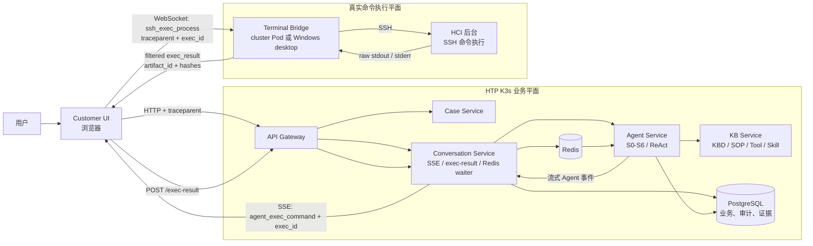
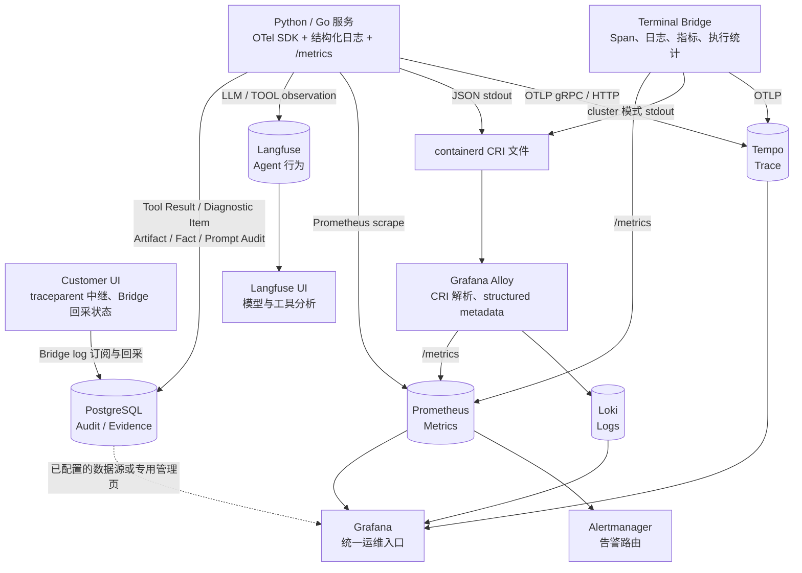
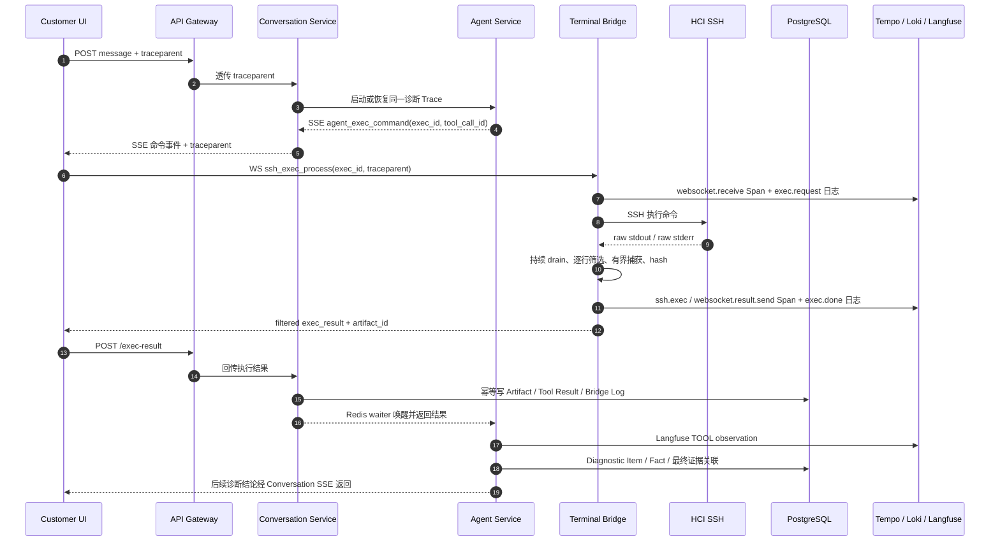
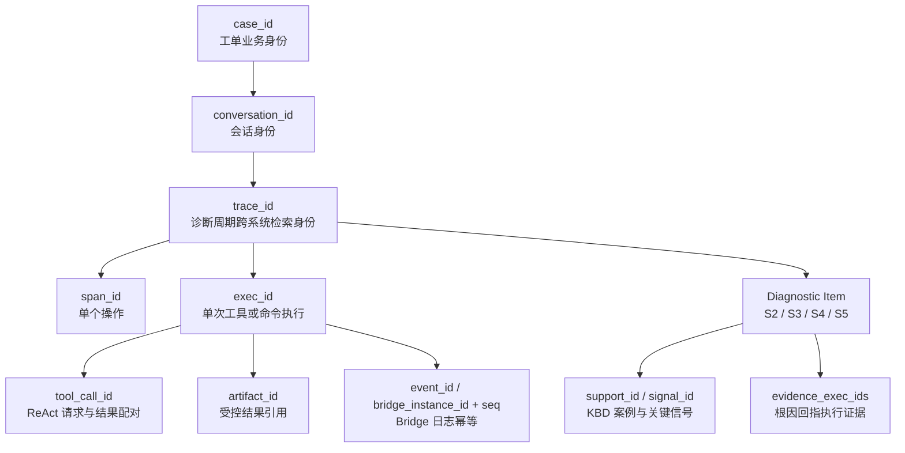

# HCI 智能排障平台可观测性设计

本文档是 HTP 可观测性架构的总入口。它不再只描述日志、链路和指标三大支柱，而是从 Agent 排障的最终目标出发，统一描述以下五类观测数据面：

1. 分布式链路：OpenTelemetry + Tempo；
2. 结构化日志：JSON stdout + containerd CRI + Grafana Alloy + Loki；
3. 指标与告警：Prometheus + Alertmanager + Grafana；
4. LLM 与 Agent 行为：Langfuse + Prompt Audit；
5. 诊断证据与执行审计：Tool Result + Diagnostic Item + Artifact + Fact + Bridge Log。

本文档以 K3s 部署为当前主形态，以 Terminal Bridge 真实 SSH 执行链路为最严格的验收样本。文中严格区分“当前已实现”“真实验收通过”“部分实现”和“目标设计”，不把规划项描述为现状。

## 变更历史

| 日期 | 版本 | 变更内容 | 关联文档 |
|---|---|---|---|
| 2026-08-06 | v3.2 | KBD 错误链路整改：StructuredLogger 统一兼容标准调用并固定 schema version；HTTPException/RequestValidationError、网关下游非 2xx、KBD 保存 digest 上下文统一记录 request_id/trace_id；kb-service 接入 HTTP 黄金信号和 `hci_kbd_signal_validation_total{code,operation}`，前端展示错误码与诊断编号。 | [KBD 关键信号错误链路与日志可观测性整改方案](events/2026-08-06-KBD关键信号错误链路与日志可观测性整改方案.md) |
| 2026-08-06 | v3.1 | KBD Pipeline 增加操作者中文摘要与 JSONL 双轨日志；图片级与案例级状态不一致显式记录，`failed/warning/blocked_by_dependency/skipped_existing` 分开统计。JSONL 用 run_id/trace_id/support_id/stage/job_id/error_code 关联，默认压低 httpcore 噪声；Provider 级指标和多副本 Job 持久化仍待部署专项。 | [KBD 数据管道稳定性与可观测性方案](knowledge-base/events/2026-08-06-KBD数据管道稳定性与可观测性方案.md) |
| 2026-07-29 | v3.0 | 按五类数据面重构全景架构；补齐 Customer UI、Agent、Terminal Bridge、HCI、Langfuse 和诊断证据链；明确关联身份、物理流语义、验收门禁、保留策略和现存限制 | [Terminal Bridge 真实入口 P0 修复与端到端重验](../verify/events/2026-07-29-terminal-bridge真实入口P0修复与端到端重验.md) |
| 2026-08-10 | v3.3 | 阶段一 cluster Bridge 纳入受管部署证据：Pod Ready 仍只代表进程可用；必须同时验证同源 WebSocket 101、NetworkPolicy、Bridge/hci-sim 共享 TestRun/exec 关联和 rollback。 | [K3s 受管 terminal_bridge 启用验证](../verify/events/2026-08-10-K3s受管terminal_bridge启用验证.md) |
| 2026-07-29 | v2.2 | Alloy 健康从 Pod 状态升级为资源、HTTP 探针、Prometheus 指标与流水线告警四层门禁 | [Terminal Bridge 真实入口 P0 修复与端到端重验](../verify/events/2026-07-29-terminal-bridge真实入口P0修复与端到端重验.md) |
| 2026-07-27 | v2.1 | K3s 日志采集从已 EOL 的 Promtail 迁移到 Alloy；Terminal Bridge 接入真实 OTel Trace 和 Artifact | [Terminal Bridge 端到端可观测性重构设计](observability/2026-07-27-terminal-bridge端到端可观测性重构设计.md) |
| 2026-04-24 | v2.1 | 新增 Prompt 审计 Dashboard、PostgreSQL 数据源和上下文审计机制 | [Prompt 审计机制](observability/Prompt审计机制.md) |
| 2026-04-16 | v2.0 | 修复持久化、关联钻取、告警、HTTP 指标、Dashboard 等历史问题 | [可观测性全面修复方案](events/2026-04-16-可观测性全面修复方案.md) |

---

## 1. 第一性原理：什么才是“端到端完整可观测”

可观测性不是“部署了 Grafana”，也不是“能搜到一些日志”。对于 HTP，真正需要回答的是：

- 用户发起了什么诊断请求？
- Agent 为什么选择某个 KBD、SOP、工具和命令？
- 命令是否真的通过 Terminal Bridge 到达 HCI？
- HCI 实际返回了多少数据，哪些内容经过安全筛选后交给 Agent？
- Agent 的阶段性证据、根因和结论能否回指到具体执行？
- 任意一层失败、丢数、截断或重试时，能否区分故障发生位置和责任边界？
- 所有数据能否在不泄漏敏感命令输出和 Prompt 的前提下被复盘？

因此，“端到端完整可观测”必须同时满足六个条件：

| 条件 | 必须证明的事实 |
|---|---|
| 上下文连续 | W3C `traceparent` 在 HTTP、SSE 消息、WebSocket 消息和结果回传中持续传播，不能为每一跳重新生成无关 Trace |
| 执行真实 | 必须存在受审计的 `agent_exec_command` / `ssh_exec_process`、Bridge Span、Artifact 和 Tool Result；页面中的 Markdown 或模型描述不能冒充真实执行 |
| 语义可关联 | `case_id → conversation_id → trace_id → exec_id → artifact_id` 可跨 Tempo、Loki、Langfuse 和 PostgreSQL 互查 |
| 丢失可感知 | Pod Ready 之外，还要观测采集 target、写入成功、丢弃、重试、缓冲和唯一事件是否真正到达后端 |
| 证据可复现 | S2/S3/S4/S5 诊断项可回指具体 `exec_id`、输出摘要/hash 和受控 Artifact，而不是只保存一段最终自然语言 |
| 安全有边界 | 原始大输出不进入浏览器、普通日志或 Langfuse；完整受控输出有分级、截断、hash、过期时间和访问限制 |

### 1.1 Telemetry 与 Evidence 不是一回事

HTP 同时需要两种不同性质的数据：

- **Telemetry（运行遥测）**回答“系统怎样运行”：请求耗时、错误率、Span、进程日志、队列和采集健康。Tempo、Loki 和 Prometheus 是主要载体。
- **Evidence（诊断证据）**回答“Agent 根据什么得出结论”：工具输入输出、关键信号、证据状态、Artifact、Prompt 版本和事实。PostgreSQL 与 Langfuse 是主要载体。

日志不能替代证据表，因为日志会采样、轮转和过期；Langfuse 也不能替代 Prometheus、Loki、Tempo，因为它不负责基础设施健康、日志采集丢失和通用分布式调用拓扑。业界合理范式是分工协作，而不是在 Grafana 栈和 Langfuse 之间二选一。

### 1.2 “一个 Trace”准确含义

本项目的 P0 契约是：同一次诊断周期使用一个权威 `trace_id`，跨服务和 Terminal Bridge 不发生 Trace 分叉。它不等于每个参与方都能导出 Span：

- 当前浏览器负责中继 `traceparent`，但尚未接入前端 OTel SDK，因此 Tempo 中没有完整的浏览器 Span；
- HCI 后台没有接入 HTP 的 OTel SDK，`terminal_bridge.ssh.exec` 是 HTP 能观测到的 HCI 客户端边界，无法宣称看到 HCI 内部进程 Span；
- SSE、WebSocket、Redis 等异步边界可能出现未导出的远端父 Span 引用，但只要 `trace_id` 一致，就不是 Trace 分叉。

因此，对外表述应是“HTP 控制范围内的同一 Trace 可关联”，而不是“所有外部系统内部均有完整 Span”。

---

## 2. 可观测性全景图

### 2.1 业务链路与执行数据面



这条链路中，浏览器不是命令执行器，而是 Agent 与 Bridge 之间的受控传输端点。只有服务端产生并携带 `exec_id` 的 `agent_exec_command` 才能进入自动执行入口；普通 Markdown、代码块和 S0 模型文本没有自动执行权限。

### 2.2 五类观测数据面的汇聚关系



Grafana 是运维查询与关联入口，不是数据权威源；Langfuse UI 是模型和 Agent 行为分析入口；PostgreSQL 中的业务证据是诊断结论复盘的权威源。

### 2.3 一次真实 Agent → HCI 执行时序



---

## 3. 跨系统关联身份模型

### 3.1 ID 层级与权威来源



| 字段 | 基数与生命周期 | 权威含义 | 主要查询位置 |
|---|---|---|---|
| `case_id` | 一个用户工单一个 | 工单业务身份，如 `Q2026072939295` | Case、Conversation、Tool Result、Artifact、Langfuse session |
| `conversation_id` | 工单下一个或多个 | 对话与诊断状态身份 | Conversation、Message、Diagnostic Item、Tool Result |
| `trace_id` | 当前设计为一次诊断周期一个 | Tempo、Loki、Langfuse、审计表的跨系统主检索键，32 位十六进制 | 全部观测数据面 |
| `traceparent` | 每一跳一个 Header 或消息字段 | W3C 上下文权威载体，包含版本、trace ID、父 Span ID 和 flags；不能只传自造 `trace_id` 代替 | HTTP Header、SSE/WS/结果消息 |
| `span_id` | 一个操作一个 | 单个入站、出站、SSH 或结果发送操作 | Tempo、结构化日志 |
| `exec_id` | 一次工具/命令一个 | 执行审计的稳定身份；确定性 KBD 信号重跑时可幂等更新 | Tool Result、Artifact、Bridge Log、Langfuse TOOL |
| `tool_call_id` | 一次 ReAct tool call 一个 | OpenAI 工具请求与 tool result 消息配对 | Message、Tool Result、Bridge Log |
| `artifact_id` | 一个受控执行结果一个 | filtered stdout/stderr 的受限引用；通常由 `exec_id` 确定性生成 | Artifact、Tool Result、Langfuse |
| `event_id` | 一条 Bridge 事件一个 | Bridge 回采日志第一幂等键 | `bridge_execution_logs` |
| `(bridge_instance_id, seq)` | Bridge 实例内单调递增 | Bridge 回采日志第二幂等键，处理重放和断线续传 | `bridge_execution_logs` |
| `support_id` | 一个 KBD 案例一个 | Agent 命中的知识案例身份 | KBD、Diagnostic Item、Langfuse |
| `signal_id` | KBD 内一个关键信号一个 | S3 关键信号身份 | Diagnostic Item content、执行计划 |

### 3.2 强制关联规则

- `trace_id` 必须从有效 W3C 上下文派生，不允许在下游服务随意重建；无上下文的新入口才创建新 Trace。
- `exec_id` 必须在 Agent 提议执行时生成，随后由 SSE、浏览器、WebSocket、Bridge、`/exec-result`、Tool Result 和 Langfuse 原样传递。
- `artifact_id` 只代表受控内容，不代表 HCI 原始物理流；原始流只留下计数、行数和 SHA-256。
- Prometheus label 中禁止放 `trace_id`、`exec_id`、`case_id`、`conversation_id`、`session_id` 等无界高基数字段；需要定位单次执行时使用 Tempo、Loki 或 PostgreSQL。
- 不把展示序号、数组位置或日志时间戳当作跨层业务身份。

---

## 4. 五类观测数据面

### 4.1 分布式 Trace：OpenTelemetry + Tempo

当前 Python 服务通过共享 OTel 模块完成 FastAPI、HTTPX、SQLAlchemy 与日志上下文关联；Terminal Bridge 使用同一套 W3C Trace Context 和 OTel Go SDK，至少创建以下真实执行 Span：

- `terminal_bridge.websocket.receive`：收到并校验命令消息；
- `terminal_bridge.ssh.exec`：创建 SSH 会话、执行和读取结果；
- `terminal_bridge.websocket.result.send`：向浏览器发送受控结果。

Trace 的职责是呈现调用拓扑、耗时、状态和错误边界，不负责保存完整命令输出。关键属性应包含低敏感度的 `exec_id`、`artifact_id`、`tool_name`、`node_ip`、`exit_code`、`error_type`、字节数和截断状态；命令正文和 HCI 大输出不应直接写入 Span。

采集链路为：

```text
Python / Go OTel SDK
  → BatchSpanProcessor
  → OTLP gRPC 4317 或 HTTP 4318
  → Tempo
  → Grafana Tempo 数据源
```

当前边界：浏览器未导出 Span，HCI 内部也未接入 OTel；Tempo 看到的是 HTP 对这些边界的客户端观测。

### 4.2 结构化日志：JSON stdout + Alloy + Loki

服务日志遵循结构化事件模型，而不是依赖不可解析的自由文本。推荐稳定字段如下：

| 类别 | 字段 |
|---|---|
| 时间与级别 | `timestamp` / `event_time`、`observed_time`、`level` |
| 服务身份 | `service_name`、`service_version`、`deployment_environment`、Pod/容器 |
| Trace 身份 | `trace_id`、`span_id`、`trace_flags` |
| 业务身份 | `case_id`、`conversation_id`、`user_id` |
| 执行身份 | `exec_id`、`tool_call_id`、`artifact_id`、`event_id`、`bridge_instance_id`、`seq` |
| 事件语义 | `event`、`message`、`status`、`success`、`error_type` |
| 结果摘要 | `duration_ms`、`exit_code`、字节数、SHA-256、截断标记、受控 preview |

K3s 采集路径为：

```text
应用 JSON stdout
  → containerd 写入 /var/log/pods 下的 CRI 日志
  → Alloy stage.cri 解码
  → stage.json 提取 event / level / trace_id / span_id
  → trace_id 等保存为 structured metadata
  → Loki
```

Loki label 只保留 `namespace`、`service_name`、`pod`、`container` 等有界维度。`trace_id` 和 `span_id` 作为 structured metadata 或 JSON 字段查询，避免索引基数爆炸。

#### Bridge 日志的双通道

Terminal Bridge 有两个互补日志通道：

1. cluster 模式的 JSON stdout 由 CRI → Alloy → Loki 收集，适合实时运维排障；
2. Bridge 内部带 `event_id` 和实例序号的结构化事件由浏览器订阅、重放并回采到 `bridge_execution_logs`，适合按工单持久复盘和断线补偿。

Windows desktop 模式没有 containerd/Alloy，因此本机 stdout 不会自动进入 K3s Loki；但同一套 Bridge 事件协议、OTel 导出和工单日志回采仍可工作。若要获得 Windows 本机进程级日志和指标的完全对等覆盖，需要部署 Windows 采集器，这是 P1 范围；当前 dev 的 cluster 模式已经消除了这一部署边界。

#### Alloy 健康门禁

`Pod Ready` 只表示 Alloy 进程探针可达。日志链路真正 Ready 必须同时满足：

1. Pod 资源无持续 CPU 饥饿或 OOM；
2. `/-/ready` 正常；
3. Prometheus 抓取 Alloy target 为 `up=1`；
4. Loki dropped entries/bytes 为 0，重试不持续增长；
5. 文件读取有增长时，Loki 成功写入不能长期为 0；
6. 注入的唯一事件能在 Loki 按时间窗检索到。

### 4.3 Metrics 与 Alerts：Prometheus + Alertmanager

Metrics 用于趋势、容量、SLO 和异常检测，不用于追踪单次工单。当前指标按职责分为：

| 范围 | 代表指标 |
|---|---|
| HTTP RED | `http_request_duration_seconds`、`http_requests_total` |
| AI/知识检索 | `hci_ai_ttft_seconds`、`hci_ai_requests_total`、`hci_kb_search_seconds` |
| 调度与 Pod 池 | `hci_pod_pool_idle`、`hci_pod_pool_active` |
| Agent 工具可靠性 | `agent_tool_call_total`、`agent_tool_timeout_total`、`agent_tool_execution_duration_seconds`、`agent_tool_error_total`、`agent_tool_semantic_validation_total` |
| Agent 结论可靠性 | `agent_hallucination_detected_total`、`agent_unsupported_claim_total`、`agent_schema_validation_total`、`agent_verification_blocked_total`、`agent_reasoning_confidence`、`agent_resolution_steps` |
| Agent 信息质量 | `agent_information_confidence_sum`、`agent_information_packet_count`、`agent_reasoning_steps_total` |
| Bridge 执行 | `bridge_exec_commands_total`、`bridge_exec_command_errors_total`、`bridge_ssh_connections_total`、`bridge_ssh_connection_errors_total` |
| Bridge 运行态 | `bridge_process_up`、`bridge_build_info`、`bridge_websocket_connections_active`、`bridge_ssh_sessions_active`、`bridge_log_subscribers_active` |
| Bridge 回采 | `bridge_logs_collected_total`、`bridge_logs_collect_errors_total`、`bridge_logs_replayed_total`、`bridge_log_buffer_entries`、`bridge_log_pending_entries`、`bridge_log_file_bytes` |

Prometheus 当前抓取业务命名空间、`hci-observability` 和 ArgoCD 中带注解的 Pod，默认 15 秒间隔。Alertmanager 接收 Prometheus 规则并路由告警。

指标设计遵循：

- Counter 表示累计事件，Histogram 表示耗时分布，Gauge 表示当前状态；
- label 仅使用工具名、状态、错误类型、风险等级、服务名等有界枚举；
- 单次 `trace_id`/`exec_id` 通过日志、Trace、Exemplar 或证据表关联，不直接成为 label；
- 指标名、告警表达式和实际 scrape label 必须做契约测试，不能仅验证 YAML 可解析。

### 4.4 LLM 与 Agent：Langfuse + Prompt Audit

Langfuse 负责传统 APM 不擅长回答的问题：

- Agent 使用了哪个模型、Prompt、KBD/SOP/Skill 和工具；
- 模型调用耗时、token、失败和重试情况；
- ReAct 中 TOOL observation 的输入摘要、执行结果摘要和前后因果；
- 同一工单的不同 Prompt/模型版本效果如何比较。

Terminal Bridge 工具执行写入 Langfuse 的稳定结果字段集合为：

```text
otel_trace_id, exec_id, artifact_id,
stdout_sha256, stderr_sha256,
stdout_bytes, stderr_bytes,
stdout_truncated, stderr_truncated,
exit_code, error_type, duration_ms
```

零值和空值也是契约的一部分，例如成功命令必须明确保留 `stderr_bytes=0`、`truncated=false` 和 `error_type=null`，不能因为序列化过滤而消失。

Prompt Audit 使用 PostgreSQL `audit_log` 保存 Prompt 构建快照、模板版本、模型和采样的完整 messages，主要用于复现“Agent 当时看到了什么”。其访问权限和保留策略应严于普通运行日志，详细机制见 [Prompt 审计机制](observability/Prompt审计机制.md)。

#### Grafana 栈与 Langfuse 的分工

| 问题 | 最合适的入口 | 原因 |
|---|---|---|
| 服务是否存活、错误率是否升高 | Prometheus / Grafana | 低成本聚合和告警 |
| 某次请求在哪个服务变慢或失败 | Tempo | 分布式调用拓扑和 Span 状态 |
| 失败时进程打印了什么 | Loki | 结构化事件和时间窗上下文 |
| 模型为什么选了某工具、token 和 observation 如何变化 | Langfuse | LLM/Agent 原生语义 |
| 根因结论由哪些真实命令支撑 | PostgreSQL 证据表 | 结构化、持久、可审计的业务事实 |
| HCI 完整受控输出是什么 | Artifact 受限查询 | 避免大输出污染日志和 LLM 平台 |

结论：Grafana 栈、Langfuse 和证据数据库是三个互补层。任何单一产品都不能独立覆盖 HTP 的完整可观测需求。

### 4.5 诊断证据与执行审计：PostgreSQL

| 数据实体 | 作用 | 关键关联 |
|---|---|---|
| `tool_result` | 工具执行生命周期、风险、授权、状态、摘要和耗时 | `conversation_id`、`case_id`、`trace_id`、`exec_id`、`artifact_id` |
| `diagnostic_item` | S2 假设、S3 验证、S4 根因、S5 方案 | `conversation_id`、`trace_id`，content 内含 `support_id`、`signal_id`、`evidence_exec_ids` |
| `bridge_execution_artifacts` | filtered stdout/stderr 的受控完整内容 | `exec_id` 唯一，关联 `artifact_id`、`trace_id`、case、conversation |
| `bridge_execution_logs` | Bridge SSH 与命令事件的工单级持久回采 | `event_id`、实例序号、`trace_id`、`exec_id`、`artifact_id` |
| `fact` | Agent 已采集并归一化的客观事实 | `case_id`、`trace_id`、来源、置信度、原始引用 |
| `audit_log` | Prompt 构建和上下文审计 | `conversation_id`、`trace_id`、Prompt 版本 |
| `message` | 用户、助手、tool_call、tool_result 的跨轮次历史 | `conversation_id`、`case_id`、`trace_id`、`tool_call_id` |

证据链的最低闭环为：

```text
Diagnostic Item.signal_id
  → evidence_exec_ids / Tool Result.exec_id
  → Artifact.artifact_id
  → stdout/stderr SHA-256、字节数、截断状态
  → Bridge exec.done 与 Tempo SSH Span
```

最终报告只保存自然语言而没有这条证据链，不算可复盘的 Agent 诊断。

---

## 5. Terminal Bridge 与 HCI 执行观测专题

### 5.1 raw 与 filtered 的物理语义

Bridge 必须区分“HCI 实际写入 SSH pipe 的物理流”和“允许返回给平台的受控流”：

| 数据 | 精确定义 | 是否保存正文 |
|---|---|---|
| `raw_bytes` / `raw_sha256` / `scanned_lines` | Bridge 从 SSH stdout/stderr pipe 实际读到的全部物理数据 | 否，只记录统计和 hash |
| `filtered_bytes` / `filtered_sha256` / `kept_lines` | 经过安全逐行筛选后允许进入受控捕获的数据 | 是，受 bounded capture 限制 |
| Artifact `stdout_bytes` / `stderr_bytes` | Artifact 中 filtered stdout/stderr 的 UTF-8 字节数 | 是，restricted |
| `stdout_truncated` / `stderr_truncated` | 受控捕获是否达到上限 | 只保存布尔值；即使截断仍继续 drain pipe |
| `filter_applied` | 本次命令是否应用了安全行筛选 | 否 |

必须持续 drain 原始 pipe，即使受控缓存已经截断；否则远端进程可能因为 pipe 背压阻塞，导致“观测逻辑改变被观测系统行为”。

原始正文禁止进入：

- 浏览器 WebSocket；
- `/exec-result` HTTP；
- Artifact；
- 普通结构化日志；
- Loki；
- Langfuse。

这意味着 Artifact 的 418 字节不能被误读为 HCI 只输出了 418 字节。真实验收中的 `lsof` 命令，Bridge 读到 raw stdout `61,272,982` 字节，筛选后 stdout 为 `418` 字节，`filter_applied=true`；两者同时存在才证明“远端有大量输出且安全筛选工作正常”。

### 5.2 stdout/stderr、错误与完成语义

- stdout 和 stderr 独立读取、独立计数、独立 hash、独立截断，不能合并后再推断来源；
- `exit_code=0` 只表示远端命令正常退出，不代表 stdout 非空，也不代表 Agent 关键信号一定 PASS；
- 超时、取消、SSH 会话创建失败、pipe 获取失败、命令启动失败分别使用稳定 `error_type`；
- `status`、`success`、`exit_code`、`timed_out`、`cancelled` 不能互相替代；
- `exec.done` 必须无论成功失败都产生，前端工具卡片不能永久停留在“等待输出”；
- 受控 preview 只用于快速定位，完整 filtered 内容必须通过 `artifact_id` 按权限读取。

### 5.3 幂等、重放与断线恢复

- 每条 Bridge 事件以 `event_id` 幂等落库；
- `(bridge_instance_id, seq)` 提供实例内第二唯一约束，防止浏览器断线重连后的重复回放；
- `exec_id` 关联 `exec.request`、`exec.start`、`exec.done`、Tool Result 和 Artifact；
- 确定性 KBD 信号重跑可以复用 `exec_id` 并幂等更新结果，但每次物理执行仍应在 Span、指标和 Bridge 事件中可见；
- 回采成功、失败、丢弃和最后错误同时暴露给前端运行态，禁止静默失败。

### 5.4 安全边界

- cluster 模式默认执行 same-origin 校验，单副本运行，不把 Bridge 暴露为任意网页可调用的 SSH 跳板；
- K3s NetworkPolicy 只允许 Traefik → Bridge，以及 Bridge → DNS、hci-sim:2222、Tempo:4318；它不是“Pod Running”或 readiness 的替代证据；
- 命令在日志和 Span 中按策略脱敏或只保存 SHA-256；
- Artifact 默认 `restricted`，通过专用 API 和权限控制访问；
- 密钥、Token、密码、私钥和原始大输出禁止进入普通日志与 Langfuse；
- 风险等级、授权人、授权决策和输入 hash 写入 Tool Result / Authorization 审计。

---

## 6. 数据分级、存储与保留现状

### 6.1 数据分级

| 分级 | 示例 | 允许位置 |
|---|---|---|
| Operational | 服务名、状态码、耗时、错误类型、聚合指标 | Prometheus、Tempo、Loki |
| Internal | `case_id`、`trace_id`、`exec_id`、节点标识、受控 preview | Tempo、Loki、Langfuse、PostgreSQL，按内部权限访问 |
| Restricted | filtered 完整命令输出、Prompt full messages、用户输入上下文 | Artifact、Prompt Audit 等受限存储 |
| Prohibited | 密码、私钥、API Key、未筛选 raw 正文 | 不得进入观测后端；在产生端脱敏或丢弃 |

### 6.2 当前真实存储与保留

| 后端 | 数据 | 当前配置 | 结论 |
|---|---|---|---|
| Tempo | Trace | 2 GiB `local-path` PVC；Chart 未声明固定 retention SLA | Pod 重建可保留，但容量和时间保留无正式保证 |
| Loki | 结构化日志 | 2 GiB `local-path` PVC；Chart 未声明固定 retention SLA | 不应在文档中虚构固定保留天数 |
| Prometheus | 指标 | `retention.time=7d`，存储为 `emptyDir` | 最多 7 天且 Pod 重建会丢历史，是 P1 风险 |
| Langfuse | LLM / TOOL observations | Langfuse + ClickHouse + MinIO；ClickHouse/MinIO 为 2 GiB PVC | 未声明统一业务 retention SLA |
| Artifact | filtered stdout/stderr | 默认 30 天，`restricted`，`expires_at` 清理 | 当前唯一明确的执行正文保留周期 |
| Tool Result / Diagnostic Item / Fact | 诊断证据 | PostgreSQL 业务持久数据 | 未声明独立自动过期策略 |
| Bridge Log | 工单级 Bridge 事件 | PostgreSQL，双幂等键 | 未声明独立自动过期策略 |
| Prompt Audit | Prompt 构建上下文 | PostgreSQL，完整 messages 受采样策略控制 | 高敏数据，需要单独保留与权限策略 |

生产化前必须按故障复盘窗口、合规、磁盘容量和恢复目标明确每类数据的 retention、备份和删除 SLA。

---

## 7. 查询入口与跨系统 Runbook

### 7.1 推荐排查顺序

```text
case_id
  → 查 conversation_id 与权威 trace_id
  → Tempo 看服务拓扑、失败 Span 和耗时
  → Loki 按 trace_id 看同时间窗结构化事件
  → Tool Result / Diagnostic Item 看业务状态与 exec_id
  → Artifact 看受控完整输出和 hash
  → Langfuse 按 case/session、trace_id、exec_id 看模型与 TOOL observation
  → Prometheus 看同期是否存在系统性错误、容量或采集故障
```

### 7.2 Loki 查询示例

```logql
{namespace="hci"} | json | trace_id="<32位trace_id>"
```

只看 Bridge 执行完成事件：

```logql
{namespace="hci", service_name="terminal-bridge"} | json | event="exec.done" | trace_id="<trace_id>"
```

### 7.3 Prometheus 查询示例

```promql
bridge_exec_commands_total
```

```promql
increase(bridge_exec_command_errors_total[5m])
```

```promql
up{app="terminal-bridge"}
```

```promql
up{app="alloy"}
```

```promql
increase(loki_write_dropped_entries_total{component_id="loki.write.default"}[5m])
```

### 7.4 PostgreSQL 关联查询示例

以下示例使用参数占位符，禁止把生产 ID 或敏感输出直接粘贴到共享聊天中：

```sql
SELECT id, tool_name, status, exec_id, artifact_id, output_sha256,
       error_type, duration_ms, trace_id
FROM tool_result
WHERE trace_id = :trace_id
ORDER BY started_at;
```

```sql
SELECT artifact_id, exec_id, status, exit_code,
       stdout_bytes, stderr_bytes,
       stdout_sha256, stderr_sha256,
       stdout_truncated, stderr_truncated,
       error_type, expires_at
FROM bridge_execution_artifacts
WHERE trace_id = :trace_id
ORDER BY created_at;
```

```sql
SELECT event_time, event, level, exec_id, artifact_id,
       exit_code, duration_ms, success, error_type, extra
FROM bridge_execution_logs
WHERE trace_id = :trace_id
ORDER BY event_time, seq;
```

```sql
SELECT stage, type, seq, status, content, trace_id
FROM diagnostic_item
WHERE conversation_id = :conversation_id
ORDER BY stage, type, seq;
```

### 7.5 Grafana 与 Langfuse

- Grafana Tempo：按完整 Trace ID 直接搜索，确认服务数、错误 Span 和 Bridge 三段 Span；
- Tempo → Loki：通过 `service.name → service_name` 和 Trace ID 跳转到相同时间窗日志；
- Langfuse：按工单 session 找到唯一 Trace，再用 `exec_id` 检查每条 TOOL 的 12 字段集合；
- PostgreSQL Prompt Audit：通过管理页或受控 PostgreSQL 数据源按 conversation/trace 查询；
- 当前 K3s Grafana Chart 只明确配置 Loki、Tempo、Prometheus 三个数据源，PostgreSQL 数据源不能假设已在所有环境自动 provision。

---

## 8. “端到端完整可观测”验收门禁

### 8.1 通用验收矩阵

| 验收层 | 正向路径要求 | 负向路径要求 | 通过证据 |
|---|---|---|---|
| UI / SSE | 收到服务端 `agent_exec_command + exec_id` | 普通 Markdown、S0 伪命令不能进入自动执行 | 浏览器事件与服务日志 |
| WebSocket | 使用 `ssh_exec_process` 且携带 `traceparent + exec_id` | 无授权/无 exec_id/来源非法时拒绝 | Bridge request 日志与 counter |
| HCI 执行 | SSH 命令真实执行并返回 exit code | 创建会话、pipe、启动、超时等失败明确分类 | `ssh.exec` Span、`exec.done` |
| 结果回传 | `/exec-result` 唤醒对应 Redis waiter | 重复结果幂等，不串工单或串执行 | Conversation 日志、Tool Result |
| Trace | 同一个 `trace_id` 覆盖 HTP 服务和 Bridge | 禁止为每一跳创建无关 Trace | Tempo |
| Logs | 同一 trace/exec 可查 request/start/done | 采集丢失、重试、积压可告警 | Loki + Alloy metrics |
| Metrics | 命令 counter 增长、errors 符合真实结果 | 负向测试 counter 不增长 | Prometheus |
| Agent | Langfuse TOOL 字段完整且 hash/bytes 对齐 | 未执行不能生成伪 TOOL observation | Langfuse |
| Evidence | Tool Result、Artifact、S3/S4 证据可互查 | blocked/failed/cancelled 语义准确 | PostgreSQL |
| 安全 | raw 只留统计/hash，filtered 有界存储 | 敏感信息不进入日志、Span、Langfuse | 字段审计与大输出测试 |

### 8.2 P0 真实验收基线

PR #632 及后续 P0 修复已在 dev K3s 使用真实 HCI 完成两类样本：

#### 负向样本：`Q2026072884353`

- S0 模型文本中的伪命令零执行；
- Bridge counter `0 → 0`；
- 无 Tool Result、Artifact、Bridge Span 和 Langfuse TOOL；
- 证明“页面展示内容”与“受审计执行入口”已经物理分离。

#### 正向样本：`Q2026072939295`

- conversation：`9e5da773-7462-44e6-aa0a-c3510fabf315`；
- trace：`c6acbb7bdf5faffaedf5a6faa04eeb97`；
- KBD：`27123`；
- 三个 S3 关键信号全部 `confirmed/PASS`，S4 root cause 为 confirmed；
- 修复后累计 8 次真实 Bridge 执行，errors 为 0；
- Langfuse 三条 KBD TOOL observation 均达到 12/12 稳定字段；
- Tempo 共 612 个 Span、覆盖 6 个服务，其中 Terminal Bridge 24 个 Span；
- 新时间窗 Loki 命中 104 条日志；
- Prometheus commands=8、errors=0，Bridge/Alloy target 均为 up；
- Alloy dropped entries/bytes=0，无相关 firing alert；
- `lsof` raw stdout 约 61 MB，filtered stdout 418 bytes，证明物理读取、安全筛选和受控返回三层语义可区分。

这组证据允许宣称“Terminal Bridge P0 真实执行链路在本次 dev 样本中端到端可观测验收通过”。它不等于所有服务、所有故障模式、所有部署环境和无限保留周期均已完成生产级覆盖。

详细证据见 [Terminal Bridge 真实入口 P0 修复与端到端重验](../verify/events/2026-07-29-terminal-bridge真实入口P0修复与端到端重验.md)。

---

## 9. 部署形态

### 9.1 K3s：当前端到端联调主形态

业务服务与可观测性组件均运行在本地 K3s：

```text
hci namespace
  ├── API Gateway / Case / Conversation / Agent / KB / UI
  └── Terminal Bridge（cluster 模式，可选）

hci-observability namespace
  ├── Grafana
  ├── Loki
  ├── Tempo
  ├── Prometheus
  ├── Alertmanager
  ├── Alloy DaemonSet
  └── Langfuse / ClickHouse / MinIO
```

cluster 模式与 Windows desktop 模式使用同一套 Terminal Bridge Go 代码；差异是部署拓扑、浏览器连接地址、Origin 策略和本地采集边界，不应产生不同的 Trace/exec/artifact 语义。

### 9.2 Windows desktop：生产客户端兼容形态

- 浏览器连接本机 Bridge；
- 同样传递 `traceparent`、`exec_id`、`artifact_id` 和结构化 Bridge 事件；
- Bridge stdout 不经过 K3s CRI/Alloy，需要依赖 Bridge 回采、OTel exporter 或后续 Windows 采集器；
- 所有修复必须落在共享 Go 代码中，禁止仅修 cluster 分支而使 Windows 客户端行为漂移。

### 9.3 Docker Compose：本地开发补充形态

Docker Compose 可用于单机开发和快速验证，但不是当前“真实 HCI + Terminal Bridge P0”验收的权威部署形态。Compose 中的 named volume、Grafana PostgreSQL datasource 或 Tempo remote_write 配置不能反向推断 K3s Helm 已具备同等配置；两套部署必须分别核对。

---

## 10. 当前限制与演进路线

### 10.1 P1：生产化前优先治理

| 项目 | 当前事实 | 改进目标 |
|---|---|---|
| Prometheus 持久化 | 7 天 retention，但使用 `emptyDir` | 改为 PVC 或远端时序存储，并验证 Pod 重建后数据存在 |
| Tempo metrics-generator | 已启用 `service-graphs`、`span-metrics` processors，但 K3s 配置未看到 remote_write | 明确写入 Prometheus 的 remote_write、receiver 和验收查询 |
| Grafana service map | K3s datasource 当前 `serviceMap.datasourceUid: loki` | 在 span metrics 真正落地后改为 Prometheus，并加 provisioning 测试 |
| 指标高基数 | `agent_reasoning_steps_total` 当前包含 `session_id/case_id` 风险标签 | 移除无界标签，单次定位改用 Trace/Log/Exemplar |
| 告警契约漂移 | 部分规则仍引用历史 `hci_warm_pool_size` 或依赖与实际 scrape job 不一致的 label | 为指标名和 PromQL 建运行态契约测试，统一到实际指标与 labels |
| 浏览器 Trace | 只中继 `traceparent`，不导出浏览器 Span | 如需完整浏览器拓扑，引入前端 OTel、合理采样和敏感字段限制 |
| Windows 本机遥测 | desktop stdout 不在 K3s CRI/Alloy 范围 | 增加 Windows Alloy/OTel Collector 或等价采集方案 |
| 保留与容量 | Loki、Tempo、Langfuse 和多数证据表未定义统一 SLA | 按环境制定 retention、容量预警、备份、恢复和删除策略 |
| PostgreSQL 查询入口 | K3s Grafana 未统一 provision 证据/Prompt datasource | 选择受控 Grafana datasource 或管理 API，落实字段级权限 |

### 10.2 P2：规模化与质量优化

- 引入 OTel Collector，统一采样、重试、批处理、脱敏和多后端路由；
- 为长 Trace 设计 tail sampling，优先保留错误、超时和 Agent 低置信度样本；
- 使用 Prometheus Exemplars 从聚合指标跳转到代表性 Trace；
- 将 Loki/Tempo/Langfuse 大数据迁移到有备份和容量治理的对象存储；
- 基于 Tool Result、Diagnostic Item 和 Artifact 构建 Agent 离线评测数据集；
- 为 hci-sim 的 100+ 并发环境增加 `environment_id/scenario_id/run_id`，但仍禁止把这些无界 ID 作为 Prometheus label；
- 定义端到端 SLI/SLO：诊断成功率、工具执行成功率、结果回传 P95、证据完整率、Trace 完整率、日志丢失率和 Artifact 对齐率。

---

## 11. 实施与审查清单

新增或修改任何服务、工具、SOP、KBD 执行器时，必须逐项回答：

- [ ] 入站和出站是否传播标准 W3C `traceparent`？
- [ ] 异步消息是否显式携带 Trace 上下文，而不是依赖可能丢失的 ContextVar？
- [ ] 是否有稳定 `event`、`error_type` 和结构化完成事件？
- [ ] Prometheus label 是否全部有界？
- [ ] 工具是否在提议阶段生成并全链路传递 `exec_id`？
- [ ] Tool Result、Artifact、Langfuse TOOL 和 Diagnostic Item 能否按 `exec_id` 对齐？
- [ ] stdout/stderr 是否分流？raw/filtered 是否语义清晰？
- [ ] 大输出是否有界捕获且继续 drain？
- [ ] 敏感正文是否在产生端脱敏，是否禁止进入 Span、日志和 Langfuse？
- [ ] 采集链路是否有丢弃、重试、积压和唯一事件端到端验证？
- [ ] 正向执行和负向零执行是否都做了真实 UI 验收？
- [ ] 文档是否明确区分当前实现、已验收样本与目标设计？

---

## 12. 关联实现与文档

- [Terminal Bridge 端到端可观测性重构设计](observability/2026-07-27-terminal-bridge端到端可观测性重构设计.md)
- [Terminal Bridge 真实入口 P0 修复与端到端重验](../verify/events/2026-07-29-terminal-bridge真实入口P0修复与端到端重验.md)
- [Terminal Bridge 端到端验收报告](../verify/events/2026-07-27-terminal-bridge端到端验收报告.md)
- [Prompt 审计机制](observability/Prompt审计机制.md)
- [审计日志与可观测性优化方案](observability/2026-06-05-审计日志与可观测性优化方案.md)
- [Alloy / K3s 运维避坑 D-017、D-018、D-021](../deploy/pitfalls/k8s.md)
- [K3s 可观测性 Chart](../../deploy/helm/hci-platform-obs/values.yaml)
- [共享 OpenTelemetry 实现](../../backend/shared/observability/otel.py)
- [共享结构化日志实现](../../backend/shared/observability/logger.py)
- [共享指标实现](../../backend/shared/observability/metrics.py)
- [Terminal Bridge 实现](../../terminal_bridge/main.go)
- [声明式数据库 Schema](../../database/desired_schema.sql)
