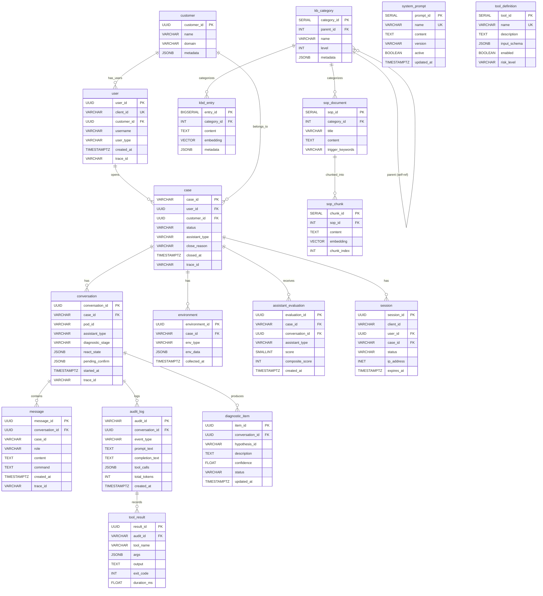
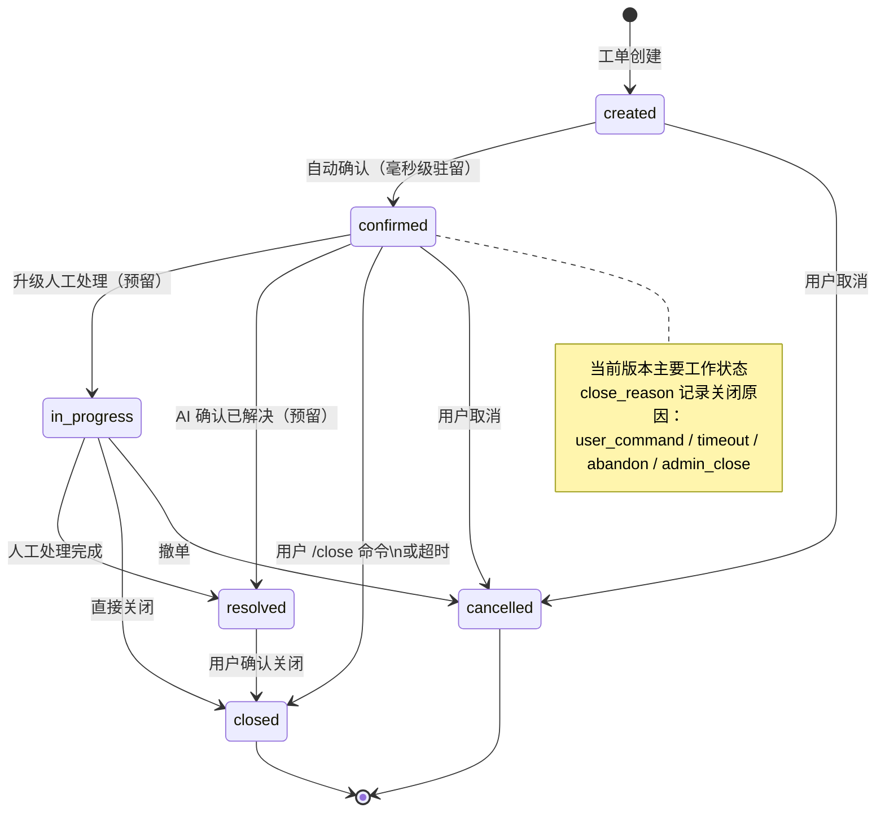
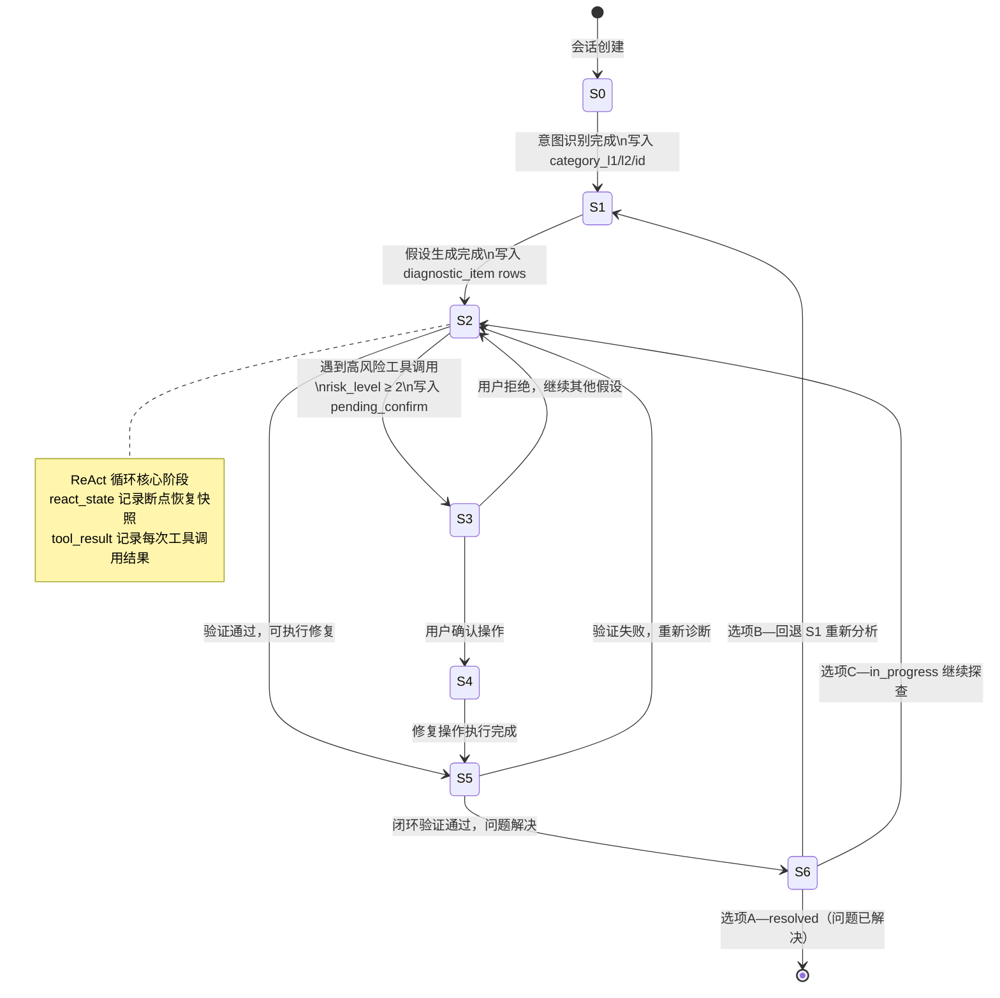

# HCI 智能排障平台 - 数据库设计文档

## 文档信息

- **版本**: 6.2
- **作者**: Claude
- **更新日期**: 2026-04-06
- **数据库**: PostgreSQL 15 + pgvector 扩展
- **依据文档**: `架构设计.md` v6.2（第一性原理全审查后定版 17 张表）

---

## 变更历史

| 版本 | 日期 | 变更内容 |
|------|------|----------|
| 1.0 | 2026-02-15 | 初始版本，基础 6 张表设计 |
| 2.0 | 2026-03-01 | `case`/`conversation` 表新增 `assistant_type`；`openclaw_pod_id` 重命名为 `pod_id`；新增 `assistant_evaluation`；`trace_id` 扩展为 `VARCHAR(64)` |
| 3.0 | 2026-03-05 | 新增 KB RAG 5 张表；`kb_document`/`kb_chunk` 主键从 UUID 改为 SERIAL |
| 3.1 | 2026-03-11 | 新增 P4 数据管道 3 张表：`raw_cases`/`knowledge_atoms`/`error_code_index` |
| 3.2 | 2026-03-12 | 评分评价体系：`case.close_reason`、`conversation.repeat_question_count`、`assistant_evaluation` 多维字段、新增 `prompt_audit`；补充 P4 诊断字段 |
| 3.3 | 2026-03-23 | 新增 `tool_audit_log` 表，ReAct 引擎工具调用全量审计 |
| 4.0 | 2026-03-31 | 全量重写：覆盖所有真实在用字段（17 张表），补充每字段详细注释 |
| **5.0** | **2026-04-02** | **重大重构**：基于方案B，目标从 17 张精简为 11 张；移除"数据管道"模块；知识库只保留 4 张表；合并审计表为 `audit_log` |
| **6.2** | **2026-04-06** | **第一性原理全审查**：11 张表 → **17 张表**；新增 `customer` / `diagnostic_item` / `tool_result` / `system_prompt` / `tool_definition`；废弃 `conversation.hypothesis` JSONB blob（BUG-06）；修复 `audit_log` 语义混乱（BUG-03）；新增 ER 图 + 状态机图 |
| **6.2.1** | **2026-04-07** | **Schema 漂移修复**：dev 环境发现 `schema_migrations` 记录与实际 DDL 不一致，创建幂等修复迁移 `20260407001_schema_repair.sql` 补齐缺失表列。详见 [事件文档](events/2026-04-07-schema-漂移修复方案.md) |
| **6.2.2** | **2026-04-07** | **废弃表再次清理**：PR #108 的 `schema_repair.sql` 误重建 7 张废弃表，创建 `20260407002_cleanup_deprecated_tables.sql` 清理并修正 `schema_repair.sql` |

---

## 0. 数据库全貌（Mermaid）

### 0.1 ER 关系图



### 0.2 `case.status` 状态机



### 0.3 `conversation.diagnostic_stage` 状态机（P4 诊断引擎）



---

## 1. 数据库概述

### 1.1 设计原则

| 原则 | 说明 |
|------|------|
| **全链路追踪** | 所有业务表含 `trace_id VARCHAR(64)`，采用 W3C traceparent 格式 |
| **时间戳一致** | 核心业务表通过触发器统一维护 `created_at`/`updated_at`（均带时区） |
| **级联删除** | 外键链路 `user → case → conversation → message` 均使用 `ON DELETE CASCADE` |
| **冗余加速** | `message.case_id` 与 `assistant_evaluation.close_reason` 为冗余字段，写入时同步，查询时免跨表 |
| **JSONB 弹性** | 不确定结构的扩展字段统一用 JSONB |
| **向量扩展** | 通过 `pgvector` 扩展支持 1536 维向量，用于知识库语义检索和意图识别 |
| **独立 Session** | conversation-service 所有写操作使用独立 DB Session，避免 SSE 长事务持锁 |

### 1.2 数据库扩展依赖

```sql
CREATE EXTENSION IF NOT EXISTS "uuid-ossp";  -- UUID 辅助生成函数
CREATE EXTENSION IF NOT EXISTS "pg_trgm";    -- 文本三元组相似度
CREATE EXTENSION IF NOT EXISTS "vector";     -- pgvector 向量存储与检索
```

### 1.3 全量表总览（v6.2 · 17 张）

> **依据**：`架构设计.md` v6.2 第一性原理全审查

| # | 表名 | 所属模块 | 主键类型 | 说明 | 状态 |
|---|------|---------|---------|------|------|
| 1 | `customer` | case-service | UUID | 企业客户档案（B2B 多租户根节点） | 🆕 v6.2 |
| 2 | `user` | case-service | UUID | 操作员身份（临时/认证） | ✅ |
| 3 | `case` | case-service | VARCHAR(20) | 排障工单，6 态状态机驱动 | ✅ |
| 4 | `environment` | case-service | UUID | 客户现场环境采集数据 | ✅ |
| 5 | `assistant_evaluation` | case-service | UUID | AI 助手双轨评分 | ✅ |
| 6 | `session` | gateway | UUID | WebSocket 会话审计（运行时走 Redis） | 保留审计 |
| 7 | `conversation` | conversation-service | UUID | 对话会话，含 P4 诊断 S0-S6 状态机 | ✅ |
| 8 | `message` | conversation-service | UUID | 聊天消息四种角色 | ✅ |
| 9 | `audit_log` | conversation-service | VARCHAR(36) | AI 行为统一审计（合并 prompt + tool 两表） | 🆕 合并 |
| 10 | `diagnostic_item` | conversation-service | UUID | 诊断假设条目（S1 生成，S2 更新状态） | 🆕 v6.2 |
| 11 | `tool_result` | conversation-service | UUID | 工具调用执行结果（audit_log 子表） | 🆕 v6.2 |
| 12 | `system_prompt` | conversation-service | SERIAL | Prompt 模板库（版本化管理） | 🆕 v6.2 |
| 13 | `tool_definition` | conversation-service | SERIAL | 工具知识库（ReAct 可用工具清单） | 🆕 v6.2 |
| 14 | `kb_category` | kb-service | SERIAL | 分类树（198 节点），全局分类枢纽 | ✅ |
| 15 | `kbd_entry` | kb-service | BIGSERIAL | KBD 知识条目（整条 embedding，无分块） | ✅ |
| 16 | `sop_document` | kb-service | SERIAL | SOP 文档（~20,000 字/个） | ✅ |
| 17 | `sop_chunk` | kb-service | SERIAL | SOP 分块检索 | ✅ |

### 1.4 废弃表清单

| 表名 | 处置方式 | 原因 |
|------|----------|------|
| `prompt_audit` | 合并入 `audit_log` | 与 `tool_audit_log` 同属 AI 行为审计 |
| `tool_audit_log` | 合并入 `audit_log` | 同上 |
| `kb_document` | 废弃 | 被 `kbd_entry` 替代（方案B：KBD 整条存储） |
| `kb_chunk` | 废弃 | 方案B 中 KBD 不分块，SOP 使用 `sop_chunk` |
| `kb_sop_node` | 废弃 | 关键字路由架构死路，被 `sop_document/sop_chunk` 替代 |
| `kb_synonym` | 合并入 `kb_category.metadata` | 数量 < 500 |
| `raw_cases` | 废弃 | 数据不可用，已被 `scripts/kbd/` 新流水线替代 |
| `knowledge_atoms` | 废弃 | 方案B 中不是核心表 |
| `error_code_index` | 废弃 | 数据孤岛 |

---

## 2. 核心业务表详细设计

### 2.1 `user` — 用户表

**用途**: 存储平台用户身份信息，当前版本以"临时用户"为主（前端自动生成 client_id，无需登录）。

**使用场景**:
- case-service 在接收新工单请求时，先 UPSERT `user` 表（以 `client_id` 为唯一键），再创建 `case`
- 临时用户通过 `client_id`（前端持久化到 localStorage）跨会话关联历史工单

**设计依据**: 前端生成 UUID 作为 `client_id`，服务端不强制认证，降低客户接入门槛。`user_type` 字段预留认证升级路径。

```sql
CREATE TABLE IF NOT EXISTS "user" (
    user_id       UUID         PRIMARY KEY DEFAULT gen_random_uuid(),
    client_id     VARCHAR(255) UNIQUE NOT NULL,
    username      VARCHAR(100),
    email         VARCHAR(255),
    user_type     VARCHAR(20)  NOT NULL DEFAULT 'temporary',
    metadata      JSONB        DEFAULT '{}'::jsonb,
    created_at    TIMESTAMPTZ  DEFAULT CURRENT_TIMESTAMP,
    updated_at    TIMESTAMPTZ  DEFAULT CURRENT_TIMESTAMP,
    last_login_at TIMESTAMPTZ,
    trace_id      VARCHAR(64)
);
```

**字段说明**:

| 字段 | 类型 | 可空 | 默认值 | 说明 |
|------|------|------|--------|------|
| `user_id` | UUID | NOT NULL | `gen_random_uuid()` | 系统内部主键，全局唯一，不暴露给前端 |
| `client_id` | VARCHAR(255) | NOT NULL | — | **前端生成并持久化的唯一标识**（UUID v4 格式），`UNIQUE` 约束，UPSERT 的幂等键；前端刷新/重开后只要 localStorage 未清除即可关联历史工单 |
| `username` | VARCHAR(100) | 可空 | NULL | 用户显示名，临时用户默认为空，认证用户可填写 |
| `email` | VARCHAR(255) | 可空 | NULL | 邮箱，可选；用于未来通知功能 |
| `user_type` | VARCHAR(20) | NOT NULL | `'temporary'` | 用户类型枚举：`temporary`（临时用户，无需登录）/ `authenticated`（认证用户，预留） |
| `metadata` | JSONB | NOT NULL | `{}` | 扩展元数据，存储不在固定字段中的用户属性（如设备信息、语言偏好等） |
| `created_at` | TIMESTAMPTZ | NOT NULL | `NOW()` | 首次创建时间，由 `TimestampMixin` 注入，只读 |
| `updated_at` | TIMESTAMPTZ | NOT NULL | `NOW()` | 最后更新时间，由触发器 `update_user_updated_at` 自动维护，禁止手动更新 |
| `last_login_at` | TIMESTAMPTZ | 可空 | NULL | 最后登录/活跃时间，临时用户每次建立 WebSocket 连接时更新 |
| `trace_id` | VARCHAR(64) | 可空 | NULL | 创建该用户的请求追踪 ID（W3C traceparent），用于问题溯源 |

**索引**:
```sql
CREATE INDEX idx_user_client_id ON "user"(client_id);  -- UPSERT / 工单列表查询
CREATE INDEX idx_user_trace_id  ON "user"(trace_id);   -- 链路追踪排查
CREATE INDEX idx_user_type      ON "user"(user_type);  -- 用户类型统计
```

**触发器**: `update_user_updated_at` — 每次 UPDATE 前自动刷新 `updated_at`

---

### 2.2 `case` — 工单表

**用途**: 排障工单是整个平台的核心业务实体，记录一次完整的客户问题从提交到关闭的全生命周期。

**使用场景**:
- 前端提交问题描述 → case-service 创建 case → conversation-service 创建 conversation
- 用户发送 `/close` 命令 → case-service 更新 `status = closed`、记录 `closed_at` 和 `close_reason`
- 管理后台展示工单列表，按 `status`/`category`/`created_at` 过滤排序

**设计依据**: 工单号采用 `Q + YYYYMMDD + 5位序号`（如 `Q2026033100001`）而非 UUID，原因是业务人员需要人工可读的工单号便于沟通；序号当天从 1 开始，由 DB 函数 `generate_case_id()` 生成，确保并发安全。

```sql
CREATE TABLE IF NOT EXISTS "case" (
    case_id       VARCHAR(20)  PRIMARY KEY,
    user_id       UUID         NOT NULL REFERENCES "user"(user_id) ON DELETE CASCADE,
    client_id     VARCHAR(255) NOT NULL,
    title         VARCHAR(500) NOT NULL,
    description   TEXT,
    status        case_status  NOT NULL DEFAULT 'created',
    priority      VARCHAR(20)  DEFAULT 'medium',
    category      VARCHAR(100),
    assistant_type VARCHAR(50) NOT NULL DEFAULT 'openclaw',
    metadata      JSONB        DEFAULT '{}'::jsonb,
    created_at    TIMESTAMPTZ  DEFAULT CURRENT_TIMESTAMP,
    updated_at    TIMESTAMPTZ  DEFAULT CURRENT_TIMESTAMP,
    confirmed_at  TIMESTAMPTZ,
    resolved_at   TIMESTAMPTZ,
    closed_at     TIMESTAMPTZ,
    close_reason  VARCHAR(20)  CHECK (close_reason IN ('user_command','timeout','abandon','admin_close')),
    trace_id      VARCHAR(64)
);
```

**字段说明**:

| 字段 | 类型 | 可空 | 默认值 | 说明 |
|------|------|------|--------|------|
| `case_id` | VARCHAR(20) | NOT NULL | — | **业务可读工单号**，格式 `Q{YYYYMMDD}{NNNNN}`，由数据库函数 `generate_case_id()` 在服务层调用生成，当天序号从 00001 开始自增；不使用 UUID 是为了人工沟通友好 |
| `user_id` | UUID | NOT NULL | — | 关联 `user.user_id`，`ON DELETE CASCADE`，删除用户时级联删除所有工单 |
| `client_id` | VARCHAR(255) | NOT NULL | — | **冗余字段**，复制自 `user.client_id`，用于无 JOIN 快速查询"某客户端的所有工单" |
| `title` | VARCHAR(500) | NOT NULL | — | 工单标题，由前端提交时截取问题描述前 500 字符，或由 AI 自动生成摘要 |
| `description` | TEXT | 可空 | NULL | 问题完整描述，前端第一条消息内容，可为 NULL（后续消息补充） |
| `status` | case_status | NOT NULL | `created` | 工单生命周期状态枚举（详见状态机说明） |
| `priority` | VARCHAR(20) | 可空 | `medium` | 优先级：`low` / `medium` / `high` / `urgent`；当前由人工设置，未来可由 AI 自动评级 |
| `category` | VARCHAR(100) | 可空 | NULL | 故障分类（如 `vm`/`storage`/`network`/`cluster`/`backup`），由前端选择或 AI 自动分类后回填 |
| `assistant_type` | VARCHAR(50) | NOT NULL | `openclaw` | AI 助手类型标识，当前值为 `openclaw`；预留多助手切换能力（如 LearningClaw/ProductionClaw 分流） |
| `metadata` | JSONB | NOT NULL | `{}` | 扩展元数据，如附件 URL、打标结果、人工备注等 |
| `created_at` | TIMESTAMPTZ | NOT NULL | `NOW()` | 工单创建时间 |
| `updated_at` | TIMESTAMPTZ | NOT NULL | `NOW()` | 最后更新时间，触发器自动维护 |
| `confirmed_at` | TIMESTAMPTZ | 可空 | NULL | 状态变为 `confirmed` 的时间戳；当前版本创建后自动确认（毫秒级），是计算"响应时效"的起点 |
| `resolved_at` | TIMESTAMPTZ | 可空 | NULL | 状态变为 `resolved` 的时间戳（预留字段，当前版本未使用） |
| `closed_at` | TIMESTAMPTZ | 可空 | NULL | 状态变为 `closed` 的时间戳，`closed_at - confirmed_at` 为工单处理时长 |
| `close_reason` | VARCHAR(20) | 可空 | NULL | **关闭原因**（v3.2 新增）：`user_command`=用户主动关闭 / `timeout`=超时 / `abandon`=用户放弃 / `admin_close`=管理员关闭；被动信号轨道核心数据，权重 20% 的综合质量评分来源 |
| `trace_id` | VARCHAR(64) | 可空 | NULL | 创建工单的请求 trace ID |

**工单状态枚举 `case_status`**:

| 状态 | 当前版本使用 | 说明 | 后续可流转 |
|------|------------|------|-----------|
| `created` | 是（创建瞬间，毫秒级驻留） | 工单刚创建，等待自动确认 | → `confirmed`，→ `cancelled` |
| `confirmed` | **是（主要工作状态）** | 已确认，AI 对话进行中 | → `in_progress`，→ `closed`，→ `cancelled` |
| `in_progress` | 否（预留） | 升级为人工处理 | → `resolved`，→ `closed`，→ `cancelled` |
| `resolved` | 否（预留） | 问题已解决待用户确认 | → `closed` |
| `closed` | **是（终态）** | 工单已关闭 | — |
| `cancelled` | 否（预留） | 工单已取消 | — |

**索引**:
```sql
CREATE INDEX idx_case_user_id        ON "case"(user_id);
CREATE INDEX idx_case_client_id      ON "case"(client_id);
CREATE INDEX idx_case_status         ON "case"(status);
CREATE INDEX idx_case_created_at     ON "case"(created_at DESC);
CREATE INDEX idx_case_trace_id       ON "case"(trace_id);
CREATE INDEX idx_case_category       ON "case"(category);
CREATE INDEX idx_case_client_status  ON "case"(client_id, status);  -- 复合索引：查询某客户端的活跃工单
CREATE INDEX idx_case_assistant_type ON "case"(assistant_type);
```

---

### 2.3 `conversation` — 对话会话表

**用途**: 记录一次与 AI 助手的对话会话。一个工单可以有多个 conversation（用户断开后重连会创建新的 conversation）。

**使用场景**:
- 用户首次发消息时，conversation-service 创建 conversation，并获取 Scheduler 分配的 AI Pod ID
- SSE 流式对话期间，AI 推理完成后异步更新 `message_count`（由 DB 触发器维护，不需代码操作）
- P4 ReAct 诊断引擎将诊断状态（`diagnostic_stage`、`hypothesis`、`react_state`）持久化到此表，支持断点续接

**设计依据**: `conversation` 与 `case` 分表，而非直接在 `case` 表记录对话，原因是：
1. 一个工单可能经历多轮对话（用户断开重连）
2. 不同 conversation 可能使用不同的 AI Pod 或助手类型
3. `message_count` 由触发器维护，**禁止代码层手动递增（会导致双重计数）**

```sql
CREATE TABLE IF NOT EXISTS conversation (
    conversation_id       UUID         PRIMARY KEY DEFAULT gen_random_uuid(),
    case_id               VARCHAR(20)  NOT NULL REFERENCES "case"(case_id) ON DELETE CASCADE,
    pod_id                VARCHAR(100),
    assistant_type        VARCHAR(50)  NOT NULL DEFAULT 'openclaw',
    started_at            TIMESTAMPTZ  DEFAULT CURRENT_TIMESTAMP,
    ended_at              TIMESTAMPTZ,
    message_count         INT          DEFAULT 0,
    repeat_question_count INT          NOT NULL DEFAULT 0,
    metadata              JSONB        DEFAULT '{}'::jsonb,
    -- P4 诊断状态字段（migrate_conversation_p4_v1.sql）
    diagnostic_stage      VARCHAR(8)   NOT NULL DEFAULT 'S0',
    category_l1           VARCHAR(100),
    category_l2           VARCHAR(100),
    category_id           VARCHAR(32),
    hypothesis            JSONB        DEFAULT '[]'::jsonb,
    react_state           JSONB        DEFAULT '{}'::jsonb,
    pending_confirm       JSONB,
    trace_id              VARCHAR(64)
);
```

**字段说明**:

| 字段 | 类型 | 可空 | 默认值 | 说明 |
|------|------|------|--------|------|
| `conversation_id` | UUID | NOT NULL | `gen_random_uuid()` | 会话主键，全局唯一 |
| `case_id` | VARCHAR(20) | NOT NULL | — | 关联工单，`ON DELETE CASCADE` |
| `pod_id` | VARCHAR(100) | 可空 | NULL | Scheduler Service 分配的 AI 助手 Pod 标识（如 `openclaw-pod-abc123`），用于追踪本次对话由哪个 Pod 服务 |
| `assistant_type` | VARCHAR(50) | NOT NULL | `openclaw` | AI 助手类型，与 `case.assistant_type` 保持一致，冗余存储便于直接在 conversation 维度统计 |
| `started_at` | TIMESTAMPTZ | NOT NULL | `NOW()` | 会话开始时间 |
| `ended_at` | TIMESTAMPTZ | 可空 | NULL | 会话结束时间（用户关闭工单或 Pod 回收时写入） |
| `message_count` | INT | NOT NULL | `0` | **只读字段**，由触发器 `update_conversation_message_count` 在 `message` 表 INSERT/DELETE 时自动维护；代码层只读，禁止手动修改 |
| `repeat_question_count` | INT | NOT NULL | `0` | 用户重复提问次数（v3.2 新增）；conversation-service 在 `save_user_message()` 时，对比前 10 条用户消息的 Jaccard 相似度，≥0.6 则 +1；负向质量信号，权重 15% 纳入综合评分 |
| `metadata` | JSONB | NOT NULL | `{}` | 扩展字段，可存储上下文摘要、会话配置等 |
| `diagnostic_stage` | VARCHAR(8) | NOT NULL | `'S0'` | **P4 诊断阶段状态机**（详见下表），ReAct 引擎每次执行后更新此字段实现断点续接 |
| `category_l1` | VARCHAR(100) | 可空 | NULL | P4 故障一级分类（如 `虚拟机`/`存储`/`网络`），由 AI 意图识别（S0 阶段）后写入 |
| `category_l2` | VARCHAR(100) | 可空 | NULL | P4 故障二级分类（如 `开机失败`/`迁移失败`），更精细的分类 |
| `category_id` | VARCHAR(32) | 可空 | NULL | 对应 `category_baseline.yaml` 中的分类 ID（如 `虚拟机-003`），用于关联知识库检索 |
| `hypothesis` | JSONB | 可空 | `[]` | 当前诊断假设列表，格式：`[{"id":"h1","description":"CPU 资源不足","confidence":0.85,"status":"active"}]`；ReAct S1 阶段生成，S2 阶段验证后更新 `status` |
| `react_state` | JSONB | 可空 | `{}` | ReAct 执行器状态快照，格式：`{"step":"think|act|observe","context":{...}}`；用于 SSE 中断后断点续接，不丢失诊断进度 |
| `pending_confirm` | JSONB | 可空 | NULL | 待用户确认的工具调用，格式：`{"tool_call_id":"...","tool_name":"...","args":{...},"risk_level":2}`；`risk_level >= 2` 时暂停 ReAct 循环等待用户确认 |
| `trace_id` | VARCHAR(64) | 可空 | NULL | 创建会话的请求 trace ID |

**P4 诊断阶段（`diagnostic_stage`）状态机**:

| 阶段 | 中文 | 说明 |
|------|------|------|
| `S0` | 意图识别 | 分析用户第一条消息，判断故障类型，写入 `category_l1`/`category_l2` |
| `S1` | 假设生成 | 结合知识库生成初始假设列表，写入 `hypothesis` |
| `S2` | 验证中 | ReAct 循环执行工具调用验证假设，更新 `react_state` |
| `S3` | 待确认 | 遇到 `risk_level >= 2` 的操作，暂停等待用户确认，写入 `pending_confirm` |
| `S4` | 修复执行 | 用户确认后执行修复操作 |
| `S5` | 验证闭环 | 修复后验证问题是否解决 |
| `S6` | 已闭环 | 诊断完成，可关闭工单 |

**索引**:
```sql
CREATE INDEX idx_conversation_case_id        ON conversation(case_id);
CREATE INDEX idx_conversation_pod_id         ON conversation(pod_id);
CREATE INDEX idx_conversation_assistant_type ON conversation(assistant_type);
CREATE INDEX idx_conversation_started_at     ON conversation(started_at DESC);
CREATE INDEX idx_conversation_trace_id       ON conversation(trace_id);
CREATE INDEX idx_conversation_case_started   ON conversation(case_id, started_at DESC);
CREATE INDEX idx_conversation_diagnostic_stage ON conversation(diagnostic_stage);
```

**session 规范（重要）**:
```
✅ save_user_message    → async with session_factory() as s: await s.commit()
✅ get_messages         → async with session_factory() as s: (只读，自动关闭)
✅ save_assistant_message → BackgroundTask 中 async with session_factory() as s: await s.commit()
❌ 禁止在 SSE 流程中使用请求作用域 Session（idle in transaction 期间持锁）
```

---

### 2.4 `message` — 消息表

**用途**: 存储对话中所有消息，是多轮对话上下文的持久化来源。每轮对话前 AI 从此表读取完整历史，因为 AI 模型本身无状态。

**使用场景**:
- 用户发送消息 → 先 INSERT `role=user` 消息（同步，独立 session）
- 读取历史 → SELECT 当前 conversation 的所有消息，按 `created_at ASC` 排序组装 messages[] 传给 AI
- AI 回复结束 → BackgroundTask 异步 INSERT `role=assistant` 消息
- AI 建议执行命令 → INSERT `role=command` 消息（须填写 `command` 字段）

**设计依据**: INSERT user 消息必须在 SELECT 历史之前，确保 AI 能在 messages[] 末尾看到本轮问题；若顺序颠倒，AI 看不到当前问题，回复失去连贯性。

```sql
CREATE TYPE message_role AS ENUM ('user','assistant','system','command');

CREATE TABLE IF NOT EXISTS message (
    message_id      UUID         PRIMARY KEY DEFAULT gen_random_uuid(),
    conversation_id UUID         NOT NULL REFERENCES conversation(conversation_id) ON DELETE CASCADE,
    case_id         VARCHAR(20)  NOT NULL,
    role            message_role NOT NULL,
    content         TEXT         NOT NULL,
    command         TEXT,
    command_warning TEXT,
    metadata        JSONB        DEFAULT '{}'::jsonb,
    created_at      TIMESTAMPTZ  DEFAULT CURRENT_TIMESTAMP,
    trace_id        VARCHAR(64),
    CONSTRAINT check_command_content CHECK (
        (role = 'command' AND command IS NOT NULL) OR (role != 'command')
    )
);
```

**字段说明**:

| 字段 | 类型 | 可空 | 默认值 | 说明 |
|------|------|------|--------|------|
| `message_id` | UUID | NOT NULL | `gen_random_uuid()` | 消息主键 |
| `conversation_id` | UUID | NOT NULL | — | 关联会话，`ON DELETE CASCADE` |
| `case_id` | VARCHAR(20) | NOT NULL | — | **冗余字段**，直接存储工单 ID，免 JOIN conversation 表查询某工单的全部消息 |
| `role` | message_role | NOT NULL | — | 消息角色枚举：`user`=用户输入 / `assistant`=AI 回复 / `system`=系统提示（实际一般不落库）/ `command`=AI 建议执行的命令 |
| `content` | TEXT | NOT NULL | — | 消息正文；`role=command` 时为命令前的说明文字，实际命令在 `command` 字段 |
| `command` | TEXT | 可空 | NULL | **仅 `role=command` 时使用**，存储 AI 建议执行的 Shell 命令（如 `virsh list --all`）；DB 约束 `check_command_content` 强制 `role=command` 时此字段非空 |
| `command_warning` | TEXT | 可空 | NULL | 命令风险提示（如 `此命令会重启服务`），前端在执行按钮旁展示，引导用户注意风险 |
| `metadata` | JSONB | NOT NULL | `{}` | 扩展信息，可存：token 消耗数、使用的模型版本、推理耗时、KB 命中情况等 |
| `created_at` | TIMESTAMPTZ | NOT NULL | `NOW()` | 消息创建时间，用于排序和历史窗口截取 |
| `trace_id` | VARCHAR(64) | 可空 | NULL | 本条消息关联的请求 trace ID |

**触发器**: 两个触发器自动维护 `conversation.message_count`：
```sql
-- INSERT 时 +1
CREATE TRIGGER update_message_count_on_insert
    AFTER INSERT ON message FOR EACH ROW
    EXECUTE FUNCTION update_conversation_message_count();
-- DELETE 时 -1
CREATE TRIGGER update_message_count_on_delete
    AFTER DELETE ON message FOR EACH ROW
    EXECUTE FUNCTION update_conversation_message_count();
```

**多轮对话计数规律**: N 轮对话 = N×2 次 INSERT + N 次 SELECT（INSERT user → SELECT history → AI 推理 → INSERT assistant）

**索引**:
```sql
CREATE INDEX idx_message_conversation_id ON message(conversation_id);
CREATE INDEX idx_message_case_id         ON message(case_id);
CREATE INDEX idx_message_role            ON message(role);
CREATE INDEX idx_message_created_at      ON message(created_at DESC);
CREATE INDEX idx_message_trace_id        ON message(trace_id);
CREATE INDEX idx_message_case_created    ON message(case_id, created_at DESC);  -- 工单维度时序查询
CREATE INDEX idx_message_content_search  ON message USING gin(to_tsvector('english', content));  -- 全文搜索
```

---

### 2.5 `environment` — 环境信息表

**用途**: 存储客户现场采集的环境数据（系统信息、集群状态、网络拓扑等），作为 AI 诊断的基础上下文。

**使用场景**:
- 客户通过 aClient 图形化工具一键采集环境信息 → `POST /api/cases/{case_id}/environment`
- conversation-service 在组装 AI 提示词时读取环境数据注入 system prompt
- 管理员查看特定工单的客户现场环境

```sql
CREATE TABLE IF NOT EXISTS environment (
    environment_id UUID        PRIMARY KEY DEFAULT gen_random_uuid(),
    case_id        VARCHAR(20) NOT NULL REFERENCES "case"(case_id) ON DELETE CASCADE,
    env_type       VARCHAR(50) NOT NULL,
    env_data       JSONB       NOT NULL,
    collected_at   TIMESTAMPTZ DEFAULT CURRENT_TIMESTAMP,
    trace_id       VARCHAR(64)
);
```

**字段说明**:

| 字段 | 类型 | 可空 | 默认值 | 说明 |
|------|------|------|--------|------|
| `environment_id` | UUID | NOT NULL | `gen_random_uuid()` | 主键 |
| `case_id` | VARCHAR(20) | NOT NULL | — | 关联工单，`ON DELETE CASCADE` |
| `env_type` | VARCHAR(50) | NOT NULL | — | 环境数据类型：`system`（OS、内核）/ `network`（网卡、路由）/ `storage`（磁盘、RAID）/ `cluster`（集群节点状态）/ `vm`（虚拟机列表）等 |
| `env_data` | JSONB | NOT NULL | — | 环境详情 JSONB，结构因 `env_type` 不同而异（见下方示例） |
| `collected_at` | TIMESTAMPTZ | NOT NULL | `NOW()` | 数据采集时间点，注意不是 created_at，反映的是客户现场实际状态时间 |
| `trace_id` | VARCHAR(64) | 可空 | NULL | 采集请求的 trace ID |

**`env_data` JSONB 结构示例**:
```json
// env_type = 'system'
{"os": "CentOS 7.9", "kernel": "3.10.0-1160", "cpu_cores": 16, "memory_gb": 64}

// env_type = 'cluster'
{"cluster_name": "prod-hci", "node_count": 3, "version": "6.5.0",
 "nodes": [{"hostname": "node-01", "status": "online"}, {"hostname": "node-03", "status": "offline"}]}
```

**索引**:
```sql
CREATE INDEX idx_environment_case_id    ON environment(case_id);
CREATE INDEX idx_environment_type       ON environment(env_type);
CREATE INDEX idx_environment_collected_at ON environment(collected_at DESC);
CREATE INDEX idx_environment_trace_id   ON environment(trace_id);
CREATE INDEX idx_environment_data_gin   ON environment USING gin(env_data);  -- JSONB 路径查询
```

---

### 2.6 `session` — WebSocket 会话表

**用途**: 持久化记录 WebSocket 连接信息。**运行时主要使用 Redis**；此表用于审计和断线恢复。

**使用场景**:
- 建立 WebSocket 连接时创建 session 记录，记录客户端 IP 和 UA
- 管理后台查看当前有多少活跃连接
- 定期清理过期 session（`expires_at < NOW()`）

```sql
CREATE TABLE IF NOT EXISTS session (
    session_id       UUID         PRIMARY KEY DEFAULT gen_random_uuid(),
    client_id        VARCHAR(255) NOT NULL,
    user_id          UUID         REFERENCES "user"(user_id) ON DELETE SET NULL,
    case_id          VARCHAR(20)  REFERENCES "case"(case_id) ON DELETE SET NULL,
    websocket_id     VARCHAR(100),
    status           VARCHAR(20)  NOT NULL DEFAULT 'active',
    ip_address       INET,
    user_agent       TEXT,
    metadata         JSONB        DEFAULT '{}'::jsonb,
    created_at       TIMESTAMPTZ  DEFAULT CURRENT_TIMESTAMP,
    last_activity_at TIMESTAMPTZ  DEFAULT CURRENT_TIMESTAMP,
    expires_at       TIMESTAMPTZ,
    trace_id         VARCHAR(64)
);
```

**字段说明**:

| 字段 | 类型 | 可空 | 默认值 | 说明 |
|------|------|------|--------|------|
| `session_id` | UUID | NOT NULL | `gen_random_uuid()` | WebSocket 会话主键，与 Redis key 对应 |
| `client_id` | VARCHAR(255) | NOT NULL | — | 发起连接的客户端标识 |
| `user_id` | UUID | 可空 | NULL | 关联用户，`ON DELETE SET NULL`（用户删除时 session 记录保留，便于审计） |
| `case_id` | VARCHAR(20) | 可空 | NULL | 本次 WebSocket 连接关联的工单，`ON DELETE SET NULL` |
| `websocket_id` | VARCHAR(100) | 可空 | NULL | WebSocket 连接的服务端唯一标识，用于主动推送消息时定向投递 |
| `status` | VARCHAR(20) | NOT NULL | `active` | 连接状态：`active`（在线）/ `inactive`（断开）/ `expired`（已过期） |
| `ip_address` | INET | 可空 | NULL | 客户端 IP 地址（PostgreSQL `INET` 类型支持 IPv4/IPv6），用于安全审计 |
| `user_agent` | TEXT | 可空 | NULL | 客户端 User-Agent，用于区分 aClient 版本和浏览器访问 |
| `metadata` | JSONB | NOT NULL | `{}` | 扩展信息，如客户端版本号、连接参数等 |
| `created_at` | TIMESTAMPTZ | NOT NULL | `NOW()` | 连接建立时间 |
| `last_activity_at` | TIMESTAMPTZ | NOT NULL | `NOW()` | 最后活跃时间，通过心跳包更新 |
| `expires_at` | TIMESTAMPTZ | 可空 | NULL | 连接过期时间（默认 24 小时后），定期清理任务据此清理过期记录 |
| `trace_id` | VARCHAR(64) | 可空 | NULL | 建立连接的请求 trace ID |

**索引**:
```sql
CREATE INDEX idx_session_client_id  ON session(client_id);
CREATE INDEX idx_session_user_id    ON session(user_id);
CREATE INDEX idx_session_case_id    ON session(case_id);
CREATE INDEX idx_session_status     ON session(status);
CREATE INDEX idx_session_expires_at ON session(expires_at);
CREATE INDEX idx_session_trace_id   ON session(trace_id);
```

---

### 2.7 `assistant_evaluation` — AI 助手评估表

**用途**: 存储 AI 助手效果评分。v3.2 引入**双轨制评价模型**：① 用户主动打分（1-5 星）；② 系统基于多维被动信号计算综合质量分（0-100）。

**使用场景**:
- 工单关闭时，前端弹出评分组件 → `POST /api/conversations/{id}/evaluate` → 写入 `score` 和 `feedback`
- 工单关闭同时，QualityScoreService 自动计算 `composite_score`（无论用户是否主动评分）
- 管理后台展示 AI 质量趋势、差 case 预警

**设计依据**: 用户主动评分率通常 < 30%，依赖单一评分维度无法全面度量 AI 质量。双轨制引入关闭意图（`close_reason`）、解决效率（`session_duration_sec`）、重复提问（`repeat_question_count`）等被动信号，确保 100% 覆盖可计算。

```sql
CREATE TABLE IF NOT EXISTS assistant_evaluation (
    evaluation_id          UUID       PRIMARY KEY DEFAULT gen_random_uuid(),
    case_id                VARCHAR(20) NOT NULL REFERENCES "case"(case_id) ON DELETE CASCADE,
    conversation_id        UUID        REFERENCES conversation(conversation_id) ON DELETE SET NULL,
    assistant_type         VARCHAR(50) NOT NULL,
    score                  SMALLINT    CHECK (score >= 1 AND score <= 5),
    feedback               TEXT,
    resolution_time_seconds INT,
    message_count          INT,
    metadata               JSONB       DEFAULT '{}'::jsonb,
    created_at             TIMESTAMPTZ DEFAULT CURRENT_TIMESTAMP,
    close_reason           VARCHAR(20),
    session_duration_sec   INT,
    repeat_question_count  INT,
    composite_score        SMALLINT,
    score_breakdown        JSONB,
    calculated_at          TIMESTAMPTZ,
    trace_id               VARCHAR(64)
);
```

**字段说明**:

| 字段 | 类型 | 可空 | 默认值 | 说明 |
|------|------|------|--------|------|
| `evaluation_id` | UUID | NOT NULL | `gen_random_uuid()` | 评估记录主键 |
| `case_id` | VARCHAR(20) | NOT NULL | — | 关联工单，`ON DELETE CASCADE` |
| `conversation_id` | UUID | 可空 | NULL | 关联会话，`ON DELETE SET NULL`（会话删除后评分记录保留） |
| `assistant_type` | VARCHAR(50) | NOT NULL | — | 被评估的 AI 助手类型（如 `openclaw`），支持多助手横向对比 |
| `score` | SMALLINT | 可空 | NULL | **用户主动评分**（1-5 星），CHECK 约束；NULL 表示用户未评分 |
| `feedback` | TEXT | 可空 | NULL | 用户文字反馈，与 `score` 同时提交 |
| `resolution_time_seconds` | INT | 可空 | NULL | 从工单确认到关闭的总时长（秒），`closed_at - confirmed_at`；已废弃，用 `session_duration_sec` 替代 |
| `message_count` | INT | 可空 | NULL | 工单总消息数快照，冗余存储避免关联查询 |
| `metadata` | JSONB | NOT NULL | `{}` | 扩展元数据 |
| `created_at` | TIMESTAMPTZ | NOT NULL | `NOW()` | 评估记录创建时间（工单关闭时） |
| `close_reason` | VARCHAR(20) | 可空 | NULL | **冗余字段**，从 `case.close_reason` 复制；避免 JOIN 计算综合分时跨表查询 |
| `session_duration_sec` | INT | 可空 | NULL | 会话时长（秒），`conversation.ended_at - conversation.started_at`；解决效率维度的核心数据，权重 25% |
| `repeat_question_count` | INT | 可空 | NULL | 用户重复提问次数，从 `conversation.repeat_question_count` 复制；权重 15% 的负向信号 |
| `composite_score` | SMALLINT | 可空 | NULL | **综合质量分 0-100**，由 `QualityScoreService` 计算；无用户评分时自动降级为三维模型（关闭意图 + 效率 + 重复提问） |
| `score_breakdown` | JSONB | 可空 | NULL | 各维度分解，格式：`{"close_intent": 90, "efficiency": 70, "user_rating": 80, "ai_quality": 65}` |
| `calculated_at` | TIMESTAMPTZ | 可空 | NULL | `composite_score` 计算完成的时间戳 |
| `trace_id` | VARCHAR(64) | 可空 | NULL | 评估创建的请求 trace ID |

**索引**:
```sql
CREATE INDEX idx_eval_case_id        ON assistant_evaluation(case_id);
CREATE INDEX idx_eval_assistant_type ON assistant_evaluation(assistant_type);
CREATE INDEX idx_eval_score          ON assistant_evaluation(score);
CREATE INDEX idx_eval_created_at     ON assistant_evaluation(created_at DESC);
CREATE INDEX idx_eval_trace_id       ON assistant_evaluation(trace_id);
CREATE INDEX idx_eval_composite_score ON assistant_evaluation(composite_score) WHERE composite_score IS NOT NULL;
CREATE INDEX idx_eval_close_reason   ON assistant_evaluation(close_reason) WHERE close_reason IS NOT NULL;
```

---

### 2.8 `prompt_audit` — AI 提示词审计镜像表

**用途**: 记录每次 AI 推理调用的入口信息。**元数据字段 100% 覆盖**采集（~200 bytes/条），**完整 payload 按 10-20% 采样**存储（~5KB-20KB/条），用于质量分析、fine-tuning 数据收集和用户评分回填。

**使用场景**:
- conversation-service 每次调用 AI 推理前，异步写入 prompt_audit（不阻塞主流程）
- 质量评分系统通过 `has_sop`/`kb_chunks_count`/`kb_top_score` 计算 AI 能力维度评分
- 用户评分后回填 `user_rating`，建立"提示词质量 → 用户感知"的关联回路
- 管理员抽查 `messages` 字段分析 AI 回复质量，发现 SOP 覆盖盲区（`has_sop = FALSE`）

**设计依据**: 完整 messages 字段单条约 5-20KB，若 100% 存储按 1000次/天计算每天约 5-20MB，年增 1.8-7.3GB；采用 10-20% 采样在存储成本和数据覆盖之间取得平衡。元数据字段（bool + int + float）100% 采集确保统计分析不受采样影响。

```sql
CREATE TABLE IF NOT EXISTS prompt_audit (
    audit_id            UUID        PRIMARY KEY DEFAULT gen_random_uuid(),
    conversation_id     UUID        NOT NULL REFERENCES conversation(conversation_id) ON DELETE CASCADE,
    case_id             VARCHAR(20),
    assistant_type      VARCHAR(50),
    model               VARCHAR(100),
    message_count       INT,
    has_sop             BOOLEAN     DEFAULT FALSE,
    kb_chunks_count     INT         DEFAULT 0,
    kb_top_score        FLOAT       DEFAULT 0.0,
    system_prompt_chars INT,
    messages            JSONB,
    payload_ref         VARCHAR(200),
    context_breakdown   JSONB,
    user_rating         SMALLINT    CHECK (user_rating >= 1 AND user_rating <= 5),
    captured_at         TIMESTAMPTZ DEFAULT NOW(),
    trace_id            VARCHAR(64)
);
```

**字段说明**:

| 字段 | 类型 | 可空 | 采集策略 | 说明 |
|------|------|------|---------|------|
| `audit_id` | UUID | NOT NULL | — | 审计记录主键 |
| `conversation_id` | UUID | NOT NULL | 100% | 关联会话，`ON DELETE CASCADE` |
| `case_id` | VARCHAR(20) | 可空 | 100% | 冗余工单 ID，便于单工单维度查询 |
| `assistant_type` | VARCHAR(50) | 可空 | 100% | AI 助手类型（如 `openclaw`） |
| `model` | VARCHAR(100) | 可空 | 100% | 实际调用的模型名称（如 `gpt-4o`/`glm-4`），用于成本追踪 |
| `message_count` | INT | 可空 | 100% | 本次调用时历史消息总数，用于上下文窗口分析 |
| `has_sop` | BOOLEAN | 可空 | **100%** | 是否命中 SOP 决策树；FALSE 表示 SOP 覆盖盲区，权重 20% 纳入 AI 能力质量维度 |
| `kb_chunks_count` | INT | 可空 | **100%** | RAG 检索命中的 KB chunk 数量，0 表示知识库无相关内容，权重 20% |
| `kb_top_score` | FLOAT | 可空 | **100%** | 最高 KB 相关度分数（0-1），反映知识库匹配质量 |
| `system_prompt_chars` | INT | 可空 | 100% | System Prompt 总字符数，用于 token 成本分析 |
| `messages` | JSONB | 可空 | **10-20% 采样** | 完整 messages[] 数组（含所有历史消息），用于深度 review 和 fine-tuning 数据提取 |
| `payload_ref` | VARCHAR(200) | 可空 | 可选 | MinIO 文件路径（大 payload 外置存储方案，messages 超过阈值时写对象存储，此处记录路径） |
| `context_breakdown` | JSONB | 可空 | 100% | 提示词各部分 token 拆解（v3.2 migrate_conversation_p4_v1.sql 新增），格式：`{"system":120,"history":480,"kb_context":200,"total":800}` |
| `user_rating` | SMALLINT | 可空 | 后置回填 | 用户评分后回填（1-5 星），建立"提示词质量 → 用户感知"的闭环验证；NULL 表示用户未评分 |
| `captured_at` | TIMESTAMPTZ | 可空 | 100% | 审计数据采集时间 |
| `trace_id` | VARCHAR(64) | 可空 | 100% | 请求 trace ID |

**索引**:
```sql
CREATE INDEX idx_prompt_audit_case        ON prompt_audit(case_id);
CREATE INDEX idx_prompt_audit_has_sop     ON prompt_audit(has_sop) WHERE has_sop = FALSE;  -- SOP 盲区发现
CREATE INDEX idx_prompt_audit_rating      ON prompt_audit(user_rating) WHERE user_rating IS NOT NULL;
CREATE INDEX idx_prompt_audit_captured_at ON prompt_audit(captured_at DESC);
CREATE INDEX idx_prompt_audit_trace_id    ON prompt_audit(trace_id);
```

---

### 2.9 `tool_audit_log` — 工具调用审计日志表

**用途**: 记录 ReAct 执行器每次工具调用的完整信息。**生产安全要求，不可绕过、不可删除**。

**使用场景**:
- ReAct 引擎调用任意工具（`get_active_alerts`、`restart_vm` 等）前预创建记录
- 调用完成后更新 `result`/`error`/`completed_at`/`duration_ms`
- 管理后台安全审计：谁（哪个 conversation）在何时调用了哪个工具，结果如何
- 性能分析：`duration_ms` 统计各工具 P95/P99 耗时，发现慢工具
- 权限回溯：`risk_level >= 2` 的操作必须有 `authorized_by` 记录

**技术实现**:
- 主键 `id` 由 `ReactExecutor` 在调用前预生成（UUID），确保"调用前写入，调用失败也有记录"
- `session_id` 对应 `conversation.conversation_id`（VARCHAR 类型匹配 UUID 字符串）
- 审计不依赖 ORM 事务，使用独立连接直写，即使主业务事务回滚也能留存记录

```sql
CREATE TABLE IF NOT EXISTS tool_audit_log (
    id            VARCHAR(36)  PRIMARY KEY,
    session_id    VARCHAR(36)  NOT NULL,
    trace_id      VARCHAR(55),
    tool_name     VARCHAR(100) NOT NULL,
    tool_args     JSONB,
    risk_level    INTEGER      NOT NULL,
    policy        VARCHAR(20),
    authorized_by VARCHAR(100),
    result        JSONB,
    error         TEXT,
    started_at    TIMESTAMPTZ  NOT NULL,
    completed_at  TIMESTAMPTZ  NOT NULL,
    duration_ms   INTEGER,
    created_at    TIMESTAMPTZ  NOT NULL DEFAULT NOW()
);
```

**字段说明**:

| 字段 | 类型 | 可空 | 说明 |
|------|------|------|------|
| `id` | VARCHAR(36) | NOT NULL | ReactExecutor 预生成的 UUID（字符串格式），调用前写入以确保记录不丢失 |
| `session_id` | VARCHAR(36) | NOT NULL | 对应 `conversation.conversation_id`，VARCHAR 匹配 UUID 字符串 |
| `trace_id` | VARCHAR(55) | 可空 | W3C traceparent，此表中 trace_id 最大 55 字符（规范值） |
| `tool_name` | VARCHAR(100) | NOT NULL | 工具名称（如 `get_active_alerts`/`restart_vm`/`kubectl_get`) |
| `tool_args` | JSONB | 可空 | 工具调用参数 JSON，完整记录，用于审计重放 |
| `risk_level` | INTEGER | NOT NULL | 风险等级：`1`=只读/低风险，自动执行；`2`=写操作，在业务层等待用户确认；`3`=高危，禁止自动执行，必须人工审批 |
| `policy` | VARCHAR(20) | 可空 | 执行策略：`auto`=自动执行 / `notify`=执行后通知 / `confirm`=需用户确认 / `block`=禁止执行 |
| `authorized_by` | VARCHAR(100) | 可空 | `risk_level >= 2` 时记录确认人的用户 ID；`policy = block` 时为 NULL，审计时可排查未授权操作 |
| `result` | JSONB | 可空 | 执行结果 JSONB，超长时截断到 2000 字符以防单条记录过大 |
| `error` | TEXT | 可空 | 执行失败时的异常信息，NULL 表示执行成功 |
| `started_at` | TIMESTAMPTZ | NOT NULL | 工具调用开始时间 |
| `completed_at` | TIMESTAMPTZ | NOT NULL | 工具调用结束时间 |
| `duration_ms` | INTEGER | 可空 | 执行耗时（毫秒），`completed_at - started_at`，用于性能分析 |
| `created_at` | TIMESTAMPTZ | NOT NULL | `NOW()` | 记录写入时间（与 `started_at` 基本相同，兜底字段） |

**索引**:
```sql
CREATE INDEX idx_tool_audit_log_session_id ON tool_audit_log(session_id);
CREATE INDEX idx_tool_audit_log_tool_name  ON tool_audit_log(tool_name);
CREATE INDEX idx_tool_audit_log_trace_id   ON tool_audit_log(trace_id) WHERE trace_id IS NOT NULL;
CREATE INDEX idx_tool_audit_log_started_at ON tool_audit_log(started_at DESC);
CREATE INDEX ix_tool_audit_log_risk_level  ON tool_audit_log(risk_level);
```

---

## 3. 知识库表详细设计（v5.0）

> **依据**：`21_知识库模块重设计.md` 方案B（双轨分离）
> **核心设计**：KBD 和 SOP 有本质形态差异，用独立表保持 schema 语义清晰
> **三轨串行路由**：SOP 优先 → KBD 覆盖 → 人工兜底

### 3.1 知识库 4 张表全景

| # | 表名 | 主键类型 | 核心作用 | 检索方式 |
|---|------|----------|----------|----------|
| 1 | `kb_category` | SERIAL | 分类树（198 节点），意图识别锚点 | 向量相似度 |
| 2 | `kbd_entry` | BIGSERIAL | KBD 知识条目（~600 字/条） | 整条 embedding + BM25 |
| 3 | `sop_document` | SERIAL | SOP 文档（~20,000 字/个） | — |
| 4 | `sop_chunk` | SERIAL | SOP 分块检索 | 分块 embedding + BM25 |

### 3.2 `kb_category` — 分类基础数据

**用途**: 4 层树形分类体系（198 个叶节点），全局分类枢纽，意图识别锚点。

**使用场景**:
- 用户提问 → embedding → cos_sim(kb_category.embedding) → top3 候选 → LLM 确认 → category_id
- `kbd_entry.category_id` / `sop_document.category_id` 引用此表

**设计依据**: `code` 字段对应 `category_baseline.yaml` 的 id（如"虚拟机-001"），实现 YAML 与 DB 的对齐。

```sql
CREATE TABLE IF NOT EXISTS kb_category (
    id         SERIAL       PRIMARY KEY,
    parent_id  INTEGER      REFERENCES kb_category(id),
    name       VARCHAR(100) NOT NULL,
    level      SMALLINT     NOT NULL,              -- 1=L1, 2=L2, 3=L3, 4=L4
    keywords   TEXT[],
    source     VARCHAR(20)  DEFAULT 'manual',
    version    VARCHAR(20)  DEFAULT '1.0',
    -- v5.0 新增字段（migration 20260401001）
    code       VARCHAR(32)  UNIQUE,                -- YAML id，如 "虚拟机-001"
    domain     VARCHAR(50),                        -- 一级技术域（中文）
    path_labels JSONB       DEFAULT '[]'::jsonb,   -- 完整路径数组
    embedding  vector(1536),                       -- 意图识别向量
    created_at TIMESTAMPTZ  DEFAULT CURRENT_TIMESTAMP
);

CREATE INDEX idx_kb_category_parent    ON kb_category(parent_id);
CREATE INDEX idx_kb_category_level     ON kb_category(level);
CREATE INDEX idx_kb_category_code      ON kb_category(code);
CREATE INDEX idx_kb_category_keywords  ON kb_category USING GIN (keywords);
-- HNSW 向量索引：198 条数据完成后创建
-- CREATE INDEX idx_kb_category_embed ON kb_category USING hnsw (embedding vector_cosine_ops);
```

**字段说明**:

| 字段 | 类型 | 说明 |
|------|------|------|
| `id` | SERIAL | 整型主键 |
| `parent_id` | INTEGER | 父分类 ID，NULL = L1 根节点 |
| `name` | VARCHAR(100) | 分类名称 |
| `level` | SMALLINT | 层级：1-4 |
| `keywords` | TEXT[] | 触发关键字 |
| `source` | VARCHAR(20) | manual / auto_generated / auto_suggested |
| `code` | VARCHAR(32) | **业务键**，对应 YAML id（如"虚拟机-001"） |
| `domain` | VARCHAR(50) | 一级技术域（虚拟机/存储/硬件/平台/网络） |
| `path_labels` | JSONB | 完整路径数组，如 `["虚拟机", "虚拟机创建"]` |
| `embedding` | vector(1536) | 分类节点语义向量，用于意图识别 |

---

### 3.3 `kbd_entry` — KBD 知识条目（核心表）

**用途**: KBD 知识条目全生命周期：生产 → 审核 → 消费 → 归档。

**核心特点**:
- **整条 embedding，不分块**（对 ~600 字短文档最优）
- 双轨分类：AI 建议 + 人工确认
- 状态机：`draft` → `published` → `archived` / `rejected`

**设计依据**: 方案B 选择整条 embedding 而非分块，原因是 KBD 平均 600 字，分块反而增加检索噪音。

```sql
CREATE TABLE IF NOT EXISTS kbd_entry (
    id                 BIGSERIAL    PRIMARY KEY,
    support_id         VARCHAR(20)  UNIQUE NOT NULL,  -- 深信服案例 ID
    support_url        TEXT,                         -- 原始案例页面 URL
    title              TEXT         NOT NULL,        -- 案例标题
    content_md         TEXT,                         -- 全段结构化 Markdown
    metadata           JSONB        NOT NULL DEFAULT '{}',
    -- 分类（双轨：AI 建议 + 人工确认）
    category_id        VARCHAR(32)  REFERENCES kb_category(code),
    ai_category_id     VARCHAR(32),                  -- AI 分类建议
    ai_category_conf   FLOAT,                        -- 置信度（< 0.5 提示人工核对）
    ai_category_reason TEXT,                         -- AI 分类理由
    -- 检索字段（published 时生成）
    embedding          vector(1536),                 -- 全文语义向量
    tsv                tsvector,                     -- BM25 全文检索
    -- 状态机
    status             VARCHAR(20)  NOT NULL DEFAULT 'draft',
    reviewer_id        INTEGER,
    reviewed_at        TIMESTAMPTZ,
    review_note        TEXT,
    published_at       TIMESTAMPTZ,
    archived_at        TIMESTAMPTZ,
    created_at         TIMESTAMPTZ  NOT NULL DEFAULT NOW(),
    updated_at         TIMESTAMPTZ  NOT NULL DEFAULT NOW()
);

CREATE INDEX idx_kbd_entry_status      ON kbd_entry(status);
CREATE INDEX idx_kbd_entry_category    ON kbd_entry(category_id) WHERE status = 'published';
CREATE INDEX idx_kbd_entry_ai_category ON kbd_entry(ai_category_id);
CREATE INDEX idx_kbd_entry_published   ON kbd_entry(published_at DESC) WHERE status = 'published';
CREATE INDEX idx_kbd_entry_tsv         ON kbd_entry USING GIN(tsv);
CREATE INDEX idx_kbd_entry_metadata    ON kbd_entry USING GIN(metadata);
```

**状态机**:
```
draft ──[脚本导入]──→ pending_review ──[人工 approve]──→ published ──[手动归档]──→ archived
    │                       │
    └────────[人工 reject]──→ rejected
```

---

### 3.4 `sop_document` — SOP 文档（待实现）

**用途**: SOP 排障手册文档存储，单篇 ~20,000 字。

**使用场景**: docx 导入 → 章节拆分 → 写入 `sop_document` + `sop_chunk`

```sql
CREATE TABLE sop_document (
    id          SERIAL PRIMARY KEY,
    source_id   VARCHAR(100) UNIQUE,             -- 如 sop-vm-start-failure
    category_id VARCHAR(32) REFERENCES kb_category(code),
    title       VARCHAR(500),
    content_md  TEXT,                            -- 完整 SOP Markdown
    docx_hash   VARCHAR(64),                     -- 幂等去重
    status      VARCHAR(20) DEFAULT 'draft',
    created_at  TIMESTAMPTZ DEFAULT NOW()
);

CREATE INDEX idx_sop_document_category ON sop_document(category_id) WHERE status = 'published';
```

---

### 3.5 `sop_chunk` — SOP 分块检索（待实现）

**用途**: SOP 按章节拆分 + 向量检索。

```sql
CREATE TABLE sop_chunk (
    id           SERIAL PRIMARY KEY,
    document_id  INTEGER REFERENCES sop_document(id) ON DELETE CASCADE,
    chunk_index  SMALLINT,
    chapter_title VARCHAR(200),
    content      TEXT,
    embedding    vector(1536),
    tsv          tsvector
);

CREATE INDEX idx_sop_chunk_document ON sop_chunk(document_id);
CREATE INDEX idx_sop_chunk_tsv      ON sop_chunk USING GIN(tsv);
```

---

### 3.6 废弃表说明

以下表已废弃，将在迁移完成后删除：

| 表名 | 替代方案 | 废弃原因 |
|------|----------|----------|
| `kb_document` | `kbd_entry` | 方案B：KBD 整条存储，不分块 |
| `kb_chunk` | `sop_chunk`（SOP 专用） | KBD 不再分块 |
| `kb_sop_node` | `sop_document/sop_chunk` | 关键字路由架构死路 |
| `kb_synonym` | `kb_category.metadata` | 数量 < 500，合并存储 |
| `raw_cases` | `scripts/kbd/cache/`（文件存储） | 数据不可用，新流水线用文件存储 |
| `knowledge_atoms` | — | 方案B 中不是核心表 |
| `error_code_index` | LLM 意图识别 | 数据孤岛 |

---

## 4. `audit_log` — AI 行为统一审计表（v5.0 合并）

> **设计决策**：合并 `prompt_audit` + `tool_audit_log` 为统一审计表，通过 `audit_type` 区分类型。

**用途**: 统一 AI 行为审计：prompt 类型记录 System Instructions 构建，tool_call 类型记录工具调用。

**使用场景**:
- 每次调用 AI 推理前，异步写入 audit_log（不阻塞主流程）
- 工具调用前预创建记录，调用后更新结果
- 管理后台安全审计：谁在何时调用了哪个工具，结果如何

```sql
CREATE TABLE IF NOT EXISTS audit_log (
    id              VARCHAR(36)  PRIMARY KEY,           -- UUID
    audit_type      VARCHAR(20)  NOT NULL,              -- 'prompt' | 'tool_call'
    conversation_id UUID         NOT NULL REFERENCES conversation(conversation_id) ON DELETE CASCADE,
    turn_index      SMALLINT,                           -- prompt 类型：第几轮对话
    tool_name       VARCHAR(100),                       -- tool_call 类型：工具名称
    risk_level      SMALLINT,                           -- 1=只读 2=写 3=高危
    policy          VARCHAR(20),                        -- auto|notify|confirm|block
    authorized_by   VARCHAR(100),                       -- 高危操作确认用户
    payload         JSONB        NOT NULL DEFAULT '{}', -- 类型专属字段
    error           TEXT,
    duration_ms     INTEGER,
    started_at      TIMESTAMPTZ  NOT NULL DEFAULT NOW(),
    completed_at    TIMESTAMPTZ,
    trace_id        VARCHAR(64)
);

CREATE INDEX idx_audit_log_conversation ON audit_log(conversation_id, started_at DESC);
CREATE INDEX idx_audit_log_type         ON audit_log(audit_type, started_at DESC);
CREATE INDEX idx_audit_log_tool_name    ON audit_log(tool_name) WHERE tool_name IS NOT NULL;
CREATE INDEX idx_audit_log_risk_level   ON audit_log(risk_level) WHERE risk_level >= 2;
CREATE INDEX idx_audit_log_trace_id     ON audit_log(trace_id) WHERE trace_id IS NOT NULL;
```

**字段说明**:

| 字段 | 类型 | 说明 |
|------|------|------|
| `id` | VARCHAR(36) | UUID，调用前预生成 |
| `audit_type` | VARCHAR(20) | `prompt` / `tool_call` |
| `conversation_id` | UUID | 关联会话 |
| `turn_index` | SMALLINT | prompt 类型：第几轮对话 |
| `tool_name` | VARCHAR(100) | tool_call 类型：工具名称 |
| `risk_level` | SMALLINT | 1=只读，2=写，3=高危 |
| `policy` | VARCHAR(20) | auto/notify/confirm/block |
| `authorized_by` | VARCHAR(100) | 高危操作确认用户 |
| `payload` | JSONB | 类型专属字段（见下方示例） |
| `error` | TEXT | 执行失败时的异常信息 |
| `duration_ms` | INTEGER | 执行耗时（毫秒） |
| `started_at` | TIMESTAMPTZ | 开始时间 |
| `completed_at` | TIMESTAMPTZ | 结束时间 |
| `trace_id` | VARCHAR(64) | W3C traceparent |

**payload 字段示例**:

```json
// audit_type = 'prompt'
{
  "has_sop": true,
  "kb_chunks_count": 3,
  "kb_top_score": 0.82,
  "system_prompt_chars": 1200,
  "context_breakdown": {"system": 120, "history": 480, "kb_context": 200},
  "payload_ref": "s3://hci-audit/prompts/2026/03/conv-xxx.json.gz",
  "user_rating": 4
}

// audit_type = 'tool_call'
{
  "tool_args": {"vm_id": "vm-001", "action": "power_on"},
  "result_summary": "VM vm-001 started successfully",
  "result_code": 200
}
```

---

## 5. 废弃表处置（参考）

以下表已废弃，详情见 `20_数据库重规划分析.md`：

### 5.1 `session` — 直接删除

从未写入 PG，Redis 是 Source of Truth。

### 5.2 `prompt_audit` / `tool_audit_log` — 合并入 `audit_log`

两张表同属 AI 行为审计，合并后减少 JOIN 复杂度。

### 5.3 `raw_cases` / `knowledge_atoms` / `error_code_index` — 废弃

- `raw_cases`：数据不可用，已被 `scripts/kbd/` 新流水线替代
- `knowledge_atoms`：方案B 中不是核心表
- `error_code_index`：数据孤岛，错误码触发通过 LLM 意图识别实现

---

## 6. 附录

### 6.1 服务边界（kb-service 唯一写入权）

```
采集层（scripts/kbd/）           → 文件存储（cache/）
                                     │
                                     ▼ HTTP POST
                               kb-service API
                                     │
┌────────────────────────────────────────────────────────────┐
│ kb-service（唯一写入权）                                    │
│   POST /api/kbd/ingest    → 写 kbd_entry（status=draft）   │
│   POST /api/sop/import    → 写 sop_document + sop_chunk    │
│   POST /api/admin/kbd/{id}/approve → status=published      │
│   GET  /api/kb/route      → 三轨串行路由                   │
│   GET  /api/kb/categories → 返回分类树                     │
└────────────────────────────────────────────────────────────┘
```

### 6.2 三轨串行路由架构

```
用户提问 → 意图识别（kb_category.embedding）→ category_id
    │
    ▼
┌─────────────────────────────────────────────────────┐
│ 第1轨：SOP 优先                                      │
│  sop_document WHERE category_id=X AND status='published' │
│  有结果 → 加载 sop_chunk → SOP 步骤引导 → ✅ 返回    │
│  无结果 → 进入第2轨                                  │
└─────────────────────────────────────────────────────┘
    │
    ▼
┌─────────────────────────────────────────────────────┐
│ 第2轨：KBD 覆盖                                      │
│  kbd_entry WHERE category_id=X AND status='published' │
│  BM25(tsv) + 向量(embedding) → RRF → top5 条目      │
│  有结果 → LLM RAG context → ✅ 返回                  │
│  无结果 → 进入第3轨                                  │
└─────────────────────────────────────────────────────┘
    │
    ▼
┌─────────────────────────────────────────────────────┐
│ 第3轨：人工兜底                                      │
│  生成升级工单 + 标记 category_id → 转人工处理        │
└─────────────────────────────────────────────────────┘
```

---

*本文档严格遵循 `20_数据库重规划分析.md` 和 `21_知识库模块重设计.md` 的架构决策。*
```

**字段说明**:

| 字段 | 类型 | 可空 | 说明 |
|------|------|------|------|
| `id` | VARCHAR(32) | NOT NULL | 格式 `ka-{12位hex}`，由代码生成，唯一标识知识原子 |
| `atom_type` | VARCHAR(32) | NOT NULL | 知识类型：`diagnostic_step`/`fix_action`/`decision_gate` |
| `category_id` | VARCHAR(64) | NOT NULL | 关联的故障分类 ID（对应 `category_baseline.yaml`，如 `虚拟机-003`） |
| `trigger_json` | JSONB | NOT NULL | 触发条件，格式：`{"stage":"S2","conditions":["CPU不足"],"error_codes":["0x010032F5"]}` |
| `content_json` | JSONB | NOT NULL | 内容，格式：`{"full_text":"...","commands":["acli vm.on"],"expected_result":"..."}` |
| `source_type` | VARCHAR(16) | NOT NULL | 来源：`session`=从在网工单实时生成 / `manual`=人工录入 |
| `source_ref` | VARCHAR(64) | NOT NULL | 来源引用（session_id 或操作者 ID） |
| `verified` | BOOLEAN | NOT NULL | 人工审核状态；`FALSE` 时不被检索系统使用 |
| `confidence` | NUMERIC(3,2) | NOT NULL | 置信度 0.00-1.00；AI 生成默认 0.70，人工修正后可调高 |
| `created_at` | TIMESTAMPTZ | NOT NULL | 创建时间 |
| `updated_at` | TIMESTAMPTZ | NOT NULL | 更新时间，触发器自动维护 |
| `verified_at` | TIMESTAMPTZ | 可空 | 人工审核通过时间 |
| `verified_by` | VARCHAR(64) | 可空 | 审核者 ID |

**索引**:
```sql
CREATE INDEX idx_knowledge_atoms_verified  ON knowledge_atoms(verified, created_at DESC);
CREATE INDEX idx_knowledge_atoms_category  ON knowledge_atoms(category_id);
CREATE INDEX idx_knowledge_atoms_source    ON knowledge_atoms(source_ref);
```

---

### 4.3 `error_code_index` — 错误码索引表

**用途**: 建立 `错误码 → 知识原子` 的快速映射关系，支持精确错误码检索（O(1) 查找），无需向量检索。

**使用场景**: 用户描述"报错 0x010032F5"→ 直接查 `error_code_index` → 命中对应知识原子列表 → 返回精准排障步骤。

```sql
-- ORM 模型在 shared/models/knowledge_atom.py 中，无独立迁移文件
CREATE TABLE IF NOT EXISTS error_code_index (
    error_code         VARCHAR(32) PRIMARY KEY,
    description        TEXT,
    category_ids       JSONB,
    knowledge_atom_ids JSONB,
    source             VARCHAR(16) DEFAULT 'manual',
    created_at         TIMESTAMPTZ DEFAULT CURRENT_TIMESTAMP,
    updated_at         TIMESTAMPTZ DEFAULT CURRENT_TIMESTAMP
);
```

**字段说明**:

| 字段 | 类型 | 可空 | 说明 |
|------|------|------|------|
| `error_code` | VARCHAR(32) | NOT NULL | 错误码主键，格式 `0x{8位十六进制}`（统一大写，如 `0x010032F5`） |
| `description` | TEXT | 可空 | 错误码含义说明（如 `虚拟机 CPU 配额不足`） |
| `category_ids` | JSONB | 可空 | 关联的分类 ID 列表（如 `["虚拟机-003"]`） |
| `knowledge_atom_ids` | JSONB | 可空 | 关联的知识原子 ID 列表（如 `["ka-abc123xyz456"]`） |
| `source` | VARCHAR(16) | NOT NULL | 来源：`manual`=人工维护 / `auto_extracted`=从文档自动提取 / `vendor_doc`=厂商文档 |
| `created_at` / `updated_at` | TIMESTAMPTZ | NOT NULL | 时间戳 |

---

## 5. 触发器与约束机制

### 5.1 触发器函数清单

| 触发器函数 | 作用表 | 触发时机 | 说明 |
|-----------|-------|---------|------|
| `update_updated_at_column()` | `user`/`case`/`kb_document` | BEFORE UPDATE | 自动刷新 `updated_at` 字段为当前时间 |
| `update_conversation_message_count()` | `message` | AFTER INSERT/DELETE | `message` 表写入/删除时自动维护 `conversation.message_count`；**代码层禁止手动操作** |
| `update_raw_cases_updated_at()` | `raw_cases` | BEFORE UPDATE | 原始案例表 `updated_at` 维护 |
| `update_knowledge_atoms_updated_at()` | `knowledge_atoms` | BEFORE UPDATE | 知识原子表 `updated_at` 维护 |
| `update_kb_document_updated_at()` | `kb_document` | BEFORE UPDATE | 知识库文档表 `updated_at` 维护 |

### 5.2 关键 DB 函数

```sql
-- 生成业务可读工单号 Q{YYYYMMDD}{NNNNN}
-- 当天序号从 00001 开始，通过 SELECT MAX() 保证并发安全
-- 并发极高场景建议加 advisory lock 或改用 sequence
CREATE OR REPLACE FUNCTION generate_case_id() RETURNS VARCHAR AS $$
DECLARE
    date_part VARCHAR(8);
    next_seq  INT;
BEGIN
    date_part := TO_CHAR(CURRENT_DATE, 'YYYYMMDD');
    SELECT COALESCE(MAX(SUBSTRING(case_id FROM 10 FOR 5)::INT), 0) + 1
    INTO next_seq FROM "case"
    WHERE case_id LIKE 'Q' || date_part || '%';
    RETURN 'Q' || date_part || LPAD(next_seq::TEXT, 5, '0');
END;
$$ LANGUAGE plpgsql;
```

### 5.3 CHECK 约束

| 表 | 约束名 | 说明 |
|----|-------|------|
| `message` | `check_command_content` | `role = 'command'` 时 `command` 字段必须非空；其他 role 时 `command` 可为 NULL |
| `message` | `score` range check | `score BETWEEN 1 AND 5`（在 `assistant_evaluation` 表） |
| `case` | `close_reason` check | `close_reason IN ('user_command','timeout','abandon','admin_close')` |

### 5.4 级联删除链路

```
user (user_id)
  └─► case (user_id → CASCADE)
        └─► conversation (case_id → CASCADE)
              └─► message (conversation_id → CASCADE)
              └─► prompt_audit (conversation_id → CASCADE)
              └─► assistant_evaluation (conversation_id → SET NULL)
        └─► environment (case_id → CASCADE)
        └─► session (case_id → SET NULL)
        └─► assistant_evaluation (case_id → CASCADE)

kb_document (id)
  └─► kb_chunk (document_id → CASCADE)

kb_sop_node (id)
  └─► kb_sop_node (parent_id → 自引用，parent 删除时子节点 parent_id 变为 NULL)

kb_category (id)
  └─► kb_category (parent_id → 自引用)
```

---

## 2.8 `customer` — 企业客户表（v6.2 新增）

**用途**: 多租户根节点，一个企业客户（B2B）对应多个操作员 `user` 和多个工单 `case`。

```sql
CREATE TABLE IF NOT EXISTS customer (
    customer_id   UUID        PRIMARY KEY DEFAULT gen_random_uuid(),
    name          VARCHAR(200) NOT NULL,
    domain        VARCHAR(100),
    contact_email VARCHAR(255),
    metadata      JSONB       NOT NULL DEFAULT '{}',
    created_at    TIMESTAMPTZ NOT NULL DEFAULT NOW(),
    updated_at    TIMESTAMPTZ NOT NULL DEFAULT NOW(),
    trace_id      VARCHAR(64)
);
CREATE INDEX idx_customer_domain ON customer(domain);
```

---

## 2.9 `diagnostic_item` — 诊断假设条目表（v6.2 新增）

**用途**: 替代 `conversation.hypothesis` JSONB blob（BUG-06）。S1 阶段对每个假设创建独立行，方便 S2 阶段按行更新置信度和状态。

```sql
CREATE TABLE IF NOT EXISTS diagnostic_item (
    item_id         UUID        PRIMARY KEY DEFAULT gen_random_uuid(),
    conversation_id UUID        NOT NULL REFERENCES conversation(conversation_id) ON DELETE CASCADE,
    hypothesis_id   VARCHAR(32) NOT NULL,          -- 如 "h1", "h2"
    description     TEXT        NOT NULL,          -- 假设描述
    confidence      FLOAT       NOT NULL DEFAULT 0.5,  -- 0.0-1.0
    status          VARCHAR(20) NOT NULL DEFAULT 'active',  -- active/confirmed/rejected
    evidence        JSONB       NOT NULL DEFAULT '[]',  -- 支撑证据列表
    created_at      TIMESTAMPTZ NOT NULL DEFAULT NOW(),
    updated_at      TIMESTAMPTZ NOT NULL DEFAULT NOW(),
    trace_id        VARCHAR(64)
);
CREATE INDEX idx_diagnostic_item_conversation ON diagnostic_item(conversation_id);
CREATE INDEX idx_diagnostic_item_status       ON diagnostic_item(status);
```

---

## 2.10 `tool_result` — 工具执行结果表（v6.2 新增）

**用途**: 记录 ReAct 引擎每次工具调用的执行结果，外键关联 `audit_log`。支持审计、重放和诊断分析。

```sql
CREATE TABLE IF NOT EXISTS tool_result (
    result_id    UUID        PRIMARY KEY DEFAULT gen_random_uuid(),
    audit_id     VARCHAR(36) NOT NULL REFERENCES audit_log(audit_id) ON DELETE CASCADE,
    tool_name    VARCHAR(100) NOT NULL,         -- 工具名称（如 "bash_execute"）
    args         JSONB       NOT NULL DEFAULT '{}',  -- 调用参数
    output       TEXT,                          -- 执行输出
    exit_code    INT,                           -- 退出码（0=成功）
    duration_ms  FLOAT,                         -- 执行耗时（毫秒）
    error        TEXT,                          -- 错误信息（NULL 表示成功）
    created_at   TIMESTAMPTZ NOT NULL DEFAULT NOW(),
    trace_id     VARCHAR(64)
);
CREATE INDEX idx_tool_result_audit_id  ON tool_result(audit_id);
CREATE INDEX idx_tool_result_tool_name ON tool_result(tool_name);
```

---

## 2.11 `system_prompt` — Prompt 模板库（v6.2 新增）

**用途**: 版本化管理所有系统 prompt 模板（Tier-1 注入），支持 A/B 测试和灰度发布。

```sql
CREATE TABLE IF NOT EXISTS system_prompt (
    prompt_id    SERIAL       PRIMARY KEY,
    name         VARCHAR(100) NOT NULL UNIQUE,   -- 如 "openclaw_base_v3"
    content      TEXT         NOT NULL,           -- Prompt 全文
    version      VARCHAR(20)  NOT NULL DEFAULT '1.0',
    active       BOOLEAN      NOT NULL DEFAULT false,  -- 同名只能一个 active=true
    assistant_type VARCHAR(50),                   -- NULL=通用，否则与特定助手类型绑定
    metadata     JSONB        NOT NULL DEFAULT '{}',
    created_at   TIMESTAMPTZ  NOT NULL DEFAULT NOW(),
    updated_at   TIMESTAMPTZ  NOT NULL DEFAULT NOW()
);
CREATE INDEX idx_system_prompt_name   ON system_prompt(name);
CREATE INDEX idx_system_prompt_active ON system_prompt(active) WHERE active = true;
```

---

## 2.12 `tool_definition` — 工具知识库（v6.2 新增）

**用途**: ReAct 引擎可用工具的静态定义库，包含输入 schema、风险级别和描述，供意图分类和参数校验使用。

```sql
CREATE TABLE IF NOT EXISTS tool_definition (
    tool_id      SERIAL       PRIMARY KEY,
    name         VARCHAR(100) NOT NULL UNIQUE,   -- 如 "bash_execute", "virsh_list"
    description  TEXT         NOT NULL,           -- 供 LLM 理解的功能描述
    input_schema JSONB        NOT NULL DEFAULT '{}',  -- JSON Schema 格式参数定义
    risk_level   VARCHAR(20)  NOT NULL DEFAULT 'low',  -- low / medium / high
    enabled      BOOLEAN      NOT NULL DEFAULT true,
    category     VARCHAR(50),                    -- vm / network / storage / general
    metadata     JSONB        NOT NULL DEFAULT '{}',
    updated_at   TIMESTAMPTZ  NOT NULL DEFAULT NOW()
);
CREATE INDEX idx_tool_def_enabled  ON tool_definition(enabled) WHERE enabled = true;
CREATE INDEX idx_tool_def_category ON tool_definition(category);
CREATE INDEX idx_tool_def_risk     ON tool_definition(risk_level);
```

---

## 6. 数据流全景

### 6.1 用户对话主流程

```
前端（Customer UI）
    │
    │ POST /api/gateway/cases           ① 创建/确认工单
    ▼
API Gateway (8000) → Case Service (8001)
    │  写入：
    │  1. UPSERT user（client_id 幂等）   → user 表
    │  2. INSERT case（generate_case_id）  → case 表
    │  3. INSERT session（WS 记录）        → session 表
    │
    │ POST /api/gateway/conversations   ② 创建对话会话
    ▼
Conversation Service (8002)
    │  写入：
    │  4. INSERT conversation            → conversation 表
    │
    │ POST /api/conversations/{id}/message  ③ 发送消息（SSE 流）
    ▼
Conversation Service (8002) [全程使用独立 session]
    │  5. INSERT message (role=user)     → message 表（同步，独立 session commit）
    │  6. SELECT messages（历史上下文）  → message 表（只读，独立 session）
    │  7. KB Service RAG 检索 → 写入 prompt_audit（异步）
    │  8. AI 流式推理（SSE，10-60s）
    │  9. INSERT message (role=assistant)→ message 表（BackgroundTask，独立 session）
    │     触发器自动 UPDATE conversation.message_count += 1
    │
    │ 关闭工单
    ▼
Case Service (8001)
    │  10. UPDATE case.status = closed，写 closed_at + close_reason → case 表
    │  11. INSERT assistant_evaluation（含 composite_score）→ assistant_evaluation 表
```

### 6.2 知识库离线入库流程

```
SOP 文档 / 历史案例 MD 文件
    │
    │ scripts/ingest_sop_docs.sh 或 data-pipeline/pipeline.py
    ▼
KB Service (8004) — ingestor.py
    │  1. UPSERT kb_document（content_hash 去重）→ kb_document 表
    │  2. 调用 Embedding API（z.ai / bge降级）
    │  3. INSERT kb_chunk（分块 + 向量 + tsv）  → kb_chunk 表
    │  4. UPSERT kb_sop_node（关键字路由节点）  → kb_sop_node 表（SOP 文档专用）
    ▼
人工/脚本维护分类和同义词
    │  5. kb_category 表（分类树）
    │  6. kb_synonym 表（术语标准化）
```

### 6.3 P4 ReAct 诊断流程

```
用户消息触发 ReAct 引擎
    │
    ▼
S0 意图识别 → 写 conversation.category_l1/l2/category_id/diagnostic_stage='S1'
    ↓
S1 假设生成 → 写 conversation.hypothesis，diagnostic_stage='S2'
    ↓
S2 验证循环
    ├─ 工具调用（risk_level=1）→ 写 tool_audit_log → 直接执行
    │                           → 写 INSERT message(role=assistant) 展示结果
    │
    ├─ 工具调用（risk_level=2）→ 写 tool_audit_log（未授权）
    │                           → 写 conversation.pending_confirm
    │                           → diagnostic_stage='S3'，等待用户确认
    │   用户确认
    │   └─ 清空 pending_confirm → 更新 tool_audit_log.authorized_by
    │      → S4 修复执行
    │
    └─ 验证通过 → diagnostic_stage='S5' → 写验证结果消息
                                   ↓
                               S6 已闭环 → 可关闭工单
```

---

## 7. 常用查询示例

### 7.1 查询某客户端的所有工单（含消息数）

```sql
SELECT
    c.case_id, c.title, c.status, c.category,
    c.created_at, c.closed_at,
    COUNT(DISTINCT conv.conversation_id) AS conversation_count,
    COUNT(m.message_id) AS total_messages
FROM "case" c
LEFT JOIN conversation conv ON c.case_id = conv.case_id
LEFT JOIN message m ON conv.conversation_id = m.conversation_id
WHERE c.client_id = 'client-abc123'
GROUP BY c.case_id, c.title, c.status, c.category, c.created_at, c.closed_at
ORDER BY c.created_at DESC;
```

### 7.2 获取工单完整对话历史

```sql
SELECT role, content, command, command_warning, created_at, trace_id
FROM message
WHERE case_id = 'Q2026033100001'
ORDER BY created_at ASC;
```

### 7.3 通过 TraceID 全链路追踪

```sql
SELECT 'user'    AS tbl, user_id::text     AS id, created_at, trace_id FROM "user"    WHERE trace_id = $1
UNION ALL
SELECT 'case',           case_id,                 created_at, trace_id FROM "case"    WHERE trace_id = $1
UNION ALL
SELECT 'conversation',   conversation_id::text,   started_at, trace_id FROM conversation WHERE trace_id = $1
UNION ALL
SELECT 'message',        message_id::text,        created_at, trace_id FROM message   WHERE trace_id = $1
ORDER BY created_at;
```

### 7.4 查询 AI 质量指标（近 30 天）

```sql
SELECT
    DATE_TRUNC('day', created_at) AS day,
    COUNT(*) AS total_evals,
    ROUND(AVG(score), 2) AS avg_user_score,
    ROUND(AVG(composite_score), 1) AS avg_composite,
    COUNT(*) FILTER (WHERE close_reason = 'user_command') AS user_closed,
    COUNT(*) FILTER (WHERE close_reason = 'abandon') AS abandoned
FROM assistant_evaluation
WHERE created_at >= NOW() - INTERVAL '30 days'
GROUP BY 1
ORDER BY 1 DESC;
```

### 7.5 发现 SOP 覆盖盲区（未命中 SOP 且用户评分低）

```sql
SELECT pa.case_id, pa.captured_at, pa.kb_chunks_count, pa.kb_top_score, pa.user_rating
FROM prompt_audit pa
WHERE pa.has_sop = FALSE
  AND pa.user_rating IS NOT NULL
  AND pa.user_rating <= 3
ORDER BY pa.captured_at DESC
LIMIT 50;
```

### 7.6 ReAct 工具调用性能分析

```sql
SELECT
    tool_name,
    COUNT(*) AS call_count,
    ROUND(AVG(duration_ms)) AS avg_ms,
    PERCENTILE_CONT(0.95) WITHIN GROUP (ORDER BY duration_ms) AS p95_ms,
    COUNT(*) FILTER (WHERE error IS NOT NULL) AS error_count
FROM tool_audit_log
WHERE started_at >= NOW() - INTERVAL '7 days'
GROUP BY tool_name
ORDER BY avg_ms DESC;
```

---

## 8. 索引策略与性能

### 8.1 索引设计原则

| 索引类型 | 使用场景 | 示例 |
|---------|---------|------|
| B-Tree 单列 | 等值查找、范围查询、ORDER BY | `idx_case_status`、`idx_message_created_at` |
| B-Tree 复合 | 多条件组合查询（最左前缀原则） | `idx_case_client_status(client_id, status)`、`idx_message_case_created(case_id, created_at)` |
| GIN（JSONB） | JSONB 路径查询（`@>`、`?`） | `idx_environment_data_gin`、`idx_kb_sop_node_keywords` |
| GIN（tsvector） | BM25 全文检索 | `idx_kb_chunk_tsv`、`idx_message_content_search` |
| IVFFlat（vector） | 向量近似最近邻检索 | `idx_kb_chunk_embedding`（需 ≥1000 条后创建） |
| 部分索引（WHERE） | 过滤低基数字段中的热点值 | `idx_eval_composite_score WHERE composite_score IS NOT NULL` |

### 8.2 向量索引特别说明

```sql
-- IVFFlat 索引参数：lists ≈ sqrt(row_count)，查询时 probes = lists * 0.1
-- 空表无法创建，需在入库 ≥ 1000 条后执行：
CREATE INDEX idx_kb_chunk_embedding ON kb_chunk
    USING ivfflat (embedding vector_cosine_ops)
    WITH (lists = 100);

-- 查询时设置 probes（影响召回率 vs 速度权衡）：
SET ivfflat.probes = 10;
```

### 8.3 定期维护

```sql
-- 更新统计信息（建议每日执行）
ANALYZE "user"; ANALYZE "case"; ANALYZE conversation;
ANALYZE message; ANALYZE kb_document; ANALYZE kb_chunk;

-- 碎片清理（建议每周低峰执行）
VACUUM ANALYZE;
```

---

## 9. 数据生命周期管理

### 9.1 清理策略

```sql
-- 清理 7 天前的过期 session 记录
DELETE FROM session
WHERE status = 'expired' AND expires_at < NOW() - INTERVAL '7 days';

-- 清理 30 天前的 tool_audit_log（按业务保留要求调整）
-- DELETE FROM tool_audit_log WHERE started_at < NOW() - INTERVAL '30 days';

-- 归档超过 90 天的已关闭工单（可选，建议先移到归档表再删除）
-- UPDATE "case" SET status = 'archived'
-- WHERE status = 'closed' AND closed_at < NOW() - INTERVAL '90 days';
```

### 9.2 备份策略

```bash
# 每日全量备份
pg_dump -h localhost -U hci_admin -d hci_troubleshoot \
    -F c -f /backup/hci_$(date +%Y%m%d).dump

# WAL 归档实现 PITR（postgresql.conf）
wal_level = replica
archive_mode = on
archive_command = 'cp %p /backup/wal/%f'
```

---

## 10. 附录

### A. ER 图（简化版）

```
┌──────────┐  1:N  ┌──────────┐  1:N  ┌──────────────┐  1:N  ┌─────────┐
│  user    │──────►│  case    │──────►│ conversation │──────►│ message │
│ user_id  │       │ case_id  │       │ conv_id      │       │ msg_id  │
│ client_id│       │ status   │       │ diagnostic_  │       │ role    │
│ user_type│       │ close_   │       │  stage       │       │ content │
└──────────┘       │  reason  │       │ hypothesis   │       │ command │
                   └──────────┘       │ react_state  │       └─────────┘
                        │             └──────────────┘
                        │                   │ 1:N
                        │ 1:N               ▼
                        ▼             ┌──────────────┐
                  ┌───────────┐       │ prompt_audit │
                  │environment│       │ has_sop      │
                  │ env_type  │       │ kb_chunks_cnt│
                  │ env_data  │       │ messages(采样)│
                  └───────────┘       └──────────────┘

┌──────────────┐  1:N  ┌──────────┐
│  kb_document │──────►│ kb_chunk │
│  id(SERIAL)  │       │ embedding│
│  status      │       │ tsv      │
│  content_hash│       └──────────┘
└──────────────┘

┌─────────────────┐     ┌──────────────────┐     ┌───────────────────┐
│  tool_audit_log │     │  knowledge_atoms │     │  error_code_index │
│  risk_level     │     │  verified        │     │  error_code (PK)  │
│  authorized_by  │     │  confidence      │     │  knowledge_atom_  │
│  duration_ms    │     │  trigger_json    │     │    ids (JSONB)    │
└─────────────────┘     └──────────────────┘     └───────────────────┘
```

### B. 迁移文件索引

| 迁移文件 | 说明 | 影响的表 |
|---------|------|---------|
| `database/init_schema.sql` | 初始化（v1.0 + v2.0 + v3.0 KB 表） | 全部基础表 |
| `database/migrate_kb_v3.sql` | KB 表从 UUID PK 迁移到 SERIAL | `kb_document`、`kb_chunk` 及关联 |
| `database/migrate_p4_v1.sql` | P4 数据管道表初始化 | `raw_cases`、`knowledge_atoms` |
| `database/migrate_conversation_p4_v1.sql` | conversation 诊断字段 + prompt_audit 上下文字段 | `conversation`、`prompt_audit` |
| `database/migrate_evaluation_v1.sql` | 评分评价体系 DDL | `case`、`conversation`、`assistant_evaluation`、`prompt_audit`（新建） |
| `database/migrate_tool_audit_log.sql` | ReAct 工具调用审计表 | `tool_audit_log`（新建） |

> **注意**: `error_code_index` 表通过 ORM 自动建表（`shared/models/knowledge_atom.py`），无独立迁移文件。

### C. Session 规范（重申）

```python
# conversation-service 所有 DB 写操作模板
async def save_message(session_factory, data):
    async with session_factory() as session:
        session.add(Message(**data))
        await session.commit()

# ❌ 禁止：在 SSE generator 函数内复用请求级 session
# ✅ 正确：使用独立 session，每次操作独立的事务
```

---

*文档版本: 6.2 | 更新日期: 2026-04-06 | 17 张表全量覆盖，含 ER 图 + 两个状态机图*
