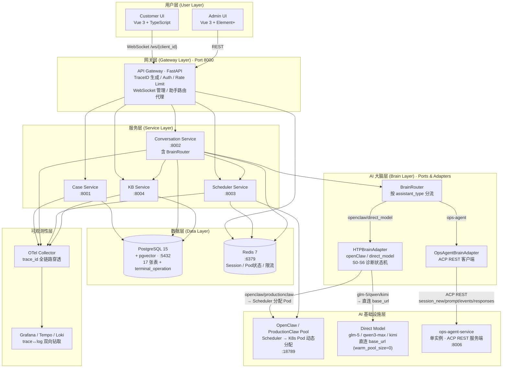
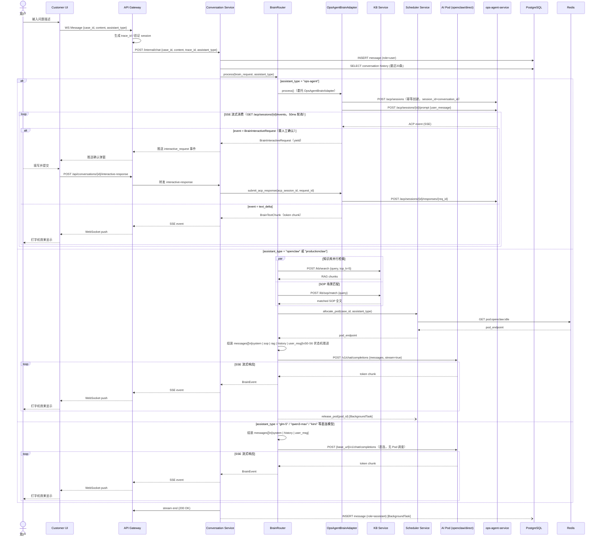

# HCI 智能排障平台 - 架构设计文档

## 文档信息
- **版本**: 7.2
- **作者**: Claude
- **创建日期**: 2026-02-15
- **更新日期**: 2026-05-13
- **状态**: 持续更新
- **依据文档**: `20_数据库重规划分析.md`、`21_知识库模块重设计.md`

---

## 变更历史

| 版本 | 日期 | 变更内容 |
|------|------|----------|
| **6.9** | **2026-05-07** | **助手选择器 Bug 修复 + ops-agent 注册**：修复 scheduler-service 可用性判断 key 不匹配（`idle_count` → `idle`）；ops-agent 注册到助手选择器（直连模式）；conversation-service 改用统一配置源；改进直连模式判断逻辑（增加 base_url 检查），详见 [事件文档](events/2026-05-07-助手选择器Bug修复.md) |
| **7.0** | **2026-05-10** | **AI 层架构全面修正（Ports & Adapters + 三大助手族 + ACP REST）**：①修正 Mermaid 架构图和 ASCII 图，新增 ops-agent-service（单实例，端口 8006，走 ACP REST 协议）；②引入 BrainPort/BrainRouter 抽象层（Ports & Adapters），明确 HTPBrainAdapter（openclaw+direct_model）和 OpsAgentBrainAdapter（ops-agent）两个管道；③新增三大助手族对照（assistant_family：openclaw/direct_model/ops_agent）及路由逻辑；④更新对话时序图为 BrainRouter 双路版本；⑤修正 NaboBot Pool 描述（已废弃，现为 ops-agent ACP REST 集成）；⑥记录 case.assistant_type 演进路径（应从最新 conversation.assistant_type 恢复，case 字段待删除）。 |
| **7.2** | **2026-05-13** | **架构设计精确修正（第一性原理对代码验证）**：①修正文档信息版本字段（v7.0→v7.2，v7.1已入变更历史但头部未更新）；②纠正§0.2时序图六处错误：新增`OPS（OpsAgentBrainAdapter）`参与者，将`BR->>OA`直接调用改为经由`OPS`中转（BrainRouter只做分发，HTTP调用由Adapter完成），修正interactive_request透传链路（`BR-->>GW`→`OPS-->>CVS-->>GW`），修正前端提交端点`/brain-response`→`/interactive-response`（commit fc592b5），修正`CVS->>BR:submit_acp_response()`→`CVS->>OPS:submit_acp_response()`（BrainRouter无此方法，实际通过`get_ops_agent_adapter()`获取Adapter后调用）；③修正§0.1 Mermaid图`OPS→OA`标签补全`responses`端点；④修正§1.1状态说明移除"本地workspace ops_agent/server/为空"错误描述（实测文件均在位：`main.py`/`acp_routes.py`/`otel_integration.py`）；⑤§1.1 ASCII图ops-agent描述补充per-session run_lock说明（commit 0183684，消除session间执行串行化）。 |
| **7.1** | **2026-05-10** | **OTLP gRPC 端点 scheme 处理修复**：`backend/shared/utils/otel.py` 新增 `_parse_grpc_endpoint()` 函数，支持从 `http://host:port` 或 `https://host:port` 格式的环境变量中正确剥离 scheme，并根据 scheme 自动设置 `insecure` 参数（http→True，https→False），确保与 gRPC channel 兼容。 |
| **6.8** | **2026-04-25** | **终端操作录制功能**：api-gateway 新增 terminal operations API（POST/GET /api/terminal/operations）；新增 terminal_operation 数据库表（归属工单模块）；前端 TerminalPanel 录制集成；TerminalReplay 回放组件；详见 [事件文档](events/2026-04-25-终端操作录制方案.md) |
| **6.7** | **2026-04-20** | **Environment 类型修复**：ORM 添加 TimestampMixin；collected_at 改为 DateTime；Schema env_type 改为 EnvType；前端采集状态新增 'empty'；新增单测覆盖，详见 [客户端设计.md](custom-ui/客户端设计.md) |
| **6.6** | **2026-04-20** | **Environment API 实现**：api-gateway 新增 environments 代理路由；backend/shared 新增 EnvType Schema；支持 S0 Prompt context_info 构建，详见 [客户端设计.md §2](custom-ui/客户端设计.md) |
| 1.0 | 2026-02-15 | 初始版本，OpenClaw 单助手架构 |
| 2.0 | 2026-02-27 | "OpenClaw Pod Pool" 泛化为 "AI Assistant Pod Pool"；新增知识库 RAG 层；新增 AI Assistant Protocol v1 |
| 2.1 | 2026-03-01 | 整合多助手接入评估；记录 Phase 1+2 重构优化成果 |
| 3.1 | 2026-03-10 | 新增 §3.4 AI 层数据流演进 |
| 4.0 | 2026-03-20 | 重写 §4 部署架构：四层 Helm Chart + GitOps 双仓模型 + ArgoCD |
| **5.0** | **2026-04-02** | **知识库架构重构**：基于方案B（双轨分离），目标 11 张表；移除"数据管道"模块；知识库只保留 4 张表；三轨串行路由 |
| **6.2** | **2026-04-04** | **数据库第一性原理全审查**：11 张表 → 17 张表；新增 customer/diagnostic_item/tool_result/system_prompt/tool_definition；废弃 conversation.hypothesis JSONB blob（BUG-06）；修复 audit_log 语义混乱（BUG-03） |
| **6.3** | **2026-04-04** | **两个正交状态机设计**：明确 case.status（6 态）与 conversation.diagnostic_stage（S0-S6）的正交语义；S6 三选项流程（A=resolved/B=回退S1/C=in_progress）；新增 §9 AI诊断状态机设计 |
| **6.4** | **2026-04-06** | **文档结构更新**：新增 §0 Mermaid 架构概览图 + §0.2 典型对话时序图；分支目录统一改为英文 |
| **6.4.1** | **2026-04-07** | **Schema 漂移修复**：新增 Alembic 0005 修复迁移（补齐 10 张缺失表 + 15 个缺失列），详见 [事件文档](events/2026-04-07-schema-漂移修复方案.md) |
| **6.4.2** | **2026-04-07** | **Admin 管理台 API 路由修复**：api-gateway 新增 categories_router（`/api/kb/categories`）和 kbd_router（`/api/v1/kbd`）代理路由；清理废弃 knowledge_atoms 前端模块，详见 [事件文档](events/2026-04-07-Admin管理台API路由修复方案.md) |
| **6.4.3** | **2026-04-07** | **Admin 路由冲突与 Token 鉴权修复**：删除 classify.py 死代码端点（解除 GET /categories 路由冲突）；api-gateway 代理改用网关自身 Token 调用 kb-service（含防御性校验），详见 [事件文档](events/2026-04-07-Admin路由冲突与Token鉴权修复方案.md) |
| **6.4.4** | **2026-04-08** | **彻底废弃 Alembic 迁移链**：`backend/shared/migrations/versions/0005_schema_repair.py` 删除 §5-§8 废弃表创建代码（7 张表），保留 §1-§4 和 tool_result/diagnostic_item；Alembic 不再承担 schema 迁移职责，详见 [事件文档](events/2026-04-08-dbmate迁移机制全面修复方案.md) |
| **6.4.5** | **2026-04-10** | **解耦 db-migrate 镜像构建**：从 `build-and-push` matrix 剥离 db-migrate，独立 `build-db-migrate` job（仅在 schema/extras/Dockerfile/脚本变更时触发）；env-repo-sync 新增可选 `db_migrate_tag` 参数，无 schema 变更时 dbMigrate.tag 保持历史值不变，详见 [事件文档](events/2026-04-10-解耦db-migrate镜像构建方案.md) |
| **6.4.6** | **2026-04-15** | **SOP 发布代理超时与错误透传修复**：api-gateway `_sop_proxy` 新增 `timeout` 参数；`sop_approve_proxy` 独立使用 600s 超时；捕获 `httpx.TimeoutException`（其不继承 `RequestError`）返回 504；`response.json()` 加容错避免非 JSON 响应导致前端只显示 "HTTP 500"，详见 [事件文档](events/2026-04-14-sop-publish-500-button-layout-fix.md) |
| **6.5.1** | **2026-04-17** | **AI 助手动态切换**：`MessageCreate` Schema 新增可选 `assistant_type` 字段，支持对话过程中切换助手（向后兼容），详见 [事件文档](events/2026-04-17-助手切换优化方案.md) |
| **6.5** | **2026-04-17** | **AI 助手选择器智能显示重构**：api-gateway `/api/assistants` 代理返回结构化响应 `{assistants, show_selector, default_assistant}`；scheduler-service 新增 `ASSISTANT_SHOW_SELECTOR` 配置支持 `auto/true/false` 三档控制；前端助手选择器显示由后端 API 响应驱动（删除前端环境变量硬开关），详见 [AI助手设计.md §10](ai-assistant/AI助手设计.md) |

---

## 0. 架构概览（Mermaid）

### 0.1 系统层次架构图



### 0.2 典型对话时序图



---

## 1. 系统架构总览

### 1.1 整体架构图 (v2.0 ASCII)

```
┌─────────────────────────────────────────────────────────────────────────┐
│                        HCI Troubleshoot Platform  v2.0                  │
└─────────────────────────────────────────────────────────────────────────┘

┌─────────────────────────────────────────────────────────────────────────┐
│                              用户层 (User Layer)                         │
├─────────────────────────────────────────────────────────────────────────┤
│  Customer UI (Vue 3 + TypeScript)           Admin UI (Vue 3 + Element+) │
│  - Case Management (查询/创建/确认/关闭)     - 工单管理 / 用户管理         │
│  - AI助手选择器 (生产环境隐藏)               - 助手评估看板                │
│  - WebSocket Connection (实时双向通信)      - 系统监控 (Grafana嵌入)      │
│  - Message Display & Command Execution                                  │
│  Client ID: 浏览器生成的唯一标识                                          │
└─────────────────────────────────────────────────────────────────────────┘
                                    │
                              WSS (WebSocket Secure)
                              HTTPS (REST API)
                                    │
                                    ▼
┌─────────────────────────────────────────────────────────────────────────┐
│                           网关层 (Gateway Layer)                         │
├─────────────────────────────────────────────────────────────────────────┤
│  API Gateway (FastAPI)                                                  │
│  ┌───────────────────────────────────────────────────────────────────┐  │
│  │ • W3C Trace Context Propagation (OpenTelemetry)                   │  │
│  │ • Request Router (路由到对应微服务)                                │  │
│  │ • Session Manager (WebSocket连接管理)                             │  │
│  │ • Auth Service (临时用户/认证用户验证)                             │  │
│  │ • Rate Limiter (请求限流)                                         │  │
│  │ • Assistant Selector Proxy (助手选择路由)                          │  │
│  └───────────────────────────────────────────────────────────────────┘  │
│  Port: 8000                                                             │
└─────────────────────────────────────────────────────────────────────────┘
                                    │
            ┌───────────────────────┼───────────────────────┐
            │                       │                       │
            ▼                       ▼                       ▼
┌─────────────────────────────────────────────────────────────────────────┐
│                           服务层 (Service Layer)                         │
├─────────────────────────────────────────────────────────────────────────┤
│  ┌──────────────┐  ┌──────────────┐  ┌──────────────┐  ┌────────────┐   │
│  │ Case Service │  │ Conversation │  │ Scheduler    │  │ KB Service │   │
│  │ (FastAPI)    │  │ Service      │  │ Service      │  │ (FastAPI)  │   │
│  │              │  │ (FastAPI)    │  │ (FastAPI)    │  │            │   │
│  │ • Case CRUD  │  │ • Msg Store  │  │ • Pod Pool   │  │ • RAG检索  │   │
│  │ • Status Mgmt│  │ • Context    │  │   Manager    │  │ • 文档摄入  │   │
│  │ • Case 归属  │  │   Assembly   │  │ • Assistant  │  │ • 向量存储  │   │
│  │   与状态管理  │  │ • BrainRouter│  │   Registry   │  │ • SOP匹配   │   │
│  │              │  │ • Brain      │  │ • Multi-Type │  │            │   │
│  │ Port: 8001   │  │   Adapters   │  │   Scheduling │  │ Port: 8004 │   │
│  │              │  │ • KB Context │  │              │  │            │   │
│  │              │  │   Injection  │  │ Port: 8003   │  │            │   │
│  │              │  │ Port: 8002   │  │              │  │            │   │
│  └──────────────┘  └──────────────┘  └──────────────┘  └────────────┘   │
└─────────────────────────────────────────────────────────────────────────┘
                                    │
          ┌─────────────────────────┼─────────────────────────┐
          │                         │                         │
          ▼                         ▼                         ▼
┌─────────────────────────────────────────────────────────────────────────┐
│                     AI 层 (AI Assistant Layer)                          │
├─────────────────────────────────────────────────────────────────────────┤
│                                                                         │
│  ┌── BrainRouter（Ports & Adapters 分流）──────────────────────────┐    │
│  │  输入: assistant_type                                            │    │
│  │  ├─ "openclaw" / "productionclaw" → HTPBrainAdapter            │    │
│  │  │     └─ S0-S6 诊断状态机 + KB RAG + Scheduler Pod 分配       │    │
│  │  ├─ "glm-5" / "qwen3-max" / "kimi" 等 → HTPBrainAdapter       │    │
│  │  │     └─ 直连 base_url，无 Pod 调度，warm_pool_size=0         │    │
│  │  └─ "ops-agent" → OpsAgentBrainAdapter                         │    │
│  │        └─ ACP REST → ops-agent-service:8006                    │    │
│  └──────────────────────────────────────────────────────────────────┘   │
│                                                                         │
│  ┌── Pod Pool（Scheduler 管理）────────────────────────────────────┐    │
│  │  ┌── OpenClaw / ProductionClaw ─────────────────────────────┐   │    │
│  │  │ Warm: POD-1(Idle) POD-2(Busy)   On-Demand: POD-N ...    │   │    │
│  │  │ Image: openclaw:latest / productionclaw:latest           │   │    │
│  │  │ Port: 18789  Protocol: POST /v1/chat/completions         │   │    │
│  │  └──────────────────────────────────────────────────────────┘   │    │
│  └──────────────────────────────────────────────────────────────────┘   │
│                                                                         │
│  ┌── Direct Model（直连 base_url，无 Pod Pool）─────────────────────┐    │
│  │  glm-5 / qwen3-max / kimi / 其他 OpenAI 兼容 API               │    │
│  │  warm_pool_size=0，base_url 直连第三方 API                      │    │
│  └──────────────────────────────────────────────────────────────────┘   │
│                                                                         │
│  ┌── ops-agent-service（单实例，ACP REST 服务端）──────────────────┐    │
│  │  Image: ghcr.io/tomturing/ops-agent   Port: 8006               │    │
│  │  Protocol: ACP REST（非 OpenAI 兼容）                           │    │
│  │  ├─ POST /acp/sessions  （幂等创建，session_id=conversation_id）│    │
│  │  ├─ POST /acp/sessions/{id}/prompt                             │    │
│  │  ├─ GET  /acp/sessions/{id}/events  （SSE）                    │    │
│  │  └─ POST /acp/sessions/{id}/responses/{req_id}                 │    │
│  │  多 session 隔离：各 ACPSession 独立 run_lock + llm_message_history   │    │
│  │  多轮连续：session_id 复用 conversation_id，跨轮保持上下文       │    │
│  │  弱点：in-memory 存储，Pod 重启状态丢失                          │    │
│  └──────────────────────────────────────────────────────────────────┘   │
│                                                                         │
│  AI Assistant Protocol（统一接口规范）:                                  │
│  • openclaw/direct_model: POST /v1/chat/completions（OpenAI 兼容）      │
│  • ops-agent: ACP REST 协议（见上）                                     │
│  • Health Probe: /health/live、/health/ready（K8s 探针）                │
│                                                                         │
└─────────────────────────────────────────────────────────────────────────┘
          │                         │                         │
          ▼                         ▼                         ▼
┌─────────────────────────────────────────────────────────────────────────┐
│                           数据层 (Data Layer)                            │
├─────────────────────────────────────────────────────────────────────────┤
│  ┌─────────────────────────┐  ┌───────────────────────────────────┐     │
│  │ Redis 7                 │  │ PostgreSQL 15 + pgvector          │     │
│  │ • Session Store         │  │ • user (用户表)                    │     │
│  │ • WebSocket Connections │  │ • case (工单表, +assistant_type)   │     │
│  │ • Pod Status Cache      │  │ • conversation (+assistant_type)  │     │
│  │ • Rate Limit Counter    │  │ • message (消息表)                 │     │
│  │ • KB Query Cache        │  │ • environment (环境快照)           │     │
│  │                         │  │ • audit_log (AI行为审计)           │     │
│  │ Port: 6379              │  │ • assistant_evaluation (评估表)    │     │
│  │                         │  │ • diagnostic_item (诊断结论子表)   │     │
│  │                         │  │ • tool_result (工具执行记录)       │     │
│  │                         │  │ • system_prompt (Prompt模板库)     │     │
│  │                         │  │ • tool_definition (工具知识库)     │     │
│  │                         │  │ • customer (客户档案)              │     │
│  │                         │  │                                   │     │
│  │                         │  │ 【知识库 - 4张表】                 │     │
│  │                         │  │ • kb_category (分类树198节点)      │     │
│  │                         │  │ • kbd_entry (KBD知识条目)          │     │
│  │                         │  │ • sop_document (SOP文档)           │     │
│  │                         │  │ • sop_chunk (SOP分块检索)          │     │
│  │                         │  │                                   │     │
│  │                         │  │ 所有表包含 trace_id 字段           │     │
│  │                         │  │ 当前: 17张表 (v6.2全审查)          │     │
│  │                         │  │ Port: 5432                        │     │
│  └─────────────────────────┘  └───────────────────────────────────┘     │
│                                                                         │
│  【文件存储】data-pipeline/kbd/cache/                                          │
│  • KBD 生产流水线中间产物（原始JSON/图片/Vision描述）                      │
│  • 断点续传用文件存在性判断，并发幂等用flock文件锁                          │
└─────────────────────────────────────────────────────────────────────────┘
                                    │
                                    ▼
┌─────────────────────────────────────────────────────────────────────────┐
│                      可观测性层 (Observability Layer)                    │
├─────────────────────────────────────────────────────────────────────────┤
│  ┌─────────────────┐  ┌─────────────────┐  ┌─────────────────────────┐  │
│  │ OTel & Logging  │  │ Tempo & Loki    │  │ Grafana                 │  │
│  │ • OTLP          │  │ • Trace Backend │  │ • trace↔log 双向钻取     │  │
│  │ • trace_id      │  │ • Log Aggregator│  │ • 助手评估看板           │  │
│  │ • Stdout JSON   │  │                 │  │ • Visualization         │  │
│  └─────────────────┘  └─────────────────┘  └─────────────────────────┘  │
└─────────────────────────────────────────────────────────────────────────┘
```

> **⚠️ 架构实现状态说明（v7.0，2026-05-10 更新）**
> - **KB Service (Port: 8004)**：✅ 已实现（`backend/kb-service/`），包含 BM25+pgvector 混合检索、SOP 关键字路由、/metrics 指标端点。
> - **BrainRouter / BrainPort Protocol**：✅ 已实现（v2.9.0）。`ConversationService` 根据 `assistant_type` 在运行时选择 `HTPBrainAdapter`（openclaw/direct_model）或 `OpsAgentBrainAdapter`（ops-agent）。
> - **ops-agent ACP REST 集成（方案E）**：✅ v2.9.0 T-E1～T-E7 全部完成。HTP 侧 `OpsAgentBrainAdapter` 完全走 ACP REST；ops-agent 侧在 `feature-hci` 分支实现了完整的 FastAPI + uvicorn 服务：`ops_agent/server/main.py`（应用入口，端口 8006）、`ops_agent/server/acp_routes.py`（ACP REST 路由）、`ops_agent/server/otel_integration.py`（OTel 集成），容器 CMD 为 `ops-server`（入口点 `ops_agent.server.main:main`）。
> - **direct_model（GLM-5/Qwen/Kimi）**：✅ 通过 `HTPBrainAdapter` 直连 `base_url`，`warm_pool_size=0`，无 Pod 调度。
> - **NaboBot Pool**：❌ 已废弃规划（未实现）。nanobot/nanoclaw/picoclaw 实际通过 `cli_openai_adapter/server.py`（ThreadingHTTPServer）暴露 `/v1/chat/completions`，与 ops-agent 无关，且不经过 `BrainRouter` 而是直接注册为 openai 兼容助手。

### 1.2 v2.0 架构核心变化

| 维度 | v1.0 (单助手) | v2.0 (多助手池化) | 优化原因  |
|------|--------------|------------------|----------|
| AI层 | OpenClaw Pod Pool (单一类型) | AI Assistant Pod Pool (多类型独立池) | 多样性、多并发 |
| 调度 | allocate_pod(case_id) | allocate_pod(case_id, assistant_type) | 多样性、独立性 |
| 对话 | 硬编码 OpenClawClient | AIAssistantClient 抽象 (策略模式) | 多样性、可替换 |
| 知识库 | 无 | Knowledge Base Service (RAG 三层注入) | 统一性 |
| 数据模型 | conversation.openclaw_pod_id | conversation.assistant_type + pod_id | 统一性、对比 |
| 助手选择 | 无 (固定 OpenClaw) | 用户可选 / 生产环境系统自动分配 | 多样性、独立性 |
| 评估 | 无 | assistant_evaluation 表 (准确率对比) | 统一性、对比 |
| 扩展 | 修改代码 | AssistantRegistry 配置化注册，零代码接入 | 多样性 |

**设计驱动场景** (v2.0 升级的四大业务动因):

1. **多并发**: 云服务场景，0-N 个用户同时使用，每人需独立 AI 助手实例
2. **多样性**: OpenClaw 是第三方，可随时替换为 nabobot / picoclaw / zeroclaw / 自研助手
3. **独立性**: 每个 Case 需要隔离的上下文环境，避免交叉污染
4. **统一性**: 所有 AI 助手共用统一知识库 + Prompt 模板，可横向对比诊断准确率

### 1.3 调用链路 (v2.0 / v7.0 更新)

#### 典型对话流程
```
1. 用户发送消息 (含助手选择)
   Customer UI (ClientID: xxx, assistant_type: openclaw / ops-agent / glm-5 ...)
   → WebSocket Message / REST API
   
2. 网关处理
   API Gateway
   → Generate TraceContext (W3C traceparent)
   → Validate Session
   → Route to Conversation Service (携带 assistant_type)
   
3. Conversation Service → BrainRouter 分流
   BrainRouter.process(request, assistant_type)
   ┌─ "ops-agent" → OpsAgentBrainAdapter
   │    ├─ POST /acp/sessions（幂等创建，session_id = conversation_id）
   │    ├─ POST /acp/sessions/{id}/prompt（提交用户输入）
   │    ├─ GET  /acp/sessions/{id}/events（SSE 消费，翻译为 BrainEvent）
   │    └─ 如有 BrainInteractiveRequest → 透传给前端确认 → 回传 submit_acp_response
   │
   ├─ "openclaw" / "productionclaw" → HTPBrainAdapter
   │    ├─ 知识库检索 (并行)
   │    │    CVS → KB Service: POST /api/kb/search { query, top_k=5 }
   │    │         返回相关知识片段 (ranked chunks)
   │    │    → SOP 匹配: 检测特殊场景 → 注入完整 SOP 文档
   │    ├─ Scheduler 分配 Pod
   │    │    → allocate_pod(case_id, assistant_type)
   │    │    → Redis: GET pod:openclaw:idle → pod_endpoint
   │    ├─ 上下文组装
   │    │    [Tier-1] 静态 System Prompt
   │    │    [Tier-2] SOP 注入 (匹配场景)
   │    │    [Tier-3] RAG 知识片段 (top-k)
   │    │    [Tier-4] 对话历史 (最近 20 条)
   │    ├─ S0-S6 诊断状态机推进 (stage = conversation.diagnostic_stage)
   │    └─ POST /v1/chat/completions {messages, stream=true}
   │
   └─ "glm-5" / "qwen3-max" / "kimi" 等 → HTPBrainAdapter（直连模式）
        ├─ 上下文组装 [system | history | user_msg]（无 KB 注入，warm_pool_size=0）
        └─ POST {base_url}/v1/chat/completions（直连第三方 API）

4. 流式响应返回 (三路统一出口)
   BrainAdapter
   → BrainEvent stream → Conversation Service
   → API Gateway SSE
   → Customer UI WebSocket push（打字机效果）

5. 后台异步任务
   CVS → PostgreSQL: INSERT message (role=assistant, assistant_type, trace_id)
   HTPBrainAdapter → Scheduler: release_pod(pod_id)（ops-agent 无需）
```

#### 三大助手族路由对照

| assistant_family | 典型 assistant_type | 路由适配器 | 协议 | Pod 调度 | KB 注入 | 多轮连续 |
|---|---|---|---|---|---|---|
| openclaw | openclaw, productionclaw | HTPBrainAdapter | POST /v1/chat/completions | ✅ Scheduler | ✅ RAG+SOP | ✅ history |
| direct_model | glm-5, qwen3-max, kimi | HTPBrainAdapter | POST /v1/chat/completions | ❌ 直连 | ⬜ 可选 | ✅ history |
| ops_agent | ops-agent | OpsAgentBrainAdapter | ACP REST | ❌ 单实例 | 由 ops-agent 自管 | ✅ ACP session |

---

## 2. 核心组件设计

### 2.1 API Gateway

**职责**:
- TraceID 生成和透传
- WebSocket 连接管理
- 请求路由
- 认证授权
- 限流保护
- 助手类型列表代理 (GET /api/assistants)

**技术栈**:
- FastAPI (WebSocket支持)
- Redis (Session存储)
- Pydantic (数据验证)

**关键接口**:
```
WebSocket:
  /ws/{client_id}           - WebSocket连接入口

REST API (Case):
  GET  /api/cases            - 查询工单列表
  POST /api/cases            - 创建新工单 (含 assistant_type)
  GET  /api/cases/{case_id}  - 查询工单详情
  PUT  /api/cases/{case_id}/confirm - 确认工单
  PUT  /api/cases/{case_id}/close   - 关闭工单

REST API (Assistant):
  GET  /api/assistants       - 获取可用 AI 助手列表 (代理 Scheduler)
  
REST API (Admin):
  GET  /api/cases/all        - 分页+筛选查询所有工单
  GET  /api/cases/stats      - 按状态统计工单数量
  GET  /api/cases/clients    - 客户端列表及工单数
```

### 2.2 Case Service

**职责**:
- 工单生命周期管理
- 工单状态维护
- 工单查询
- **[v2.0] 记录工单关联的 assistant_type**

**工单状态机**:
```
created → confirmed → in_progress → resolved → closed
           ↓                ↓
        cancelled      cancelled
```

**数据模型** (v2.0):
```python
Case:
  - case_id: str (Q + YYYYMMDD + 5位序号)
  - client_id: str
  - status: enum
  - title: str
  - description: str
  - assistant_type: str        # [v2.0新增] 如 openclaw / nabobot
  - created_at: datetime
  - updated_at: datetime
  - closed_at: datetime
  - trace_id: str
```

### 2.3 Conversation Service

**职责**:
- 消息存储和检索
- 对话上下文预处理
- **[v2.0] AIAssistantClient 抽象层 — 统一对接多种 AI 助手**
- **[v2.0] 知识库上下文注入 (3-tier prompt assembly)**
- 流式响应处理

**v2.0 核心变化 — AIAssistantClient 抽象**:
```python
# v1.0: 硬编码 OpenClawClient
class OpenClawClient:
    async def chat_completion_stream(self, messages, pod_endpoint):
        # 固定调用 OpenClaw API
        ...

# v2.0: 策略模式抽象
class AIAssistantClient(Protocol):
    """AI 助手统一接口 — 所有助手实现此协议"""
    async def chat_completion_stream(
        self,
        messages: list[dict],
        pod_endpoint: str,
        gateway_token: str,
    ) -> AsyncIterator[str]:
        ...

class OpenClawAssistant(AIAssistantClient):
    """OpenClaw 适配器 — POST /v1/chat/completions"""
    ...

class NaboBotAssistant(AIAssistantClient):
    """NaboBot 适配器 — 也走 OpenAI 兼容接口"""
    ...

# 工厂函数: 根据 assistant_type 返回对应客户端
def get_assistant_client(assistant_type: str) -> AIAssistantClient:
    registry = {
        "openclaw": OpenClawAssistant,
        "nabobot": NaboBotAssistant,
    }
    return registry[assistant_type]()
```

**v2.0 核心变化 — 知识库上下文注入 (3-Tier Prompt Assembly)**:
```python
async def assemble_context(case_id: str, user_message: str) -> list[dict]:
    """组装发送给 AI 助手的完整 messages 数组"""
    messages = []
    
    # Tier-1: 静态 System Prompt (~500 tokens)
    # 角色定义、行为准则、输出格式要求
    messages.append({"role": "system", "content": SYSTEM_PROMPT})
    
    # Tier-2: SOP 智能注入 (~2000 tokens, 可选)
    # 检测用户问题是否匹配特殊场景 → 注入对应 SOP 全文
    sop = await kb_service.match_sop(user_message)
    if sop:
        messages.append({"role": "system", "content": f"相关SOP文档:
{sop}"})
    
    # Tier-3: RAG 语义检索 (~3000 tokens)
    # 从 6000+ 知识文档中检索最相关的 top-k 片段
    chunks = await kb_service.search(query=user_message, top_k=5)
    if chunks:
        context = "
---
".join([c.content for c in chunks])
        messages.append({"role": "system", "content": f"参考知识库:
{context}"})
    
    # Tier-4: 对话历史 (最近 20 条)
    history = await get_conversation_history(case_id, limit=20)
    messages.extend(history)
    
    # 当前用户消息
    messages.append({"role": "user", "content": user_message})
    
    return messages
```

**消息类型**:
```python
MessageType:
  - user: 用户消息
  - assistant: AI响应
  - system: 系统消息
  - command: 命令建议
```

**数据模型** (v2.0):
```python
Conversation:
  - conversation_id: uuid
  - case_id: str
  - assistant_type: str       # [v2.0新增] 使用的 AI 助手类型
  - pod_id: str               # [v2.0重命名] 原 openclaw_pod_id
  - started_at: datetime
  - ended_at: datetime
  - trace_id: str

Message:
  - message_id: uuid
  - conversation_id: uuid
  - role: enum (user/assistant/system)
  - content: text
  - metadata: jsonb           # 含 kb_chunks_used, sop_matched 等信息
  - created_at: datetime
  - trace_id: str
```

### 2.4 Scheduler Service

**职责**:
- **[v2.0] 多类型 AI 助手 Pod 池统一管理 (PodPoolManager)**
- **[v2.0] AssistantRegistry — 助手类型配置化注册**
- 每类型独立热备池 + 按需池
- 负载均衡
- 健康检查

**v2.0 核心变化 — AssistantRegistry**（v1.2 后支持两种接入模式）:
```python
# 配置化注册，新增助手类型无需修改代码
# 配置来源: 环境变量 / Helm values.yaml (ASSISTANT_REGISTRY_JSON)
ASSISTANT_REGISTRY = {
    # --- Pod 模式（warm_pool_size > 0）：Scheduler 在 K8s 启动 AI Pod ---
    "openclaw": {
        "image": "ghcr.io/.../hci-openclaw:latest",
        "port": 18789,
        "warm_pool_size": 2,          # 大于 0 → Pod 模式
        "max_pool_size": 5,
        "idle_timeout": 300,
        "gateway_token": "...",       # OpenClaw 内部网关鉴权
        "health_check": "post_empty_payload",
        "display_name": "OpenClaw (GLM)",
        "description": "基于智谱 GLM 模型的 AI 排障助手",
    },
    # --- 直连模式（warm_pool_size=0 & max_pool_size=0）：跳过 Pod 分配 ---
    "qwen3.5-plus": {
        "base_url": "https://coding.dashscope.aliyuncs.com/v1",
        "provider_api_key": "sk-...",  # 外部模型 API Key（与 gateway_token 独立）
        "model": "qwen3.5-plus",
        "warm_pool_size": 0,           # 0 → 直连模式，Scheduler 直接返回 base_url
        "max_pool_size": 0,
        "display_name": "Qwen3.5-Plus",
        "description": "Qwen3.5-Plus - deep thinking + vision",
    },
    # kimi-k2.5 / glm-4.7 / qwen3-max 同样为直连模式，结构一致
}
```

> **两种模式区别**：Pod 模式用 `gateway_token` 鉴权（OpenClaw 内部）；直连模式用 `provider_api_key`（外部 LLM API Key）。两个字段在代码层面已彻底解耦（v1.3）。

**v2.0 核心变化 — PodPoolManager**:
```python
class PodPoolManager:
    """管理多个助手类型的独立 Pod 池"""
    
    def __init__(self, registry: dict):
        # 每个助手类型一个独立 PodPool
        self.pools: dict[str, PodPool] = {
            name: PodPool(name, config)
            for name, config in registry.items()
        }
    
    async def allocate_pod(self, case_id: str, assistant_type: str) -> str:
        """按类型分配 Pod，返回 pod_endpoint"""
        pool = self.pools[assistant_type]
        return await pool.acquire(case_id)
    
    async def release_pod(self, case_id: str, assistant_type: str):
        """释放 Pod 回池"""
        pool = self.pools[assistant_type]
        await pool.release(case_id)
    
    async def get_status(self) -> dict:
        """返回所有池的状态汇总"""
        return {name: pool.status() for name, pool in self.pools.items()}
    
    def list_assistants(self) -> list[dict]:
        """返回可用助手列表 (供前端展示)"""
        return [
            {
                "type": name,
                "display_name": config["display_name"],
                "description": config["description"],
                "available": self.pools[name].has_capacity(),
            }
            for name, config in self.registry.items()
        ]
```

**调度策略** (每类型独立):
```
1. 热备池 (Warm Pool) — 每类型独立
   - 保持 N 个空闲 Pod (N 按类型配置)
   - 快速响应 (< 1s)
   - 定期健康检查

2. 按需池 (On-Demand Pool)
   - 热备池耗尽时按需创建
   - 闲置 idle_timeout 秒后销毁
   - 最大限制: max_pool_size (按类型)

3. 分配算法
   - 优先分配热备池
   - 同类型内负载均衡 (最少连接数)
   - 故障转移 (Pod 不可用时自动切换同类型其他 Pod)
```

**Pod状态**:
```python
PodStatus:
  - idle: 空闲，等待分配
  - assigned: 已分配给 Case
  - busy: 正在处理请求
  - unhealthy: 健康检查失败
  - terminating: 正在终止
```

**新增接口**:
```
GET  /api/scheduler/assistants          - 获取可用助手列表
POST /api/scheduler/allocate            - 分配 Pod (含 assistant_type)
POST /api/scheduler/release             - 释放 Pod
GET  /api/scheduler/status              - 所有池状态汇总
```

### 2.5 AI Assistant Protocol v1

**[v2.0 新增]** 所有接入平台的 AI 助手必须遵循的统一接口规范。

**协议目标**: 任何 AI 助手只要实现此协议，即可零代码修改接入平台。

**接口规范**:
```yaml
API:
  Endpoint: POST /v1/chat/completions
  Protocol: OpenAI Chat Completions 兼容
  Request:
    model: string (可选，助手内部路由)
    messages:
      - role: system | user | assistant
        content: string
    stream: true
    user: string (case_id 标识)
  Response: SSE (text/event-stream)
    data: {"choices": [{"delta": {"content": "..."}}]}
    data: [DONE]

Health Check:
  # 方案A: 标准健康端点 (推荐)
  GET /health → 200 OK
  
  # 方案B: 兼容模式 (OpenClaw 等无 /health 的助手)
  POST /v1/chat/completions (空 JSON body)
  → 400 或 422 = 可达 (healthy)
  → 超时或连接拒绝 = 不可达 (unhealthy)

Environment Variables (由平台注入):
  - *_API_KEY        # 上游模型密钥 (助手特有)
  - *_GATEWAY_TOKEN  # 网关鉴权 Token
  - ASSISTANT_TYPE   # 助手类型标识

Container Requirements:
  - 非 root 用户运行
  - 支持优雅关闭 (SIGTERM)
  - stdout JSON 结构化日志
```

**当前已适配助手**:

| 助手类型 | 镜像 | 端口 | 上游模型 | 状态 |
|----------|------|------|---------|------|
| openclaw | openclaw:latest (node:22-bookworm) | 18789 | z.ai GLM (via OPENCLAW_API_KEY) | ✅ 已接入 |
| nabobot | nabobot:latest | 8080 | 待定 | 📋 计划中 |
| picoclaw | picoclaw:latest | 待定 | 待定 | 📋 计划中 |

### 2.6 Knowledge Base Service (RAG Pipeline)

**[v2.0 新增]** 负责知识库文档的摄入、索引、检索，为 AI 助手对话提供上下文增强。

**业务背景**:
- 6000+ 篇按问题分类的 Markdown 排障文档
- 10 篇针对特殊场景的 SOP 文档
- 若干网页版案例库
- 数据量大且持续迭代新增

**架构: 三层知识注入 (3-Tier Knowledge Injection)**:
```
┌────────────────────────────────────────────────────┐
│            Conversation Service                    │
│                                                    │
│  messages[] = [                                    │
│    [Tier-1] System Prompt     ~500 tokens          │ ← 静态模板，角色+准则
│    [Tier-2] SOP Document      ~2000 tokens (可选)   │ ← 10篇SOP，场景匹配后全文注入
│    [Tier-3] RAG Chunks        ~3000 tokens         │ ← 6000+文档，语义检索top-k
│    [Tier-4] Chat History      ~4000 tokens         │ ← 最近20条对话
│    [Current] User Message                          │
│  ]                                                 │
│                                                    │
│  → 发送给 AI Assistant Pod                          │
└────────────────────────────────────────────────────┘
```

**三层详解**:

| 层级 | 数据源 | 大小 | 注入策略 | 更新频率 |
|------|--------|------|---------|---------|
| Tier-1 静态 Prompt | 平台维护的角色模板 | ~500 tokens | 每次对话固定注入 | 低频手动更新 |
| Tier-2 SOP 注入 | 10 篇 SOP 文档 | ~2000 tokens/篇 | 分类器匹配 → 全文注入 | 低频手动更新 |
| Tier-3 RAG 检索 | 6000+ Markdown 文档 | top-5 chunks ~3000 tokens | 语义向量检索 | 增量自动索引 |

**RAG Pipeline 架构**:
```
文档源                    KB Service                       存储
┌──────────┐           ┌───────────────┐                ┌────────────┐
│ Markdown │ ─ingest─  │ 文本分块       │   ─chunk─      │ PostgreSQL │
│ 6000+文档│           │ (512 tokens,   │               │ + pgvector  │
├──────────┤           │  20% overlap)  │  ─embed─      │             │
│ SOP 文档 │           │                │               │ kb_chunk    │
│ 10 篇    │           │ Embedding      │ (bge-zh/      │ (content    │
├──────────┤           │ Model API      │  z.ai embed)  │  + vector)  │
│ 网页案例  │ ─scrape─  │                │               │             │
└──────────┘           └────────────────┘               └─────────────┘
                              │
                    ┌─────────┴──────────┐
                    │ Search API         │
                    │ POST /api/kb/search│
                    │ { query, top_k }   │
                    │                    │
                    │ → 向量相似度检索    │
                    │ → 返回 ranked      │
                    │   chunks           │
                    └────────────────────┘
```

**为什么选择 RAG 而非其他方案?**

| 方案 | 优点 | 缺点 | 适用场景 |
|------|------|------|---------|
| **RAG (当前方案)** | 实时更新、可审计、低成本 | 需维护向量索引 | ✅ 大量文档、持续增长 |
| 全量 Prompt 注入 | 简单 | Token 超限 (6000文档不可能) | ❌ 不适用 |
| Fine-tuning | 内化知识 | 更新需重训、不可审计 | ❌ 知识持续增长场景不适用 |
| Volume 挂载 | 文件可读 | LLM 无法自动检索 | 仅适合 Agent 工具调用 |

**技术选型**:

| 组件 | 选型 | 理由 |
|------|------|------|
| 向量存储 | **pgvector** (PostgreSQL 扩展) | 6000×10=60K 向量，pgvector 完全胜任；复用现有 PG，无新增基础设施 |
| Embedding 模型 | **bge-small-zh-v1.5** (本地) 或 z.ai embedding API | 中文文档需中文 embedding；本地模型无 API 调用开销 |
| 文本分块 | 512 tokens / chunk, 20% overlap | 兼顾上下文完整性与检索精度 |
| SOP 匹配 | 关键词分类器 + TF-IDF | 10 篇 SOP 规模小，关键词匹配足够 |

**数据模型**:
```python
KBDocument:
  - doc_id: uuid
  - title: str
  - category: str          # 问题分类
  - doc_type: str          # markdown / sop / web_case
  - source_path: str       # 原始文件路径或 URL
  - content: text          # 原始全文
  - metadata: jsonb
  - created_at: datetime
  - updated_at: datetime

KBChunk:
  - chunk_id: uuid
  - doc_id: uuid (FK)
  - chunk_index: int       # 在文档中的位置
  - content: text          # 分块文本 (~512 tokens)
  - embedding: vector(384) # bge-small 输出维度 384
  - metadata: jsonb        # 含原始 section title 等
  - created_at: datetime
```

**关键接口**:
```
POST /api/kb/search         - 语义检索 (query + top_k + category?)
POST /api/kb/sop/match      - SOP 场景匹配 (query → matched SOP)
POST /api/kb/ingest         - 文档批量摄入 (markdown/url)
GET  /api/kb/documents      - 文档列表 (分页+筛选)
DELETE /api/kb/documents/{id} - 删除文档 (级联删除 chunks)
POST /api/kb/reindex        - 重建索引 (全量 re-embed)
GET  /api/kb/stats          - 知识库统计 (文档数/分块数/分类分布)
```

**端口**: 8004

### 2.7 助手选择机制

**[v2.0 新增]** 用户在创建工单时可选择 AI 助手类型。

**双模式设计**:

```
┌────────────────────────────────────┐
│      Customer UI 助手选择器         │
│                                    │
│  开发/测试环境:                     │
│  ┌──────────────────────────────┐  │
│  │ 🤖 选择 AI 助手:             │  │
│  │ ○ OpenClaw (GLM) — 推荐      │  │
│  │ ○ NaboBot                    │  │
│  │ ○ PicoClaw                   │  │
│  └──────────────────────────────┘  │
│                                    │
│  生产环境:                          │
│  [选择器隐藏，系统自动分配]          │
│  策略: 轮询(A/B) / 负载均衡 /        │
│        分类路由 / 管理员指定         │
│                                    │
│  控制方式:                          │
│  VUE_APP_SHOW_ASSISTANT_SELECTOR   │
│  = true (开发) / false (生产)       │
└────────────────────────────────────┘
```

**前端实现要点**:
- Customer UI 工单创建对话框新增「AI 助手」下拉选择
- 可用助手列表来自 API: 
- 环境变量  控制显示/隐藏
- 隐藏时自动选择默认助手 (由后端 fallback)
- 生产环境系统自动分配策略:
  - **轮询 A/B 测试**: 均匀分配不同助手，对比准确率
  - **分类路由**: 根据问题类别选择最擅长的助手
  - **负载感知**: 优先分配当前池余量最大的助手

**API 变化**:
```json
// POST /api/cases 请求体新增 assistant_type
{
  "client_id": "xxx",
  "title": "虚拟机启动失败",
  "description": "...",
  "assistant_type": "openclaw"   // 可选，不传则系统自动分配
}
```

---

## 3. 数据流设计

### 3.1 TraceID 生成与传播

**协议**: W3C Trace Context (`traceparent`)
- OTel Span: 32个字符的十六进制追踪ID (如: `c0b904d1edb615436688e40f5a7d7ac3`)

**示例**: `00-c0b904d1edb615436688e40f5a7d7ac3-596cc379aa804c0d-01`

**传播路径**:
```
API Gateway (Instrumentor 自动生成 / 继承)
  ↓ HTTP Header: traceparent
Micro Services (Instrumentor 自动透传)
  ↓ SQL: SQLAlchemyInstrumentor 生成 Sub-Span, 日志注入 trace_id
Database (存储 / Loki 采集)
  ↓ Log: {"trace_id": "c0b9...", "span_id": "596c...", ...}
Logs (输出为 JSON stdout)
```

### 3.2 WebSocket 消息协议

**客户端 → 服务端**:
```json
{
  "type": "user_message",
  "case_id": "Q20260215001",
  "content": "虚拟机启动失败",
  "metadata": {
    "timestamp": 1708012345,
    "assistant_type": "openclaw"
  }
}
```

**服务端 → 客户端** (流式):
```json
{
  "type": "assistant_message",
  "case_id": "Q20260215001",
  "content": "我来帮您诊断这个问题...",
  "is_complete": false,
  "metadata": {
    "trace_id": "c0b904d1edb615436688e40f5a7d7ac3",
    "assistant_type": "openclaw",
    "kb_chunks_used": 3
  }
}
```

**命令建议**:
```json
{
  "type": "command",
  "case_id": "Q20260215001",
  "content": "请执行以下命令检查虚拟机状态",
  "command": "virsh list --all",
  "warning": "请在执行前确认环境安全",
  "metadata": {
    "trace_id": "c0b904d1edb615436688e40f5a7d7ac3"
  }
}
```

### 3.3 知识库数据流 (v2.0 新增)

```
文档摄入流:
  Admin 上传 / 定时扫描目录
  → KB Service: ingest(files[])
  → 解析 Markdown / 抓取网页
  → 文本分块 (512 tokens, 20% overlap)
  → Embedding 生成 (bge-small-zh / z.ai API)
  → 存入 PostgreSQL + pgvector

对话时检索流:
  用户消息 → Conversation Service
  → KB Service: search(query, top_k=5)
  → pgvector: 余弦相似度检索
  → 返回 ranked chunks (含 score + source)
  → 注入 Tier-3 system message

SOP 匹配流:
  用户消息 → KB Service: sop_match(query)
  → TF-IDF / 关键词分类器
  → 返回匹配的 SOP 全文 (如有)
  → 注入 Tier-2 system message
```

---

### 3.4 AI 层数据流演进：阶段一 vs 阶段三

> 详细架构决策见 `15_AI层RAG对接架构决策.md`。本节记录两个关键阶段下一条用户消息的**完整数据流**，供研发对照实现。

#### 3.4.1 阶段一：外挂 RAG（当前目标态）

**核心特征**：conversation-service 承担 RAG 编排职责，在调用 AI 前同步拉取知识并注入 system prompt；ProductionClaw 作为被动 LLM 使用。

```
浏览器
  │ POST /api/conversations/{id}/messages（HTTP）
  ▼
api-gateway
  │ HTTP SSE 透传代理（httpx stream）
  ▼
conversation-service
  │
  ├─ ① POST /api/kb/sop/match {"query": "用户消息"}
  │        ↓ 返回：匹配 SOP 全文（Tier-2 注入源）
  │        kb-service → pgvector TF-IDF 分类
  │
  ├─ ② POST /api/kb/search {"query": "用户消息", "top_k": 5}
  │        ↓ 返回：top-k 语义相关 chunks（Tier-3 注入源）
  │        kb-service → pgvector 余弦相似度检索
  │
  ├─ ③ 拼装 system_prompt
  │        Tier-1: 角色定义（静态）
  │        Tier-2: SOP 全文（来自步骤①）
  │        Tier-3: 相关案例 chunks（来自步骤②）
  │        Tier-4: 输出格式规范（静态）
  │
  │ POST /v1/chat/completions
  │   { stream: true, messages: [system_prompt, user_msg] }
  ▼
ProductionClaw Pod（Pi agent runtime，此阶段作为 LLM 使用）
  │  仅执行：token 预测 → 流式文本生成
  │  agent loop / tool-calling / session memory：闲置
  ▼
流式文本 SSE → conversation-service → api-gateway → 浏览器
```

**数据特征**：
- 每条用户消息触发 **2 次同步串行 KB HTTP 请求**，增加 TTFB（预计 +100~400ms）
- ProductionClaw 接收内容：`1 个拼装好的 system_prompt 字符串 + 1 条 user 消息`
- **知识决策权**在 conversation-service（无对话语义理解，每次无条件注入）
- `productionclaw/TOOLS.md` 中定义的工具调用规范此阶段**形同虚设**

---

#### 3.4.2 阶段三：混合架构（目标演进态）

**核心特征**：SOP 以 ConfigMap 形式挂载进 Pod 本地（零延迟），历史案例通过工具调用按需检索；conversation-service 降级为纯路由器；LearningClaw 提供自主学习闭环。

```
浏览器
  │ POST /api/conversations/{id}/messages（HTTP）
  ▼
api-gateway
  │ HTTP SSE 透传代理
  ▼
conversation-service（纯路由 + DB 持久化，不感知知识内容）
  │
  ├─ 维持 WS session（case-{id} → ProductionClaw Pod，长连接）
  │
  │ POST /v1/chat/completions { user_msg }   ← 仅原始消息，无 RAG 注入
  ▼
ProductionClaw Pod（完整 Pi agent runtime）
  │
  │ ── Pod 启动时（BOOTSTRAP，一次性）───────────────────────────────
  │   读 /workspace/skills/vm_power_failure/keywords_map.json   ← ConfigMap 挂载
  │   读 /workspace/skills/vm_power_failure/chapters/*.md        ← 本地文件，< 1ms
  │   读 /workspace/skills/storage_offline/*.md
  │   建立本地 session-memory 知识缓存
  │
  │ ── 每轮对话（REASONING，按需）─────────────────────────────────
  │   判断是否需要案例检索？
  │      ├─ YES → tool-call: POST /api/kb/search {"query": "..."}
  │      │              ↓ kb-service → pgvector 检索
  │      │        返回 top-k chunks
  │      │        判断是否需要多跳？
  │      │           └─ YES → 再次 tool-call（完全自主）
  │      └─ NO  → 直接基于 session-memory + 本地 SOP skills 回答
  │
  │   生成流式文本回复
  │
  │ ── 结案时（CLOSE）────────────────────────────────────────────
  │   sessions_send → LearningClaw（异步，不阻塞用户）
  ▼
流式文本 SSE → conversation-service → api-gateway → 浏览器

                         ↙（异步后台）
              LearningClaw Pod
                ├─ 提炼对话经验 → POST /api/kb/ingest（新案例入库）
                └─ 判断 SOP 是否需更新
                      └─ kubectl replace configmap sop-skills-*
                         → rollout restart productionclaw-pool
                           （下次 Pod 启动时自动获益）
```

**数据特征**：
- 用户消息触发 **0 次**同步 KB HTTP 请求（SOP 本地化），案例检索仅在 agent 判断必要时触发
- ProductionClaw 接收内容：仅原始 user 消息，知识由自身 agent loop 按需获取
- **知识决策权**在 ProductionClaw（理解完整对话上下文，自主判断检索时机和内容）
- `productionclaw/TOOLS.md` 中定义的 KB 调用规范**完整生效**

---

#### 3.4.3 两阶段核心差异对照

| 维度 | 阶段一：外挂 RAG | 阶段三：混合架构 |
|------|-----------------|-----------------|
| **conversation-service 职责** | RAG 编排者（知道 KB、做检索、拼 prompt） | 纯路由器（维持 WS session、消息持久化） |
| **知识决策权归属** | conversation-service（不懂语义，无条件注入） | ProductionClaw（理解对话，按需决策） |
| **SOP 访问路径** | HTTP → kb-service → pgvector（+100~400ms） | Pod 本地 ConfigMap 文件（< 1ms） |
| **案例检索触发** | 每条消息无条件触发（无论是否需要） | agent 自主判断，仅在必要时调用 |
| **多跳推理** | ❌ 一次注入后无法迭代 | ✅ agent loop 可任意追加检索 |
| **ProductionClaw 实际使用** | 纯 token 预测引擎 | 完整 Pi agent runtime |
| **WS session** | ❌ 无（当前 bug 根源） | ✅ conversation-service 维持长连接 |
| **LearningClaw 接入** | ❌ 未接入 | ✅ 异步消费结案事件，写 KB + 更新 skills |
| **知识更新传播** | 改 KB 下次检索即生效 | SOP 需 ConfigMap 更新 + Pod 重启；案例库实时 |
| **知识模式** | 推（Push）：外部把知识推给 ProductionClaw | 拉（Pull）：ProductionClaw 自主决定何时拉什么 |
| **系统耦合度** | conversation-service 强耦合 KB 逻辑 | 各层职责清晰，KB 只被 ProductionClaw 直接使用 |

---

## 4. 部署架构

### 4.1 开发环境 (Docker Compose)

```yaml
services:
  - api-gateway          # 网关，负责路由与 SSE 代理
  - case-service         # 工单服务
  - conversation-service # 对话服务，AI 客户端抽象
  - scheduler-service    # 调度服务，多类型 Pod 池管理
  - kb-service           # [v2.0] 知识库 RAG 服务
  - openclaw             # OpenClaw Gateway 容器 (:18789)
  - postgres             # 含 pgvector 扩展
  - redis
```

**优点**:
- 快速启动
- 本地调试方便
- 资源占用少

### 4.2 生产环境 (K3s + ArgoCD GitOps)

项目采用**双仓模型 + 四层 Helm Chart + App of Apps 分层** 架构，消除 ArgoCD 资源竞争（见 [ADR-005](../adr/005-Helm-Chart资源归属拆分.md)）：

```
代码仓库 (hci-troubleshoot-platform)
  └─ GitHub Actions CI
       ├─ 构建镜像 → ghcr.io/<org>/<service>:<date>-<sha7>
       ├─ Trivy 安全扫描 (HIGH/CRITICAL 阻断)
       └─ 自动提交 dev values PR → 环境仓库

环境仓库 (hci-platform-env)
  environments/
    dev/values.yaml      ← CI 自动合入
    staging/values.yaml  ← 手动审批晋级
    prod/values.yaml     ← 发布窗口 + 审批
  └─ ArgoCD 监听此仓库 → 同步集群
```

**App of Apps 分层（PR #159 引入，D-001）**：

```
dev 集群 ArgoCD
└── argocd-ops (sources: argocd-ops/ + argo-apps/local/)
    ├── 运维配件（watchdog CronJob + RBAC + PrometheusRule）
    └── dev 所有 Application 定义（hci-platform-dev / data / obs）

staging 集群 ArgoCD
└── argocd-ops (sources: argocd-ops/ + argo-apps/cloud/)
    ├── 运维配件（同上）
    └── staging Application 定义（hci-platform-staging / ...）
```

> ⚠️ `argo-apps/cloud/` 里的 Application **只能**由 staging 侧 ArgoCD 管理，严禁在 dev 集群 `kubectl apply`，否则因缺少 staging 集群凭据导致 sync 永久失败（D-001）。

**四层 Helm Chart（按部署顺序）**：

| Chart | Namespace | 内容 | ArgoCD Apps | 特殊配置 |
|-------|-----------|------|-------------|----------|
| `hci-platform-infra` | 集群级 | StorageClass + 4 个 ClusterRole/ClusterRoleBinding | 全局单一 | ServerSideApply=true |
| `hci-platform-data` | hci-dev / hci-staging / hci | PostgreSQL(+pgvector) + Redis StatefulSet + PVC | 3 个（per-env）| prune:false 保护 PVC |
| `hci-platform-obs` | hci-obs | Loki + Tempo + Grafana + Prometheus + Promtail + AlertManager | 全局单一 | prune:false 保护 PVC |
| `hci-platform` | hci-dev / hci-staging / hci | 业务微服务 + 前端 + Ingress + ConfigMap + Secret | 3 个（per-env）| 镜像 tag 由环境仓库控制 |

**业务服务资源清单（hci-platform）**：
```
Namespaces: hci-dev / hci-staging / hci (prod)

Deployments (业务):
  api-gateway          (Replicas: 2, WebSocket sticky session)
  case-service         (Replicas: 2)
  conversation-service (Replicas: 3, SSE 流式)
  scheduler-service    (Replicas: 2, Redis 状态持久化)
  kb-service           (Replicas: 2, 待实现)
  customer-ui          (Replicas: 2)
  admin-ui             (Replicas: 2)

Deployments (AI 助手 — Scheduler 动态管理):
  openclaw-pool        (Dynamic Replicas: 2-5)

Ingress (Traefik):
  HTTPS + TLS (cert-manager)
  WebSocket sticky session (Traefik sticky cookie)

ConfigMap: assistant-registry, system-prompts
Secret:    DB 密码, API Token, ZAI API Key
```

---

## 5. 可观测性设计

### 5.1 MVP阶段 (当前)

**结构化日志**:
```json
{
  "timestamp": "2026-02-15T10:30:00Z",
  "level": "INFO",
  "trace_id": "c0b904d1edb615436688e40f5a7d7ac3",
  "service": "conversation-service",
  "event": "message_sent",
  "case_id": "Q20260215001",
  "assistant_type": "openclaw",
  "kb_chunks_used": 3,
  "duration_ms": 125,
  "status": "success"
}
```

**TraceID 索引**:
```sql
-- PostgreSQL
CREATE INDEX idx_case_trace_id ON case(trace_id);
CREATE INDEX idx_conversation_trace_id ON conversation(trace_id);
CREATE INDEX idx_message_trace_id ON message(trace_id);
```

### 5.2 未来迭代

**指标监控** (Prometheus):
- API请求成功率、延迟
- WebSocket连接数
- 各类型 AI 助手 Pod 使用率
- 知识库检索命中率与延迟
- 数据库性能指标

**可视化** (Grafana):
- 实时大盘
- **助手准确率对比看板** (v2.0)
- 告警面板
- 链路追踪

---

## 6. 安全设计

### 6.1 MVP阶段

**临时用户**:
- ClientID 唯一标识
- Session 超时: 24小时
- 无持久化认证

**认证用户** (未来):
- JWT Token
- Refresh Token
- RBAC 权限控制

### 6.2 数据安全

**传输加密**:
- WSS (WebSocket Secure)
- HTTPS

**敏感数据**:
- API Key 环境变量注入
- 数据库密码 K8s Secret
- 各助手类型独立 Secret (互不可见)

---

## 7. 性能设计

### 7.1 性能目标

| 指标 | 目标值 |
|------|--------|
| API响应时间 | < 100ms (P95) |
| WebSocket延迟 | < 50ms |
| AI首字响应 | < 2s |
| **知识库检索延迟** | **< 200ms (P95)** |
| 并发连接数 | 1000+ |
| Pod启动时间 | < 3s (热备), < 10s (按需) |

### 7.2 优化策略

**缓存**:
- Redis 缓存 Case 状态
- Session 全内存存储
- **KB 热门查询结果缓存** (Redis, TTL 30min)

**连接池**:
- PostgreSQL: 20 connections/service
- Redis: 10 connections/service

**流式响应**:
- AI Assistant Pod → Conversation Service (Stream)
- Conversation Service → API Gateway (Stream)
- API Gateway → Web Client (WebSocket Stream)

**知识库优化**:
- pgvector IVFFlat 索引 (60K 向量, nlist=100)
- 按分类预过滤 (减少搜索空间)
- Embedding 模型本地部署 (避免网络延迟)

---

## 8. 扩展性设计

### 8.1 水平扩展

**无状态服务**:
- API Gateway
- Case Service
- Conversation Service
- Scheduler Service
- KB Service

**扩展策略**:
- K8s HPA (Horizontal Pod Autoscaler)
- 基于 CPU/Memory 自动扩缩容

### 8.2 AI 助手扩展 (v2.0 核心)

**接入新助手类型的步骤** (零代码修改):
```
1. 准备助手容器镜像 (实现 AI Assistant Protocol v1)
2. 在 AssistantRegistry 中添加配置项:
   - image, port, warm_pool_size, max_pool_size
   - env (API key 等)
   - health_check 方式
   - display_name, description
3. Scheduler Service 自动创建对应 PodPool
4. Conversation Service 自动路由到对应 AIAssistantClient
5. Customer UI 助手列表自动展示新选项
```

**评估体系** (v2.0 新增):
```sql
-- 助手效果评估表
CREATE TABLE assistant_evaluation (
    eval_id UUID PRIMARY KEY,
    case_id VARCHAR(20) NOT NULL,
    conversation_id UUID NOT NULL,
    assistant_type VARCHAR(50) NOT NULL,
    user_rating INT,              -- 用户评分 1-5
    resolution_time_sec INT,      -- 解决耗时
    message_count INT,            -- 对话轮数
    resolved BOOLEAN,             -- 是否成功解决
    metadata JSONB,               -- 扩展数据
    created_at TIMESTAMP WITH TIME ZONE DEFAULT CURRENT_TIMESTAMP,
    trace_id VARCHAR(64)
);
```

### 8.3 知识库扩展

- 支持多种文档格式 (Markdown / HTML / PDF / Word)
- 支持增量索引 (watch 目录变更 → 自动 re-index)
- 支持多知识域 (不同产品线独立知识库)
- 未来: Fine-tuning + RAG 混合模式

### 8.4 垂直扩展

**AI Assistant Pod**:
- 根据负载调整资源配额
- GPU支持 (未来，本地模型推理)

---

## 9. 容错设计

### 9.1 服务容错

**健康检查**:
- Liveness Probe
- Readiness Probe

**重试机制**:
- AI 助手调用失败自动重试 (3次)
- 指数退避
- **跨类型 fallback (v2.0)**: 如 OpenClaw 不可用，可降级到 NaboBot

**熔断器**:
- 服务间调用熔断
- 降级策略
- 知识库不可用时退化为无 RAG 模式 (保留基础对话能力)

### 9.2 数据容错

**数据库**:
- PostgreSQL WAL备份
- 每日全量备份

**Redis**:
- AOF持久化
- 主从复制 (未来)

**知识库**:
- 文档源路径记录，支持全量重建索引
- pgvector 数据随 PostgreSQL 备份自动覆盖

---

## 10. 技术债务与演进路线

### 10.1 当前已知限制

1. **认证系统**: 仅支持临时用户，无完整认证
2. **监控系统**: 仅日志和TraceID，无指标采集
3. **环境信息**: 未实现自动采集
4. **知识库**: RAG 设计完成（详见 `13_RAG设计.md`），KB Service 代码实现待开发
5. **多助手**: AssistantRegistry + CLI Adapter 已就绪，已评估的 5 个助手接入情况见下文

### 10.1.1 多助手接入兼容性评估

平台统一协议为 `POST /v1/chat/completions` + Bearer Token + SSE 流式。已评估 5 个助手的接入能力：

| 助手 | 协议兼容 | 端口 | 接入方式 | 备注 |
|------|---------|------|---------|------|
| **OpenClaw** | ✅ 直接兼容 | 18789 | 原生 `/v1/chat/completions` | 需开启 `chatCompletions.enabled=true` |
| **ZeroClaw** | ✅ 直接兼容 | 42617 | 兼容模式 `/v1/chat/completions` | 需先 `POST /pair` 交换 Token |
| **NanoBot** | ❌ 需 Adapter | 43102 | CLI Adapter 包装 | 无稳定 HTTP 推理 API |
| **PicoClaw** | ❌ 需 Adapter | 43101 | CLI Adapter 包装 | Webhook 渠道模式，非推理 API |
| **NanoClaw** | ❌ 需 Adapter | 43103 | CLI Adapter 包装 | 个人助手 runtime，无 HTTP API |

**CLI Adapter 方案**: 对不直接兼容的助手，通过 `adapters/cli_openai_adapter/server.py` 统一包装为 OpenAI 兼容接口。Adapter 内部调用各自 CLI/runtime，对外暴露标准 `/v1/chat/completions` + SSE。

**配置注册**: 所有助手通过 `ASSISTANT_REGISTRY_JSON` 统一注册，包含 `base_url`、`gateway_token`、`model`、`labels` 等字段。详见 Adapter 启动脚本：
- `scripts/start_picoclaw_adapter.sh`
- `scripts/start_nanobot_adapter.sh`
- `scripts/start_nanoclaw_adapter.sh`

### 10.1.2 Phase 1+2 重构优化成果

在深度代码审查后完成的架构改进（详见 `10_重构优化.md`）：

**依赖注入**: 4 个服务从全局变量 DI 迁移至 `app.state` 模式，消除全局可变状态。

**状态持久化**: Scheduler 分配状态从内存 Dict 迁移至 Redis Hash (`scheduler:allocations`)，服务重启后自动恢复。

**启动流程**: `pod_pool.initialize()` 实现 K8s label selector 扫描，启动时同步已运行 Pod 状态。

**安全性**: CORS 从 `allow_origins=["*"]` 改为环境变量配置的显式 Origin 列表。

**工程质量**: 移除 15+ 处 `sys.path.insert` hack，改用 `PYTHONPATH=/app` + `conftest.py`。

### 10.2 v2.0 → v3.0 演进计划

| 优先级 | 任务 | 说明 | 状态 |
|--------|------|------|------|
| P0 | Conversation Service AIAssistantClient 抽象 | 替换硬编码 OpenClawClient | ✅ 已完成 |
| P0 | Scheduler Service PodPoolManager 重构 | 支持多类型独立池 | ✅ 已完成 |
| P0 | DB Schema 扩展 | 添加 assistant_type 字段到 case、conversation 表 | ✅ 已完成 |
| P0 | Phase 1+2 重构优化 | Bug 修复 + 架构加固（详见 10_重构优化.md） | ✅ 已完成 |
| P0 | **AI 层 v3.0: LearningClaw+ProductionClaw** | 一 Pod 一 Case 架构 + 知识生产/消费分离 | ✅ 已完成 |
| P0 | **RAG 设计** | 知识库完整设计（详见 13_RAG设计.md） | ✅ 设计完成 |
| P0 | **工程化交付体系** | CI/CD + GitOps 双仓 + 四层 Helm Chart + Alembic + 覆盖率 + CHANGELOG | ✅ 已完成 |
| P1 | Customer UI 助手选择器 | 工单创建时选择 AI 助手 | ✅ 已完成 |
| P1 | **KB Service 微服务实现** | RAG pipeline 代码实现（骨架 + 检索引擎） | ⬜ 待开发 |
| P1 | **知识库文档摄入** | 7000 案例 + SOP 入库，LearningClaw 自主学习 | ⬜ 待开发 |
| P1 | Conversation Service KB 上下文注入 | 4-Tier Prompt 拼装，实现知识增强对话 | ⬜ 待开发 |
| P1 | **AI 层 × RAG 层对接架构决策** | 三阶段演进（外挂 RAG→Agentic RAG→混合架构）+ LLM 对照组，见 `15_AI层RAG对接架构决策.md` | 📋 阶段一进行中 |
| P2 | assistant_evaluation 表 | 准确率对比数据采集 | ⬜ |
| P2 | 第二个助手接入 (NaboBot) | 验证多助手架构 | ⬜ |
| P3 | 生产环境自动分配策略 | A/B 测试、分类路由 | ⬜ |

### 10.3 长期优化方向

1. **性能优化**: 
   - 引入消息队列 (RabbitMQ/Kafka)
   - 增加缓存层
   
2. **功能增强**:
   - 环境信息自动采集
   - 多租户支持
   - Agent 工具调用 (AI 主动查询 K8s)
   
3. **可观测性**:
   - 完整的监控体系 (Prometheus)
   - 助手准确率对比看板

---

## 附录

### A. 技术栈版本

| 技术 | 版本 |
|------|------|
| Python | 3.12 |
| FastAPI | 0.109+ |
| PostgreSQL | 15 (+pgvector 0.7+) |
| Redis | 7 |
| Vue | 3.4+ |
| TypeScript | 5.3+ |
| Docker | 24+ |
| Kubernetes | K3s 1.28+ |
| Helm | 3.14+ |
| ArgoCD | 2.x |
| 镜像仓库 | ghcr.io |
| CI | GitHub Actions |
| CHANGELOG | release-please v4 |
| Embedding Model | bge-small-zh-v1.5 (384d) |

### B. 端口分配

| 服务 | 端口 |
|------|------|
| API Gateway | 8000 |
| Case Service | 8001 |
| Conversation Service | 8002 |
| Scheduler Service | 8003 |
| **KB Service** | **8004** |
| AI Assistant (OpenClaw) | 18789 |
| AI Assistant (NaboBot) | 8080 |
| PostgreSQL | 5432 |
| Redis | 6379 |
| Customer UI | 3001 |
| Admin UI | 3002 |

### C. v2.0 新增数据表

```sql
-- case 表新增字段
ALTER TABLE "case" ADD COLUMN assistant_type VARCHAR(50) DEFAULT 'openclaw';
CREATE INDEX idx_case_assistant_type ON "case"(assistant_type);

-- conversation 表变更
ALTER TABLE conversation RENAME COLUMN openclaw_pod_id TO pod_id;
ALTER TABLE conversation ADD COLUMN assistant_type VARCHAR(50) DEFAULT 'openclaw';
CREATE INDEX idx_conversation_assistant_type ON conversation(assistant_type);

-- 知识库文档表
CREATE TABLE kb_document (
    doc_id UUID PRIMARY KEY DEFAULT gen_random_uuid(),
    title VARCHAR(500) NOT NULL,
    category VARCHAR(100),
    doc_type VARCHAR(50) NOT NULL DEFAULT 'markdown',
    source_path TEXT,
    content TEXT NOT NULL,
    metadata JSONB DEFAULT '{}'::jsonb,
    created_at TIMESTAMP WITH TIME ZONE DEFAULT CURRENT_TIMESTAMP,
    updated_at TIMESTAMP WITH TIME ZONE DEFAULT CURRENT_TIMESTAMP,
    trace_id VARCHAR(64)
);

-- 知识库分块 + 向量表
CREATE TABLE kb_chunk (
    chunk_id UUID PRIMARY KEY DEFAULT gen_random_uuid(),
    doc_id UUID NOT NULL REFERENCES kb_document(doc_id) ON DELETE CASCADE,
    chunk_index INT NOT NULL,
    content TEXT NOT NULL,
    embedding vector(384),
    metadata JSONB DEFAULT '{}'::jsonb,
    created_at TIMESTAMP WITH TIME ZONE DEFAULT CURRENT_TIMESTAMP
);
CREATE INDEX idx_kb_chunk_embedding ON kb_chunk USING ivfflat (embedding vector_cosine_ops) WITH (lists = 100);

-- 助手效果评估表
CREATE TABLE assistant_evaluation (
    eval_id UUID PRIMARY KEY DEFAULT gen_random_uuid(),
    case_id VARCHAR(20) NOT NULL REFERENCES "case"(case_id),
    conversation_id UUID NOT NULL REFERENCES conversation(conversation_id),
    assistant_type VARCHAR(50) NOT NULL,
    user_rating INT CHECK (user_rating BETWEEN 1 AND 5),
    resolution_time_sec INT,
    message_count INT,
    resolved BOOLEAN,
    metadata JSONB DEFAULT '{}'::jsonb,
    created_at TIMESTAMP WITH TIME ZONE DEFAULT CURRENT_TIMESTAMP,
    trace_id VARCHAR(64)
);
CREATE INDEX idx_eval_assistant_type ON assistant_evaluation(assistant_type);
CREATE INDEX idx_eval_case_id ON assistant_evaluation(case_id);
```

---

*文档版本: 6.4.4 | 创建: 2026-02-15 | 更新: 2026-04-08*

---

## 9. AI 诊断状态机设计 (v6.3)

> **依据文档**：`20_数据库重规划分析.md` §九
> **核心结论**：平台运行**两个正交状态机**，一个是业务合同层（case.status），一个是 AI 推理内核层（conversation.diagnostic_stage），二者独立维护，仅在特定节点发生同步。

### 9.1 两个正交状态机的本质

**为什么是两个，而不是一个？**

这是第一性原理分析的核心发现。一开始很容易把工单状态和 AI 诊断阶段混为一谈，但它们本质上是两个完全不同层次的概念：

| 维度 | case.status（业务合同层） | conversation.diagnostic_stage（AI推理内核层） |
|------|--------------------------|----------------------------------------------|
| **所有者** | case-service（业务层） | conversation-service（AI层） |
| **面向对象** | 用户、客服、管理员（人）| AI 推理过程（机器） |
| **时间粒度** | 小时级（一次工单的生命周期） | 分钟级（一次对话的推理过程） |
| **更新触发** | 用户操作 + 系统事件 | AI 回复内容解析 |
| **关联实体** | case 表 | conversation 表 |
| **持久化策略** | 总是持久化（工单是主实体） | 总是持久化（断线重连需要恢复） |

**类比**：医院的病历单（case.status：入院/在诊/出院/归档）和医生的诊疗记录（diagnostic_stage：主诉/检查/假设/确认/处方/复诊）是两套完全独立的记录系统，只在关键节点同步。

### 9.2 case.status 完整状态图

```
                        ┌─────────────────────────────────────────┐
                        │              case.status                 │
                        │         业务合同层（6个状态）             │
                        └─────────────────────────────────────────┘

             [工单创建]
                 │
                 ▼
           ┌──────────┐
           │ created  │  ← 工单刚建立，S0 意图识别尚未完成
           └──────────┘
                 │
                 │  S0 完成（用户和 AI 确认故障分类）
                 ▼
           ┌──────────┐
           │confirmed │  ← AI 推理进行中（S1-S6 运行）
           └──────────┘
                 │
        ┌────────┴────────┐
        │                 │  [S6 推送三选项，用户回答]
        │                 ▼
        │          用户选择 ABC
        │         ┌─────┬─────┐
        │       A │     │  C  │
        │    已解决│     │ 升级│
        │         ▼     ▼     │
        │    ┌─────────┐  ┌───────────┐
        │    │resolved │  │in_progress│← 人工接管（AI退出）
        │    └─────────┘  └───────────┘
        │         │
        │         │  [Scheduler 完成 Pod 回收]
        │         ▼
        │    ┌──────────┐
        │    │  closed  │  ← 终态，系统资源全部释放
        │    └──────────┘
        │
        │  B：未解决+新报错
        │  → 维持 confirmed，diagnostic_stage 回退 S1
        └────────── （B 不改变 case.status，只改 conversation.diagnostic_stage）

任意阶段用户 /close 或超时：
  → cancelled（含 close_reason：user_command/timeout/abandon/admin_close/escalated）
```

**状态转换规则（服务层强制约束）：**

| 转换 | 允许发起方 | 前置条件 |
|------|-----------|---------|
| created → confirmed | conversation-service | S0 分类确认完成，写入 category_id |
| confirmed → resolved | conversation-service | 用户明确选 A，pending_resolution 清空 |
| confirmed → in_progress | conversation-service | 用户明确选 C |
| resolved → closed | scheduler-service | Pod 回收完成回调 |
| 任何 → cancelled | case-service | /close 命令 / 超时 / 管理员操作 |

### 9.3 conversation.diagnostic_stage 完整状态图

```
                  ┌──────────────────────────────────────────┐
                  │        conversation.diagnostic_stage       │
                  │         AI 推理内核层（S0-S6）             │
                  └──────────────────────────────────────────┘

 [会话创建]
     │
     ▼
  ┌────┐   S0 分类确认标记             ┌────┐
  │ S0 │ ──────────────────────────▶ │ S1 │  故障定位（追问关键参数）
  └────┘  「已确认故障分类：XXX」       └────┘
                                         │ 故障类型清晰
                                         ▼
                                      ┌────┐
                                      │ S2 │  假设生成（2-4 个根因假设+概率）
                                      └────┘
                                         │ extract → diagnostic_item(type=hypothesis)
                                         ▼
                       ┌─────────────────────────────┐
                       │           S3               │  验证执行
                       │  [pending_confirm 可能激活] │  ← 工具调用 + 高危操作确认
                       └─────────────────────────────┘
                                         │ 证据充分
                                         ▼
                                      ┌────┐
                                      │ S4 │  根因确认（「根因确认：」标记）
                                      └────┘
                                         │ → diagnostic_item(type=root_cause)
                                         ▼
                       ┌─────────────────────────────┐
                       │           S5               │  解决方案
                       │  [pending_confirm 可能激活] │  ← 高危操作需授权
                       └─────────────────────────────┘
                                         │ 方案输出完成
                                         ▼
                  ┌────────────────────────────────────────┐
                  │                  S6                    │  验证闭环
                  │  [pending_resolution 激活]             │
                  │  向用户推送三选项等待确认               │
                  └────────────────────────────────────────┘
                           │           │           │
                         A │         B │         C │
                      已解决│      未解决│      升级 │
                           ▼           ▼           ▼
                    case=resolved  stage=S1   case=in_progress
                    pending_res=   旧 diag_   AI 退出
                    NULL          item       pending_res=NULL
                                  archived
```

### 9.4 S0 意图识别算法设计

> **依据文档**：`docs/solution/events/2026-04-02-S0意图识别与分类基线重构方案.md`  
> **核心问题**：S0 是整个诊断链的枢纽，分类结果错误将导致后续 SOP 路由和 KB 检索全部偏向。
> **详细实现**：参见 [`conversation/对话设计.md §3`](conversation/对话设计.md)。

#### 9.4.1 两阶段架构（S0 → S1+ 分离）

```
┌─────────────────────────────────────────────────────────────────┐
│  S0：故障分类确认                                                │
│                                                                 │
│  输入：用户描述 + context_info（env_info + alert_logs + tasks）  │
│  注入：198 个分类列表（按 domain 分组）                          │
│  ❌ 不注入：SOP（类型未知不知道用哪条）                          │
│  ❌ 不触发：KB 检索（query 最模糊时召回质量最差）                │
│  出口条件：LLM 输出含「已确认故障分类：{code}」                  │
│  副作用：写 conversation.category_id，kb_category.hit_count +1  │
└─────────────────────────────────────────────────────────────────┘
                            │ category_id 确定
                            ▼
┌─────────────────────────────────────────────────────────────────┐
│  S1+：精准诊断（三轨串行路由）                                    │
│                                                                 │
│  第1轨 SOP 优先：SELECT sop_document WHERE category_id = X      │
│    命中 → SOP 步骤引导 ──────────────────────────── ✅ 返回      │
│    未命中 ↓                                                      │
│  第2轨 KB 覆盖：BM25 + 向量混合检索（带 category_id 过滤）      │
│    命中 → RAG context 注入 ──────────────────────── ✅ 返回      │
│    未命中 ↓                                                      │
│  第3轨 人工兜底：生成升级提示 + 记录 category_id                 │
└─────────────────────────────────────────────────────────────────┘
```

#### 9.4.2 S0 Prompt 结构（4 段）

```
[Segment 1] 角色定义
你是 HCI 云平台故障诊断专家，负责识别并确认故障分类。

[Segment 2] 环境上下文（来自 conversation.metadata["context_info"]）
## 当前环境信息
{env_info}
## 最新告警
{alert_logs}
## 近期任务日志
{task_logs}

[Segment 3] 分类列表（从 kb_category 表按 domain 分组，约 3000 tokens）
## 故障分类（共 198 个，请从中选择最匹配的 1 个）
### 虚拟机域（54个）
- 虚拟机-001 虚拟机创建失败
- 虚拟机-003 虚拟机开机失败
...

[Segment 4] 输出格式约束
当你有足够信息确定分类时，**必须**在回复末尾输出：
「已确认故障分类：{code} {name}」
在确认分类之前，不注入 SOP，不做诊断推理。
```

#### 9.4.3 category_id 提取与 S0 退出

```python
CATEGORY_PATTERN = re.compile(r'已确认故障分类：([\u4e00-\u9fa5]+-\d+)')

def extract_category_id(full_reply: str) -> str | None:
    """从 LLM 完整回复中提取故障分类 code（对应 kb_category.code）"""
    match = CATEGORY_PATTERN.search(full_reply)
    return match.group(1) if match else None

# S0 退出流程（conversation_manager.py）
if category_id := extract_category_id(reply):
    conversation.category_id = category_id          # 写入分类
    conversation.category_l1 = ...                   # 写入 domain
    conversation.diagnostic_stage = "S1"             # 阶段推进
    await kb_client.post_hit_increment(category_id)  # hit_count +1
    await case_service.confirm_case(case_id)         # created → confirmed
```

#### 9.4.4 分类数据来源

| 项目 | 说明 |
|------|------|
| 分类表 | `kb_category`，198 条，覆盖 5 个技术域（虚拟机/网络/存储/硬件/平台） |
| 业务键 | `kb_category.code`，格式 `{域}-{NNN}`，如 `虚拟机-003` |
| 运行时缓存 | kb-service 启动时加载全量 active 分类到内存，TTL=5 分钟 |
| 管理入口 | Admin-UI 分类管理页（可启用/禁用分类，查看命中统计） |
| SOP 关联 | `sop_document.category_id` FK → S1+ 路由直接按外键查询 |

### 9.5 S6 三选项完整流程（v6.3 核心设计）

S6 是平台 AI 诊断流程的关键收尾节点。S6 完成不等于问题解决，必须等待用户明确表达意图。

```
S6 阶段完成
    │
    ▼  AI 推送消息（SSE 事件）：
   "问题是否已解决？请选择：
    A. 是，问题已解决
    B. 否，还有新报错
    C. 需要人工支持"
    │
    ▼  同时写入 DB：
   conversation.pending_resolution = {
     "stage": "S6",
     "sent_at": "2026-04-04T10:00:00Z",
     "options": ["A", "B", "C"]
   }
    │
    │ 用户断线重连时，读取 pending_resolution 恢复等待状态
    │
    ├── 用户选 A（已解决）──────────────────────────────────────────────┐
    │                                                                │
    │   1. conversation.pending_resolution = NULL                    │
    │   2. case.status = "resolved"                                  │
    │   3. case.resolved_at = NOW()（SLA 指标：resolved_at - confirmed_at）│
    │   4. SSE 推送：工单已标记解决，等待系统回收 Pod                   │
    │   5. Scheduler 回收 Pod → 回调 case.status = "closed"           │
    │                                                                ▼
    │                                                    工单进入终态 closed
    │
    ├── 用户选 B（未解决 + 新报错）─────────────────────────────────────┐
    │                                                                │
    │   1. conversation.pending_resolution = NULL                    │
    │   2. 批量 UPDATE diagnostic_item SET status='archived'         │
    │      WHERE conversation_id=X AND status != 'archived'          │
    │   3. conversation.diagnostic_stage = "S1"                      │
    │   4. SSE 推送：请描述新出现的错误信息                            │
    │   5. 用户输入新报错 → 注入到 message，重新开始 S1               │
    │                                                                ▼
    │                                              重新诊断（case.status 不变仍是 confirmed）
    │
    └── 用户选 C（升级人工）────────────────────────────────────────────┐
                                                                    │
        1. conversation.pending_resolution = NULL                    │
        2. case.status = "in_progress"                              │
        3. case.close_reason = "escalated"                          │
        4. conversation.ended_at = NOW()                            │
        5. AI 停止推理（Pod 释放）                                   │
        6. SSE 推送：已记录转人工请求，客服将在 X 分钟内接入           │
                                                                    ▼
                                                     人工客服介入处理
```

### 9.6 两个状态机的同步点

两个状态机在以下 5 个点进行状态同步（其他时间完全独立运行）：

| 同步点 | diagnostic_stage 变化 | case.status 变化 | 由谁触发 |
|--------|----------------------|----------------|---------|
| S0 完成 | S0 → S1 | created → confirmed | conversation-service |
| S6 用户选 A | 无（stage 保持 S6） | confirmed → resolved | conversation-service |
| S6 用户选 C | 无（stage 保持 S6）| confirmed → in_progress | conversation-service |
| Pod 回收完成 | 无 | resolved → closed | scheduler-service |
| 用户 /close | 无 | 任意 → cancelled | case-service |

### 9.7 服务层必须强制的 4 条约束

这 4 条约束**必须在服务层代码实现，不能仅依赖数据库约束**：

```python
# 约束 1: resolved 只能从 confirmed 转入，且必须有用户 A 选择记录
assert case.status == "confirmed", "resolved 只能从 confirmed 转入"
assert conversation.pending_resolution is not None, "必须有 pending_resolution 快照"
assert user_choice == "A", "必须是用户明确选 A"

# 约束 2: resolved → closed 只能由 Scheduler Service 触发
# 在 case-service API 层：仅 Scheduler 的内部 token 可调用 /internal/cases/{id}/close
assert request.headers.get("X-Internal-Service") == "scheduler", "非授权服务"

# 约束 3: pending_resolution 和 pending_confirm 不能同时非 NULL
# pending_confirm 在 S3/S5，pending_resolution 在 S6，两者互斥
assert not (conversation.pending_confirm and conversation.pending_resolution), \
    "两种等待状态不能同时存在"

# 约束 4: B 选项回退时必须先 archived 旧 diagnostic_item
# 错误做法：直接改 stage 就开始新一轮
# 正确做法：
await session.execute(
    update(DiagnosticItem)
    .where(DiagnosticItem.conversation_id == conversation_id)
    .where(DiagnosticItem.status != "archived")
    .values(status="archived")
)
# 然后再改 stage
conversation.diagnostic_stage = "S1"
```


---

## 变更历史

| 版本 | 日期 | 说明 |
|------|------|------|
| v2.1 | 2026-04-16 | api-gateway TraceIDMiddleware 改为读取 OTel Span Context 真实 Trace ID；注入 HTTPMetricsMiddleware；shared/utils 新增 exception() 方法和 HTTPMetricsMiddleware 中间件（可观测性修复 #2 #5 #12 #13） |
| v2.2 | 2026-04-16 | ai_client.py `provider_api_key` 优先级翻转（per-assistant API key 优先于全局 OPENCLAW_API_KEY env var），支持 dashscope/千问/Kimi 等多模型通过 ASSISTANT_REGISTRY_JSON 直连，前端下拉框自动呈现所有注册助手 |
| v2.3 | 2026-04-17 | 修复 gateway_token 与 provider_api_key 混用架构问题：OpenClawAssistant 新增独立 `provider_api_key` 构造参数，与内部网关鉴权的 `gateway_token` 彻底解耦；main.py 从 ASSISTANT_REGISTRY_JSON 读取 `provider_api_key` 字段；values.yaml 中 dashscope 助手统一使用 `provider_api_key` 字段（原 `gateway_token` 含义混用已修复） |
| v2.5 | 2026-04-25 | api-gateway TerminalService db_manager 注入修复：`lifespan` 中增加 `DatabaseManager` 实例化和 connect()，`TerminalService(redis_manager, db_manager=db_manager)` 解决终端操作录制数据无法写库（原为 `db_manager=None`，所有写操作静默失败返回 500）；shutdown 阶段补充 `db_manager.close()` 防止连接泄漏；修复后终端历史记录和回放功能正常可用 | [2026-04-25-工单状态与AI诊断流程缺陷修复方案](../events/2026-04-25-工单状态与AI诊断流程缺陷修复方案.md) |
| v2.4 | 2026-04-23 | api-gateway 新增环境数据 upsert 代理路由：`PUT /environments/case/{case_id}/type/{env_type}`，透明代理至 case-service 同路径端点；解决前端重复采集时产生重复环境记录的问题 |
| v2.6 | 2026-05-09 | RC-5: api-gateway 新增 `POST /api/conversations/{id}/interactive-response` 路由代理；此前缺少该路由，ops-agent 弹出交互确认框后用户提交选项返回 404；新路由透传至 conversation-service `submit_interactive_response`，完成 T-E6 全链路闭环 |
