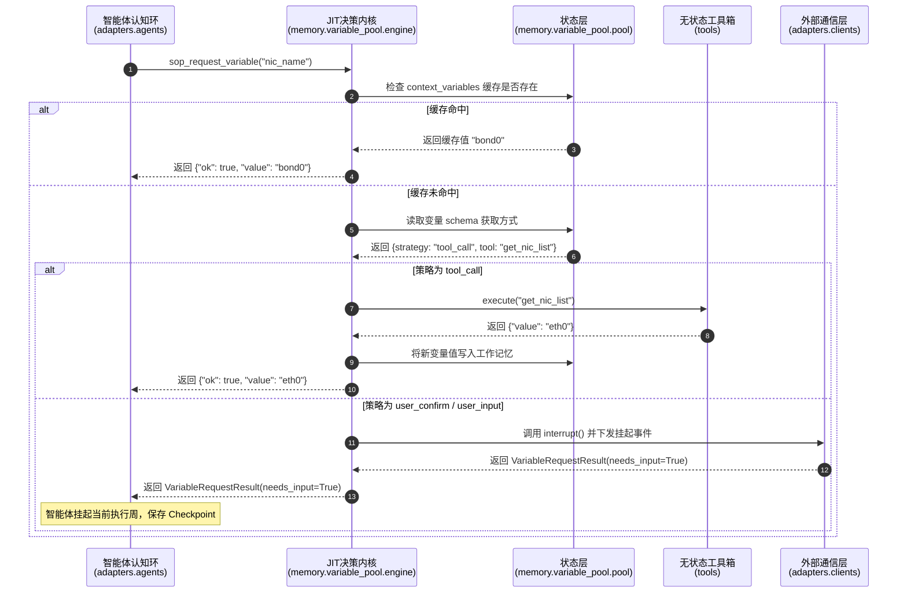

# 全局服务设计与目录结构规范

> 本文档详细规范整个 `backend/` 下各微服务的目录结构设计、职责边界、物理架构划分，并重点解构智能体模块（`agent-service`）中变量池的“控制与执行解耦的微内核设计”，注明核心设计范式与最佳实践。

---

## 一、全局目录树汇总

```
┌─────────────────────────┬──────────────────────────────────────────────────────────────────┐
│ 服务                    │ app/ 目录结构                                                     │
├─────────────────────────┼──────────────────────────────────────────────────────────────────┤
│ agent-service           │ domain/  adapters/  routes/  memory/  tools/                        │
│ api-gateway             │ models/  routes/  services/                                              │
│ case-service            │ models/  repositories/  routes/  services/                      │
│ conversation-service    │ models/  repositories/  routes/  schemas/  services/           │
│ eval-service            │ routes/  services/                                              │
│ kb-service              │ models/  repositories/  routes/  schemas/  services/  utils/   │
│ scheduler-service       │ routes/  services/                                              │
└─────────────────────────┴──────────────────────────────────────────────────────────────────┘
```

---

## 二、详细对比表

| 目录 | agent | api-gateway | case | conversation | eval | kb | scheduler |
|-----|:-----:|:-----------:|:----:|:------------:|:----:|:--:|:---------:|
| **domain/** | ✅ | ❌ | ❌ | ❌ | ❌ | ❌ | ❌ |
| **adapters/** | ✅ | ❌ | ❌ | ❌ | ❌ | ❌ | ❌ |
| **memory/** | ✅ | ❌ | ❌ | ❌ | ❌ | ❌ | ❌ |
| **tools/** | ✅ | ❌ | ❌ | ❌ | ❌ | ❌ | ❌ |
| **models/** | ❌ | ✅ | ✅ | ✅ | ❌ | ✅ | ❌ |
| **repositories/** | ❌ | ❌ | ✅ | ✅ | ❌ | ✅ | ❌ |
| **routes/** | ✅ | ✅ | ✅ | ✅ | ✅ | ✅ | ✅ |
| **schemas/** | ❌ | ❌ | ❌ | ✅ | ❌ | ✅ | ❌ |
| **services/** | ❌ | ✅ | ✅ | ✅ | ✅ | ✅ | ✅ |
| **utils/** | ❌ | ❌ | ❌ | ❌ | ❌ | ✅ | ❌ |
| **config/** | ❌ | ❌ | ❌ | ❌ | ❌ | ✅ | ❌ |
| **data/** | ❌ | ❌ | ❌ | ❌ | ❌ | ✅ | ❌ |

---

## 三、各服务职责与核心模块深度剖析

### 1. agent-service — 智能体推理与 JIT 变量引擎

`agent-service` 是整个 HCI 平台最复杂的 AI 推理核心，负责处理 ReAct 循环、事件分发以及工作记忆管理。其**当前实际的目录结构**如下：

```
app/
├── domain/                     ← 领域层（核心通信协议、事件基类，无任何外部 I/O 依赖）
├── routes/                     ← API 端点（暴露给 conversation-service 的推理接口）
├── adapters/
│   ├── agents/                 # 大脑适配器（htp / ops / pai 智能体具体的 ReAct/ACP 推理实现）
│   │   └── htp/                # HTP-Agent 内部包含 triage_agent.py, investigation_agent.py 等
│   └── clients/                # 外部服务集成客户端（scp_client.py 负责工单和中断 API，acli_client.py 负责 SSH）
│
├── memory/                     ← 【控制核：工作记忆控制面】
│   └── variable_pool/          # JIT 变量获取引擎（本次微内核重构核心）
│       ├── __init__.py         # 门面层（Facade）：提供 100% 兼容的 API 导出
│       ├── pool.py             # 存储与状态核心（State）：定义 VariableRequestResult 实体
│       └── engine.py           # 策略决策内核（Control）：执行 JIT 路由调度决策
│
└── tools/                      ← 【数据面/执行面：无状态执行体】
    ├── base_tool.py            # 工具注册基类
    ├── acli/                   # acli 主动触达命令行工具
    └── sop/                    # SOP 诊断相关无状态工具
```

> ⚠️ **架构演进抉择：方案一（逻辑外观层软解耦）的落地实践**：
> 针对如何向“理想微内核蓝图”演进，我们经第一性原理深度论证，最终选择并落地了**方案一：逻辑外观层软解耦方案（Logical Facade Decoupling）**：
> 1. **物理层保持工程高稳定性**：物理上继续保留 `tools/acli/`（ACLI 技术客户端）和 `tools/sop/`（SOP 状态流转端），避免大面积物理重命名和文件移动带来不可预测的测试/编译回归故障。
> 2. **逻辑外观层（Facade）强解耦**：我们在 [app/tools/__init__.py](file:///mnt/d/aihci/hci-troubleshoot-platform/backend/agent-service/app/tools/__init__.py) 中，强势抽象并暴露出两个纯净的逻辑命名空间类：
>    - **`SystemTools`**（系统无状态主动执行工具，对标 `tool_call` 策略）
>    - **`InteractiveTools`**（交互类/状态流转类工具，对标 `user_confirm` 与 `user_input` 策略）
> 3. **后续演进规范（人和 AI 必读 🎯）**：
>    - **任何人类开发人员或 AI Agent 在新增命令、工具或客户端交互接口时，必须优先在 `app.tools.SystemTools` 或 `app.tools.InteractiveTools` 中注册对应的逻辑门面（Facade）。**
>    - **JIT 变量池决策引擎与核心认知 Agent，在调用和访问工具时，必须强一致性地通过上述逻辑外观命名空间进行单向依赖导入，禁止跨越目录层级直接读取底包物理私有实现。**
>    - 这套软解耦范式为未来的物理硬重构（即彻底分拆为 `tools/system` 与 `tools/interactive`）铺平了平滑演进的道路，实现了完美的渐进式演化。


#### 💡 最佳实践与设计范式：变量池的“控制与执行解耦的微内核设计”

在复杂的智能体运维排障（SOP）场景下，我们遇到了大文件臃肿、循环依赖和 I/O 模块重度耦合的架构痛点。为此，我们对变量池进行了彻底的**控制面与执行面彻底解耦的微内核重构**：

1. **控制与执行分离（Control-Execution Separation）**
   * **控制面（`memory/variable_pool/engine.py`）**：作为微内核的决策中心，仅负责**无状态的路由规划**。当某个 SOP 步骤遇到变量缺失时，它只在内存（`pool.py`）里检查缓存、扫描 Schema 并决策使用哪种 `acquisition_strategy`（策略路由）。它**绝对不直接调用**底层的命令行执行或 HTTP 客户端。
   * **数据/执行面（`tools/`）**：充当纯净的无状态执行箱（Actuators）。例如，`tool_call` 策略的具体执行完全委托给 `tools/system/` 目录中的系统工具；而 `user_confirm` 的候选数据列表获取则通过 `tools/interactive/` 生成。
2. **工作记忆外化范式（MemGPT Externalized Memory）**
   * 排障状态（`context_variables`）作为**执行层状态（Layer 2 Episode State）**持久化存储在外部 PostgreSQL 中。每轮推理调用前，引擎从数据库加载内存并渲染投影至 LLM 上下文窗口。重构后的 `pool.py` 专注于内存状态的表达与断点完整性校验，实现了物理介质存储与认知层的彻底脱耦。
3. **HITL 人机协作挂起范式（Human-in-the-Loop Interrupts）**
   * 当 JIT 引擎发现变量需要交互时，通过 `adapters/interaction`（I/O 适配层）对当前执行树注入 `pending_variable_name` 并抛出 `VariableRequestResult(needs_input=True)` 标记。当前执行线程挂起并保存 Checkpoint，释放服务资源。直至用户通过 HTTP 信号（Signal）将值写回，方才唤醒并无缝续接。

#### 核心协作时序图：



---

### 2. api-gateway — 高并发流量入口与 WebSocket 会话代理
* **目录结构**：
  ```
  models/    ← 仅包含 terminal.py（WebSocket 终端会话上下文模型）
  routes/    ← 反向代理、端点映射、WebSocket 通道及监控指标端点
  services/  ← 终端代理管理、WebSocket 心跳维护与网络传输服务
  ```
* **设计原则**：该服务是典型的 **BFF（Backend for Frontend）** 流量网关。它**无数据库访问需求**，因此直接免除 `repositories/` 和复杂的 `schemas/` 目录，轻量化设计，保障高吞吐与极低延迟。

---

### 3. case-service — 工单全生命周期状态机
* **目录结构**：
  ```
  models/       ← 映射 PostgreSQL 工单实体的 SQLAlchemy 模型（数据表映射）
  repositories/ ← 数据访问层（CRUD 精细化 SQL 封装，基于 SQLAlchemy）
  routes/       ← 面向后台管理和客户端的工单 API
  services/     ← 核心业务逻辑实现，如工单流转状态机、SLA 倒计时及通知策略
  ```
* **设计原则**：工单是标准的持久化高可靠业务模块。采用**标准 DDD 三层架构**，模型层与数据库读写物理分离，核心状态变迁全部由 `services/` 进行事务性控制，规避并发脏写。

---

### 4. conversation-service — 复杂对话流、SSE 发射器与多智能体网关
* **目录结构**：
  ```
  models/       ← 会话实例、消息历史、元数据槽（metadata jsonb）映射
  repositories/ ← SQL CRUD 操作
  routes/       ← SSE 流式 API、历史消息拉取 API
  schemas/      ← Pydantic DTO，提供 API 接口契约校验
  services/     ← AI 客户端统一流封装、知识检索调度、意图识别路由
  ```
* **设计原则**：这是系统最复杂的枢纽微服务。因为其承载复杂的 SSE 流式报文包装、意图元数据插入（Scheme B 驱动卡片）等，引入了独立的 `schemas/` 规范输入输出格式。

---

### 5. eval-service — 轻量级效能指标统计服务
* **目录结构**：
  ```
  routes/    ← 报表统计及诊断效能查询 API
  services/  ← 聚合计算算法（统计分析）
  ```
* **设计原则**：属于纯计算型轻量服务，诊断指标状态从 Redis 或外部微服务间接计算。直接采用极简的两层目录，**无任何数据持久化模型层**。

---

### 6. kb-service — 知识库密集型 NLP 向量引擎
* **目录结构**：
  ```
  models/       ← 文档、切片分块、意图分类树 SQLAlchemy 模型
  repositories/ ← 数据落库操作
  routes/       ← SOP 导入、SOP 查看、分类检索 API
  schemas/      ← 决策树 JSON 契约定义
  services/     ← 相似度召回、分词向量化、分类匹配引擎
  utils/        ← jieba 分词包装器、文本分割工具
  config/       ← 静态分类基线与 Vision 提示词库
  data/         ← 初始化导入的静态 SOP 知识库源文件
  ```
* **设计原则**：作为数据处理密集型服务，它包含文本清洗、分词及离线向量处理。使用 `utils/` 强力隔离非业务的算法纯函数，并用 `data/` 进行种子数据的静态隔离。

---

### 7. scheduler-service — K8s 容器热备池极速调度器
* **目录结构**：
  ```
  routes/    ← 调度分配、心跳反馈 API
  services/  ← Kubernetes 交互封装（K8s Python Client）、并发队列、热备分配算法
  ```
* **设计原则**：高可靠基础设施调度器，容器池分配是高频内存操作，调度状态完全存储在高性能 Redis 中。**拒绝关系型数据库**，无 models / repositories，确保极佳的弹性调度效率。

---

## 四、第一性原理：代码归属与迁移历史

从原始职责和架构边界出发，我们遵循 **SRP（单一职责）** 与 **DRY（不要自我复制）** 原则对公共依赖与服务残留进行了物理彻底治理：

### 4.1 迁移基线表

| 文件/类 | 原始位置 | 正确归属 | 治理原因与状态 |
| :--- | :--- | :--- | :--- |
| **`ai_client.py`** | agent/conversation 各自副本 | **`shared/clients/`** | 跨服务通用 LLM 客户端，统一提取至共享层。 |
| **`scheduler_client.py`**| agent/conversation 各自副本 | **`shared/clients/`** | 热备池调度接口客户端，统一跨服务共享。 |
| **`kb_client.py`** | agent/conversation 各自副本 | **`shared/clients/`** | 统一的知识库检索调用客户端，服务间契约。 |
| **`confirm_service.py`** | conversation-service 残留 | **`agent-service` 独占** | 仅在智能体 ReAct 执行树中活跃，对话服务无需直接感知其存在。已彻底清理。 |
| **`knowledge_retriever`**| agent-service 残留 | **`conversation-service`** | 智能体不直接跑语义搜索，所有 RAG 调度均在对话服务流式生成中完成。已从 agent-service 彻底删除。 |

---

## 五、全局演进规范

为了保持整个平台代码仓库的高度规范和优雅性，所有开发工程师与 AI 协同助理必须无条件遵守以下核心门禁原则：

1. **不为未来设计原则（Anti-Overengineering）**
   * 绝对禁止预留没有任何实质代码的空文件夹。目录的存在必须有其明确的、即时运行的职责支撑。
2. **模块所有权隔离（Ownership Isolation）**
   * `shared/` 目录下（如模型 models 和客户端 clients）的代码修改享有最高优先级，且对依赖它的微服务保持向后兼容。任何破坏性契约变更必须遵循三步走升级规范。
3. **文档与代码双门禁合规（Docs Governance）**
   * 改动 `backend/`、`frontend/`、`deploy/`、`scripts/`、`database/`、`.github/workflows/` 时，**必须在同一 Commit/PR 中同步更新相应的 `docs/` 设计文档**，确保业务演进与架构设计高度同步，代码即文档。

---

## 六、变更历史

| 日期 | 变更摘要 | 责任人 | 状态 |
| :--- | :--- | :--- | :--- |
| 2026-05-21 | 初版：分析各服务目录差异及其设计原因 | 架构组 | 已完成 |
| 2026-05-21 | 第一性原理分析：执行残留清理与 `shared/` 模块隔离 | 架构组 | 已完成 |
| 2026-05-22 | 重构 agent-service 目录结构：实现 Direct/React 模式系统架构 | 架构组 | 已完成 |
| 2026-05-31 | 彻底重构变量池为**控制与执行解耦的微内核架构**，正式更名重组本全局目录结构设计文档 | Antigravity | 已完成 |
