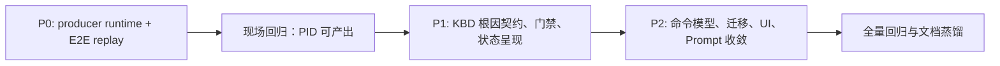

# KBD27123 产出变量执行链与 QFK 命令参数模型收敛任务

> 对应方案：[KBD27123产出变量执行链与QFK命令参数模型收敛方案](../../solution/hci-sim/events/KBD27123产出变量执行链与QFK命令参数模型收敛.md)。
> 关联工单：`Q2026080352822`、`Q2026080323483`。

## 执行原则

- 本任务以“命令执行成功、结果处理失败、下游依赖阻塞”为三个独立阶段验收，不用单一工具卡片终态掩盖中间失败。
- 不把 VM ID 填入 `lsof` 参数，不开放 shell pipe/grep，也不使用恒真 matcher 绕过 producer 执行缺陷。
- P0 完成并验证前，不将 KBD27123 整体标记为已修复；revision 23 的 120 秒超时调整仅解决第一阶段。

## P0：修复 QFK producer 执行链

- [ ] 在 `backend/agent-service/app/tools/qfk/engine.py` 定义并消费显式 `execution_mode="produce" | "match"`；producer 不得触发 `QFK_MATCHER_MISSING`。
- [ ] 在 producer 成功时返回完整的、受边缘输出限制的 `complete_outputs`，供 KBD `produces` 规则消费。
- [ ] 在 `backend/agent-service/app/adapters/agents/htp/kbd_differential.py` 传递执行模式；成功返回后调用变量池填充流程，保留失败原因和阶段审计。
- [ ] 为 `match=null + produces` 与 `match` 两种模式增加正反例单元测试：无 matcher 的 match 模式必须失败；producer 模式不得被 matcher 前置校验短路。
- [ ] 增加端到端 replay：`qfk_system lsof` 经过 `{{VM}}` 行筛选，取第 2 列第一个 PID，再执行 `qfk_system ps -p {{PID}} -o cmd=`；断言 PID 实际写入变量池、第二步被调度。
- [ ] 在测试中断言远端 exit、筛选后的 stdout、extract 结果、tool_result 状态和下游调度状态，不能只断言辅助函数返回值。

## P1：修正 KBD27123 根因契约、发布门禁与状态呈现

- [ ] 审核并发布 KBD27123 的规范化配置：`sig_002.command=lsof`、`command_args=[]`、`timeout=120`、无 `resource_keyword`、producer 取第 2 列 PID。
- [ ] 修正 `sig_003`：以 `ps -p {{PID}} -o cmd=` 查询进程；若根因仍是第三方容灾进程，占用身份必须精确匹配 `ClwDRDBClient`，不得匹配 `{{VM}}`。
- [ ] 若产品需要兼容多种占用者，为 sig_003 产出 `PROCESS_CMD` 并增加明确分类规则；将 `flock/sleep` 标为未知或不满足，而非 `ClwDRDBClient`。
- [ ] 在 KBD 保存与发布门禁中校验 producer/match 互斥、matcher 对象与根因语义一致、qfk_system 无 `command_args + resource_keyword` 混用。
- [ ] 增加已知大输出命令 timeout 门禁/告警；`lsof` 必须显式配置且 KBD27123 的值不得小于 120 秒。
- [ ] 为 Handler 编译、边缘字面量筛选、文本取值与完整 producer chain 建立最小 replay 门禁。
- [ ] 更新客户工具卡片及事件状态模型：分别显示“命令执行”“结果处理/变量提取”“下游依赖”，并为命令成功而解析失败场景增加 UI 回归测试。

## P2：收敛 qfk_system 命令与资源字段模型

- [ ] 在 `backend/shared/schemas/acquirer_args.py` 定义 qfk_system 的唯一命令结构：基命令 `command` + argv `command_args`；生成并提交对应 schema。
- [ ] 在 `backend/agent-service/app/tools/qfk/handlers.py` 停止将 qfk_system 的 `resource_keyword` 追加到最终命令；拒绝/告警歧义的双字段旧数据。
- [ ] 为旧 `command` 含参数实现受控分词和变量白名单校验，迁移为 `command + command_args`；无法安全迁移的数据进入人工复核，不作猜测性拼接。
- [ ] 设计数据库迁移：盘点 `kbd_entry.signals_json` 中 qfk_system 的 `resource_keyword`、`keyword`、含参 `command` 和双字段数据；迁移记录须可审计、可回滚。
- [ ] 在 `frontend/admin/src/views/KbdReviewView.vue` 移除 qfk_system 重复的“命令参数”，对审核者仅保留一个“命令（不含 acli system）”入口，并展示最终编译预览。
- [ ] 更新 `database/seeds/02_system_prompts.sql`、相应 Atlas migration/seed 与抽取 Prompt，删除把 `{{VM}}` 生成到 `resource_keyword` 的旧示例。
- [ ] 统一其它工具的资源字段：qfk_service 使用 `service_name`，qfk_log 使用 `topic`/日志源；通用 QFK 中未被 Handler 消费的字段从契约中删除或补齐实现。
- [ ] 增加 Schema、Prompt、Admin UI、Handler 编译结果的一致性测试，防止字段“可保存但不可执行”或“可生成但不可审核”。

## 文件级实施范围

| 域 | 主要文件或位置 | 工作内容 |
|---|---|---|
| QFK 引擎 | `backend/agent-service/app/tools/qfk/engine.py` | producer/match 显式模式、完整输出返回、错误分层 |
| KBD 编排 | `backend/agent-service/app/adapters/agents/htp/kbd_differential.py` | 传递模式、变量池填充、阶段化 tool_result |
| QFK Handler | `backend/agent-service/app/tools/qfk/handlers.py` | 规范化 argv 编译、移除 qfk_system 旧参数追加 |
| 共享契约 | `backend/shared/schemas/acquirer_args.py`、生成 schema | 字段收敛、发布校验契约 |
| 数据与迁移 | `database/data-migrations/`、Atlas migration、KBD revision 数据 | 历史字段审计、可回滚迁移、KBD27123 修订 |
| 管理端 | `frontend/admin/src/views/KbdReviewView.vue` | 单一输入入口、编译预览、保存校验 |
| 客户端 | 工具卡片组件与状态 store（实施时精确定位） | 执行/解析/依赖三个状态的可解释展示 |
| Prompt | `database/seeds/02_system_prompts.sql` 及同源副本 | 删除旧 resource_keyword 示例，输出唯一模型 |
| 测试 | Agent、共享 Schema、Admin UI、客户端测试目录 | 单元、集成、端到端 replay 和 UI 回归 |
| 文档 | `docs/solution/`、`docs/task/`、`docs/verify/`、`docs/README.md` | 代码合并时同步现行全量文档与 README 第一屏 |

## 实施顺序与依赖

P2 的界面收敛不能代替 P0：即使参数模型完全正确，producer 被 Matcher 前置校验短路时 PID 仍然无法产生。P1 的 KBD 数据修正也不能代替 P0；它只确保链路打通后不会给出错误根因。

## 验收与回滚

### 验收记录

- [ ] 以全新会话回归 `Q2026080352822` 的同类场景：`lsof` 在 120 秒内完成，工具展示命令执行成功。
- [ ] 以全新会话回归 `Q2026080323483` 的同类场景：PID 进入变量池，`ps` 不再因 `pid` 缺失阻塞。
- [ ] 用 `flock/sleep` 证据验证不会误判为 `ClwDRDBClient`；用真实/模拟 `ClwDRDBClient` 命令验证能够命中。
- [ ] 验证新建、编辑、导入和历史 revision 的 qfk_system 均只能形成唯一、可预览的 argv。
- [ ] 验证旧数据迁移失败时显示人工复核原因，不静默改变或追加命令。
- [ ] 完成单元、集成、E2E replay、Admin UI 和客户工具卡片回归；记录命令、测试输出、revision 和新现场 exec_id。
- [ ] PR 合并时更新受影响的现行全量设计/任务/测试文档，并按文档管理规范更新 `docs/README.md` 第一屏。

### 回滚边界

- P0 代码按服务镜像版本回滚；回滚不应删除既有的原始 tool_result 证据。
- KBD revision 使用新 revision 发布；发现数据语义问题时回退到上一已审核 revision，不直接覆写历史 revision。
- P2 的数据迁移必须保留迁移前快照和记录；无法确定的 `resource_keyword` 不迁移为命令参数。
- UI 在滚动升级期间应能读取历史 `command` 数据，但禁止把历史 `resource_keyword` 静默显示或拼接成新的 argv。
