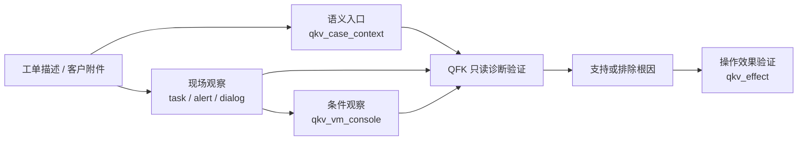
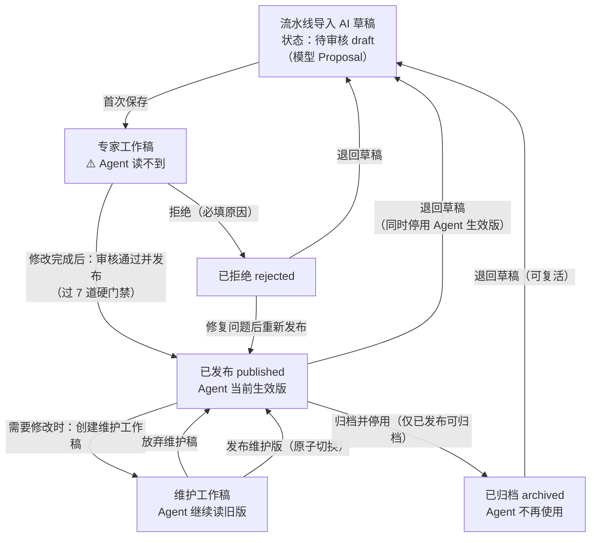
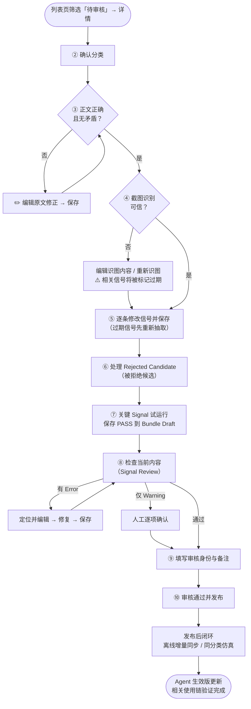
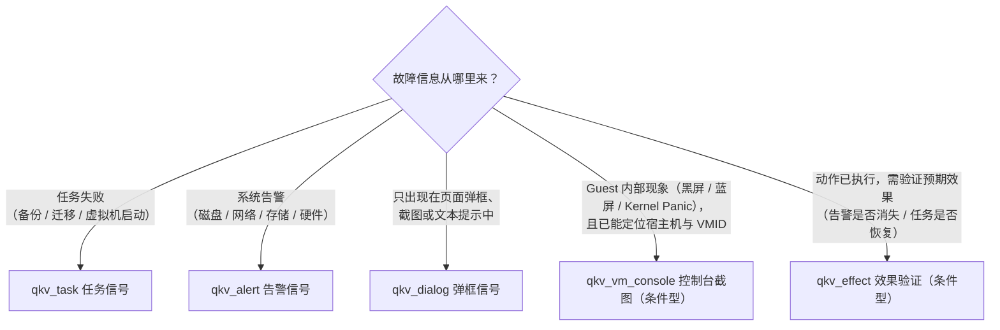
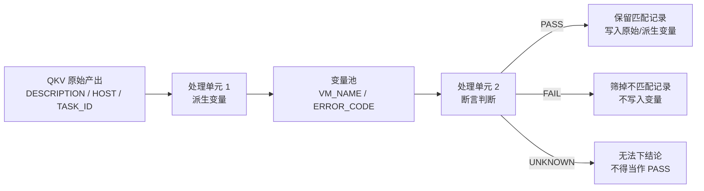
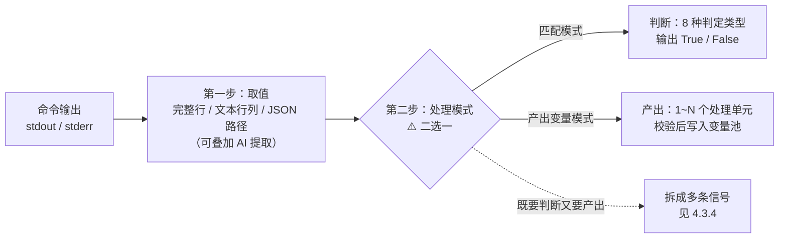
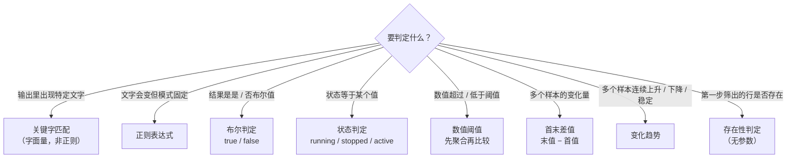

# KBD 审核与信号配置使用手册

> 适用对象：KBD（知识库文档）审核人员、领域专家、平台管理员
> 适用范围：从流水线导入、人工审核、发布、仿真验证，到后续维护、停用的完整 KBD（知识库文档）生产生命周期
> 目标：把流水线生成的 AI 草稿（模型提案）稳定地收敛为可审核、可仿真、可追溯，并供 Agent（智能诊断助手）生产使用的 KBD
> 文档定位：现行操作手册。生产实现与目标治理讨论分别进入知识库设计和任务文档，不在这里重复维护。
> 当前基线：包含尚未提交、未部署的无信号推荐工作区实现；现场可用性以实际发布版本为准。

**阅读方式：**

- 第一次操作：直接照 [第二章「快速操作」](#二快速操作一篇待审核-kbd-的完整路径) 一步步点；
- 某个区域不知道怎么改：查 [第三章「详情页九个区域」](#三详情页九个区域从上到下) 和 [第四章「信号编辑实操」](#四信号编辑实操)；
- 取值方式和判定类型不知道参数怎么填：查 [4.3 节](#43-结果处理取值与判断参数怎么填) 和附录 B 完整样例；
- 遇到报错或按钮点不动：查 [第六章「常见报错与阻断处理」](#六常见报错与阻断处理)；
- 想了解流水线产物离“可发布、可仿真”还差什么：查 [第十章「生产生命周期维护与流水线准入」](#十生产生命周期维护与流水线准入)；
- 需要判断标准（关键字怎么写、证据作用怎么选）：查 [附录 A](#附录-a信号字段判断口径)；
- 信号行为异常但没报错（不命中、取到错节点数据）：先对照 [A.7「容易配错的参数速查」](#a7-容易配错的参数速查) 逐项排查。

**按角色阅读：**

| 你是谁 | 先读什么 | 不必在首次审核时处理什么 |
|---|---|---|
| 审核人员 / 领域专家 | 第二章、第三章、第四章、第六章、第九章、附录 A/B | P0/P1/P2 看板、Prompt 发布和离线资源实现细节 |
| 离线诊断管理员 | 第三章 3.2、第二章第 10 步、10.6、10.7 | 对原始 KBD 事实作越权修改 |
| 平台 / 流水线管理员 | 第七章、第八章、第十章；抽取实现另查信号生产文档 | 用批量任务替代逐篇专家语义审核 |

**现状与目标态先区分：**

| 能力 | 当前可执行操作 | 当前不应假设已经自动完成 |
|---|---|---|
| 发布审核 | 工作稿、统一静态审查、专家发布、维护工作稿、停用修订 | 静态审查通过后自动发布，或代表真实环境执行成功 |
| 单 Signal 验证与仿真 | 试运行、保存 PASS 到 Bundle Draft、同分类 Bundle 回归 | 每条 KBD 自动具备可信正反 Fixture，或已自动成为 Bundle Active |
| 离线诊断 | 已发布 KBD 后执行增量同步并人工批准同步批次 | KBD 一发布就已经有 Collector（采集器）/Collection Profile（采集画像）可用 |
| 流水线治理 | 抓取、导入、分类、识图、候选 Signal 生成和静态审查 | `publish_candidate` / `simulation_ready` 标签、覆盖率报告和重测队列已完全产品化 |

**全文贯穿样例（自动诊断案例）：**

> **样例场景**：某客户虚拟机备份任务失败，任务详情弹框显示「连接存储失败」。根因是存储池容量使用率达到 94%，写入被拒绝。
> 全文用这个案例演示每一步的实际操作和参数填写，样例的最终完整配置见 **附录 B**。

> **边界先说明**：当前流水线会自动完成抓取、导入、分类、识图、Signal（信号）抽取和静态审查，并把 KBD 留在待审核阶段；它**不会自动发布**，也不会凭 LLM（大语言模型）生成的文本伪造现场证据或仿真 Fixture（固定样例）。这是刻意保留的安全边界，不是流程遗漏。

---

## 变更历史

| 日期 | 变更 |
|---|---|
| 2026-09-23 | 归位用户手册；统一仅案例推荐与自动诊断门禁；生产实现集中到知识库设计。 |

## 一、先理解三件事

### 1.0 先确认案例用途

- **只做相关案例推荐**：核对标题、分类和正文；可以不配任何信号，也不需要语义画像。发布后按标题和问题描述检索，展示历史原因与建议，不自动确诊或生成采集资源。
- **需要自动诊断**：另外完成信号、依赖和证据作用审核，按下文试运行及分类仿真检查。
- **已有语义画像**：可保留增强检索或人工指引；画像与上下文信号仍须成对。有非法信号、孤儿画像、过期元数据或拒绝候选时先处理，不能静默当作正常空信号发布。

下文信号编辑、试运行和仿真步骤仅适用于配置了自动验证能力的案例。


### 1.1 审核在审什么

KBD 审核先确认内容能否作为可靠参考；选择自动诊断能力时，还须确认信号能支持完整排查：



一句话：**语义入口只找方向，现场观察提供事实，QFK 验证诊断假设，效果验证确认操作结果。** 不要再把所有 `qkv_*` 当成同一种“生产者”。

对照样例：工单里备份任务失败，任务详情产出 `HOST`、`TASK_ID`；Agent 在该主机查存储池容量和备份日志；容量 94% 和 `connection refused` 共同支持「存储池容量满」根因。若任务、告警、弹框均无命中，才使用客户描述的语义入口召回少量待验证 KBD；清理快照或扩容操作完成后，再用效果验证确认备份是否达到预期，而不是只确认命令返回成功。

### 1.1.1 按职责审核信号，而不是按 QKV/QFK 名称分组

| 信号职责 | 典型工具 | 何时配置 | 审核重点 | 可以形成的结论 |
|---|---|---|---|---|
| 语义入口 | `qkv_case_context` + `semantic_entry_profile` | 没有强现场入口，或任务、告警、弹框已完整执行但未命中 | 症状和锚点逐字来自问题描述；不引用根因或解决方案；有明确补证据指引 | 仅候选召回或人工指引，不能确诊、不能产出变量 |
| 直接现场观察 | `qkv_task`、`qkv_alert`、`qkv_dialog` | 任务、告警、弹框可建立诊断上下文 | 关键字、JSON 路径、完整变量记录和来源时间 | 可生产 HOST、VM_ID、END 等变量 |
| 条件现场观察 | `qkv_vm_console` | 需要确认 Guest 内部黑屏、蓝屏、Kernel Panic、启动卡住等现象 | HOST/VM_ID 来源可信；固定截图操作、制品和视觉观察都可审计 | 画面状态和截图证据，不以客户口述替代 |
| 诊断验证 | `qfk_*` | 已有目标或可执行只读检查 | 命令只读、变量依赖完整、取值和 Matcher 正确 | 支持或排除根因 |
| 操作效果验证 | `qkv_effect` | 某个操作已完成，需要确认其预期效果；或在诊断阶段确认症状 | 观察通道、Matcher、等待窗口、复查次数；不作为唯一诊断入口 | `achieved`、`not_achieved`、`inconclusive` |

客户提供的文字、截图和日志可以作为语义入口的补充材料，也可以提示人工复核；没有受控采集来源、采集时间和目标对象关联时，不能自动等价为控制台观察或效果已经达成。

### 1.2 三个 KBD 版本，别搞混

详情页「版本、生效与发布前检查」区域显示三个版本：

| 版本 | 含义 |
|---|---|
| 模型 Proposal | 流水线/AI 生成的草稿，是审核基线 |
| 专家工作稿 | 你每次点「保存」产生的版本。**保存 ≠ 发布，Agent 还读不到** |
| Agent 当前生效 | Agent 生产环境真正读取的版本。只有「发布」类按钮才会切换它 |

记住两条规则：

1. **「保存」永远只存工作稿**，不会让 Agent 用上你的修改；
2. **已发布的 KBD 不能直接改**，必须先点「创建维护工作稿」，改完点「发布维护版」才会生效（见第五章）。

页面上还会看到以下对象，它们**不是第四种 KBD 版本**：

| 对象 | 浅显理解 | 何时关注 |
|---|---|---|
| Package Snapshot（包快照） | 后端把当前 KBD、Signal（信号）、验证规则、工具/提示词/策略依赖绑成不可变包版本 | KBD 发布、包治理与构建 Bundle（仿真包）时；当前审核页不会在单 Signal 试运行中直接让你选择或保存它 |
| Verification Asset（验证资产） | 一次试运行的不可变输入、结果和依赖摘要 | 证明某条 Signal 在指定输入下确实 PASS（通过）时；当前审核页通过 Bundle Draft（仿真包草稿）保存该类证据，不提供单独的「资产库」操作 |
| Bundle Build（仿真包构建） | 将同一问题场景的候选 KBD 和验证资产组装成可执行仿真包 | 做同分类全候选路由仿真时 |
| Agent Active / Bundle Active（Agent 生效版 / 仿真包生效版） | 两条独立的生效链：KBD 发布不会自动让新 Bundle 生效 | 发布 KBD 后进行仿真或切换 Bundle 时 |



对应关系说明：

- **工作稿可以反复编辑保存**：在「专家工作稿」或「维护工作稿」里，编辑 → 保存可以重复任意次，每次保存都停留在工作稿阶段（状态不变、Agent 读不到），直到你选择图上画出的出口——发布、拒绝或放弃；
- **保存 / 重新抽取 / 重新分类 / 重新识图**只改变内容（形成新的工作稿或 Proposal 基线），**不改变状态**，所以不出现在状态图里；
- 「退回草稿」对三种状态都可用（已发布 / 已拒绝 / 已归档），其中已发布退回时会追加停用修订，Agent 立即不再使用该 KBD；
- 「重新发布」允许从已拒绝或待审核状态发起，门禁与首次发布相同；
- 「归档」只能从已发布发起；归档后想重新启用，先「退回草稿」再走完整审核发布流程。

### 1.3 发布时会卡你的 7 道硬门禁

其他提示都是建议。真正会导致「审核通过并发布」失败的检查（详见第七章）：

1. 正文（content_md）非空；
2. 无信号案例可发布为“仅案例推荐”，按标题和问题描述检索；有信号案例仍须通过完整诊断契约；
3. 信号通过统一发布审查（无 error 级问题）；
4. 信号满足发布结构契约和专家确认要求；
5. 可执行诊断至少有 1 条消费者（QFK）信号；维护语义画像时仍要求与 `qkv_case_context` 成对声明。`guidance_only` 和无信号的 `reference_only` 不要求消费者或必要证据，但不得进入自动执行；无信号案例不必补建画像；
6. 最终分类不为空；
7. 没有并发修改（版本锁一致）。

> 生产者信号的计数口径（含条件型生产者 `qkv_vm_console`、`qkv_effect` 的特殊门禁）见第七章「补充事实」。
>
> **硬门禁通过只代表「允许发布」，不代表「现场执行一定成功」、「仿真一定通过」或「离线采集已就绪」。** 这三件事分别由单 Signal 试运行、同分类全候选仿真、离线 KBD 同步验证。

---

## 二、快速操作：一篇待审核 KBD 的完整路径

按顺序执行，每一步都写清了「在哪里、点什么、做到什么程度」。样例场景在每步的实际做法用「▶ 样例」标出。

整体流程（注意两个回环：检查不通过要回到对应步骤修复后重新检查）：



### 第 1 步：进入待审核列表

1. 打开管理端「KBD知识条目管理」页面；
2. 状态筛选选择 **待审核**，点「搜索」；
3. 可按案例 ID、标题关键字、分类、置信度（低 <0.5 的优先处理）进一步筛选；
4. 优先处理：未分类或分类置信度低、没有消费者信号、信号数量异常、图片识别未完成的 KBD；
5. 在目标行点 **「详情」**。

> 不建议只看列表直接发布。先检查正文和分类；配置了自动诊断的案例，再检查两类信号和最终命令预览。

▶ 样例：标题搜索「备份失败」，找到「虚拟机备份失败：存储池容量超限」条目，点「详情」。

### 第 2 步：确认分类（基本信息区）

1. 看「AI 建议分类」和「AI 分类理由」；
2. 置信度低于 0.5 会有「需人工重新分类」标签，可点「重新分类」让 AI 重跑；
3. 在 **「确认分类（可修改）」** 下拉框里选定最终分类。

> ⚠️ 分类为空无法发布。最终分类同时是在线诊断和离线诊断共用的问题场景编码，必须人工确认准确，不能靠标题关键词猜测。

▶ 样例：AI 建议分类「虚拟机备份失败」，置信度 0.91，理由与正文一致 → 在「确认分类」下拉框选定「虚拟机备份失败」。

### 第 3 步：核对并修改正文（内容预览区）

1. 通读渲染后的正文：标题、问题描述、根因、解决方案是否一致、无矛盾；根因应是明确的技术原因，不是重复描述现象；正文中的命令、节点、服务、文件名称应真实存在；
2. 需要修改时点 **「✏️ 编辑原文」**，改完点 **「保存」**（出现「内容已保存」即成功）；
3. 自检标准：**如果把所有信号藏起来，这篇文章本身是否仍然是一篇正确、完整的排障案例？** 不是就先改正文。

▶ 样例：AI 草稿把根因写成「备份服务异常」（重复现象），改为「存储池容量使用率超过上限，写入被拒绝」；解决方案补充「清理过期快照或扩容存储池」，保存。

### 第 4 步：核对截图（内容预览区 + 图片列表区）

1. 每张截图卡片展开后核对三块内容：
   - **可见内容**：与原图逐项核对关键报错、对象名、数值；
   - **Observed Facts（观察事实）**：必须能在原图中找到对应内容，可作为信号证据；
   - **语义描述 / Inferences（模型推测）**：带「模型推断·待确认」标签的内容未经确认不能当作事实或运行参数。
2. 识别结果有误：点 **「编辑识图内容」** 人工修正，改完点 **「确认并保存修订」**；
3. 图片模糊或识别不全：点 **「重新识图」**（单张）。

> ⚠️ 重新识图或保存截图修订后，相关信号会被标记为**过期（Stale）**，必须重新抽取或人工复核信号（见第 5 步的红条提示）。

▶ 样例：任务详情弹框截图的可见内容应为「连接存储失败」和节点 IP `10.20.1.15`；截图里存储池容量 94% 记入 Observed Facts。

### 第 5 步：逐条修改关键信号（关键信号区）

仅案例推荐可以跳过信号配置及单 Signal 试运行，直接核对正文并做发布前检查；待复核的拒绝候选仍按第 6 步处理。

这是审核工作量最大的部分，字段口径详见第四章。最短路径：

1. 如果关键信号区顶部出现**红色过期警告**（正文/截图/工具契约已变化），先点 **「重新抽取」**，再逐条复核；
2. 按本章 1.1.1 的职责表逐条检查：语义入口、直接现场观察、条件现场观察、QFK 诊断验证和操作效果验证；点 **「编辑」** 修改，每条改完点卡片上的 **「保存」**；
3. 出现黄色暂存提示条（「已暂存 N 条信号的修改」）时，确认全部保存或点「放弃全部暂存修改」；
4. 没有信号或信号质量太差：点 **「重新抽取」** 让 AI 重新生成，再人工复核；
5. 直接现场观察的 `produces` 必须由**同一条完整记录**覆盖；例如声明了 `HOST`、`VM_ID`、`END`，就不能只从不同记录分别取到其中一项后宣称下游可执行；
6. `qkv_case_context` 只审核语义画像，不允许配置命令、Matcher 或 HOST/VM_ID 等变量产出；客户附件只能作为待核实材料；
7. `qkv_vm_console` 要核对 HOST/VM_ID 上游来源、固定截图动作和制品审计；不要用客户上传截图替代受控现场采集；
8. `qkv_effect` 要核对“操作是什么、预期效果是什么”、观察通道、封闭 Matcher、等待窗口和复查次数；`inconclusive` 是合法结果，不能人为改成已恢复；
9. 检查每条 QFK 卡片上的「完整命令」预览：点 **「编译当前草稿的 HCI 执行命令」**，确认命令只读、目标主机正确（见第四章 4.4）。

▶ 样例：本例最终配置 1 条生产者信号（`qkv_task`）+ 2 条消费者信号（容量阈值判定、日志错误检查），完整参数见附录 B。

### 第 6 步：处理被拒绝候选（关键信号区）

1. 如果页面出现 **Rejected Candidate（被拒绝候选）**，逐条看拒绝码、原始候选和理由；
2. `write_signal` 类写操作不得恢复成诊断采集信号；
3. `not_exists` 先去 Tool Registry（工具注册表）确认是否真的没有可用只读工具，不要凭正文命令强行恢复；
4. `run_failed` 先修复主机、容器、变量、参数或工具选择，再点 **「恢复并编辑」**；
5. 恢复后的信号不会自动成为可发布信号，必须重新编辑、保存、试运行并重跑「检查当前内容」。

> 被拒绝候选是审计线索，不是「必须全部恢复」的待办。保留正确的拒绝结果，比为了清空数量而引入不安全信号更重要。

### 第 7 步：对关键 Signal 做单条试运行（关键信号区）

1. 先确认试运行对象：`qkv_case_context` 使用「路由试运行」验证症状能否召回候选；直接现场观察和 QFK 使用「试运行」验证整条处理链；控制台观察用已批准的截图 Fixture 或受控采集结果；效果验证在操作完成后用实际观察结果验证预期，或在 `symptom_confirm` 模式下验证症状；
2. 输入来源可选粘贴现场输出，或选择 Fixture（固定样例）。Fixture 读取已发布 Bundle 中的试运行数据；「现场回放」入口当前尚未开放，不能作为审核手段；
3. 运行后核对状态、输出、Evidence Lines（证据行）、AI 原始响应和 Trace ID（链路标识）；
4. `FAIL` 表示确定性结果不符合预期，`UNKNOWN` 表示执行/取值/依赖不足；两者都要先修复，不能当成 PASS；
5. 只有“整条 Signal”的 `PASS` 可点 **「保存到 Bundle 草稿」**。语义入口的路由命中、AI 单步试运行和客户声明都不能作为 Bundle 的现场验证资产；系统优先复用同一 KBD 修订的 Bundle Draft（仿真包草稿）；没有时以已发布 Bundle 为基线创建新的 Bundle Draft，并把本次输出和验证证据写入该草稿；这不会改写 KBD 的 Signal 配置；
6. 选择 Fixture 后，已发布 Bundle 的数据只读；需要调整输入或路由时，先点 **「创建新 Bundle 草稿」** 派生草稿，再运行和保存；
7. Package Snapshot / Verification Asset 是后端包治理对象。当前审核页没有「保存到草稿测试集」或手工绑定 Package Snapshot 的操作；KBD、Signal 或工具依赖变更后，应基于当前工作稿重新试运行并保存新的 Bundle Draft 证据。

**建议最低试运行范围**：所有 Must（必要证据）、Exclude（排除证据）、含 AI 提取的 Signal、含 QKV 派生/断言处理单元的 Signal，以及本次修改过的 Signal。试运行目前是质量证据，**不在第七章的发布硬门禁中**。

### 第 8 步：运行发布前检查（版本、生效与发布前检查区）

1. 点 **「检查当前内容」**（即 Signal Review 信号审查）；
2. 结果为「发布前统一信号审查已通过」→ 进入第 9 步；
3. 结果为「有 N 项需要专家处理」→ 逐条看 issue：
   - **Error（错误）必须修复**，点 issue 旁的 **「定位并编辑」** 跳到对应信号修改；
   - **Warning（警告）需要人工确认**，不能直接忽略；
4. 修改后**先保存**，再重新点「检查当前内容」，直到通过。

> 注意：「检查当前内容」只是预检，发布时后端会**重跑**一次审查。预检通过后又改过内容，要重新检查。

### 第 9 步：填写审核身份和备注（审核备注区）

1. 点「填写/更换」输入你的**审核人 ID（正整数）**。首次发布时系统也会自动弹窗要求填写；不填无法发布；
2. 在审核备注里写清：改了什么正文/分类/信号、命令是否只读、遗留待办（如离线同步）。备注非必填，但强烈建议填写。

> 当前手工填写的正整数只满足后端必填格式，在 Admin SSO（管理端单点登录）与人员目录完成强绑定前，**不等同于系统已验证的专家身份**。审核人应填自己的真实 ID，不得共用或随意编号。

▶ 样例备注：

```text
已确认案例分类为虚拟机备份失败；修正根因描述为存储池容量超限；
qkv_task 关键字改为「虚拟机备份失败」并产出 HOST、TASK_ID、END、REQUEST_ID；
新增容量阈值判定（Use% > 90）与 vtpdaemon.log 错误检查（connection refused）；
命令预览均为只读；关键 Signal 已试运行 PASS；Signal Review 已通过。
发布后需执行离线诊断 KBD 增量同步。
```

### 第 10 步：发布并完成使用链闭环

1. 点详情页底部 **「审核通过并发布」**；
2. 确认框中核对离线采集影响提示，点 **「确认发布」**；
3. 出现「审核通过，KBD 条目已发布」即成功；
4. 发布后确认：状态变为「已发布」、「Agent 当前生效」版本号已更新、原 AI Proposal 和历史工作稿仍可追溯、已发布内容与工作稿一致；
5. 所有已发布 KBD 默认都是在线与离线诊断的候选知识。进入「离线诊断管理 → KBD 同步与版本」执行**增量检测**，审查新增/变更/停用资源后批准并发布同步批次；同步完成前，不应对外宣称该 KBD 已离线就绪；
6. 如果该分类要进入生产仿真基线，在 Bundle 工厂将同分类全部已发布候选组装为 Bundle，走 `draft → validated → approved → published`，再单独切换 Bundle Active。仿真时真实路由和仿真路由必须使用**相同的同分类候选集**；目标 KBD 应为 `SUPPORTED`，至少 2 个相似候选应为 `REJECTED`，`fixture_not_found` 或 `ERROR` 必须失败关闭，不得降级为通过。

> 同分类全候选仿真是上线质量验证，当前不是 KBD 发布 API 的硬门禁；是否必做按项目的发布准入策略执行。

---

## 三、详情页九个区域（从上到下）

| # | 区域 | 作用 | 关键操作 |
|---|---|---|---|
| 1 | 已发布提示条 | 已发布 KBD 才显示，提示修改走维护工作稿 | — |
| 2 | 基本信息 | 标题、状态、AI 分类、最终分类 | 「确认分类」下拉、「重新分类」 |
| 3 | 版本、生效与发布前检查 | 三个版本对比 + 发布前审查入口 | 「检查当前内容」「创建维护工作稿」 |
| 4 | 来源元数据 | 案例来源、模块、版本、时间、工程师 | 只读，仅核对 |
| 5 | 关键信号（QKV/QFK） | 信号列表、Rejected Candidate（被拒绝候选）、验证规则与试运行 | 「新增信号」「导入信号」「重新抽取」「恢复并编辑」，每条信号的「编辑/保存/试运行/复制 JSON/删除」 |
| 6 | 内容预览 | 正文 Markdown + 截图卡片 | 「✏️ 编辑原文」、单张「重新识图」 |
| 7 | 图片列表 | 每张截图的完整识图结果 | 「编辑识图内容」「重新识图」「确认并保存修订」 |
| 8 | Offline Collection Impact（离线采集影响） | 离线采集依赖完整性 | 只读，记录缺失项 |
| 9 | 审核备注 | 审核身份 + 备注 | 「填写/更换」身份、备注文本框 |

> **“检查当前内容”不是现场验证。** 它给出的是当前工作稿的结构、参数、工具能力和专家确认审查结果；接口虽会返回运行时能力相关标识，但审核页不以它替代一次真实试运行。要证明 Signal 在特定输入下能执行，仍须完成第二章第 7 步的试运行；要证明多个相似 KBD 能正确分流，仍须完成同分类 Bundle 回归。

### 3.1 来源元数据怎么核对

- 来源案例 ID、产品模块、版本应与正文一致；
- 原始更新时间明显早于适用产品版本时，确认内容是否已过期；
- 元数据只用于追溯，不能代替正文或信号证据；
- 元数据异常但正文仍可确认时，在审核备注中说明；无法确认来源真实性时拒绝发布。

### 3.2 Offline Collection Impact（离线采集影响）怎么读

离线采集影响回答的是：这篇 KBD 要求的消费者证据，在没有 SSH 在线诊断时能否被离线采集器采集。关联链路为：

```text
KBD 消费者信号 → 信号映射 → 安全采集器 → 采集画像 → 采集计划 → 采集器制品
```

| 页面字段 | 看什么 |
|---|---|
| 采集需求 | 与消费者信号数量和意图核对 |
| 有效映射 | 应尽量覆盖全部采集需求 |
| 影响画像 | 发布后记录需要增量同步的画像 |
| 历史计划/制品 | 旧制品保持可追溯，新工单在同步后重新生成 |
| 缺失映射 | 记录 Signal ID、采集工具、命令/关键字，交给离线诊断管理员补齐 |
| 生命周期联动规则 | 按提示执行增量同步、停用或重新生成 |

| 页面结果 | 影响 | 你要做什么 |
|---|---|---|
| 离线采集依赖完整 | **不阻止发布** | 发布后执行离线诊断 KBD 增量同步 |
| 有缺失映射 | **仍不阻止发布** | 在备注记录缺失项，发布后补齐映射再同步 |
| 信息读取失败 | 不阻止发布 | 备注记录，恢复后重新检查 |

> 「离线就绪」和「KBD 可发布」是两个独立结论，不要把离线映射缺失当成 KBD 发布失败。
>
> `qkv_vm_console` 例外说明：它不走通用只读命令采集器，而是离线资源同步生成的
> 专用 `vm_console_capture` 采集项（受控交互风险级别、固定截图操作、近黑唤醒须
> 客户现场 TTY 确认）。缺失映射表中看到该信号时，同样记录后交给离线诊断管理员，
> 不要试图用普通 command 采集器手工仿制截图命令。
>
> `qkv_effect` 例外说明：效果验证在离线侧**不生成采集需求**（不产出
> command_template），而是编译为专用期望声明项（effect_expectation），离线验包后
> 对证据包内已存在的观测快照做追溯判定（有快照则回放判定，无快照则记
> inconclusive）。缺失映射表中看不到它属正常，不要试图用普通 command 采集器
> 为它补齐「命令」。

### 3.3 语义入口画像只读预览怎么核对

在关键信号区（区域 5）选中语义入口画像后，详情页会以**只读**方式完整呈现画像的全部配置项；分类管理页「案例详情」弹窗使用同一套展示口径，便于按分类横向核对。审核时逐项对照「我配了什么」与「详情里显示了什么」：

| 预览区块 | 核对要点 |
|---|---|
| 入口信号与诊断能力 | 入口信号应为 `qkv_case_context`；`guidance_only` 不应被期待存在消费者信号 |
| 标准症状 / 正向锚点 / 排除锚点 | 与正文原句一致；排除锚点须有依据，可留空 |
| 适用范围 | 产品与产品版本应与正文适用条件一致 |
| 后续消费者采集 | 列出消费者命令模板及其引用的 `{{变量}}`；变量必须由用户填写或来自已授权对象范围。`guidance_only` 画像不渲染该区块，看到它为空不是画像缺失 |
| 人工补充证据字段 | 客户可见字段、是否必填、填写方式、输入提示应与请客户补充的证据一致 |
| 语义澄清与追问 | 澄清选项的 effect 与追问是否覆盖真实歧义 |
| 路由正反例 | 最近一次试运行的逐字原文关联与测试期望 |
| 原文关联证据 | 画像字段、原文章节、引用原文三者对应；原文章节改动后引用会失效，发布前须重新核对 |
| 高置信语义推荐 | `semantic_recommendation` 的开关、最低分与最低余量 |

> 预览只读，编辑统一在 KBD 条目管理页的「语义入口画像」弹窗完成。详情页不做就地修改，避免审核口径与编辑口径不一致。

---

## 四、信号编辑实操

### 4.1 生产者信号（QKV）：回答「Agent 从工单里能拿到什么」

点「新增信号」可选择五种类型（3 种直接生产者 + 2 种条件型生产者），按故障信息的来源选择：



| 类型 | 什么时候选 |
|---|---|
| `qkv_task` 任务信号 | 故障来自任务失败（备份、迁移、虚拟机启动失败等） |
| `qkv_alert` 告警信号 | 故障来自系统告警（磁盘、网络、存储、硬件告警等） |
| `qkv_dialog` 弹框信号 | 故障信息只出现在页面弹框、截图或文本提示中 |
| `qkv_vm_console` 控制台截图 | Guest OS 内部现象（黑屏、蓝屏、Kernel Panic、启动卡住等）没有对应告警/任务/弹框；**条件型**：必须声明可信 `HOST`/`VM_ID` 来源（外部变量或上游生产者），否则发布门禁阻断 |
| `qkv_effect` 效果验证 | 任意操作完成后，验证「预期效果」是否达成（告警清除、任务恢复、弹框消失、画面恢复或新配置生效等）；也可在 `symptom_confirm` 模式确认症状。**条件型**：期望锚点变量必须有可信来源，且**不得作为 KBD 唯一生产者**。配置口径见 4.1.1 |

编辑表单字段与审核要点：

| 字段 | 审核要点 |
|---|---|
| 说明 | 人类可读标题，不是匹配条件 |
| 证据作用 | 必要证据 / 增强证据 / 排除证据 / 上下文证据，选择口径见附录 A.1 |
| 采集类型 | 与故障入口一致（上表）；类型与关键字明显不匹配时页面会出黄条警告 |
| 关键字 | 必须是现场数据中**真实存在、可检索**的文字，见附录 A.2（仅任务/告警/弹框三类；控制台截图、效果验证信号没有关键字字段——效果验证的期望锚点见 4.1.1） |
| 宿主机 / 虚拟机 ID | 仅 `qkv_vm_console`。只允许 `{{HOST}}`/`{{VM_ID}}` 占位符或 Inventory 规范化字面量；页面同时展示「目标变量来源」，出现"未声明来源"红标时发布必被阻断 |
| 目标变量来源 | 仅 `qkv_vm_console` 的审核面板：HOST/VM_ID 必须来自上游生产者产出，或来自已由受控集成预置的验证规则外部变量；二者皆无时不得发布 |
| 搜索目录 / 上下文行 | 仅弹框信号；用平台允许的固定目录，上下文行保持最小（0–10） |
| 仅失败任务开关 | 仅任务信号。**对应"任务失败"场景时必须显式开启**：该开关默认关闭，关着会拉回全部任务（含成功的），关键字一旦命中成功任务，产出的主机/对象就是错的，整条证据链在错误目标上执行 |
| 产出变量 | 原始变量的标准名称、可选 Alias（KBD 本地别名）和字段路径；后续排障需要的信息（NODE_IP、VM_ID、TASK_ID 等）必须在这里产出，口径见附录 A.3 |
| 产出变量处理 | 可选的 `output_processing`（产出后处理）：用原始变量派生新变量，或对已取值做断言筛选；只允许 QKV 生产者信号使用，详见 4.1.2 |

> 生产者产出变量的「路径」是任务/告警 JSON 里的**简单字段名**（如 `vm`、`host`），不是 JSONPath 表达式——写 `$.data.vm` 取不到值，变量为空会导致下游所有引用断链。
>
> Alias（KBD 本地别名）为空时，标准名称 `name` 就是变量池实际键；填写 Alias 后，Alias 才是消费者 `{{变量}}`、派生处理和断言可见的实际键。Alias 适合区分同一标准字段的不同语义（例如 `END → TASK_END`），同一条生产者内的实际键必须唯一；不要仅改显示名称却忘记同步下游引用。
>
> **外部变量的授权边界：** Signal 抽取阶段的 LLM（大语言模型）可以在 `verification_contract.variables` 中提出符合“大写名称 + 封闭类型”的变量建议；这只让静态审查知道“该变量被声明”，**不证明运行时一定能取得值，也不等于平台已授权该来源**。当前审核页不能配置外部变量供给。只有平台默认上下文、受控对象查询或已登记的用户表单集成，才是可运行的外部来源；其他变量应优先改为上游生产者产出，确需外部值时由平台/集成管理员登记来源、类型、权限和适用范围。不得通过复制 JSON 把“模型声明”伪装成“可供给变量”。

▶ 样例生产者信号（完整配置见附录 B.2）：采集类型选「任务信号 `qkv_task`」，关键字填任务列表里真实出现的「虚拟机备份失败」，产出 `HOST`、`TASK_ID`、`END`、`REQUEST_ID`，供后面两条消费者信号引用。

#### 4.1.1 效果验证信号（qkv_effect）：结构化期望表单怎么配与怎么审

效果验证把「执行成功但没达到预期效果」从不可见变成显式信号事实。它的编辑表单是**结构化期望**（观测通道 + 判定规则 + 时序窗口），**不提供命令、脚本、自由文本判定字段**——任何让 LLM 在运行时改写期望的配置都会被 422 拒绝。

| 表单区域 | 参数 | 审核要点 |
|---|---|---|
| 观测通道 | `expectation.observation.tool` | 封闭集合四选一：`qkv_alert` / `qkv_task` / `qkv_dialog` / `qkv_vm_console` 再查询；禁止自由命令；`args` 必须原样通过对应原语的参数校验（如 keyword 单字符串、host 占位符规则） |
| 判定规则 | `expectation.matcher` | 8 类封闭 matcher（keyword / regex / boolean / state / threshold / delta / trend / exists）+ `expected` 翻转；「告警应消失」用 `exists` + `expected=false`（负证据），不允许自由文本判定 |
| 时序窗口 | `settle_seconds` / `window_seconds` / `max_recheck` | settle 0–3600（默认按动作类型经验值）、window 60–86400（默认 900）、max_recheck 0–5（默认 2）。超出受限范围发布必被阻断——防止「永远复核下去」或「零等待立即判定」 |
| 用途 | `usage` | `remediation_verify`（操作后效果验证，默认）/ `symptom_confirm`（S1 症状确认）。`remediation_verify` 建议在 `success_criteria` 或 `provenance.evidence` 中留下操作和预期效果的语义依据，便于人工和审计理解 |
| 主机 | `host` | 仅 `{{HOST}}` 占位符或规范化节点变量，与 `qkv_vm_console` 同口径 |
| 超时 | `timeout` | 1–60 秒，**仅约束单次观测**（与 `qkv_vm_console` 同为对公共 1–300 的有意偏离）；长周期语义由 settle/window 承载 |
| 产出变量 | 固定 `EFFECT_STATUS` / `EFFECT_CHECKED_AT` / `EFFECT_EVIDENCE` | 只允许这三个 `EFFECT_*` 变量；`EFFECT_STATUS` 为三态词表（achieved / not_achieved / inconclusive），**单独不构成根因结论**，须与其他证据组合 |

发布前的审核口径：

1. **不是唯一生产者**：`qkv_effect` 是对动作效果的复核，KBD 必须另有至少一条直接生产者或条件型视觉生产者作为诊断观测入口——没有观测入口的 KBD 不存在诊断事实基础；
2. **期望锚点变量的来源可达**：期望里引用的全部目标变量（`HOST`、告警关键词等）必须由同一 KBD 的上游 `produces` 或已预置的验证规则外部变量取得，口径与 `qkv_vm_console` 的 HOST/VM_ID 门禁一致；
3. **`not_achieved` 不得被忽略**：运行时会自动触发重新诊断/人工裁决语义。审核人应确认正文和解决方案能解释「未达预期后怎么办」，但当前后端不要求额外的「下游处理声明」字段，不应把它误报为必然 422 硬门禁。

> 上述第 1、2 项是当前发布结构门禁；第 3 项和 `success_criteria` / `provenance.evidence` 是专家语义复核要求。

> **表单能力提醒：** `qkv_effect` 编辑器已经支持包括 `boolean`（布尔）在内的八类 Matcher（判定器）。应直接使用结构化表单配置，不要通过“导入 JSON”绕过字段范围和人工复核。

⚠️ **负证据是最大的坑**：「告警消失了」不能由「查询返回空」直接证明。`exists` + `expected=false` 类期望要求观测通道先自证有效——查询成功返回、关键词与观测域匹配、观测时间晚于动作完成时间；任一环节不满足只能出 `inconclusive`（观察不足），禁止向「已达成」坍缩。

> 策略开关提醒：`EFFECT_VERIFICATION_ENABLED` 默认**关闭**。发布成功 ≠ 执行层已开启——审核时留意该信号的 Tool Registry 启用状态与策略开关；开关未开启时运行时返回 `EFFECT_POLICY_DISABLED`（BLOCKED），不产生判定。

#### 4.1.2 QKV 产出变量处理：派生变量和断言判断

这一块处理的是 QKV 已经从任务/告警/弹框记录中取到的**具体值**，不会再发起一次采集：



| 处理方式 | 做什么 | 配置要点 | 运行结果 |
|---|---|---|---|
| 派生变量（`derive`） | 从一个原始值或前序派生值提取、拆分、归一化出新变量 | 选「输入变量」 → 填「输出变量」（全大写）、类型、提取方式（特征/分隔/AI） | 提取成功后追加到当前记录，再写入变量池 |
| 断言判断（`assert`） | 对一个已有具体值做必须满足的判定，作为该生产者记录的筛选器 | 选「输入变量」 → 选 8 种 Matcher（判定器）之一及期望开关 | PASS 保留匹配记录，FAIL 筛掉不匹配记录，UNKNOWN 不得视为通过；断言自身**不创建新变量** |

具体配置与审核：

1. 先在「产出变量」中声明原始字段，再点「产出变量处理 → 添加处理」；处理单元按顺序执行。
2. `derive` 的输入只能选本条 QKV 原始产出的标准 `name`，或前面处理单元已成功派生的变量；Alias（别名）只在整条信号处理完成、写入跨信号变量池时生效，不能当成本信号内部字段。
3. 派生名称必须全大写，不能与原始产出变量、前面派生变量重名；类型必须与取值匹配（文本/整数/数值/百分比/布尔值/数组）。
4. 特征提取只选表单提供的受控特征；分隔拆分要注意「必须唯一 / 首条 / 末条 / 全部」的结果数量。使用 AI 时，AI 仅能对前一步已确定的值再加工，结果必须能由证据原文回查。
5. `assert` 只包含输入、作用范围（逐记录 `per_record`，默认；或单记录 `single`）和 Matcher；不能再填变量名、类型或取值规则。`single` 遇到不是恰好一条的记录会产生 UNKNOWN，不应被解读成断言通过；应先回到原始 QKV 关键字或结果数量修正。
6. 断言的意思必须与正文一致：例如「只保留失败任务」就对 `TASK_STATUS` 使用状态判定 `failed`；不要把「可供参考的数值」误配成筛选断言，否则会把所有记录筛掉。

▶ 小样例：`qkv_task` 原始产出 `DESCRIPTION`（任务描述）和 `TASK_STATUS`（任务状态）。处理单元 1：从 `{{DESCRIPTION}}` 以「虚拟机名称」特征派生 `VM_NAME`；处理单元 2：对 `{{TASK_STATUS}}` 作状态断言 `failed`。只有断言通过的任务会把变量写入变量池。若 `DESCRIPTION` 配了 Alias `TASK_DESCRIPTION`，本信号内部仍从 `{{DESCRIPTION}}` 处理；后续 QFK 则引用 `{{TASK_DESCRIPTION}}`。

#### 4.1.3 没有任务、告警、弹框时：语义入口画像

若原始 KB 只有客户能观察到的异常文字，可以在关键信号区点击“语义入口画像”。它回答的是“哪些描述值得继续查”，不是“根因是什么”。保存时配套加入 `qkv_case_context`（工单上下文信号）；这条信号不执行命令、不产出变量，也不配置派生变量或断言。

开始路由试运行前，须先确认并保存 KBD 的问题分类；只有 AI 推荐分类或尚未分类时会被阻止，否则无法与同分类已发布候选公平比较。

1. 填“标准症状”：客户通常怎么描述现象，不填根因与修复步骤。
2. 填“正向锚点”：至少出现哪一个特征报错才继续检查；“排除锚点”填写有依据的不适用情况，可留空。
3. 选择诊断能力：`executable`（可执行）必须有现有消费者验证；`guidance_only`（仅人工指引）必须说明请客户补充什么证据，不要求虚构消费者；`capability_gap`（能力缺口）不能仅靠画像绕过发布门禁。
4. 在结构化表单里按需填写范围、补充问题和原文依据；展开“路由试运行”，分别输入正例和近似反例，查看每篇候选的命中／过滤原因。试运行不会执行命令。
5. 展开“原文关联与正反例”：可采用最近一次试运行的逐字原文关联，并保存测试输入。原文章节改动后，已声明的引用会失效，发布前须重新核对；测试期望与画像不一致也会阻断。自动关联找不到的改写内容仍须人工审查，不能将“没有引用”当成“已经证明”。
6. 发布后，可执行画像还要走离线“KBD 同步与版本”生成采集资源。人工指引不生成空采集器，可在线直接展示，或在离线页面“没有可自动采集的场景？查看人工补证据指引”中查看。

上下文信号卡片上的按钮为“路由试运行”，点击后直接展开画像测试区；画像尚未填写时先补齐字段。它使用当前画像草稿和同分类已发布候选，并假设强生产者已确认未命中，不会自动保存或执行消费者。普通信号的“试运行”仍用于验证记录／命令输出的处理规则；不要给上下文信号补造产出变量来通过试运行。路由选中候选不代表根因确诊，也不代替在线／离线仿真验收。

流水线会在没有强生产者、但问题描述存在可靠异常原句时保守生成待审核画像，并附原文关联、正例及否定反例；不会据此自动发布。纯语义分类可以直接选候选；有强生产者的分类在全部确认未命中后可进入完整语义候选验证。若强生产者返回过记录但完整 CDD 仍无法确诊，只允许继续展示 `guidance_only` 人工补证据指引，不执行语义消费者；查询失败仍不能当作未命中。

完整字段、JSON、运行边界和已执行回归记录见 [KBD 语义入口兜底诊断设计与需求](../solution/knowledge-base/KBD语义检索与案例推荐设计.md)。该入口不改变已有任务、告警、弹框、视觉及效果验证信号的专用安全门禁。

### 4.2 消费者信号（QFK）：回答「去哪执行什么只读检查」

点「新增信号」可选八种类型：`qfk_log`（日志）/ `qfk_system`（系统）/ `qfk_service`（服务）/ `qfk_vm`（虚拟机）/ `qfk_network`（网络）/ `qfk_storage`（存储）/ `qfk_hardware`（硬件）/ `qfk_platform`（平台）。

按三层审核：

**第一层：在哪里执行**

| 字段 | 审核要点 |
|---|---|
| 主机 | 明确值或 `{{变量}}`（变量必须由生产者信号产出） |
| 容器 | 与命令实际运行环境一致 |
| 集群执行 | 确实需要查多个节点才开启；禁止无明确目标时默认全节点执行 |
| 服务 / 动作 | 仅服务检查；动作**只允许 status**，禁止把启动、停止、重启作为诊断信号 |

**第二层：执行什么**

| 字段 | 审核要点 |
|---|---|
| 执行命令 | 必须是查询/查看/读取类；禁止 `start`/`stop`/`restart`/`delete`/`set`/`rm` 等修改动作；含管道时先点「安全转换管道」 |
| 输出格式 | 仅系统检查：json/keyvalue/csv/xml，与命令实际输出一致 |
| 时间 / 文件 / 上下文行 | 仅日志检查；时间窗口收窄到故障前后（推荐 `{{END}}` 相对时间），文件只填文件名 |
| Request ID | 仅日志检查，来自当前工单或当前执行上下文 |
| 输入变量 | 由命令中 `{{变量}}` 自动推导（只读展示），每个变量都必须有来源 |
| 超时时间 | 1–300 秒，必须有上限 |

▶ 样例两条消费者信号：容量检查（`qfk_system`，主机 `{{HOST}}`，`command=df` + `command_args=["-h", "/storage"]`）、日志检查（`qfk_log`，主机 `{{HOST}}`，文件 `vtpdaemon.log`）。安全红线完整版见附录 A.4。

**第三层：结果怎么处理**（见 4.3）

### 4.3 结果处理：取值与判断参数怎么填

每条消费者信号在「执行结果处理」中只能选一种模式，处理流程都是两步：



> 命令执行失败或超时时立即停止：不取值、不判断，也不写入变量池。

#### 4.3.1 第一步取值：三种取值方式

##### ① 完整行

结果保留**完整一行**，不截取列。适合「先找到出错的行，整行交给判断」的场景。

| 参数 | 怎么填 |
|---|---|
| 行选择 | 三选一：**全部行** / **按关键字** / **按行号**（见下方通用说明） |
| 列选择 | 无（固定整行）。关键字只负责筛选候选记录 |
| 结果数量 | 必须唯一 / 第一行 / 最后一行 / 全部行 |
| 输出来源 | stdout / stderr |

##### ② 文本行列

行选择负责选行，列选择负责从行里截列。适合表格类输出（`df -h`、`ps`、列表命令）。

| 参数 | 怎么填 |
|---|---|
| 行选择 | 同「完整行」的三种方式 |
| 列选择 | 两选一：**整行** / **一列或多列** |
| 表格解析 | 选一列或多列后出现：**空白分列**（按空白切）或 **单字符分隔**（再填 1 个分隔字符，如 `:`） |
| 识别表头 | 开关。开启后填**表头特征**：每行一个必含列名（如 `Filesystem`、`Use%`），用于定位表头行；可再选表头是否区分大小写 |
| 列卡片 | 每列一行：`key`（自动转大写，如 `USE_PERCENT`）+ 选择方式（**按列号**：从 1 开始的整数 / **按表头列名**：列名 + 可选别名逗号分隔）+ 取值类型（文本 / 整数 / 数字（35%→35）/ 布尔值）。可「+ 添加列」 |
| 主值列 | 从列 key 中选一个。Matcher 判定和标量变量**必须**指定主值列 |
| 结果数量 | 必须唯一 / 第一行 / 最后一行 / 全部行 |
| 输出来源 | stdout / stderr |

> 口诀：关键字/行号负责选行，表头/列号负责选列；行列提取完成后才进入判断或变量写入。所有行号、列号均从 1 开始。

##### ③ JSON 路径

命令输出是 JSON 时使用（如 `acli ... --format json`）。

| 参数 | 怎么填 |
|---|---|
| JSON 路径 | 只支持受控点号和数组下标，如 `data[0].status`；空表示根节点。**不支持** jq、函数、过滤器、通配符 |
| 取值类型 | 文本 / 整数 / 数字 / 布尔值 / 数组 / 对象 / 对象数组 |
| 结果数量 | 必须唯一 / 第一项 / 最后一项 / 全部项 |
| 输出来源 | stdout / stderr |

两个所有取值方式通用的易错点：

- **「结果数量」不选时默认是「必须唯一」**——这是断言不是"取第一个"：命中 0 条或 ≥2 条都会直接报 `QFK_CARDINALITY_MISMATCH`，信号失败。现场输出天然多行（多条错误日志、多张网卡）时，想要"取第一条"必须显式选「第一行」；
- **「输出来源」默认 stdout**：有些命令的错误信息只出现在 stderr，来源选错就永远筛不到行。判断依据：先在命令预览里人工跑一次命令，确认目标内容实际出现在哪个流。命令执行失败（非零退出码）时不会进入取值，stderr 也不会冒充"未命中"。

##### 行选择的三种方式（完整行、文本行列通用）

| 方式 | 参数 | 说明 |
|---|---|---|
| 全部行 | 无 | 不过滤 |
| 按关键字 | 包含关键字（每行一个）、排除关键字（每行一个）、包含关系（全部满足 AND / 任一满足 OR）、排除关系（任一出现即排除 OR / 全部同时出现才排除 AND）、区分大小写开关 | 同一行先满足包含条件，再确认没有触发排除条件；每行一个字面量或 `{{变量}}` 引用，中英文逗号属于关键字内容 |
| 按行号 | 行号基准（数据行【不含表头】/ 非空行 / 物理行【含空行和表头】）、行号列表（如 `1, 3, 8`，从 1 开始）、行号范围（每行一个，如 `5-7`） | 「完整行」模式下不提供按行号 |

行选择关键字的三个隐藏规则（配错都是静默不命中，务必注意）：

1. **支持 `{{变量}}` 引用**：运行前用变量池的值替换，如 `{{VM}}` 会替换成生产者产出的虚拟机 ID（KBD 27123 的 lsof 占用检查就是这个用法）。前提：该变量必须在信号的输入变量里声明且上游真实产出——**未产出的占位符会按字面文本 `{{VM}}` 去筛行**，一行都筛不出来且不报错；
2. **大小写默认敏感**：行选择默认区分大小写，而第二步的关键字判定默认**不**区分大小写——两套标准相反。include 写 `Error` 而现场是 `error` 时，行在第一步就被过滤，根本到不了判定。口径：按现场原文大小写写，或显式关闭区分大小写；
3. **集群执行时是跨节点筛选**：`cluster=true` 时所有节点的输出汇入同一个流，include 会命中所有节点的行。此时结果数量选「必须唯一」或「第一行」只会看到第一个节点的数据；要判断"任一节点异常"应选「全部行」+ 关键字判定，或对数值取「最大值」聚合。

##### AI 提取（可选，完整行/文本行列/JSON 路径均可叠加）

在「AI 提取」输入框填指令（≤1000 字，如「提取其中的第一个 IP 地址」）。规则：

- 平台**先按当前取值配置从完整输出确定候选行**，再让 AI 从候选原文中提取值；
- AI 返回值和引用行必须可**逐字回查**，否则本次信号失败；
- 数值判断（阈值/差值/趋势）场景：AI 需按日志出现顺序返回数值数组，第二步仍只做确定性比较；
- 文本判断/产出场景：AI 仅提供已溯源的取值证据，命中结论仍由确定性规则决定。

#### 4.3.2 第二步判断（匹配模式）：八种判定类型的参数

先按「要判定什么」选类型：



各类型的参数填法：

| 判定类型 | 需要填的参数 | 适用场景 | 样例填法 |
|---|---|---|---|
| 关键字匹配 | **关键字**（多行文本框，每行一个字面量）+ **组合关系**（任一匹配 OR / 全部匹配 AND） | 输出中是否出现特定错误文字 | 关键字两行：`connection refused`、`connect storage failed`；组合关系：任一匹配 |
| 正则表达式 | **正则表达式**（单行） | 内容会变化但有固定模式的错误 | `error\|failed\|timeout`。复制到表单时实际填 `error` + 分支符 + `failed` + 分支符 + `timeout`；此处反斜杠只用于 Markdown 表格转义，不是正则内容。日志采集会下推到 aCLI `-E`，表达式必须同时兼容 Python `re` 和 ERE（扩展正则） |
| 布尔判定 | 无额外参数；用下方 `expected` 期望开关决定应为 true 还是 false | 命令或 AI 提取结果已规范为布尔值 | 在编辑器中选择“布尔判定”，再设置期望开关 |
| 状态判定 | **期望状态**（单行，如 `running`、`stopped`、`active`） | 服务/进程/链路状态是否等于某值 | 期望状态：`running` |
| 数值阈值 | **聚合方式** + **运算符** + **阈值** | 数值超限判断（容量、次数、耗时） | 聚合：首个取值；运算符：大于；阈值：90 |
| 首末差值 | **运算符** + **差值阈值** + **最少样本**（≥2） | 周期日志计数器末值减首值的变化量 | 运算符：大于；差值阈值：100；最少样本：2 |
| 变化趋势 | **趋势方向**（连续上升/连续下降/保持稳定）+ **最小步长**（≥0）+ **最少样本**（≥3） | 周期日志数值连续变化 | 方向：连续上升；最小步长：1；最少样本：3 |
| 存在性判定 | 无参数 | 第一步筛选结果是否存在（有行就命中） | 配合行选择按关键字过滤使用 |

聚合方式共 7 种：**首个取值**（first_number）/ **最后数值**（最后一个样本）/ **最大值**（所有样本）/ **最小值** / **求和** / **非空行数**（统计行数）/ **命令耗时秒**（解析 `real`）。

**期望开关（expected）：证据的极性开关**

期望开关不改变"采什么"，只决定**采到的结果算哪一边**——这条信号是正向证据（命中=支持根因）还是反向证据（不命中=支持根因）：

| 配置 | 语义 | 典型步骤原文 |
|---|---|---|
| 期望=命中（开启） | 出现目标内容 = 支持根因 | "查看日志是否存在 connection refused 报错" |
| 期望=不命中（关闭，页面出黄色警告条） | **没出现**目标内容才算符合预期 | "确认备份服务运行正常，无异常日志" |

极性必须和证据作用一起理解，Agent 的结论规则是：

- Must 信号**与期望相反**（CONTRADICTED）→ 整个 KBD 候选被拒绝（根因被推翻）；
- Exclude 信号**符合期望**（SATISFIED）→ 整个 KBD 候选被拒绝（排除条件成立）；
- 候选被支持的条件：所有 Must 符合期望 + 所有 Exclude 与期望相反 + Should 达到最低门槛。

审核口径：

1. 对照步骤原文逐条核极性："排查是否有报错/异常" → 期望命中；"确认正常/无报错" → 期望不命中。**设反比漏配更危险**：把"确认正常"配成期望命中，会让健康现场反而支持根因；
2. 信号 JSON / 导入场景中 keyword 还有 `mode=not`（所有关键字均不出现才为真），它**忽略 expected**——遇到 not 模式不要再纠结期望开关；
3. 命令失败、取不到值时结果是 UNKNOWN，不受期望开关影响——不能被解释成支持或排除任何一边。

#### 4.3.3 产出变量模式的参数

选择「产出变量」后，每个「处理单元」= 第一步取值 + 一个变量：

| 参数 | 怎么填 |
|---|---|
| 变量名 | 必填，全大写，如 `KVM_PID`、`STORAGE_POOL_ID` |
| 变量类型 | 字符串 / 整数 / 数字 / 布尔值 / 数组 / 对象 / 对象数组，必须与取值结果一致 |
| 变量值 | 使用第一步取值结果（主值列或 JSON 路径取出的值） |

点「添加变量」会创建一个新的「取值 → 产出」处理单元。审核要求：变量名稳定易懂、类型与实际结果一致、单值/多值的结果数量配对、多个变量不要错误共享同一取值结果、后续没人用的变量删掉。

> ⚠️ **产出信号是证据链的中间节点，不是判定终点。** 产出模式的信号只要"命令成功且变量提取入池"就算符合期望——它不对提取出的值做任何判断。如果一篇 KBD 的消费者信号**全部**是产出模式，等于"采集了数据但不对数据表态"：健康主机和故障主机上变量都能正常提取，两者得到相同的诊断结论，且没有任何证据能推翻错误根因。证据链的最后一跳必须是匹配模式的信号（见 4.6 检查清单）。

#### 4.3.4 既要判断又要提取 → 拆成多条信号

同一条消费者信号不能同时配置匹配模式和产出变量模式。需要多种处理结果时拆成多条信号，且拆分后的信号必须保持一致的主机、容器、命令、时间范围和超时：

```text
消费者信号 A：qfk_hardware 查询磁盘状态 → 匹配模式：是否包含 Predictive Failure
消费者信号 B：qfk_hardware 相同查询参数 → 产出变量：DISK_SERIAL
```

▶ 如果本样例后续还需要存储池 ID，应另建一条使用 Tool Registry 已验证只读能力的 Context（上下文）信号；不要在 C1 的匹配模式上同时配产出变量，也不要为了样例完整而填写未经工具注册表验证的命令。

### 4.4 命令预览与工具能力

- 每条 QFK 卡片可点 **「编译当前草稿的 HCI 执行命令」** 生成完整命令预览，包含 SSH 目标主机和执行前替换变量；
- 预览只是编译，不执行命令；未就绪的变量保留 `{{变量名}}` 形式；
- **预览失败时不能凭正文示例命令猜测发布**，先修复工具参数或信号配置后点「重新编译」；
- 信号卡片头部出现红色 **「能力未声明，请更换采集类型」** 标签时，说明该采集工具未在工具注册表声明或启用，先更换采集类型或联系工具管理员；
- 复制的命令只能在已授权的 HCI 终端中人工核查，不要直接在生产执行。
- `qkv_vm_console` **没有命令预览**：它是代码固定操作（screendump/受控唤醒），卡片只展示目标参数与变量来源；出现「能力未声明」标签时同样先联系工具管理员，不要尝试手工构造 Monitor 命令。
- `qkv_effect` **没有命令预览**：与 vm_console 同理，它只编译不可变 Verification Intent（验证意图），绝不产出命令字符串；卡片只展示期望锚点的结构化视图（通道 / matcher / 窗口）。出现「能力未声明」标签时联系工具管理员。

### 4.5 导入与复制信号 JSON

「新增信号」旁的 **「导入信号」** 支持粘贴 JSON 或上传 `.json` 文件，用于跨 KBD 复用成熟信号模式（如「集群 ping + 丢包阈值判定」）。接受三种形态：单条信号对象（含 `acquire`）、信号数组、完整信号文档（含 `signals` 数组，顶层的验证契约字段会被丢弃）。

导入须知：

- **仅追加**：不覆盖、不删除现有信号；重复粘贴同一份 JSON 会重复追加；
- **ID 冲突自动重新生成**，数量在解析结果区提示；
- **导入即待复核**：导入的信号统一标记待复核（needs_review），必须经「检查当前内容」确认后才能发布；
- 证据作用缺失/非法会归一为必要证据，不支持的字段自动剥离，均在解析结果区摘要展示；
- **变更原因必填**，写入修订审核元数据用于审计；
- 命令、参数等领域契约不在导入时本地校验，保存时由后端校验；校验失败弹窗会保留 JSON 文本供修改后重试。

每条信号卡片上的 **「复制 JSON」** 把该信号内容复制到剪贴板（不含审核态元数据），可粘贴到其他 KBD 的导入弹窗。复制是只读操作；修改已发布 KBD 仍须先创建维护工作稿。

### 4.6 发布前检查完整证据链

逐条信号改完后，从头到尾走一遍链路：

```text
任务/告警/弹框 → 生产者信号产出变量 → 消费者信号引用变量 → 正确主机/容器执行只读检查 → 匹配或提取 → 支持/排除根因
```

同时检查「验证规则」中的 `minimum_should`（Should 最低满足数）：取值必须在 0 到 Should 信号总数之间。它是「至少多少条增强证据满足才能支持候选」，不是信号总数；没有 Should 时应为 0。已预置的外部变量只能代表平台上下文、受控对象查询或用户表单确实能提供的值，不得用它掩盖上游证据链缺失。

重点检查：

- [ ] 消费者引用的每个 `{{变量}}` 都有生产者或前序消费者产出，名字完全一致；
- [ ] Must（必要证据）真的决定结论，没有把次要信息设成 Must 导致 Agent 卡死；
- [ ] Exclude（排除证据）能够正确排除当前案例；同一条证据没有被互相矛盾的规则解释；
- [ ] 没有「只有采集命令、没有匹配或变量产出」的信号，也没有「只有匹配规则、没有采集方式」的信号；
- [ ] **证据链最后一跳是匹配模式的信号**：产出变量信号只能当中间节点，全部消费者都是产出模式的 KBD 能发布但无法区分健康/故障现场（见 4.3.3 警示）；
- [ ] 每条 Exclude（排除证据）都是**匹配模式**：排除靠"命中某个现象"生效，排除信号配成产出模式会变成"能提取到变量就排除本案例"，几乎必然是误配；
- [ ] 同一采集意图拆出的多条信号参数一致；
- [ ] 集群执行（cluster）的信号已按跨节点语义配置取值：结果数量与聚合方式考虑了多节点输出（见 4.3.1 行选择隐藏规则第 3 条）；
- [ ] 主机一律用变量（集群级对象除外）：写死 IP 的 KBD 换工单即失效；变量解析不成节点 IP 时系统会宁可中止也不跨主机误查；
- [ ] 所有命令只读、超时上限合理；
- [ ] 若使用 `qkv_effect`：不是唯一生产者（另有直接/视觉生产者）；观测通道在封闭集合内、matcher 在 8 类封闭集合内、时序窗口在受限范围；期望锚点变量来源可达；正文已说明 `not_achieved` 后的处理语义；
- [ ] 负证据期望（`exists` + `expected=false`）的观测通道能自证有效，不存在「查询失败也当作效果达成」的配置（见 4.1.1 负证据警示）。

▶ 样例核对：C1/C2 都引用 `{{HOST}}`，C2 还引用 `{{END}}` 和 `{{REQUEST_ID}}`，这些变量均由 P1 产出 ✅；P1、C1、C2 都是 Must，共同支持根因 ✅。

### 4.7 四类验证不要混用

| 验证 | 实际做什么 | 能证明什么 | 不能证明什么 |
|---|---|---|---|
| 命令预览 | 把 QFK 参数编译为完整命令 | 参数可编译、命令意图可见 | 命令在现场一定成功 |
| 检查当前内容 | 做发布结构、工具能力和专家确认审查 | 当前内容无阻断发布的 error | Signal 在给定输入下必然 PASS |
| 单 Signal 试运行 | 用粘贴输入或 Fixture 执行一条 Signal/一个 AI 步骤 | 该 Signal 在这份输入和依赖版本下的 PASS/FAIL/UNKNOWN | Agent 在多个 KBD 之间能选对根因 |
| 同分类全候选仿真 | 用相同候选集完整执行路由、采集、判定 | 目标可支持且相似候选可排除 | 未纳入 Bundle 的其他分类或未覆盖现场 |

> `ready_for_artifact_binding`（可绑定验证资产）只表示能力和依赖已编译到可绑定状态，不是端到端仿真已通过。

---

## 五、修改已发布的 KBD（维护工作稿流程）

已发布 KBD 直接保存会被拒绝（409「已发布 KBD 不能直接覆盖编辑」）。正确流程：

1. 详情页「版本、生效与发布前检查」区点 **「创建维护工作稿」**；
2. 正常编辑正文、截图、信号并保存——**保存只改工作稿，Agent 继续使用旧生效版**（页面会显示黄色提示）；
3. 点 **「检查当前内容」** 完成信号审查；
4. 点底部 **「发布维护版」** → 确认发布，系统原子切换到新版本；
5. 不想改了：点 **「放弃维护稿」**，历史保留，Agent 生效版不变。

版本冲突处理：任何保存/发布如果报 409「该 KBD 已被其他编辑更新」，说明页面打开后内容已被其他人修改，必须刷新页面重新审核，**不能覆盖提交**。

---

## 六、常见报错与阻断处理

| 报错 / 现象 | 原因 | 怎么办 |
|---|---|---|
| 409「该 KBD 已被其他编辑更新，请刷新后重新审核」 | 页面打开后有人改过这篇 KBD（版本锁冲突） | 刷新页面重新审核，不要覆盖提交 |
| 400「缺少 content_md，无法生成 embedding」 | 正文为空 | 在内容预览区编辑并保存正文 |
| 无信号区域显示「仅案例推荐」 | 当前没有可执行 Signal | 可审核发布为参考知识，不必填写画像；如有抽取异常或拒绝候选，先复核处理 |
| 422「关键信号未通过 Shared Resolution Runtime 发布审查」（SIGNAL_REVIEW_BLOCKED） | 信号存在 error 级问题 | 点「检查当前内容」，按 issue 的「定位并编辑」逐条修复后保存，重新发布 |
| 422「可执行诊断至少需要一条消费者 QFK 信号」 | 保留了诊断信号但缺消费者覆盖 | 补齐诊断链；guidance_only 和干净的空信号参考案例不要求消费者 |
| 422「控制台截图信号需要可信的 HOST 与 VM_ID 来源」 | `qkv_vm_console` 作为条件型生产者，HOST/VM_ID 既无上游生产者产出，也没有已预置的验证规则外部变量 | 补充产出 HOST/VM_ID 的上游生产者信号；确需外部值时联系平台/集成管理员预置可信来源 |
| 422「效果验证信号需要可信的期望来源」（EXPECTATION_SOURCE_MISSING） | `qkv_effect` 期望锚点引用的变量（HOST、告警关键词等）既无上游生产者产出，也没有已预置的验证规则外部变量 | 补充产出该变量的上游生产者信号；确需外部值时联系平台/集成管理员预置可信来源 |
| 422「qkv_effect 不得作为 KBD 的唯一生产者」（EFFECT_SOLE_PRODUCER_FORBIDDEN） | 效果验证信号是条件型生产者，KBD 没有直接生产者或条件型视觉生产者作为诊断观测入口 | 至少再配置一条 `qkv_task`/`qkv_alert`/`qkv_dialog`/`qkv_vm_console` 生产者信号 |
| 422「效果验证信号契约不合法」（EXPECTATION_CONTRACT_INVALID） | 观测通道/matcher 不在封闭集合，或 settle/window/max_recheck 超出受限范围，或出现自由文本判定字段 | 按 4.1.1 口径修正：封闭通道 + 8 类 matcher + 受限窗口，删除自由文本字段 |
| 422「输入变量没有上游产出或外部声明: HOST, VM_ID」 | 信号 requires 引用了 HOST/VM_ID，但依赖图里找不到来源 | 同上：让变量有上游产出或已预置的外部来源；VM（旧名）与 VM_ID 不自动互通，注意命名一致 |
| 保存信号失败：host/vm_id/timeout 不合法（qkv_vm_console） | host 不是占位符或规范节点标识；vm_id 是模糊 VM 名；timeout 超出 1–60；或填了 command/path/key 等禁止字段 | 控制台截图是代码固定操作：只保留 host/vm_id/capture_mode/timeout/instruction，其余字段一律删除 |
| 保存信号失败：效果验证参数不合法（qkv_effect） | 观测通道不在封闭集合；matcher 不在 8 类封闭集合；settle/window/max_recheck 超出受限范围；timeout 超出 1–60；或填了 command/shell/自由文本判定等禁止字段 | 按 4.1.1 表单口径修正：只保留 expectation（observation/matcher/窗口）、usage/host/timeout/instruction |
| 效果验证运行时 BLOCKED：EFFECT_POLICY_DISABLED | 执行层策略开关 `EFFECT_VERIFICATION_ENABLED` 未开启 | 发布侧不阻断；联系平台管理员确认执行层开关状态（§12 平台确认项闭环前默认关闭） |
| 422「缺少分类（category_id 与 ai_category_id 均为空）」 | 分类未确认 | 在「确认分类」下拉框选定分类 |
| 409「已发布 KBD 不能直接覆盖编辑」 | 直接改已发布 KBD | 先「创建维护工作稿」（见第五章） |
| 发布时弹窗要求填写审核身份 | 未填审核人 ID | 输入正整数 ID |
| 红色警告「当前 Signal/Contract 已过期，禁止自动执行」 | 正文、截图或工具契约变更后信号未更新 | 「重新抽取」或逐条人工复核信号 |
| 命令预览「无法编译完整命令」 | 信号参数不满足工具契约 | 修复参数后「重新编译」；不要用正文示例命令代替 |
| 保存信号失败并自动定位到某条信号 | 该信号配置不合法（匹配/产出未二选一、变量名非全大写、含未转换的 Shell 管道、主值列未选等） | 按提示文案修正该信号后重新保存 |
| 保存 QKV 产出变量处理失败：`QKV_PROCESSING_UNKNOWN_INPUT` | 派生/断言的输入变量不是本 QKV 的原始产出，也不是前序派生结果 | 先在「产出变量」声明原始字段，或调整处理单元顺序；不要跨 Signal 引用 |
| 保存 QKV 产出变量处理失败：派生变量重复 / 名称不合法 | 派生名与原始产出、前序派生名重复，或未使用全大写命名 | 为派生结果重命名为唯一的全大写变量，如 `VM_NAME` / `NORMALIZED_ERROR_CODE` |
| 试运行中 QKV 断言为 FAIL / UNKNOWN | FAIL 代表无任何记录满足断言；UNKNOWN 常见于 `single` 范围遇到非唯一记录 | 分别用应通过与应排除的输入核对断言语义；UNKNOWN 先收窄关键字或改回 `per_record`，不得当作 PASS |
| 判定总是 False 但输出里明明有目标内容 | 期望开关设反、行选择关键字把目标行过滤掉了、结果数量与实际不符（如配了「必须唯一」但命中多行）、目标内容在 stderr 但输出来源配了 stdout、行选择大小写把目标行过滤掉了 | 对照 4.3 节逐项复核取值与判断参数 |
| `QFK_CARDINALITY_MISMATCH`「期望唯一结果，实际 N 条」 | 结果数量配了「必须唯一」（或不选，默认就是它）但现场命中多行 | 确认是否真要断言唯一；否则显式改「第一行」或「全部行」（见 4.3.1 通用易错点） |
| `QFK_TARGET_HOST_UNRESOLVED`「无法把目标 HOST 解析为节点 IP」 | 主机变量/固定值解析不到节点，系统宁可中止也不跨主机误查 | 确认生产者产出的主机变量在当前工单有值且可解析；避免写死主机名 |
| 信号执行了但"什么都没筛到"，无报错 | 取值里的 `{{变量}}` 上游没产出，被当成字面文本筛行；或集群执行只看了第一个节点的数据 | 检查该变量是否在输入变量里声明且上游真实产出；集群场景对照 4.3.1 隐藏规则第 3 条 |
| 试运行为 FAIL / UNKNOWN，无法保存 | 只有 PASS 可作为验证资产；UNKNOWN 通常是执行、取值、变量或依赖不足 | 查看输出、证据行、AI 原始响应和 Trace ID，修复后重跑；不要把 UNKNOWN 当成未命中 |
| 保存 PASS 到 Bundle Draft（仿真包草稿）失败 | 目标草稿已变更、当前 KBD 修订不一致，或草稿不含该 Signal 的仿真路由 | 刷新草稿和 KBD 工作稿后重新运行；不要手工修改验证证据归属，必要时新建 Bundle Draft |
| Fixture 不可选 / `fixture_not_found` | 没有已发布 Bundle 的可用试运行数据，或当前路由未被 Bundle 覆盖 | 先用粘贴输入完成 PASS 试运行，保存到 Bundle Draft 并完成 Bundle 校验/审批/发布后再用 Fixture |
| 「现场回放暂不支持」 | 当前 UI 尚未实现该输入来源 | 改用粘贴现场输出或 Fixture；不要把回放结果当作发布证据 |
| 拒绝时提示「请填写拒绝原因」 | 拒绝原因必填 | 填写原因后「确认拒绝」 |
| 发布成功但检索效果差 | embedding 生成失败时系统会清空旧向量并照常发布（不阻断） | 记录待办，后续单独补做向量生成 |

**批量任务失败**：进入「批量任务」卡片点该批次「详情」→ 逐条看失败 KBD 的错误码和完整错误 → 点「查看」/「编辑」修复具体问题 → 再点「重试未成功记录」。业务校验失败要先修内容，不要反复盲目重试；原批次结果不可变，重试会生成新批次编号。

---

## 七、发布硬门禁（后端真实检查项）

「审核通过并发布」时后端按顺序执行，任何一条失败都会中止：

| # | 检查 | 失败返回 |
|---|---|---|
| 1 | 正文 content_md 非空 | 400 |
| 2 | 信号文档结构合法；干净空文档允许作为参考知识 | 422 |
| 3 | 信号通过统一发布审查（error 级问题为零） | 422 SIGNAL_REVIEW_BLOCKED |
| 4 | 信号满足发布结构契约与专家确认要求 | 422（结构化问题清单） |
| 5 | 可执行诊断至少 1 条 QFK；reference_only / guidance_only 免除此项 | 422 |
| 6 | 最终分类非空 | 422 |
| 7 | 提交时版本锁与当前一致（无并发修改） | 409 KBD_EDIT_CONFLICT |

补充事实：

- 「检查当前内容」还会检查标题、问题、根因、解决方案和能力描述；Signal Review（信号审查）的 issue 只有 **error / warning** 两级，只有 error 阻断发布，warning 需人工确认；
- 「检查当前内容」是预检，发布时后端会**重跑**一次审查，预检通过后改过内容要重新检查；
- embedding 生成失败**不阻断**发布：系统清空不可信旧向量后继续，全文检索索引正常生成；「状态已发布」不等于「向量已生成成功」；
- 审核人 ID 后端强制必填，备注可选；拒绝原因强制必填。手工正整数在 Admin SSO 强绑定前不代表系统已验证专家身份；
- 批量通过同样逐条执行全部门禁，且每条必须携带提交时的版本快照，防止排队期间静默发布已被修改的内容；
- 离线采集影响不在硬门禁内；
- 单 Signal 试运行、将 PASS 保存到 Bundle Draft（其后端会沉淀验证资产）、Bundle 仿真不在当前 KBD 发布 API 的 7 道硬门禁内，但它们是发布后使用质量的关键证据；
- 「至少 1 条生产者」的判定区分三类：`qkv_alert`/`qkv_task`/`qkv_dialog` 是直接生产者；`qkv_vm_console` 是**条件型生产者**，只有 HOST、VM_ID 均可由同一 KBD 的上游产出或已预置的验证规则外部变量取得时才算数。以 `qkv_vm_console` 为唯一生产者的 KBD 必须描述的是 Guest 内部现象，且不得为凑门禁凭空添加告警/任务/弹框信号。`qkv_effect` 是**条件型生产者**：期望锚点变量须来源可达（口径同 vm_console），且**不得作为 KBD 唯一生产者**——KBD 必须有直接生产者或条件型视觉生产者作为诊断观测入口，效果验证只是对操作结果的复核，不能替代观测入口本身。

---

## 八、批量操作

列表页勾选多篇 KBD 后出现批量工具栏：

| 操作 | 说明 |
|---|---|
| 批量识图 | 图片识别未完成或质量差时批量重跑 |
| 批量重新分类 | 低置信度条目批量重跑 AI 分类 |
| 批量抽取信号 | 信号缺失或整体过期时批量重抽 |
| 批量通过 | **逐条执行单篇的全部发布门禁**，不是跳过审核的一键发布；允许部分成功，失败条目不影响成功条目；仅限待审核状态 |
| 批量拒绝 | 必须填写统一拒绝原因 |

批量任务进入页面顶部「批量任务」卡片，可按任务类型筛选，显示进度、成功/失败/中断计数。处理失败条目的正确姿势见第六章末尾。

---

## 九、发布前最终检查清单

### 内容与分类

- [ ] 标题、问题描述、根因、解决方案正确且互相一致；
- [ ] 最终分类已人工确认；
- [ ] 截图识别结果与原图核对过，推测类内容未当作事实；
- [ ] 正文与信号之间无矛盾；
- [ ] 已核对来源元数据。

### 信号

- [ ] 若发布为可执行诊断，具备合法入口生产者和消费者；仅推荐案例允许零信号；
- [ ] 若使用 `qkv_vm_console`：「目标变量来源」面板中 HOST/VM_ID 均为绿色（上游产出或已预置外部来源）；KBD 确为 Guest 内部现象；
- [ ] 若使用 `qkv_effect`：不是唯一生产者（另有直接/视觉生产者）；期望锚点变量来源可达（绿色）；正文已说明 `not_achieved` 后的处理语义；通道/matcher/窗口在封闭范围（4.1.1）；已留意执行层策略开关状态（默认关闭，发布成功 ≠ 已启用）；
- [ ] 生产者产出变量覆盖消费者引用的所有 `{{变量}}`，实际键一致（填写 Alias 时以下游 Alias 为准）；
- [ ] QKV 的派生变量仅引用本信号原始产出或前序派生值，变量名、类型、结果数量正确且不重复；
- [ ] QKV 断言判断的输入、Matcher（判定器）和期望极性与正文一致；已分别用应 PASS、应 FAIL 的样例输入试运行；
- [ ] 消费者信号的主机、容器、集群执行范围明确；
- [ ] 所有命令只读，超时上限合理；
- [ ] 命令预览编译成功且与审核意图一致，工具能力已声明；
- [ ] 匹配/产出模式二选一；多处理结果已拆分为多条信号且参数一致；
- [ ] 取值方式、行/列选择、结果数量、判定类型参数与真实输出匹配（对照 4.3）；
- [ ] 无过期（Stale）信号、无未保存的暂存修改；
- [ ] 通过「导入信号」导入的信号已完成复核（待复核状态已消除）。
- [ ] Rejected Candidate（被拒绝候选）已逐条看过；只恢复了安全、有工具能力且符合原文的候选；
- [ ] Must、Exclude、含 AI 提取、QKV 派生/断言处理和本次修改过的 Signal 已试运行；PASS 已保存到对应的 Bundle Draft；
- [ ] 试运行后没有再修改 KBD/Signal/工具依赖；如有修改，已基于当前工作稿重跑并更新 Bundle Draft 证据。

### 发布

- [ ] 「检查当前内容」无 error；
- [ ] 审核身份已填写，备注说明重要修改和遗留事项；
- [ ] 已核对「模型 Proposal / 专家工作稿 / Agent 当前生效」三个版本关系；
- [ ] 已确认离线采集影响是否存在缺失映射，缺失项记录为发布后同步待办（不阻断发布）。

### 发布后闭环（不是发布按钮的硬门禁）

- [ ] 已在「离线诊断管理 → KBD 同步与版本」完成增量检测、审查、批准与发布，或已明确记录暂不离线就绪的原因；
- [ ] 若纳入仿真准入：Bundle 已校验/审批/发布，并使用与真实路由相同的同分类全候选集完成仿真。

「内容与分类 / 信号 / 发布」三组通过后，点 **「审核通过并发布」**；发布成功后继续完成「发布后闭环」两项。

---

## 十、生产生命周期维护与流水线准入

本章只说明当前操作责任。历史 P0/P1/P2 治理建议已保留在整理前归档，不应当作已经上线的标签或门禁。

### 10.1 生产与专家审核

流水线导入、分类、识图和信号抽取形成待审核内容；不会自动发布，也不会生成可信现场证明。无信号参考案例无需为了可检索而补造信号。数据运行命令以 [Pipeline README](../../data-pipeline/kbd/README.md) 为准。

### 10.2 发布与独立资源审批

发布检查通过后，专家显式发布。配置了自动诊断的案例还应检查信号正反例、同分类仿真和离线资源同步；仅推荐案例不需要凑 Collector 或空采集计划。发布版本、Bundle 和采集画像是不同对象，分别检查是否已激活。

### 10.3 后续维护

正文、图片或诊断规则变化后，通过维护工作稿复核并重新发布。不要用新工作稿解释旧现场证据。Prompt/模板的改动影响后续 Proposal，不能自动覆盖已经发布的案例。

### 10.4 按职责查权威文档

| 需要处理的事情 | 入口 |
|---|---|
| Prompt、模板、最佳实践、自愈、抽取异常 | [信号抽取与建模](../solution/knowledge-base/关键信号抽取与建模设计.md) |
| 批量任务持久化、中断、重试 | [批量任务状态](../solution/knowledge-base/KBD批量任务状态迁移说明.md) |
| 当前实现与未验收工作 | [知识库任务](../task/knowledge-base/知识库任务.md) |
| PASS 试运行与 Bundle Draft | [Signal 试运行](../solution/knowledge-base/Signal试运行设计与运维.md) |
| 推荐案例为什么没有进入确诊 | [运行流程与 CDD](../solution/knowledge-base/KBD证据诊断与CDD闭环设计.md) |

---

## 附录 A：信号字段判断口径

### A.1 证据作用怎么选

| 证据作用 | 含义 | 选择口径 |
|---|---|---|
| Must（必要证据） | 缺失则无法确认案例或无法继续关键诊断 | 只给真正决定结论的证据；**不要全设 Must**，否则 Agent 缺次要信息就无法诊断 |
| Should（增强证据） | 增强可信度，缺失仍可判断 | 辅助佐证类证据 |
| Exclude（排除证据） | 出现即否定当前案例或排除某候选根因 | 用于鉴别相似故障；**必须用匹配模式**（见下方说明） |
| Context（上下文证据） | 只提供变量或背景，不参与结论 | 纯取数用途 |

证据作用与期望开关的配合（结论规则见 4.3.2）：

- Must 信号"符合期望"才支持候选；Must 与期望相反 → 候选被拒绝；
- **Exclude 信号必须配匹配模式、且通常期望=命中**：Agent 的规则是"Exclude 符合期望（SATISFIED）即排除候选"。如果把 Exclude 误配成产出变量模式，语义变成"只要能提取到变量就排除本案例"，几乎必然误排除；
- Should 达到 `minimum_should` 门槛才计入支持；门槛配得比 Should 数量还多会被校验拒绝。

### A.2 关键字怎么写

关键字必须是**现场数据中真实存在且可检索**的文字：

```text
✅ 推荐：虚拟机备份失败 / 磁盘离线 / 连接存储失败
❌ 不推荐：检查一下备份任务为什么失败 / 可能是磁盘存在问题 / 需要进一步分析
```

后者是说明或推测，检索不到。

### A.3 产出变量怎么写

- 变量名准确表达含义（NODE_IP、VM_ID、TASK_ID、DEVICE_ID、ALERT_TYPE、REQUEST_ID）；
- 同一含义只用一个变量名，不要多处不同叫法；
- `name` 是标准变量名，也是 QKV 本信号内部“产出变量处理”的输入名；Alias 是可选的 KBD 本地别名。填写 Alias 后，只有 Alias 会写入跨信号变量池并供下游 `{{变量}}` 引用，原 `name` 不再作为下游同义键。同一生产者内的实际键不得重复；
- 变量类型正确，值必须能从证据中稳定取得；
- 后续消费者信号引用的变量必须存在；后续没有使用的变量删除；
- 生产者的「路径」是任务/告警 JSON 的**简单字段名**（`vm`、`host`、`end`），不是 JSONPath——不支持 `$.data.vm`、通配符或函数；字段在真实任务/告警数据中必须存在，取值失败的变量不会写入变量池。
- `qkv_vm_console` 的产出变量固定为视觉观察 Schema 字段：`VM_CONSOLE_STATE`（display_state）、`VM_CONSOLE_SUMMARY`（summary）、`VM_CONSOLE_CONFIDENCE`（confidence）、`VM_CONSOLE_ARTIFACT_ID`（artifact_id）；display_state 属受限词表（booting/login_prompt/desktop/black_screen/kernel_panic/bsod/installer_error/application_error/no_signal/unknown），视觉变量只作证据之一，不能单独证明根因。
- `qkv_effect` 的产出变量固定为效果验证 Schema 字段：`EFFECT_STATUS`（verdict）、`EFFECT_CHECKED_AT`（checked_at）、`EFFECT_EVIDENCE`（evidence_ref）；`EFFECT_STATUS` 属受限词表（achieved / not_achieved / inconclusive，观察不足禁止向任何一侧坍缩），不得创建 `EFFECT_RESULT`/`EFFECT_OK` 等同义变体；`EFFECT_STATUS` 单独不构成根因结论，须与其他证据按案例契约组合。

### A.4 消费者信号安全红线

- 命令只读：查询、查看、读取；
- 禁止 `start` / `stop` / `restart` / `delete` / `set` / `rm` 等修改动作；
- 禁止把解决方案里的修复命令当诊断命令；
- 执行目标必须明确，超时必须有上限；
- 服务检查动作只允许 status。

### A.5 截图证据字段口径

| 字段 | 含义 | 审核口径 |
|---|---|---|
| 可见内容（FULL_TEXT） | 模型从截图读取的原始文字 | 与原图逐项核对关键报错、对象名、时间和数值 |
| Observed Facts（观察事实） | 可以直接从截图看到的事实 | 可作为信号证据，但必须能在图片中找到 |
| Inferences（模型推测） | 模型根据截图作出的解释 | 未经专家确认不能独立作为事实型信号或运行参数 |
| 质量状态 | 图片是否清晰、识别是否完整 | 失败、截断或需复核时重新识图或人工修正 |
| 识图追溯详情 | 图片摘要、模型和 Prompt 版本 | 确认识图结果来自哪张图片和哪个模型版本 |

### A.6 检查区域与硬门禁对应关系

| 页面区域 | 是否发布硬门禁 |
|---|---|
| 基本信息与确认分类 | 是：分类缺失阻止发布 |
| 版本、生效与发布前检查 | 是：审查 error、版本冲突阻止发布 |
| 来源元数据 | 否：来源异常需人工确认并备注 |
| 正文与截图证据 | 正文为空阻止发布；截图无「必须有」门禁，但错误证据必须修正 |
| 生产者/消费者信号 | 可执行诊断要求完整覆盖；纯参考知识允许干净的空信号 |
| 工具能力与命令预览 | 能力/运行时契约被阻断时阻止发布 |
| 离线采集影响 | 否：属于离线诊断后续同步门禁 |
| 审核身份与备注 | 审核身份必填；备注用于审计交接 |

### A.7 容易配错的参数速查

按后果严重程度排列。A 组不报错、静默出错结果，审核时必须逐条核对；B 组信号直接失败（会被误当成"现场没问题"）；C 组是常见语义误解。

**A 组：静默出错结果**

| 参数 | 错误配法 | 后果 | 正确配法 |
|---|---|---|---|
| 行选择大小写 | include 写 `Error`，现场输出 `error` | 行在第一步就被过滤，判定永远不命中（行选择默认区分大小写，与关键字判定相反） | 按现场原文大小写写，或关闭区分大小写开关 |
| 任务信号 is_failed | 失败任务场景没开这个开关（默认关） | 拉回全部任务含成功的，关键字命中成功任务 → 产出错误的主机/对象，整条链在错误目标上执行 | 凡对应"任务失败"场景，显式开启 |
| 输出来源 source | 目标内容在 stderr，配了默认的 stdout | 永远筛不到行 | 命令预览人工跑一次，确认内容在哪个流 |
| 集群执行 + 结果数量 | cluster 开启但结果数量配「必须唯一/第一行」 | 只看到第一个节点的数据，其他节点的异常被忽略 | 选「全部行」+ 关键字判定，或数值取「最大值」聚合 |
| 取值/命令里的 `{{变量}}` | 变量未在输入变量声明或上游未产出 | 占位符按字面文本筛行/拼接，静默不命中且不报错 | 变量必须声明在 requires 且有上游产出 |

**B 组：信号直接失败**

| 参数 | 错误配法 | 后果 | 正确配法 |
|---|---|---|---|
| 结果数量 cardinality | 不选（默认「必须唯一」）而现场命中多行 | `QFK_CARDINALITY_MISMATCH` 信号失败 | 要"取第一条"显式选「第一行」；真断言唯一才用「必须唯一」 |
| 时间窗口 time_window | 写 `now`、`-1h` 等相对表达，或窗口没覆盖故障时刻 | 前者不合法；后者查不到日志被误判"无错误" | 只填绝对时间或 `{{ABSOLUTE_TIME}}`/`{{END}}` 锚点，窗口覆盖故障前后 |
| 超时 timeout | 长命令（如 ping -c 大量包）超过 300 秒上限 | 超时 = ERROR（不是"未命中"），证据缺失 | 命令自带边界（-c/-w），超时设在上限内 |
| qkv_vm_console 超时 timeout | 沿用公共 1–300 习惯写 120/300 | 参数校验直接失败（该工具 1–60：快速失败型采集，截图/上传/识图各有独立内部超时） | 控制台截图信号超时写在 1–60 |
| qkv_effect 超时 timeout | 沿用公共 1–300 习惯写 120/300 | 参数校验直接失败（该工具 1–60，仅约束单次观测；长周期语义由 settle/window 承载） | 超时写在 1–60，长等待交给 settle_seconds/window_seconds |
| qkv_effect 时序窗口 | settle 写 86400、max_recheck 写 10 等超出受限范围 | 发布门禁 422（EXPECTATION_CONTRACT_INVALID）：settle 0–3600、window 60–86400、max_recheck 0–5 | 窗口写在受限范围；想「复核更久」调 window，不是 max_recheck |

**C 组：语义误解**

| 参数 | 误解 | 实际行为 |
|---|---|---|
| 生产者路径 path | 以为是 JSONPath | 只支持简单字段名（`vm`、`host`），不支持 `$.data.vm`/通配符 |
| keyword 的 `mode=not` | 以为要和期望开关一起配 | not（均不出现才为真）忽略 expected，两者别叠加 |
| 期望开关 | 以为影响采集过程 | 只翻转结果解释（极性），采集什么由取值配置决定；取值失败时结果 UNKNOWN，不受期望影响 |
| 主机 host | 以为写死 IP 更可靠 | 换工单即失效；变量解析不成节点 IP 时系统宁可中止也不跨主机误查 |
| qkv_vm_console 的 vm_id | 以为可以填 VM 名称 | 只接受 `{{VM_ID}}` 或精确数值 VMID；模糊名称会被拒绝；存量变量名 `VM` 与 `VM_ID` 不自动互通 |
| minimum_should | 以为越高越严格越好 | 超过 Should 信号数量会被校验拒绝；Should 全不可用时门槛要能降级 |
| 负证据 expected=false | 以为「查询返回空」=「效果已达成」 | 必须观测通道先自证有效（查询成功、关键词与观测域匹配、观测时间晚于动作完成时间），任一不满足只能出 inconclusive——「查了且确无」与「查失败/没查到」是两回事 |
| qkv_effect 的 usage | 以为 symptom_confirm 与 remediation_verify 判定语义相同 | 三态语义随 usage 解释（症状确认模式：未达成=症状确认成立）；remediation_verify 还必须能关联动作实例（ACTION_REF_MISSING） |
| qkv_effect 产出变量 | 以为可以像普通生产者随意命名产出 | 只允许 EFFECT_STATUS / EFFECT_CHECKED_AT / EFFECT_EVIDENCE 三个变量；自造 EFFECT_RESULT/EFFECT_OK 等同义变体违反命名口径 |

---

## 附录 B：完整样例——「虚拟机备份失败：存储池容量超限」

以下是样例 KBD 发布时的最终配置。配置思路：

> **样例边界：** 本附录是“字段、变量依赖与发布契约”的教学样例，适合学习和导入后人工复核；它不是某个真实 HCI 环境的可直接执行 Fixture，也不能替代同分类回归。需要运行在线/离线诊断全流程回归时，应使用仓库中持久化的五个诊断样例（`SAMPLE-SIG-VM`、`SAMPLE-SIG-CORE`、`SAMPLE-SIG-LOG`、`SAMPLE-SIG-NET-STO`、`SAMPLE-SIG-HW-PLT`）及其仿真矩阵：[样例种子](../../database/seeds/04_kbd_diagnosis_samples.sql)、[契约测试](../../backend/diagnosis-service/tests/unit/test_diagnosis_sample_contracts.py)、[仿真矩阵](../../hci_sim/testdata/sample-suites/diagnosis-signal-matrix-v1.json)。

```text
工单：备份任务失败，弹框「连接存储失败」
  ↓ 生产者信号 P1（qkv_task）
产出 HOST=SVR_aCloud_668、TASK_ID=566、END、REQUEST_ID
  ↓ 两条消费者信号引用上述变量
C1 df -h 查容量（阈值判定）   C2 查备份日志（存在性判定）
  ↓
94% > 90% 且日志命中 connection refused → 支持根因
```

### B.1 正文（content_md）要点

- 标题：虚拟机备份失败：存储池容量超限
- 问题描述：虚拟机备份任务失败，任务详情提示「连接存储失败」
- 根因：存储池容量使用率超过上限（本例 94%），写入被拒绝
- 解决方案：清理过期快照或扩容存储池后重试备份任务
- 最终分类：虚拟机备份失败

### B.2 生产者信号 P1

| 字段 | 填写值 |
|---|---|
| 说明 | 备份任务失败入口 |
| 证据作用 | 必要证据（Must） |
| 采集类型 | 任务信号 `qkv_task` |
| 关键字 | `虚拟机备份失败`（任务列表中真实出现的文字） |
| 产出变量 | `HOST`（规范化宿主机标识）、`TASK_ID`（任务 ID）、`END`（故障结束时间）、`REQUEST_ID`（请求链路标识） |

### B.3 消费者信号 C1：容量阈值判定（匹配模式 = 文本行列取值 + 数值阈值）

**采集配置**

| 字段 | 填写值 |
|---|---|
| 说明 | 检查存储挂载点容量使用率 |
| 证据作用 | 必要证据（Must） |
| 采集类型 | 系统检查 `qfk_system` |
| 主机 / 容器 | `{{HOST}}` / `asv-con` |
| 集群执行 | 关 |
| 执行命令 | `command=df`、`command_args=["-h", "/storage"]`（编译为 `acli system df -h /storage`，只读） |
| 超时 | 30 秒 |

命令真实输出：

```text
Filesystem      Size  Used Avail Use% Mounted on
/dev/sdb1       3.5T  3.3T  210G  94% /storage
```

**第一步：取值**

| 参数 | 填写值 | 为什么 |
|---|---|---|
| 取值方式 | 文本行列 | 输出是表格，需要截出 Use% 列 |
| 行选择 | 按关键字；包含关键字 `/storage`；包含关系：任一满足 | 只保留 /storage 挂载点这一行 |
| 列选择 | 一列或多列 | 要取 Use% 列 |
| 表格解析 | 空白分列 | df 输出按空白对齐 |
| 识别表头 | 开；表头特征 `Use%` | 用表头定位列，比写死列号更稳 |
| 列卡片 | key=`USE_PERCENT`，按表头列名 `Use%`，取值类型「数字（35%→35）」 | `94%` 会被转成数字 94 |
| 主值列 | `USE_PERCENT` | 阈值判定必须有主值列 |
| 结果数量 | 必须唯一 | 一台节点该挂载点只有一行 |
| 输出来源 | stdout | |

**第二步：判断**

| 参数 | 填写值 |
|---|---|
| 判定类型 | 数值阈值 |
| 聚合方式 | 首个取值 |
| 运算符 | 大于 (>) |
| 阈值 | 90 |
| 期望 | 满足（True） |

判定结果：94 > 90 → 命中，支持根因。

### B.4 消费者信号 C2：备份日志错误检查（匹配模式 = 完整行取值 + 存在性判定）

**采集配置**

| 字段 | 填写值 |
|---|---|
| 说明 | 检查备份日志中的存储连接错误 |
| 证据作用 | 必要证据（Must） |
| 采集类型 | 日志检查 `qfk_log` |
| 主机 | `{{HOST}}` |
| 文件 / 时间 | `vtpdaemon.log` / 故障前后 30 分钟（`{{END}}` 相对时间） |
| Request ID | `{{REQUEST_ID}}` |
| 超时 | 60 秒 |

**第一步：取值**

| 参数 | 填写值 | 为什么 |
|---|---|---|
| 取值方式 | 完整行 | 只需确认错误行存在，不截列 |
| 行选择 | 按关键字；包含关键字两行：`connection refused`、`connect storage failed`；包含关系：任一满足（OR）；排除关键字：`heartbeat`；区分大小写：开 | 两种报错文案任一即可；排除心跳噪音行 |
| 结果数量 | 全部行 | 现场可能出现多条错误记录 |
| 输出来源 | stdout | |

**第二步：判断**

| 参数 | 填写值 |
|---|---|
| 判定类型 | 存在性判定（第一步筛出任何一行即命中） |
| 期望 | 满足（True） |

> 对比：如果第一步行选择用「全部行」，第二步就要改用「关键字匹配」把 `connection refused` 填进判定关键字——两种组合等价，但「先筛行 + 存在性判定」更直观。

### B.5 样例的证据链自查

- [x] C1/C2 引用的 `HOST` / `END` / `REQUEST_ID` 均由 P1 产出，名字一致；
- [x] P1、C1、C2 三条均为 Must，共同构成根因证据链；
- [x] 两条 QFK 命令均为只读，超时有上限；
- [x] C1 取值结果数量「必须唯一」与现场（单一挂载点行）相符；
- [x] 期望开关极性与各步骤原文一致（本样例两条 QFK 都是"出现异常现象=支持根因"的正向证据，故均为期望命中；阴性验证步骤应配期望不命中，见 4.3.2）；
- [x] 命令预览编译通过，SSH 目标为 `{{HOST}}` 运行时解析；`HOST` 由运行时映射为目标节点地址，KBD 不应自行猜测或硬编码 IP。

试运行建议：

- C1 粘贴本节 `df -h` 输出，应取到 `USE_PERCENT=94` 并得到 PASS；
- C2 粘贴一行包含 `connection refused`、且不包含 `heartbeat` 的现场日志，应得到 PASS；再用只有 `heartbeat` 的输入反向确认不会误 PASS；
- 当前静态发布审查可能对 C2 给出 `LOG_PATH_UNPROBED`（日志路径未现场探测）warning，这不是 error；但审核人仍应通过试运行或现场授权核查确认 `vtpdaemon.log` 在目标版本可解析。

### B.6 样例的完整信号 JSON

以下是该 KBD 审核完成后 `signals_json` 中三条信号的完整 JSON（v2 信号文档）。结构要点：

- 顶层：`schema_version` + `signals` 数组；
- 每条信号：`id`（稳定标识）、`role`（证据作用）、`acquire.tool/args`（采集工具与参数）、`match`（匹配模式的处理规则，生产者为 `null`）、`orchestrate`（`produces` 产出变量 / `requires` 引用变量）、`provenance`（来源：frontend=QKV、backend=QFK）、`review`（专家确认要求）；
- 产出变量模式下变量挂在 `orchestrate.produces`，每个变量自带独立 `extract` 取值配置；匹配模式下取值配置嵌在 `match.extract`；
- `orchestrate.requires` 由命令与取值配置中的 `{{变量}}` 占位符自动推导。

```json
{
  "schema_version": 2,
  "signals": [
    {
      "id": "p1-backup-task-entry",
      "role": "must",
      "acquire": {
        "tool": "qkv_task",
        "args": {
          "instruction": "备份任务失败入口：从失败的备份任务中获取宿主机与任务信息",
          "keyword": "虚拟机备份失败",
          "is_failed": true
        }
      },
      "match": null,
      "orchestrate": {
        "phase": "diagnostic",
        "produces": [
          { "name": "HOST", "path": "host" },
          { "name": "TASK_ID", "path": "id" },
          { "name": "END", "path": "end" },
          { "name": "REQUEST_ID", "path": "request_id" }
        ],
        "requires": []
      },
      "provenance": { "category": "frontend", "needs_review": false },
      "review": { "require_human_confirm": false }
    },
    {
      "id": "c1-storage-capacity-threshold",
      "role": "must",
      "acquire": {
        "tool": "qfk_system",
        "args": {
          "instruction": "检查存储挂载点容量使用率",
          "host": "{{HOST}}",
          "container": "asv-con",
          "command": "df",
          "command_args": ["-h", "/storage"],
          "timeout": 30
        }
      },
      "match": {
        "type": "threshold",
        "aggregation": "first_number",
        "operator": ">",
        "value": 90,
        "expected": true,
        "extract": {
          "type": "text",
          "rows": {
            "mode": "keywords",
            "include": ["/storage"],
            "exclude": [],
            "include_mode": "any",
            "exclude_mode": "any",
            "case_sensitive": true
          },
          "parser": "whitespace_table",
          "header": { "mode": "contains", "required": ["Use%"], "case_sensitive": false },
          "columns": [
            {
              "key": "USE_PERCENT",
              "selector": { "by": "header", "name": "Use%", "aliases": [] },
              "value_mode": "number"
            }
          ],
          "value_key": "USE_PERCENT",
          "cardinality": "exactly_one",
          "source": "stdout",
          "value_mode": "number"
        }
      },
      "orchestrate": { "phase": "diagnostic", "produces": [], "requires": ["HOST"] },
      "provenance": { "category": "backend", "needs_review": false },
      "review": { "require_human_confirm": false }
    },
    {
      "id": "c2-backup-log-connection-error",
      "role": "must",
      "acquire": {
        "tool": "qfk_log",
        "args": {
          "instruction": "检查备份守护进程日志中的存储连接错误",
          "host": "{{HOST}}",
          "file": "vtpdaemon.log",
          "time_window": "{{END}}",
          "request_id": "{{REQUEST_ID}}",
          "context_lines": 2,
          "timeout": 60
        }
      },
      "match": {
        "type": "exists",
        "expected": true,
        "extract": {
          "type": "text",
          "rows": {
            "mode": "keywords",
            "include": ["connection refused", "connect storage failed"],
            "exclude": ["heartbeat"],
            "include_mode": "any",
            "exclude_mode": "any",
            "case_sensitive": true
          },
          "cardinality": "all",
          "source": "stdout",
          "value_mode": "string"
        }
      },
      "orchestrate": {
        "phase": "diagnostic",
        "produces": [],
        "requires": ["END", "HOST", "REQUEST_ID"]
      },
      "provenance": { "category": "backend", "needs_review": false },
      "review": { "require_human_confirm": false }
    }
  ]
}
```

阅读这段 JSON 的注意事项：

1. **生产者没有 `match`**：P1 的 `match` 为 `null`，它的职责是产出变量（`orchestrate.produces`，`path` 是变量在任务证据数据中的取值路径）。
2. **匹配模式的取值嵌在 `match.extract`**：C1 的「文本行列」取值（行选择按关键字 → 空白分列表头解析 → `USE_PERCENT` 主值列）与「数值阈值」判断（`aggregation`/`operator`/`value`）都在 `match` 对象内，与 4.3 节表单字段一一对应。
3. **`requires` 自动推导**：由 `{{变量}}` 占位符收集排序而来。本例为了让证据链完全可追溯，让 P1 明确产出 C1/C2 所需的 `HOST`、`END` 和 `REQUEST_ID`；真实 KBD 若使用已预置的平台上下文外部变量，也不得留下无来源占位符。
4. **`time_window` 存相对时间占位符**：`{{END}}` 在信号进入执行前由运行时解析为绝对时间（`YYYY-MM-DD[ HH[:MM:SS]]`）。
5. **最终审核态**：`provenance.needs_review: false` 且 `review.require_human_confirm: false` 表示专家已逐条确认。导入时平台会重新标记待复核，不会信任外部 JSON 自带的已确认状态。
6. **导入复用**：这段 JSON 可直接粘贴到「导入信号」弹窗（完整信号文档形态，顶层的 `verification_contract` 等字段如有会被丢弃）；导入后三条信号都会标记待复核，需逐条确认、必要时试运行，并运行「检查当前内容」后才能发布。
7. **信号 ID 冲突会自动重新生成**：把这段 JSON 导入多篇 KBD 时不必手动改 `id`。
