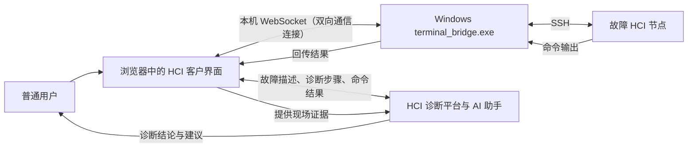
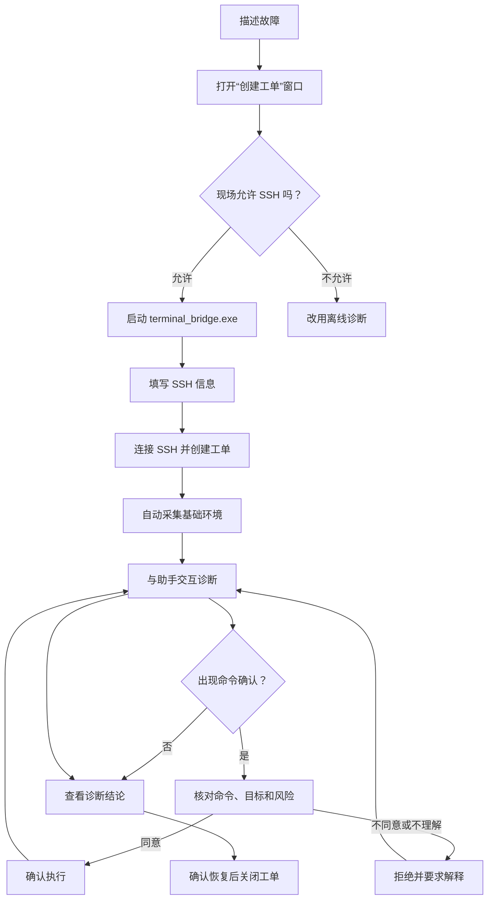
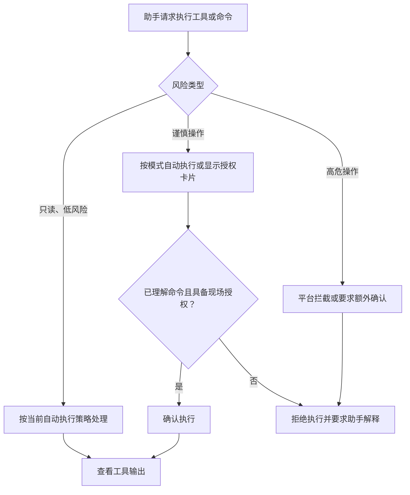

# HCI 智能排障平台在线诊断普通用户使用手册

> 适用对象：使用 HCI 智能排障平台提交故障并允许平台通过 SSH 在线采集、分析信息的普通用户。
>
> 适用模式：基于 Terminal Bridge（终端桥接器，程序名为 `terminal_bridge.exe`）的在线诊断。
>
> 界面名称可能随版本略有调整，请以实际页面为准。

## 1. 在线诊断是什么

在线诊断通过 SSH 将浏览器中的排障助手与 HCI 节点连接起来。平台可在用户授权范围内执行诊断命令、读取命令结果，并结合故障描述、环境信息和知识库给出诊断结论与恢复建议。

Terminal Bridge（终端桥接器）只负责在浏览器与 SSH 之间转发连接、命令和结果，不负责生成诊断结论。浏览器不会直接建立 SSH 连接，也不会绕过 Bridge 连接 HCI。

在线诊断适合以下情况：

- 故障环境允许 SSH 访问；
- 希望由平台实时采集告警、任务、集群或节点信息；
- 希望在同一页面中完成对话、命令确认、结果分析和诊断；
- 故障仍在发生，需要边采集边判断。

如果现场不能提供 SSH、网络隔离严格，或不允许实时连接目标环境，请改用[离线诊断普通用户使用手册](./离线诊断普通用户使用手册.md)。

### 1.1 一图看懂在线诊断



这里最容易混淆的是：浏览器不会直接 SSH 登录 HCI。运行在用户 Windows 设备上的 Terminal Bridge（终端桥接器）负责在浏览器和 HCI SSH 之间转发命令与结果。

## 2. 使用前准备

开始前请准备：

- 可正常访问 HCI 智能排障平台的浏览器，且浏览器与 `terminal_bridge.exe` 运行在同一台 Windows 设备上；
- 故障节点的主机地址或 IP、SSH 端口和用户名；
- SSH 密码，或可用的 SSH 私钥及其密码；
- 从运行 `terminal_bridge` 的设备到目标节点的网络连通性；
- 一个具备必要只读查询权限的 SSH 账号。

在线诊断需要在访问平台的 Windows 设备上运行桌面版 `terminal_bridge.exe`。当前生产默认使用 Windows 桌面版；Cluster Bridge（集群版终端桥接器）仅用于开发、测试和验收，不属于普通用户使用范围。

> 安全提示：优先使用只读、最小权限账号。不要把 SSH 密码、私钥或令牌发送到聊天消息中。当前浏览器只在本机保存上次成功连接的主机、端口和用户名，不保存 SSH 密码或私钥。

## 3. 快速操作流程



1. 打开 HCI 智能排障平台客户界面。
2. 在输入框描述故障现象并提交。
3. 在“创建工单”窗口确认标题和描述。
4. 启动 Terminal Bridge（终端桥接器），填写 SSH 信息。
5. 点击“连接 SSH 并创建工单”。
6. 等待 SSH 认证、工单创建和环境采集完成。
7. 按助手提示补充信息或确认只读诊断操作。
8. 查看工具执行结果和诊断结论。
9. 问题处理完成后点击“关闭工单”。

## 4. 详细操作说明

### 4.1 描述故障并创建工单

在页面下方输入故障描述。建议至少包含：

- 发生了什么，例如“虚拟机无法启动”或“存储延迟持续升高”；
- 受影响对象，例如虚拟机名称、磁盘序列号或节点名称；
- 首次发生时间和当前是否仍在发生；
- 已观察到的告警、报错或近期变更；
- 影响范围，例如单台虚拟机、单节点或整个集群。

示例：

```text
节点 node-03 从今天 09:20 开始出现存储延迟告警，三台虚拟机受影响，
目前仍在发生。昨晚进行过磁盘更换，尚未执行其他恢复操作。
```

提交描述后，系统打开“创建工单”窗口。检查工单标题和描述，必要时进行补充。

### 4.2 启动并检测 Terminal Bridge（终端桥接器）

页面与桌面程序的位置关系如下：

```text
┌──────────────────────── HCI 客户界面（浏览器） ────────────────────────┐
│ 右上角： [工单信息] [关闭工单] [SSH终端]                              │
│                                                        点击 ─────────┐ │
│                                                                      ▼ │
│                     ┌──── SSH 终端/创建工单窗口 ────┐                  │
│                     │ Bridge 未运行                  │                  │
│                     │ [下载 Windows 版]             │                  │
│                     │ [已运行 Bridge 工具，点击刷新] │                  │
│                     └────────────────────────────────┘                  │
└────────────────────────────────────────────────────────────────────────┘
                                      │
                                      │ 在同一台 Windows 设备启动
                                      ▼
                         ┌────────────────────────┐
                         │ terminal_bridge.exe    │
                         │ 窗口保持运行，不要关闭 │
                         └────────────────────────┘
```

如果页面提示“Bridge 工具未运行”：

1. 点击“下载 Windows 版”或页面右上角 SSH 终端入口中的下载按钮；
2. 在用于访问目标 HCI 网络的 Windows 设备上启动 `terminal_bridge.exe`；
3. 保持程序窗口运行，不要在诊断过程中退出；
4. 返回浏览器，点击“已运行 Bridge 工具，点击刷新”；
5. 检测成功后，页面显示 SSH 连接表单。

Terminal Bridge 默认仅为当前浏览器与目标 SSH 环境提供中转。若被安全软件拦截，请联系管理员核验程序来源和签名，不要从非平台渠道下载替代程序，也不要自行改用来历不明的 Bridge 地址。

### 4.3 填写 SSH 连接信息

SSH 创建工单窗口示意：

```text
┌────────────────────── 创建工单 ──────────────────────┐
│ 标题        [简要描述问题________________________]    │
│ 描述        [详细描述故障现象、时间和影响范围____]    │
│ AI 助手     [平台显示时选择____________________▼]    │
│                                                        │
│ ───────── SSH 连接（认证后自动采集环境数据）──────── │
│ 主机地址    [192.168.1.100________]  端口 [22____]     │
│ 用户名      [admin________________]                    │
│ 认证方式    (● 密码认证)  (○ 密钥认证)                │
│ 密码/私钥   [____________________________________]     │
│                                                        │
│ [连接 SSH 并创建工单] [无 SSH 创建工单] [取消]        │
└────────────────────────────────────────────────────────┘
```

普通在线诊断选择“密码认证”或“密钥认证”，然后点击“连接 SSH 并创建工单”。“无 SSH 创建工单”会创建工单并直接打开独立的离线诊断工作区，不会建立在线对话，也不会把首条故障描述发送给 Agent（智能体）。

SSH 表单字段说明：

| 字段 | 说明 |
|---|---|
| 主机地址 | 目标 HCI 节点的 IP 或可解析主机名 |
| 端口 | SSH 端口，通常为 `22` |
| 用户名 | SSH 登录用户，页面默认可能显示 `admin` |
| 密码认证 | 输入 SSH 密码 |
| 密钥认证 | 粘贴 SSH 私钥内容；私钥有密码时同时填写私钥密码 |

“仿真租约”是开发或验收环境功能，普通生产诊断不要选择。

填写完成后点击“连接 SSH 并创建工单”。系统依次执行：

1. SSH 认证；
2. 创建工单；
3. 采集基础环境数据；
4. 建立供后续诊断使用的 SSH 终端会话。

基础环境采集当前包括集群信息、告警列表和任务状态。某一项采集失败时，日志会记录失败原因但不会把错误文本当作有效环境数据；整体采集失败时，页面会提供重试入口。连接成功后，页面会显示当前工单号和环境数据摘要。

### 4.4 与诊断助手交互

助手可能要求用户：

- 从候选故障类型中选择最符合的一项；
- 补充故障对象、时间或现象；
- 确认平台推断出的变量；
- 授权执行诊断工具或命令；
- 根据现场反馈选择下一步。

请以现场事实作答。不确定时明确填写“不确定”或补充实际观察，不要猜测设备状态。

工具卡片会显示工具名称、执行原因、命令、状态和输出。常见状态包括“等待授权”“执行中”“执行成功”“执行失败”“已取消”和“已拦截”。

### 4.5 处理命令与风险确认



诊断命令分为不同风险等级：

- 只读操作：查询状态、日志、告警或资源信息，通常可自动执行；
- 谨慎操作：可能产生副作用；在“关闭自动执行”或“安全模式”下通常需要用户确认，在“激进模式”下部分操作可能自动执行；
- 高危操作：任何自动执行模式下都不会自动执行，平台会拦截或要求额外确认，普通用户不应在未评估影响时执行。

当出现确认卡片时：

1. 阅读“原因”和完整命令；
2. 核对目标节点、对象和影响说明；
3. 确认操作符合变更窗口和现场授权；
4. 选择“确认执行”或“拒绝执行”。

确认有倒计时，超时会自动拒绝。高危确认可能要求勾选“我已充分了解此操作的风险”。不理解命令用途时应选择拒绝，并在聊天中要求助手解释。

### 4.6 使用 SSH 终端

终端区域示意：

```text
┌──────────────────────────── SSH 终端 ────────────────────────────┐
│ 已连接  [自动执行：安全模式▼]       [复制本次输出] [发送到助手] │
│                                      [清空] [终端历史] [×]      │
├──────────────────────────────────────────────────────────────────┤
│ $ acli alert list                                                │
│ ...命令输出...                                                   │
│                                                                  │
├──────────────────────────────────────────────────────────────────┤
│ $ [输入命令或从命令卡片发送____________________] [执行] [清空] │
│ Enter 执行 · Shift+Enter 换行 · 断开连接                         │
└──────────────────────────────────────────────────────────────────┘
```

点击页面右上角“SSH终端”可打开终端抽屉。

- 在输入框中输入命令，点击“执行”或按 Enter 执行；
- 使用 Shift+Enter 输入多行内容；
- 助手消息中的普通命令卡片可点击“发送到终端”，命令只会填入输入框，不会立即执行；
- 点击“复制本次输出”可复制最近一次输出；
- 点击“发送到助手”可把最近一次输出放入聊天输入框，提交前可以检查和删减；
- 点击“终端历史”可查看本工单的终端回放；
- 点击“断开连接”结束 SSH 会话。

终端输入和输出会与工单关联，用于诊断、审计和问题复盘。执行含敏感信息的命令前，应先确认输出不会暴露密码、私钥、令牌或无关个人信息。

### 4.7 选择自动执行模式

SSH 连接后，终端顶部可选择自动执行模式：

| 模式 | 行为 | 建议 |
|---|---|---|
| 关闭自动执行 | 工具按策略等待人工授权 | 默认模式，适合严格管控环境 |
| 安全模式 | 允许低风险、只读工具自动执行 | 普通用户推荐 |
| 激进模式 | 低风险及部分谨慎操作可能自动执行；高危操作仍不会自动执行 | 仅在明确授权和有人值守时使用 |

自动执行偏好保存在当前浏览器中，后续打开终端时仍可能沿用。离开严格管控现场前，建议切回“关闭自动执行”。无论选择何种模式，平台的服务端安全策略仍会拦截高危操作，并对需要授权的操作发起确认。

自动执行模式只作用于平台签发、带执行标识和风险信息的结构化工具事件。助手正文中的 Markdown（标记文本）命令块只能“复制”或“发送到终端”，不会因选择“激进模式”而自动执行。

### 4.8 查看结论并关闭工单

诊断过程中可通过顶部阶段进度了解当前进展。结论通常包含：

- 故障摘要；
- 根因或最可能原因；
- 支持该判断的现场证据；
- 修复或恢复建议；
- 尚缺少的证据及风险提示。

执行恢复操作前，应核对目标、影响范围、回退方式和业务窗口。完成处理并确认业务恢复后，点击页面右上角“关闭工单”。关闭工单后如需处理新问题，请新建工单，不要复用已关闭工单。

## 5. 常见问题

### 5.1 页面一直提示 Bridge 未运行

按以下顺序检查：

1. 确认 `terminal_bridge.exe` 已启动且未退出；
2. 刷新页面后重新点击“SSH终端”；
3. 确认浏览器与 Bridge 运行在同一台桌面设备；
4. 检查本机安全软件或防火墙是否拦截 Bridge；
5. 如果仍无法检测到 Bridge，记录页面提示并联系平台管理员。

### 5.2 SSH 认证失败或超时

- 核对主机、端口、用户名和认证方式；
- 确认从 Bridge 所在设备能访问目标 SSH 端口；
- 密钥认证时确认粘贴的是完整私钥，并正确填写私钥密码；
- 确认账号未锁定且具备登录权限；
- 多次失败后停止重试，联系现场管理员确认账号状态。

### 5.3 SSH 已连接，但助手提示无法执行命令

- 确认 Bridge 和浏览器页面仍保持打开；
- 查看 SSH 终端顶部状态是否为“已连接”；
- 确认当前连接对应正在处理的工单和目标节点；
- 重新连接 SSH 后，在聊天中输入“继续”；
- 如果工具卡片显示“已拦截”，阅读风险说明，不要反复尝试绕过策略。

### 5.4 命令执行失败

常见原因包括账号权限不足、命令不存在、目标节点选择错误、网络中断或执行超时。展开工具卡片查看输出，将必要的错误信息发送给助手分析。不要通过提高账号权限或修改系统配置来盲目重试。

### 5.5 页面刷新后如何继续

使用相同浏览器和客户端身份重新进入平台，选择恢复未关闭工单。工具调用历史会随会话恢复，但 SSH 会话可能需要重新连接。重新连接后再继续诊断。

### 5.6 点击“无 SSH 创建工单”后为什么没有进入在线对话

这是当前设计。该按钮代表选择离线诊断：系统只创建工单上下文，然后跳转到独立的 `/offline-diagnosis` 工作区，不创建 Conversation（对话），也不向 Agent（智能体）发送首条消息。之后如获准改用在线诊断，应返回客户界面，恢复该未关闭工单，再点击“SSH终端”连接 SSH，无需重复创建工单。

## 6. 安全与使用注意事项

- 只连接与当前工单有关的目标节点；
- 优先使用最小权限、只读账号；
- 不在聊天、终端输出或截图中暴露密码、私钥和访问令牌；
- 对写操作逐条核对，不因助手推荐而跳过业务审批；
- 诊断过程中保持浏览器、Bridge 和网络连接稳定；
- 不要同时在多个页面为同一工单建立不同 SSH 连接；
- 终端操作会被记录并与工单关联，请遵守组织的审计和数据处理要求；
- 如需跨多个节点诊断，确认每次工具卡片显示的目标节点正确。

## 7. 何时改用离线诊断

出现以下任一情况时，建议选择离线诊断：

- 现场禁止平台实时 SSH 连接；
- Bridge 所在设备无法访问故障节点；
- 网络不稳定，在线命令频繁超时；
- 需要先在隔离环境采集，再经受控渠道上传；
- 需要对采集范围、工具签名和证据包进行离线核验。
