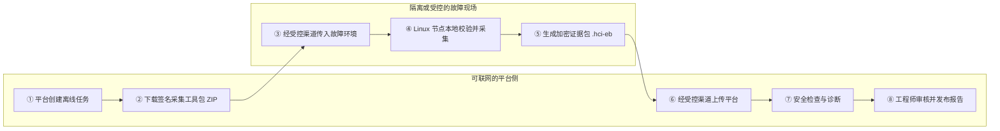
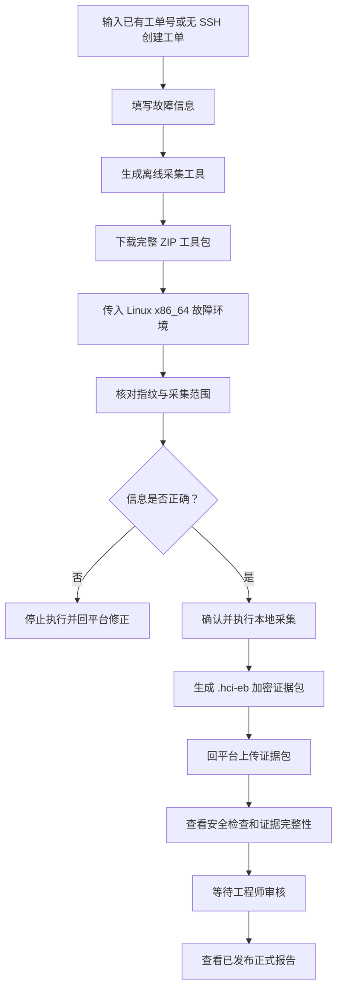
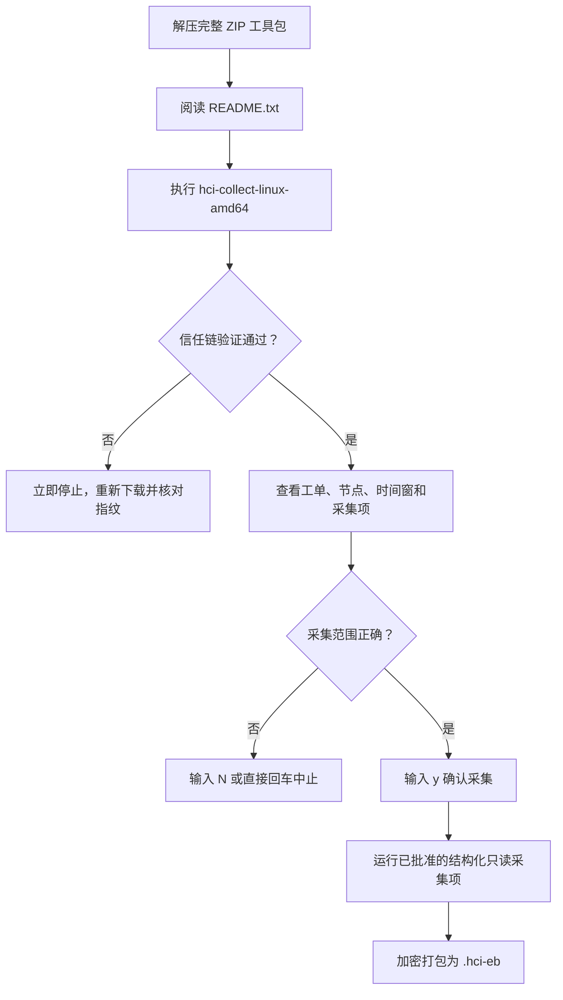
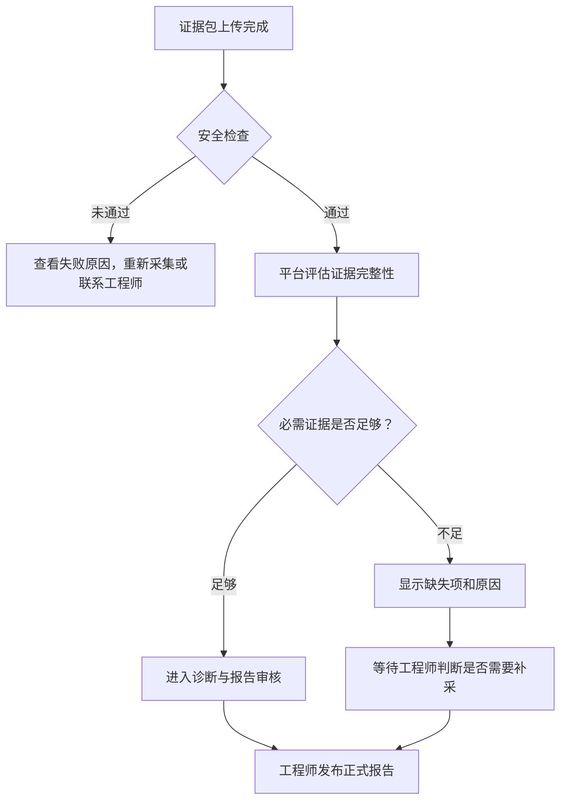

# HCI 智能排障平台离线诊断普通用户使用手册

> 适用对象：现场不能提供 SSH 在线连接，需要在故障环境本地采集证据后上传诊断的普通用户。
>
> 适用模式：HCI Offline Diagnosis（离线诊断）。
>
> 界面名称可能随版本略有调整，请以实际页面为准。

## 1. 离线诊断是什么

离线诊断不要求平台实时连接故障环境。用户先在平台创建工单和离线诊断任务，下载经过签名的采集工具包，在故障环境本地执行只读采集，再将生成的加密证据包上传。平台完成安全检查和分析后，由工程师审核并发布正式诊断报告。

离线工具不是每次从头编译一个新程序。平台提前提供经过签名的通用 Go 采集运行时，并在用户创建离线任务时，按当前生效的 Collection Profile（采集画像）、Collector（采集器）和 KBD（知识库文档）修订实时生成该工单专属的 Collection Plan（采集计划）与 Collector Artifact（采集器制品）。两者一起组成最终下载的 Verification Bundle（验证包）。

在线诊断和离线诊断共用同一套 Problem Scenario（问题场景）。问题场景来自已发布 KBD 的最终分类；
KBD 发布后会自动进入离线资源同步范围，无需用户或审核人员另外启用“支持离线”开关。页面只展示已经完成
离线资源同步并审核生效的场景；新 KBD 刚发布但场景尚未出现时，请联系平台管理员执行增量同步并发布候选资源。

离线诊断适合以下情况：

- 故障环境不能向平台提供 SSH；
- 现场网络隔离，需要通过受控方式传递文件；
- 希望在执行前核对采集范围、签名和受信根；
- 希望证据在本地加密后再上传；
- 在线诊断因网络或 Bridge 条件无法使用。

如果现场允许稳定 SSH 连接并希望实时交互，请参阅[在线诊断普通用户使用手册](./terminal_bridge在线诊断普通用户使用手册.md)。

### 1.1 一图看懂离线诊断



离线诊断的关键是“两次文件流转”：先把签名工具包带入现场，再把本地生成的加密证据包带回平台。平台不会通过该模式主动连接故障节点。

## 2. 使用前准备

开始前请准备：

- 已存在的 HCI 平台工单号；
- 可访问平台离线诊断页面的浏览器；
- 一台 Linux x86_64 执行节点；
- 在执行节点上运行已批准只读采集命令的权限；
- 足够的本地磁盘空间；
- 准确的故障对象、故障时间范围和执行节点信息；
- 通过组织认可的独立可信渠道获得或核对签名公钥指纹。

当前离线采集运行时仅支持 Linux x86_64。它是静态 Go 程序，不需要安装 Python、pip、OpenSSL、Bash 或其他联网依赖；采集命令按签名制品中的参数数组直接执行，不调用 `/bin/sh`。

> 重要：采集工具包和吊销信息具有有效期。下载后应尽快执行；如果提示已过期或已撤销，请联系平台管理员或支持工程师为当前任务重新生成制品，再下载新工具包。当前普通用户页面不提供“刷新历史制品”的自助入口，不要修改校验文件或绕过验证。

## 3. 快速操作流程



1. 在创建工单窗口选择“无 SSH 创建工单”，或打开离线诊断页面并输入已有工单号。
2. 填写故障场景、对象、执行节点和故障时间范围。
3. 点击“生成离线采集工具”。
4. 下载完整采集工具包并传入故障环境。
5. 解压工具包，核对公钥指纹和采集范围。
6. 在 Linux x86_64 执行节点运行采集程序。
7. 取得生成的 `.hci-eb` 加密证据包。
8. 回到离线诊断页面上传证据包。
9. 查看安全检查、证据完整性和诊断状态。
10. 等待工程师审核并查看正式报告。

## 4. 进入离线诊断工作区

离线工作区按页面从上到下依次推进：

```text
┌──────────────────── HCI Offline Diagnosis ────────────────────┐
│ 工单 Q20XXXXXXXXX                         [返回客户界面]       │
├────────────────────────────────────────────────────────────────┤
│ ① 填写故障 → ② 准备工具 → ③ 本地采集 → ④ 上传证据           │
│              → ⑤ 平台诊断 → ⑥ 工程师审核 → ⑦ 查看报告       │
├────────────────────────────────────────────────────────────────┤
│ 当前步骤对应的表单、下载按钮、上传进度或诊断结果              │
└────────────────────────────────────────────────────────────────┘
```

有两种进入方式。

### 4.1 创建新工单时进入

1. 在客户界面描述故障；
2. 在“创建工单”窗口检查标题和描述；
3. 点击“无 SSH 创建工单”；
4. 工单创建后，页面自动进入该工单的离线诊断工作区。

选择此方式后，系统不会建立 SSH 会话，也不会把首条故障描述发送给在线诊断助手。

### 4.2 使用已有工单号进入

1. 打开平台提供的 `/offline-diagnosis` 页面；
2. 输入已有工单号，例如 `Q202607310001`；
3. 点击“进入离线诊断”。

带工单号的工作区地址可以复制保存。只有对该工单具有访问权限的用户才能读取或操作其离线诊断数据。普通用户无需手工填写 Bearer Token（身份令牌）；正式环境应由同源身份层提供访问身份。

## 5. 详细操作说明

### 5.1 填写故障信息

表单位置示意：

```text
┌──────────────────── 1. 填写故障信息 ────────────────────┐
│ 故障场景       [请选择已发布场景__________________▼]    │
│ 产品版本       [7.0_______________________________]     │
│ 故障对象标识   [虚拟机 ID / 磁盘序列号___________]     │
│ 故障对象名称   [可选______________________________]     │
│ 执行节点       [运行工具的节点名称或 IP__________]     │
│ 故障时间范围   [开始时间________] 至 [结束时间____]     │
│ 当前状态       [仍在发生 / 已恢复 / 间歇发生_____▼]    │
│ 近期变更       [升级、扩容、迁移或硬件更换等______]     │
│                                                         │
│                         [生成离线采集工具]              │
└─────────────────────────────────────────────────────────┘
```

在“1. 填写故障信息”区域填写：

| 字段 | 填写说明 |
|---|---|
| 故障场景 | 从平台已发布的可用场景中选择最接近的一项 |
| 产品版本 | 填写故障环境实际 HCI 版本 |
| 故障对象标识 | 填写虚拟机 ID、磁盘序列号或其他稳定标识 |
| 故障对象名称 | 可选，填写便于识别的对象名称 |
| 执行节点 | 填写实际运行采集工具的 HCI 节点名称或 IP |
| 故障时间范围 | 尽量覆盖故障发生前后，并避免无关的过大时间窗 |
| 当前状态 | 选择“仍在发生”“已经恢复”或“间歇发生” |
| 近期变更 | 填写升级、扩容、迁移、硬件更换或配置调整等信息 |

请特别注意：

- “故障场景”数量不是固定值，它与当前已批准、已启用的 Collection Profile（采集画像）实时联动；如果只看到少量场景，通常表示目前只有这些画像可供客户使用；
- “执行节点”是运行工具的节点，不一定等于受影响对象；
- 时间范围过小可能漏掉关键日志，过大则会增加采集量并引入无关信息；
- 必填项完整后，“生成离线采集工具”按钮才会启用；
- 如果页面提示没有可用故障场景，请联系平台管理员，不要随意选择不相关场景；
- 当前页面在任务创建后不会回到原表单直接修改场景、对象或时间窗。提交前务必复核；生成后发现错误时，停止采集和上传，并联系支持人员处理错误任务后重新创建。

### 5.2 生成并检查采集工具

点击“生成离线采集工具”。平台将创建 Diagnosis Session（诊断会话）、Collection Plan（采集计划）和签名 Collector Artifact（采集器制品）。

生成成功后，页面会显示：

- 预计采集大小；
- 预计采集耗时；
- 文件摘要；
- 签名公钥指纹；
- 采集内容、用途、执行位置和实际执行内容。

建议展开“查看采集范围与安全校验信息”，确认采集范围与当前工单相符。这里可以看到每个采集项实际执行的命令参数、HCI API（HCI 接口）路径或 Manual Guide（人工采集指引）。若发现目标节点、故障对象或时间范围错误，应停止操作并联系支持人员重新建立正确的离线诊断任务，避免采集无关数据。

#### 采集工具与 KBD 变更的关系

- 通用 Go 运行时可以提前构建和签名，不需要在每次故障排障时重新编译；
- 工单专属的采集计划和采集器制品在点击“生成离线采集工具”时生成，并绑定当时已发布的 KBD、Collector 和 Collection Profile 不可变修订；
- 后续 KBD 或采集画像发生增删改，不会悄悄改变已经下载的工具包；
- 新任务会使用当时最新的已发布版本；旧制品需要停用时，由平台通过撤销或过期机制拒绝继续使用；
- 因此，同一个故障在规则更新前后重新生成的工具包，采集范围可能不同，不能混用。

### 5.3 下载并传输完整工具包

点击“下载完整采集工具包”。页面下载的是完整 Verification Bundle（验证包）ZIP，文件名类似：

```text
hci-offline-collector-<artifact-id>.zip
```

通过组织批准的文件传输方式将 ZIP 包传入故障环境。传输过程中：

- 不要修改 ZIP 内文件；
- 不要单独替换采集程序、Manifest（清单）或信任文件；
- 建议保留平台显示的文件摘要和公钥指纹；
- 如有条件，通过第二通道核对公钥指纹。

### 5.4 在故障环境运行采集工具



在 Linux x86_64 执行节点上解压工具包并进入解压目录。先阅读包内 `README.txt`，再执行其中给出的命令。基本形式如下：

```bash
chmod +x hci-collect-linux-amd64
./hci-collect-linux-amd64 --expected-root-fingerprint <通过可信渠道核对的公钥指纹>
```

不要从不可信消息中复制公钥指纹。应使用平台显示值或组织规定的独立可信渠道进行核对。

程序将依次执行：

1. 验证运行时、采集制品、签名 Manifest（清单）和吊销快照；
2. 显示工单、场景、故障窗口和完整采集范围；
3. 等待用户确认；
4. 按参数数组直接执行已批准的结构化只读采集项，不调用 `/bin/sh`、Bash、`curl` 或 `timeout`；
5. 使用 AES-256-GCM（带完整性校验的加密算法）加密采集结果，并生成 `.hci-eb` 证据包。

看到以下提示时，检查采集范围后输入 `y` 或 `yes`：

```text
确认在本机执行以上采集范围？[y/N]:
```

输入其他内容或直接回车会安全中止采集。

> 不建议普通用户使用 `--yes` 跳过人工确认。只有具备完整审计留痕的自动化场景才应使用该参数。

### 5.5 处理特殊采集项

#### HCI API 采集项

如果程序提示清单包含 HCI API 采集器，按包内 `README.txt` 和现场管理员要求，在执行前设置：

- `HCI_API_BASE_URL`：客户本地 HCI HTTPS 地址；
- `HCI_API_TOKEN`：短期访问令牌。

不要把令牌写入聊天、脚本文件或证据附件。令牌应仅在本次受控进程环境中使用，任务完成后及时清除。

#### 人工附件采集项

如果采集范围包含人工附件，程序会在 `diagnostic-output/manual-guides/` 下生成说明。按说明将导出文件放入指定的 `diagnostic-output/attachments/` 路径。

如果第一次运行时尚未准备附件，该项会以“用户未提供”进入证据包。需要补齐时，请按工程师指引重新采集或执行补采流程，不要直接修改已经生成的 `.hci-eb` 文件。

### 5.6 获取加密证据包

采集结束后，程序会显示成功、失败和人工附件项数量，并生成类似以下文件：

```text
Q202607310001_20260812143000.hci-eb
```

同时会显示文件大小和 SHA-256（文件摘要）值。证据包内清单还记录各采集文件的大小与摘要；上传后平台会校验文件集合、大小和摘要。`.hci-eb` 使用带认证的加密格式，内容被修改或密文损坏时会在平台安全检查阶段被拒绝。默认明文采集输出保留在 `diagnostic-output/` 目录中。

如需在加密成功后自动清理清单声明的明文，可在组织策略允许时使用：

```bash
./hci-collect-linux-amd64 \
  --expected-root-fingerprint <公钥指纹> \
  --cleanup-plaintext
```

在确认 `.hci-eb` 文件完整且可上传前，不要提前删除唯一副本。

### 5.7 上传证据包

上传区域示意：

```text
┌──────────────────── 3. 上传采集结果 ─────────────────────┐
│ 采集结束后会生成一个 .hci-eb 文件                        │
│                                                          │
│ [选择证据包]   Q20XXXXXXXXX_20260812143000.hci-eb        │
│ ████████████████████░░░░  82%                            │
│                                                          │
│ [上传并开始诊断] [继续上传] [终止上传] [刷新状态]        │
│                                                          │
│ 状态：证据包正在安全检查和分析中                         │
└──────────────────────────────────────────────────────────┘
```

回到离线诊断页面的“3. 上传采集结果”区域：

1. 点击“选择证据包”；
2. 选择本次采集生成的 `.hci-eb` 文件；
3. 点击“上传并开始诊断”；
4. 等待进度完成。

单个证据包不能超过 512 MiB。超过限制时，应由支持人员协助缩小合理的故障时间范围或调整采集任务后重新生成，不要自行拆分、编辑或二次压缩 `.hci-eb` 文件。

如果上传中断：

- 页面仍保留本次文件时，可点击“继续上传”；
- 页面刷新后，为保护一次性上传凭据，需要重新选择证据包并开始新上传；
- 不再需要本次上传时，可点击“终止上传”。

### 5.8 查看安全检查与证据完整性



上传完成后，平台会进行安全检查、解密处理和证据分析。页面通常每 3 秒自动刷新，也可点击“刷新状态”。

可能看到以下结果：

- “证据包正在安全检查和分析中”：继续等待；
- “证据包已通过安全检查”：可以进入诊断；
- “证据包未通过检查”：根据提示重新采集，或联系工程师；
- “证据可以支持诊断”：必需证据基本齐备；
- “证据不足，需要工程师确认”：仍会保留当前结果，工程师可能联系用户补充。

“证据完整性”会显示完整度、可用必需证据数量、缺失项和缺失原因。采集项失败不一定使整个证据包失效，但可能降低诊断可信度。

页面工具区域目前可能直接显示以下英文会话状态：

| 页面状态 | 中文含义 | 用户应做什么 |
|---|---|---|
| `created` | 诊断任务已创建 | 等待平台生成采集计划 |
| `plan_ready` | 采集计划已就绪 | 下载并运行采集工具 |
| `collecting` | 等待或正在现场采集 | 在故障环境完成采集 |
| `uploading` | 证据包正在上传 | 保持页面打开并等待上传完成 |
| `assessing` | 正在进行安全检查和完整性评估 | 等待自动刷新 |
| `diagnosing` | 平台正在诊断 | 等待自动刷新 |
| `supplement_required` | 当前证据不足，可能需要补采 | 等待工程师确认；精简版暂不提供自助补采 |
| `review_pending` | 报告等待工程师审核 | 等待审核发布 |
| `published` | 正式报告已发布 | 查看报告内容 |
| `failed` | 当前处理失败 | 查看页面原因并联系支持人员 |

### 5.9 查看诊断报告

诊断结果可能显示以下可信度等级：

- 已确认；
- 高概率；
- 疑似；
- 证据不足；
- 证据冲突。

报告内容包括：

- 诊断摘要；
- 主要判断和可信度；
- 支持证据；
- 缺失证据；
- 恢复建议；
- 风险与回退。

平台生成的草稿需要工程师审核。对普通客户而言，工程师发布后的报告才是正式结论。不要仅依据未审核信息执行高风险恢复操作。

## 6. 常见问题

### 6.1 页面提示没有可用故障场景

当前没有已批准并启用的采集画像，或该场景暂不支持所选产品版本。请联系平台管理员或支持工程师。

### 6.2 采集工具生成失败

检查执行节点是否填写正确，然后按页面提示“重试生成”。若仍失败，记录工单号和页面错误信息并联系平台管理员。

### 6.3 程序提示平台或架构不支持

当前运行时仅支持 Linux x86_64。请转移到符合要求且能够访问故障数据的 HCI 节点执行，不要尝试在 Windows、macOS、ARM 节点或不受信容器中绕过检查。

### 6.4 程序提示指纹不一致、签名无效或文件被篡改

立即停止使用该工具包，隔离可疑副本，从平台重新下载，并通过可信第二通道重新核对公钥指纹。不要修改 Manifest（清单）、信任文件或程序来绕过校验。

### 6.5 程序提示制品、吊销清单过期或制品已撤销

联系平台管理员或支持工程师重新生成制品，再下载最新完整采集工具包。旧包不能继续使用。

### 6.6 部分采集项失败

程序仍会将失败状态写入证据包并继续其他采集项。上传后查看“缺失证据”中的具体原因：

- 退出码 `127`：采集命令不存在；
- 退出码 `126`：缺少执行条件或访问凭据；
- 其他退出码：命令执行失败；
- 超时：现场负载、命令范围或环境状态可能异常。

不要为追求完整度而盲目提升账号权限。将失败信息交给工程师判断是否需要补采。

### 6.7 证据包超过 512 MiB

当前普通用户页面不能直接修改已经生成的任务。请联系支持人员缩短故障时间范围或选择更准确的故障对象后重新生成采集计划。不要手工拆分、编辑或二次压缩 `.hci-eb`。

### 6.8 页面提示“缺少 Bearer Token”或浏览器报告 CORS 错误

这通常是平台身份或同源上传配置问题，不是证据包内容问题。普通用户不要粘贴内部服务 Token（令牌）、不要把上传地址改成诊断服务的 IP 或端口，也不要绕过客户页面直接调用上传接口。

先刷新页面或重新登录；如果仍失败，请向平台管理员提供工单号、操作时间、页面错误和 Trace ID（链路标识，如页面有显示）。正式环境应由客户页面通过同源 `/api` 路径完成身份传递和证据上传。

### 6.9 上传后长时间没有报告

先点击“刷新状态”，确认安全检查是否完成以及是否存在缺失证据。正式报告还需要工程师审核发布；若长时间没有更新，请提供工单号联系支持人员。

### 6.10 页面刷新后工作区丢失

重新打开 `/offline-diagnosis`，输入原工单号。平台会恢复该工单最近一次未删除的离线诊断工作区。未完成的一次性上传不能直接恢复，需要重新选择本地证据包。

## 7. 安全与数据处理注意事项

- 只在与当前工单匹配的执行节点运行工具；
- 执行前核对工单号、场景、时间范围、目标和公钥指纹；
- 只使用平台下载的完整工具包，不混用不同工单或不同时间下载的文件；
- 不修改 `.hci-eb`、Manifest（清单）、签名、吊销清单或信任文件；
- 通过组织批准的渠道传输工具包和证据包；
- 妥善保护本地明文输出，上传成功并满足留存要求后再安全删除；
- 不将短期令牌、密码、私钥或无关敏感数据放入人工附件；
- 报告中的恢复建议仍需遵守现场变更审批、业务窗口和回退要求。

## 8. 在线与离线模式选择参考

| 对比项 | 在线诊断 | 离线诊断 |
|---|---|---|
| 是否需要实时 SSH | 需要 | 不需要 |
| 主要入口 | 客户界面 + SSH 终端 | `/offline-diagnosis` 工作区 |
| 数据采集方式 | Bridge 实时执行并回传 | 本地运行签名采集工具 |
| 用户交互 | 多轮对话、实时确认 | 填写任务、下载、执行、上传 |
| 证据传输 | 命令结果在线回传 | 本地加密为 `.hci-eb` 后上传 |
| 适合环境 | 网络可达、需实时排查 | 网络隔离、需受控文件流转 |
| 正式结论 | 对话诊断结论 | 工程师审核发布的报告 |
