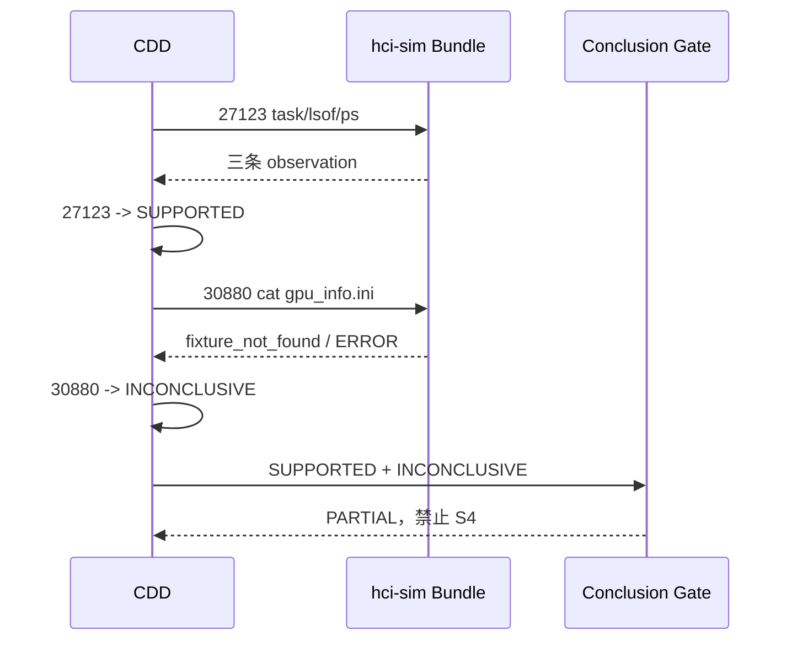

# Q2026082002685 仿真 CDD 全候选问题复盘

## 结论

工单输出 `PARTIAL` 不是 Conclusion Gate 错误，也不是 KBD30880 被错误加入候选。S0 已确认 `虚拟机-003`，30880 属于该分类的可执行已发布 KBD，进入 CDD 是正确行为。

真实问题是 KBD27123 的 hci-sim Bundle 只覆盖 27123 自身的 `task/lsof/ps` acquisition，没有覆盖同分类 KBD30880 的 `cat /sf/cfg/gpu_info.ini`。30880 因 `fixture_not_found` 成为 `INCONCLUSIVE`，Gate 正确输出 `SUPPORTED + INCONCLUSIVE = PARTIAL`。

## 现场证据

| 字段 | 值 |
|---|---|
| case_id | `Q2026082002685` |
| trace_id | `c996faf5cb357c462dcb98d32ad39035` |
| TestRun | `run-27123-a1c59eefb7e600d94ea05ec3` |
| 场景 | `kbd-27123-positive-minimal` |
| Bundle digest | `sha256:677019284f55b4d7930bbd3ac9ae4f49868cf43cb89a3625525dce46e289e41c` |
| TestRun KBD | 27123 revision 25 |
| Agent 当前 KBD | 27123 revision 26；30880 revision 8 |
| 分类候选 | KBD27123、KBD30880 |

Bundle 中只有三条 positive-minimal Route：

```text
acli ... task get -k 启动虚拟机 -s failed -l 1
acli --timeout 120 system lsof
acli --timeout 120 system ps -p 9527 -o cmd=
```

当前 KBD30880 revision 8 还需要：

```text
acli --timeout 120 system cat /sf/cfg/gpu_info.ini
```

该 RouteKey 不在 Bundle 中，因此 Runtime 返回 exit code 127 和 `fixture_not_found`。

## 状态归约



## PR #857 错误复盘

PR #857 将 TestRun 的 `support_id=27123` 当成候选答案，删除 30880 后得到 `DEFINITIVE`。这没有增加任何 fixture，也没有证明 30880 不成立，只是绕过了未决候选。

随后 Q2026082066192 因 TestRun revision 25 与当前 KBD27123 revision 26 不一致，在 S1 输出 `SIM_KBD_AUTHORITY_CANDIDATE_MISMATCH`。这进一步证明 revision freshness 被放到了错误层次：它应在 TestRun 创建前判断 Bundle 是否过期，不能改变 Agent 候选。

## hotfix 验证要求

| 检查项 | 预期 |
|---|---|
| real/sim 候选 IDs | 完全相同 |
| sim target/revision 与当前 revision 不同 | 不筛选候选、不产生 S1 mismatch |
| acquisition provider | real=`real_environment`，sim=`hci-sim` |
| ERROR 归约 | 保持未决，不转成 REJECTED |
| Conclusion Gate | 规则不变 |

## 完整业务验收要求

hotfix 只能撤销答案泄漏。要让 27123 仿真场景得到可信 `DEFINITIVE`，必须发布分类完整 Bundle，并取得以下证据：

```text
27123.sig_001 = SATISFIED
27123.sig_002 = SATISFIED
27123.sig_003 = SATISFIED 或满足其 SHOULD 策略
30880.sig_001 = 按同一现场评价
30880.sig_003 或 expert signal = CONTRADICTED
27123 = SUPPORTED
30880 = REJECTED
Conclusion = DEFINITIVE
```

在此之前再次得到 `PARTIAL` 是对 Bundle 不完整的正确报告，不得作为修改 Agent 候选或 Gate 的理由。
