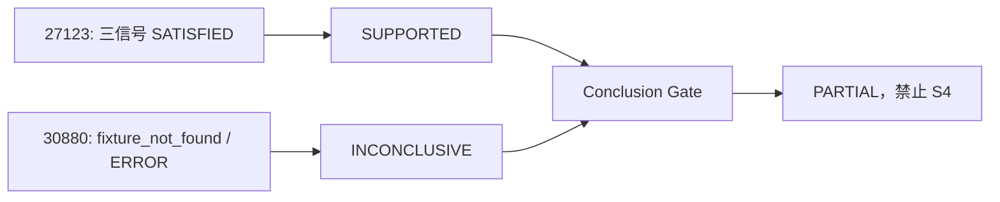

# Q2026082002685 仿真 KBD 候选绑定验证

## 读者须知：分类诊断与仿真回放不是同一作用域

真实工单的正常语义是：S0 识别 `虚拟机-003` 后，分类下全部可执行 KBD 进入 CDD，系统通过关键信号把它们逐篇排除或支持。

本工单使用的是 hci-sim 场景 `kbd-27123-positive-minimal`。它的 TestRun authority 明确绑定 KBD27123 revision 25，属于“单 KBD 正向回放”。它不是“虚拟机-003 分类全量竞争诊断”。

因此，验证时必须先问：当前 TestRun 要验证的是一篇 KBD 的执行闭环，还是整个分类的 CDD 区分能力？两者都合理，但候选范围和 fixture 要求不同。

## 现场事实

环境为 dev，trace_id=`c996faf5cb357c462dcb98d32ad39035`，conversation_id=`6e7902d2-a4a4-4688-900a-f80f32bebec9`。TestRun 为 `run-27123-a1c59eefb7e600d94ea05ec3`，场景 `kbd-27123-positive-minimal`。

分类 `虚拟机-003` 当时返回 KBD27123 和 KBD30880。27123 的 `sig_001/sig_002/sig_003` 全部 `SATISFIED`；30880 的 `sig_003` 与专家信号因 hci-sim 未发布 command fixture 返回 `exit_code=127`，均为 `ERROR`。

## 修复前结论链

这不是 Conclusion Gate 误判：根据 fail-closed 规则，`SUPPORTED + INCONCLUSIVE` 必须 `PARTIAL`。真正错误是仿真 TestRun 的 authority 没有参与候选选择。

更准确地说：KBD30880 在“分类全量 CDD”中作为候选存在没有错误；错误是单 KBD 回放的 TestRun 作用域没有被 Agent 使用，导致单 KBD 测试混入了分类级候选。30880 的 fixture 缺失又只能产生 `ERROR`，不能产生 `REJECTED`，所以 Gate 正确输出 `PARTIAL`。

## 修复后验收

| 检查项 | 结果 |
|---|---|
| 真实环境保留分类全量候选 | 通过 |
| sim-ssh 按 support_id/revision 唯一筛选 | 通过 |
| authority 缺失或 revision 失配不回退 | 通过 |
| SOP 恢复上下文不能绕过 sim authority | 通过 |
| 调度器、差异执行器和 Agent 回归 | `53 passed` |

## 结论

修复后该 TestRun 只评估 KBD27123。三信号全部通过时，候选状态为 `SUPPORTED`，全体候选已闭合，因此 Conclusion Gate 可输出 `DEFINITIVE` 并允许 S4；这不改变真实环境多 KBD 场景必须排除其他候选的安全门禁。

## 代码结论

在“hci-sim TestRun 是单 KBD 回放”的现行契约下，当前提交已经完成必要修复，不需要进一步优化 CDD 算法。若需求变更为“hci-sim 也必须模拟分类全量 CDD”，则应建立新的 category-scope TestRun 契约，并补齐 30880 等所有候选的 fixtures；不能把 fixture 缺失改判为未命中。
